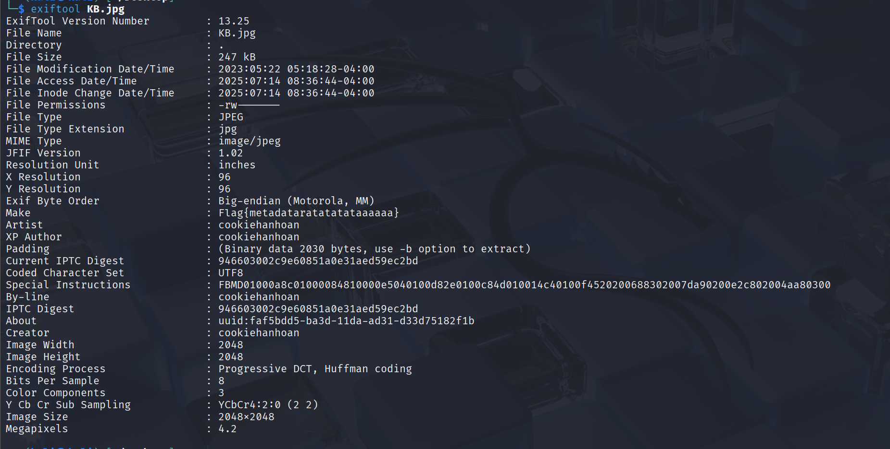
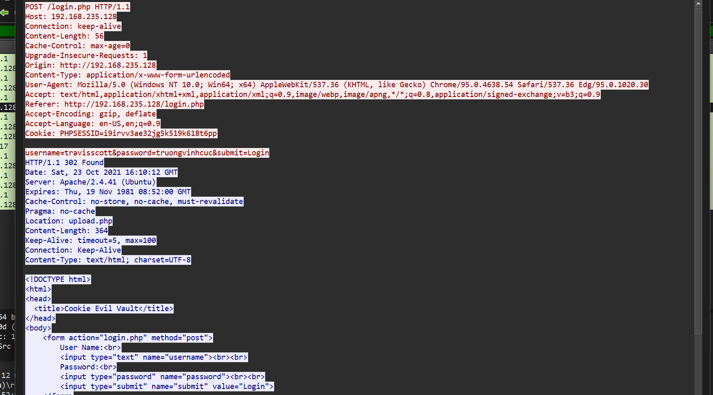
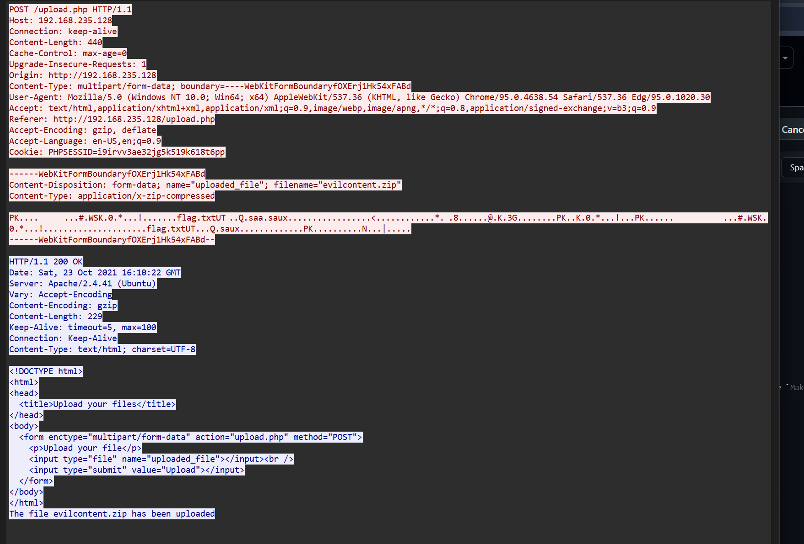
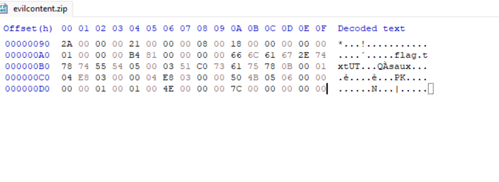
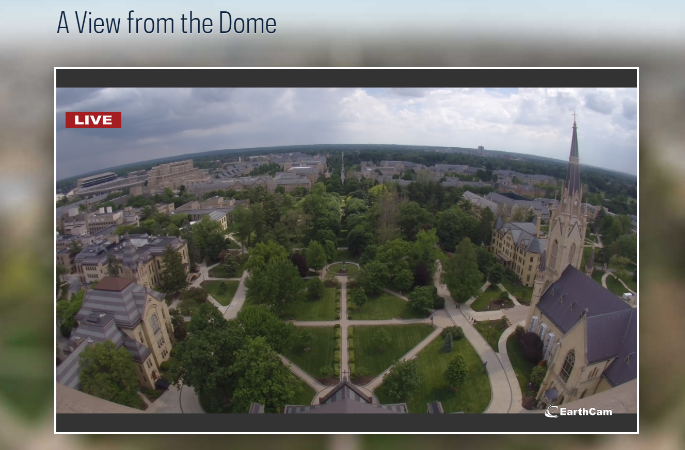
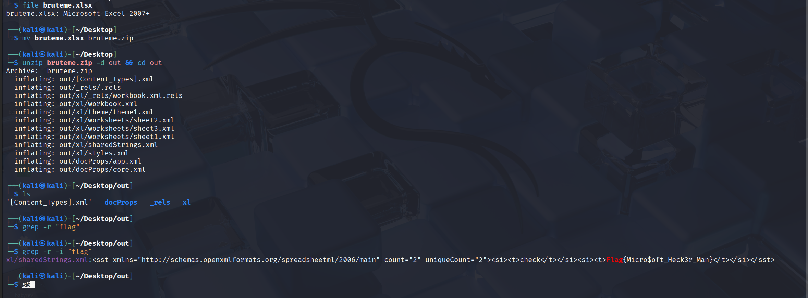

# Forensics

## Basic Image

in the photo metadata challenge, I used `exiftool` to extract metadata from the image file. The metadata revealed a hidden message that was encoded in the `Make` field



flag: `Flag{metadataratatatataaaaaa}` => `CHH{metadataratatatataaaaaa}`

---

## Streamer

in this challenge i see that there is `login` process and upload a `zip file`





then i extract the bytes and write a `script` to filter them out then recreate the `zip file`

`script`
```python
with open('a.txt', 'r') as f:
    data = f.readlines()

for line in data:
    print(line[:48])
```

```plaintext
50 4b 03 04 14 00 09 00  08 00 23 07 57 53 4b be
30 9f 2a 00 00 00 21 00  00 00 08 00 1c 00 66 6c
61 67 2e 74 78 74 55 54  09 00 03 51 c0 73 61 61
c0 73 61 75 78 0b 00 01  04 e8 03 00 00 04 e8 03
00 00 9d b7 e4 10 3c db  7f ad e3 af a8 99 b2 a1
d9 9e fd 2a a9 09 eb 38  c0 aa 1a af fa d8 40 d4
4b a5 33 47 13 18 db 1d  7f c0 8d 16 50 4b 07 08
4b be 30 9f 2a 00 00 00  21 00 00 00 50 4b 01 02
1e 03 14 00 09 00 08 00  23 07 57 53 4b be 30 9f
2a 00 00 00 21 00 00 00  08 00 18 00 00 00 00 00
01 00 00 00 b4 81 00 00  00 00 66 6c 61 67 2e 74
78 74 55 54 05 00 03 51  c0 73 61 75 78 0b 00 01
04 e8 03 00 00 04 e8 03  00 00 50 4b 05 06 00 00
00 00 01 00 01 00 4e 00  00 00 7c 00 00 00 00 00
```

after i used `hxd` to create `evilcontent.zip` file 



but here we need `password`, i tried to get `password` of that account and got `flag`

`password: truongvinhcuc`

flag: `Flag{TCP_streamin_go_skrrrrrrrt}` => `CHH{TCP_streamin_go_skrrrrrrrt}`

---

## Online Camera

we get 1 picture of `webcam` at a `building`, we need to fill in the `name` of that `building` in a template format, i searched and it is `Notre Dame`



Flag: `CHH{Notre_Dame}`

---

## ExSeller

As described, we can know that excel files are compressed format, we can change the extension and decompress and find everything inside.



Flag: `Flag{Micro$oft_Heck3r_Man}` => `CHH{Micro$oft_Heck3r_Man}`

---
