# Web retired

## Cookie and Milk

In this challenge, we will encounter a fairly common error which is `php type jugging`, also known as `loose comparison`, pay attention to the code, `==` will be a looser comparison than `===`, so it will cause an unexpected error, accordingly what we are aiming for is to compare hash strings, because of loose comparison, php will then cast from string to int, suppose 0e3531 then php will understand it as `0e3531 → 0 × 10^3531 → the result is the number '0'` ... so we need to find 2 inputs so that both output `0e<number>` to get the best result

some info on the hashes [here](https://github.com/spaze/hashes/blob/master/sha1.md)

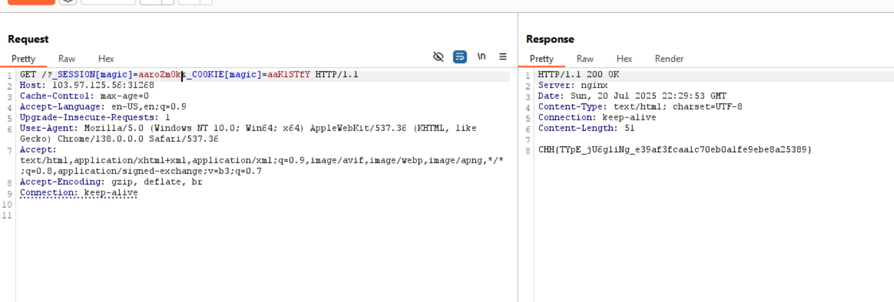

---

## SQL Injection bypass login

In this challenge, we just need to log in to get the `flag`. I tried the simplest payload: `' or 1=1 --` to get the `flag`, accordingly, this payload will make the command `SELECT * FROM users WHERE username='' or 1=1`, then the query will be completely correct because of clause `1=1` and display the data.

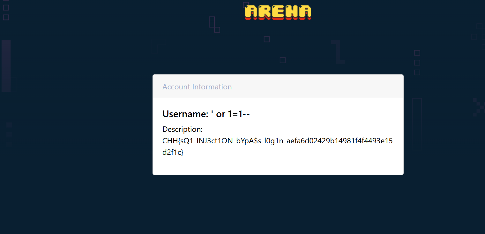

---

## Simple SQL Injection Bypass Login

In this challenge we cannot use `''` but instead use `""` for query type and string comparison.

```shell
userid=admin" or "1"="1
password=<anything>
```

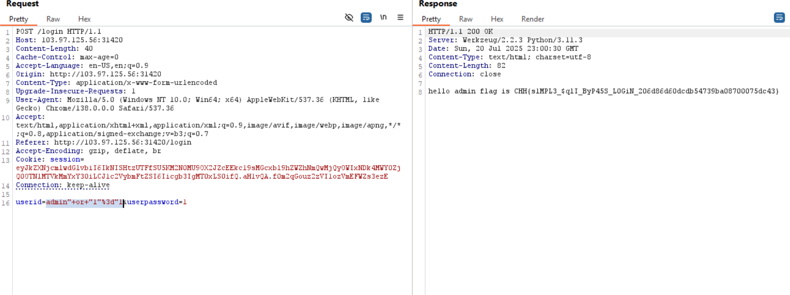

---

## Baby Ping

Usually for this challenge there is often a `command OS injection vulnerability`, inject more commands to `exploit`, first try the command by entering the `ip`

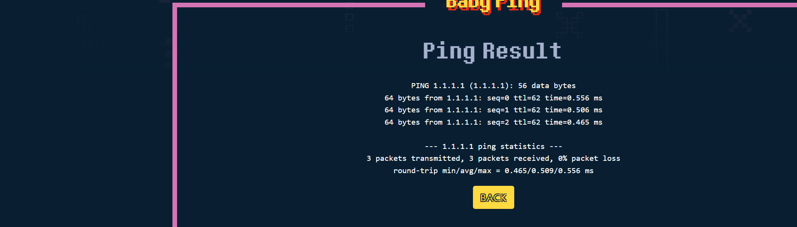

continue try `interrupt` and add `command` see what happens


we can see it will return wrong `format`, i overcome this by removing pattern in `devtool`

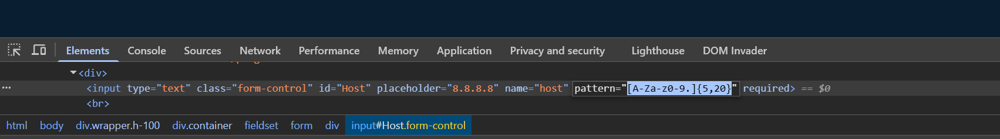

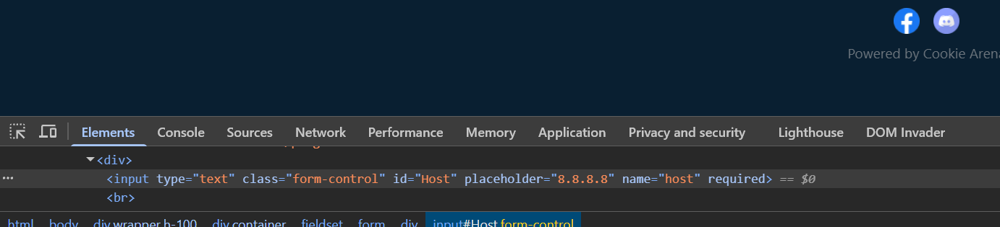

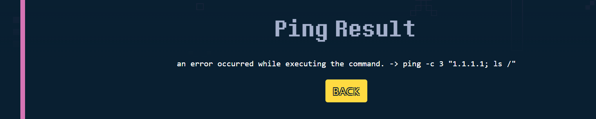

we can see that ip is wrapped in `""`, try adding it before the `command` and create a new `command` and add `#` to strip everything after it

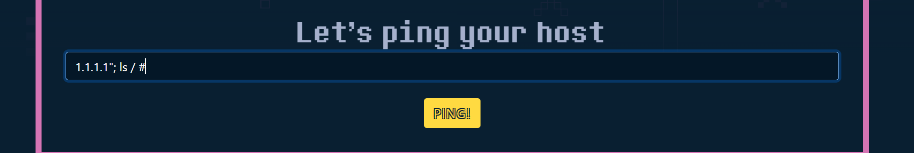

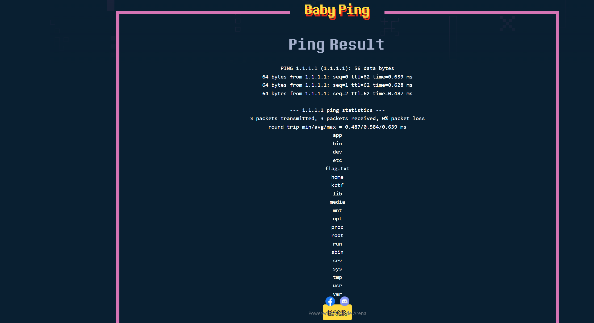


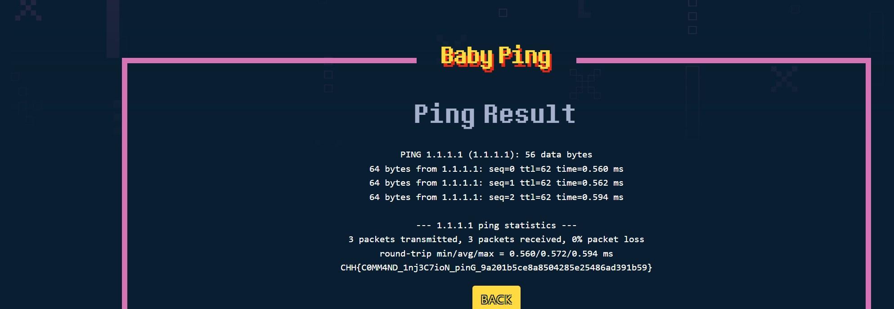

---

## Basic E-Commerce

a challenge not strictly checked, anyone can see other people's `order` information, accordingly this is `idor`, when ibanj buys, will be able to see the goods

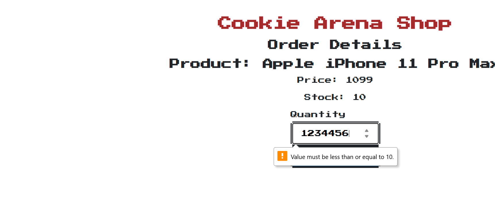


Accordingly, the value needs to be greater than `1` and less than `10`, adjust it to your liking in `devtool`

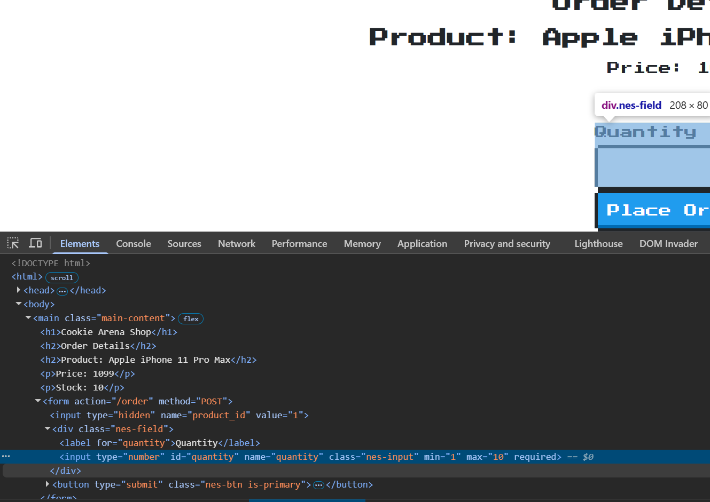

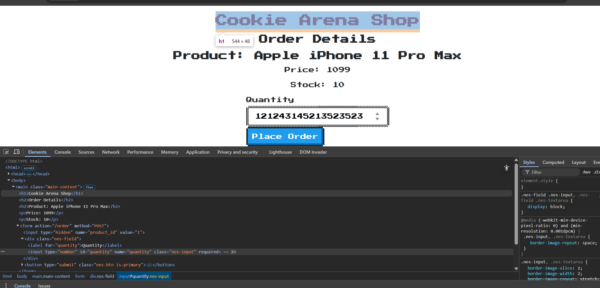

After completing, please view the `order` and change the `id` via the `url parameter`.

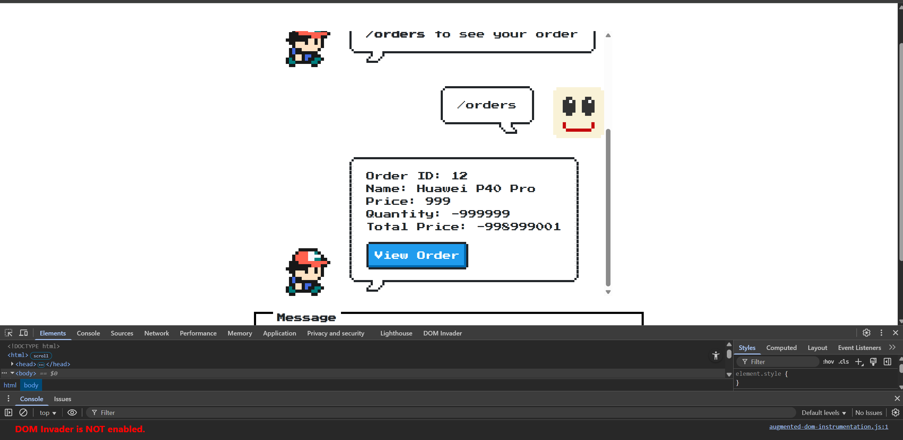

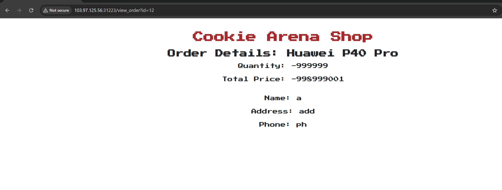

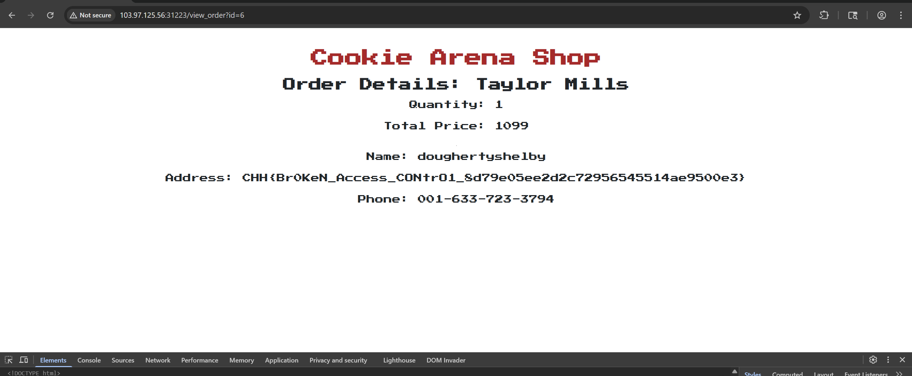

---

## Unrestricted file upload

This challenge simulates the `fileupload vulnerability`, upload a simple `webshell` and `execute` it.

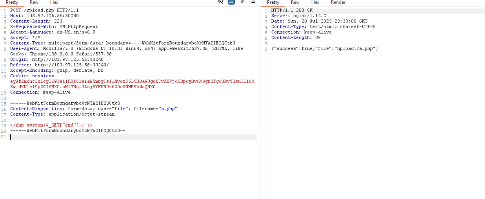

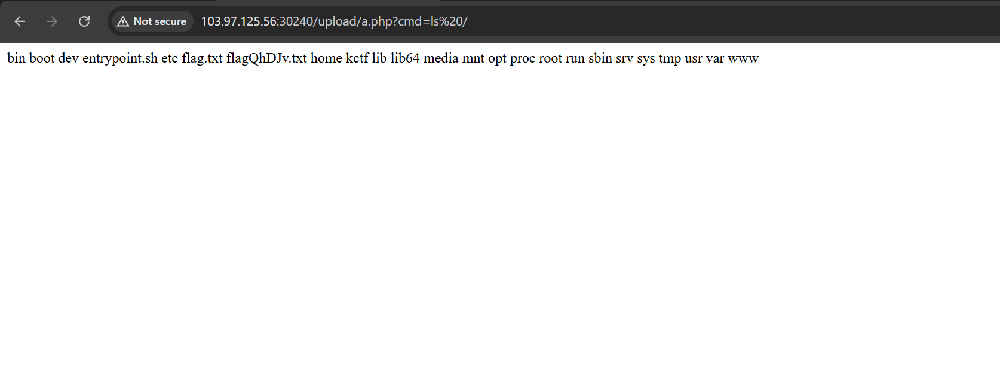

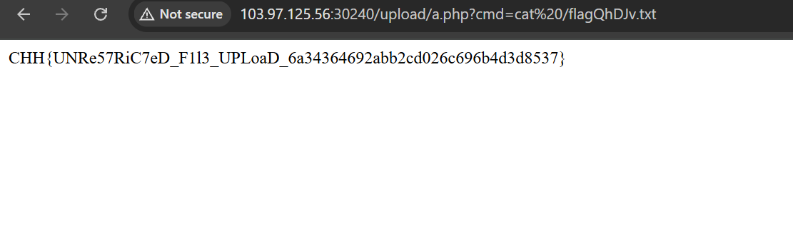

---

## Unprotected admin functionality

open `devtool` and go to `/adminarena` to get the flag

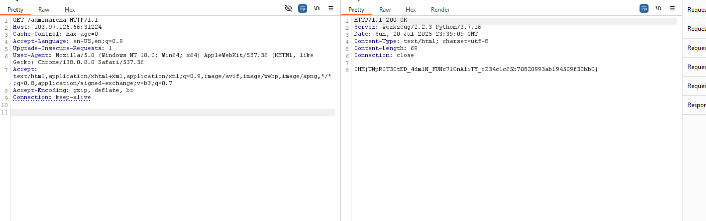

---

## Hello Cookie

Please login with `guest:guest` and change cookie `username=admin`

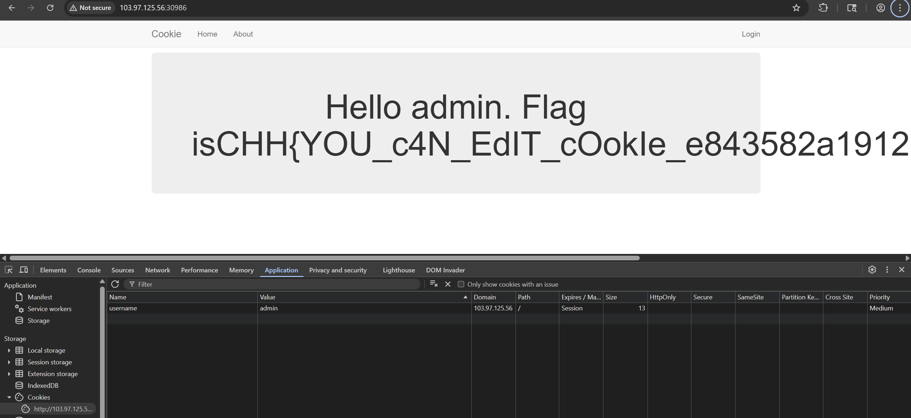

---

## Unprotected admin functionality with unpredictable

go to `robots.txt` and go to `/super_s3cr3t_p@th` to get the `flag`

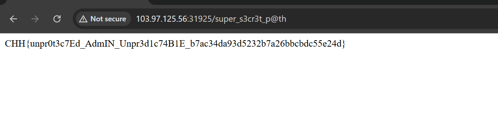

---

## Insecure Download File

we get a source code to create files to save `msgs`

`source`
```python
import glob

from flask import Flask, render_template, Response, request, send_from_directory, redirect, send_file
import os

app = Flask(__name__)
app.config['SECRET_KEY'] = os.urandom(120)
FLAG = open("/flag.txt", "r").read()

filename = 1


def init_msg():
    global filename
    with open(f"file/{filename}.txt", "w+") as file_writer:
        file_writer.write(FLAG)
    filename += 1


@app.before_first_request
def init_db():
    init_msg()


@app.route('/')
def index():
    return render_template('welcome.jinja2',
                           title="challenge-name-web-python",
                           description="challenge-name-web-python")


@app.route('/heath')
def heath():
    return "OK"


@app.route("/send_msg", methods=["GET", "POST"])
def send_msg():
    global filename

    if request.method == "GET":
        return render_template("chat-as-textarea.jinja2")
    elif request.method == "POST":
        msg = request.form.get("msg", None)
        with open(f"file/{filename}.txt", "w+") as file_writer:
            file_writer.write(msg)
        filename += 1
        return render_template("chat-as-textarea.jinja2")


@app.route("/download", methods=["GET"])
def download():
    file_name = request.args.get("file")
    if not file_name:
        list_of_files = glob.glob("file/*")
        latest_file = os.path.basename(max(list_of_files))
        return redirect(f"/download?file={latest_file}")
    return send_file(f"file/{file_name}", as_attachment=True)


@app.route('/debug')
def debug():
    return Response(open(__file__).read(), mimetype='text/plain')


if __name__ == '__main__':
    app.run(host='0.0.0.0', port=1337, debug=False)
```

The program includes:
- the file names will be created each time a `msg` is saved
- at `/send_msg` there are 2 methods: `GET` to get information, `POST` to send `msg`, and it will be saved to the file with the next serial number
- `/download` to download the file with filename as input, by default it will be inside `file/` so exploit it by `pathtraversal` to get `flag.txt`

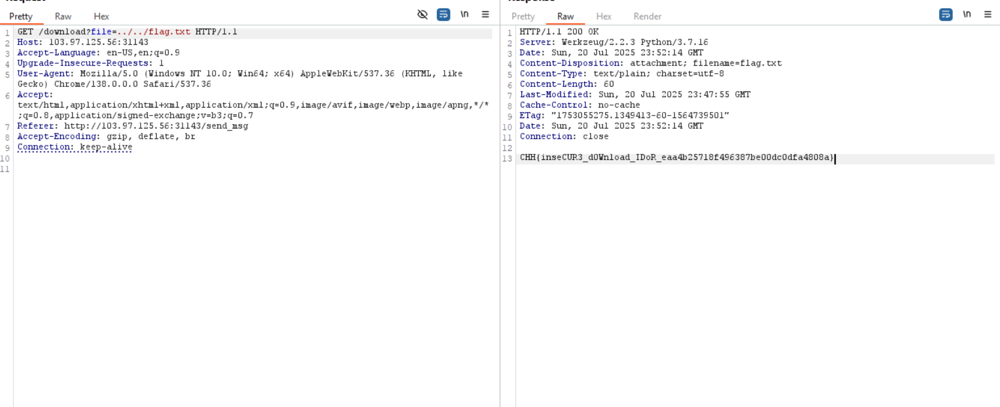

---

