# Steganography

## Split

In this challenge, we are provided with an image containing an `encrypted` message.

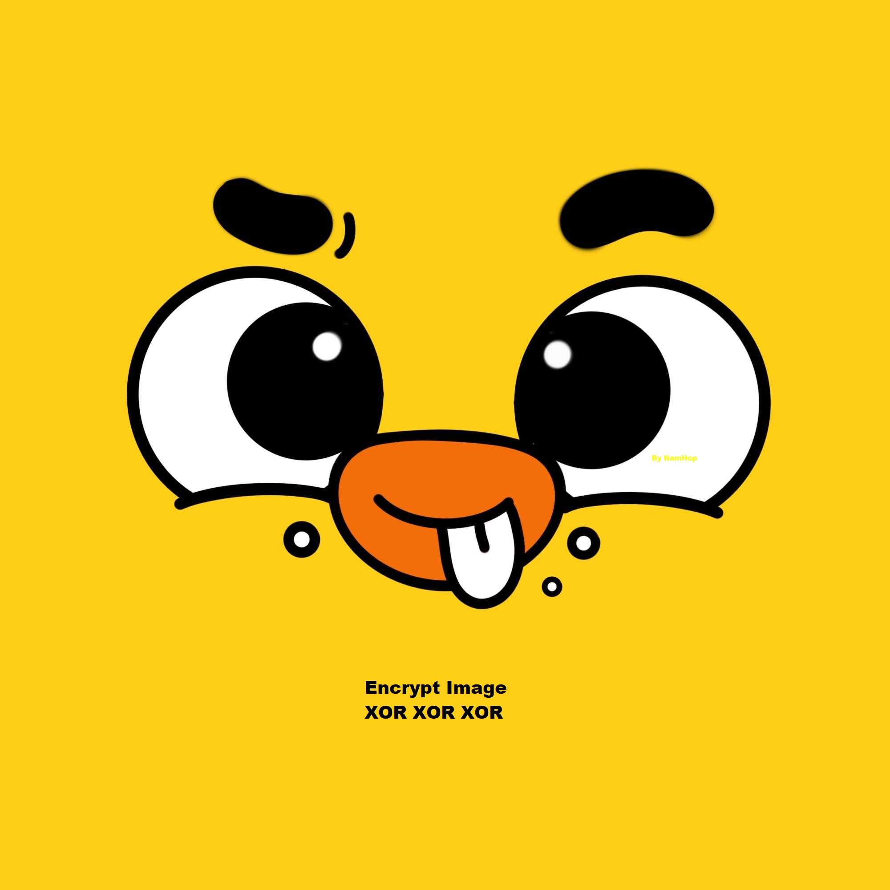

Next, I began the exploration process to gather more information and discovered that the image contains compressed data by using the `binwalk` command.

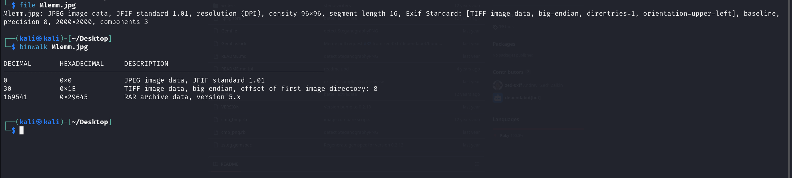

I then extracted the compressed data and decompressed it, resulting in a `canva` file.

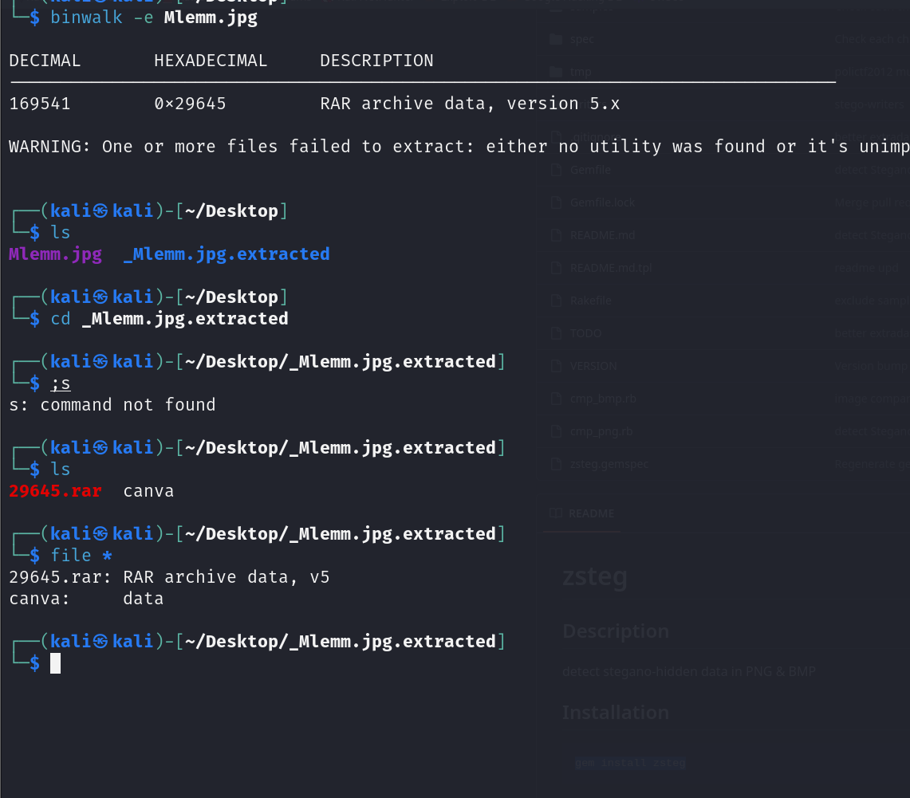

I continued analyzing the canva file and found only files named `canva.png.001`, `canva.png.002`, and `canva.png.003`, but I still don't know what this `canva` file is.

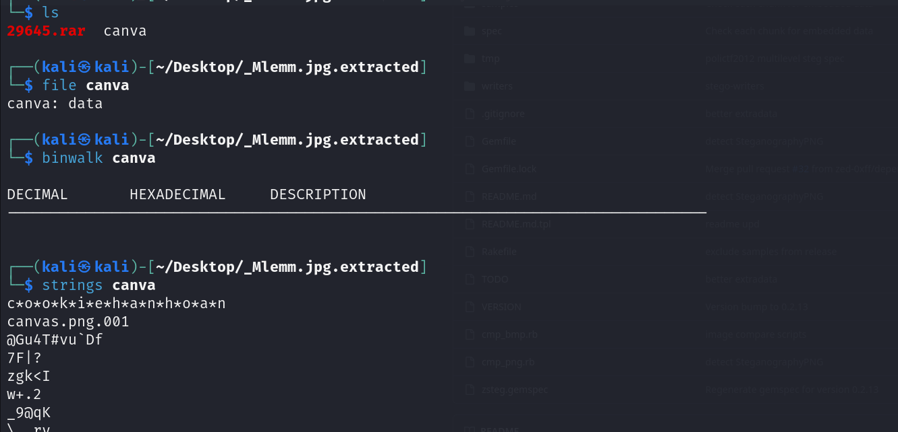

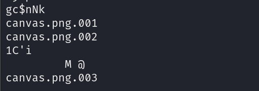

I spent quite a bit of time analyzing it with little progress until I opened it with `HxD`


We can see that there is `R.a.r` following `c*o*o*k*i*e*h*a*n*h*o*a*n`, which caused it to be hidden from the strings command. After comparing it with the standard signature of a `RAR` file, I corrected it accordingly.

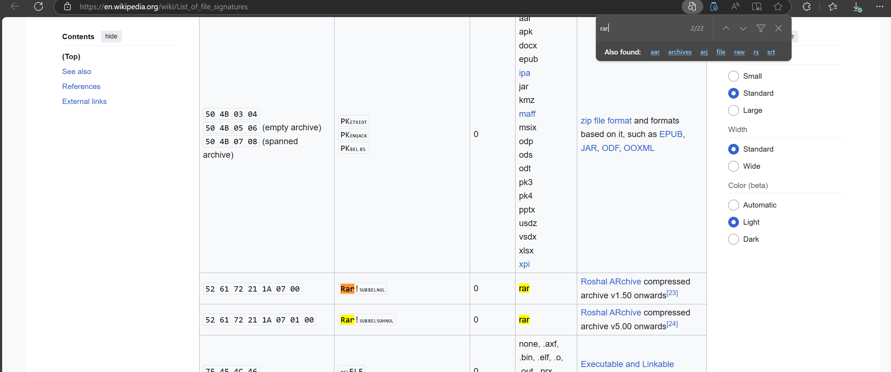

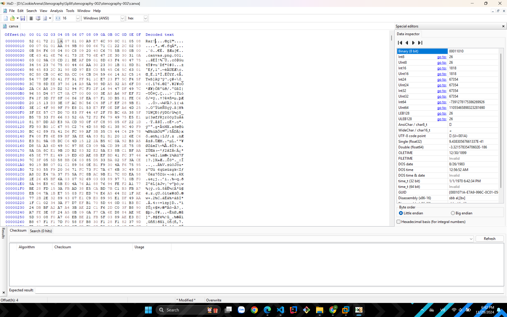

After saving it as `canva.rar` and extracting it, I obtained the same three files as initially seen in `canva` file.

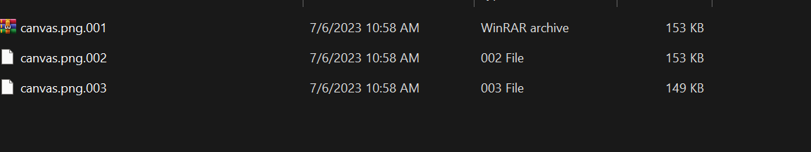

After checking, we see that the first file is a `PNG image` and the other two files are data files.

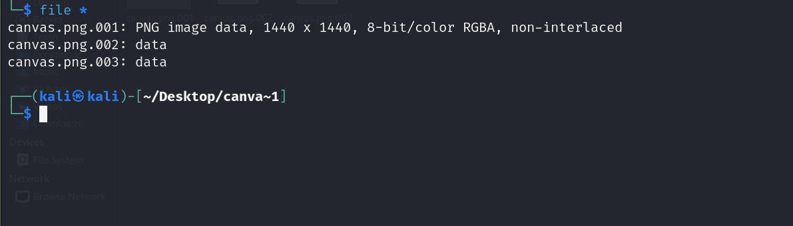

At this point, I analyzed the image and found nothing until I checked the remaining files and noticed that the end of `canva.png.003` contained the `IEND string` (a familiar ending for PNG files).

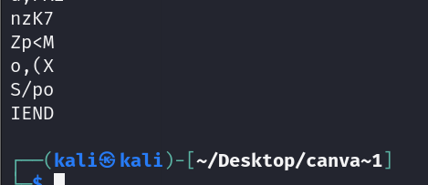

I visualized and reassembled the bytes of the three files in the correct order, and we obtained a new image.

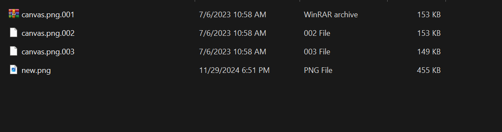

I then analyzed it using `zsteg` and obtained a strange string.

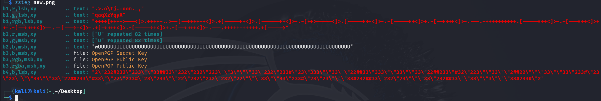

After researching, I realized it was `brainfuck` language, and I used [dcode](https://www.dcode.fr/brainfuck-language) to decode it. 

```shell
++++[++++>---<]>.+++++..>--[-->+++++<]>.+[----->+<]>.[------>+<]>-.-[++>-----<]>.[----->++<]>-.-[----->+<]>+.-[-->+++<]>-.---.+++++++++++.[----->++<]>-.+[--->++<]>+++.-[-->+++<]>--.--[--->+<]>-.+[->+++<]>.-[----->+<]>+.-[-->+++<]>-.---.+++++++++++.+[----->
```

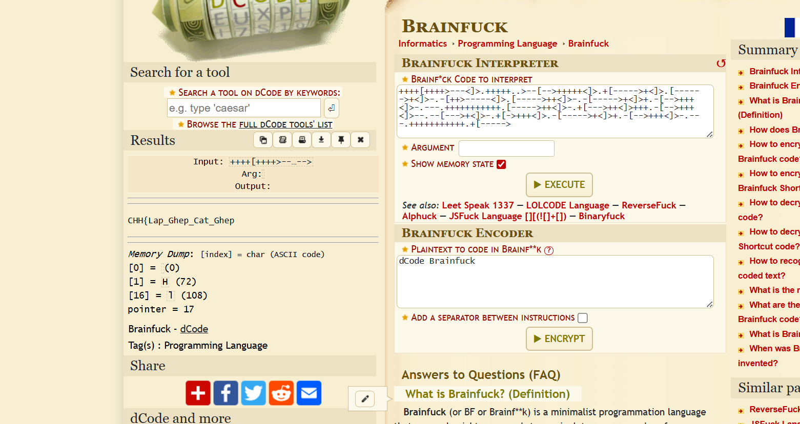

After receiving the string, I continued searching for the rest but couldn't find anything until I tried adding `}`, and that's when we got the `flag` :v.

`flag` is `CHH{Lap_Ghep_Cat_Ghep}`

---

## Here with your eyes

`Description`

```
Here with your eyes. Spectrum steganography is hiding strings in the audio spectrum. One distant feature is that it often contains noisy or harsh sounds.
```

This is a very straightforward challenge based on the description. We just need to open the provided `WAV` file in `Audacity` to see the `flag`. Note that it should be in the format `CHH{xxx}`

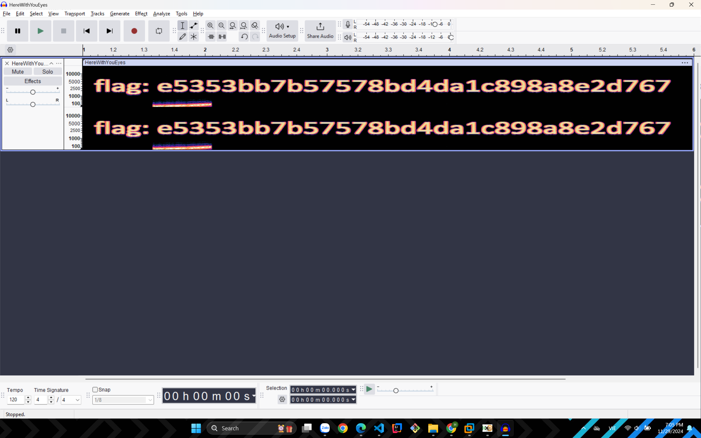

`flag` is `CHH{e5353bb7b57578bd4da1c898a8e2d767}`

---

## Can you see me ?

`Description`

```
Doing with image files should be the first step for anyone who learning cybersecurity
```

In this challenge, we received an image file, and after analyzing it a few times, we obtained a message **(not the flag :v)**

```
y0u_c4n_n0t_cr4ck_th1s_f1l3_w1th_th3_d3f4ut_w0rdl1st_0n_k4l1
```

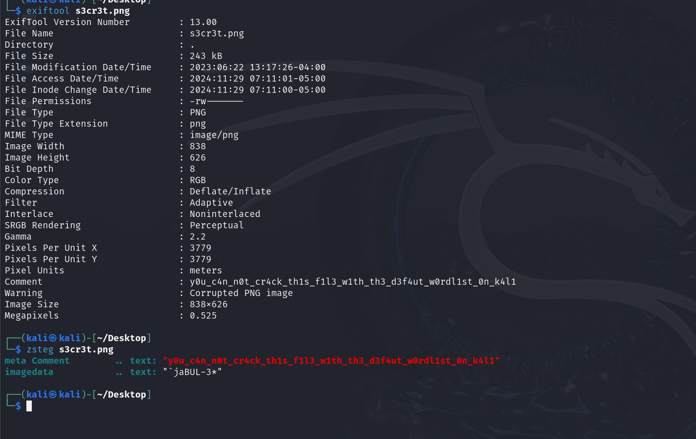

Then I used `pngcheck` on this file and found an error at byte `00 4e 00 47`. After that, I used H`xD` to inspect it and saw that it was a segment of the `PNG image hex`, but with `00` bytes inserted in between.

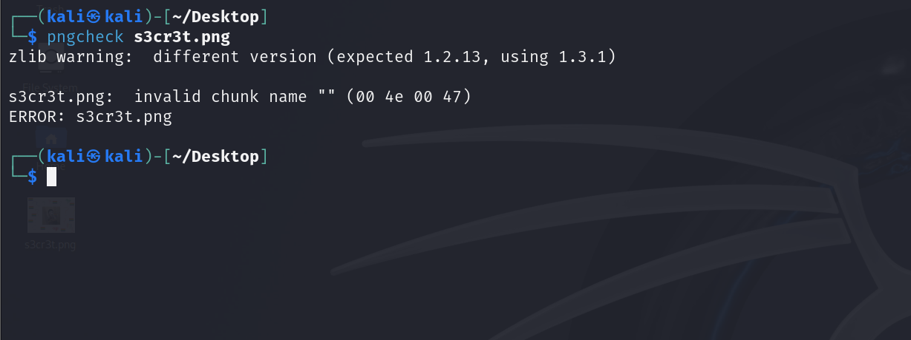

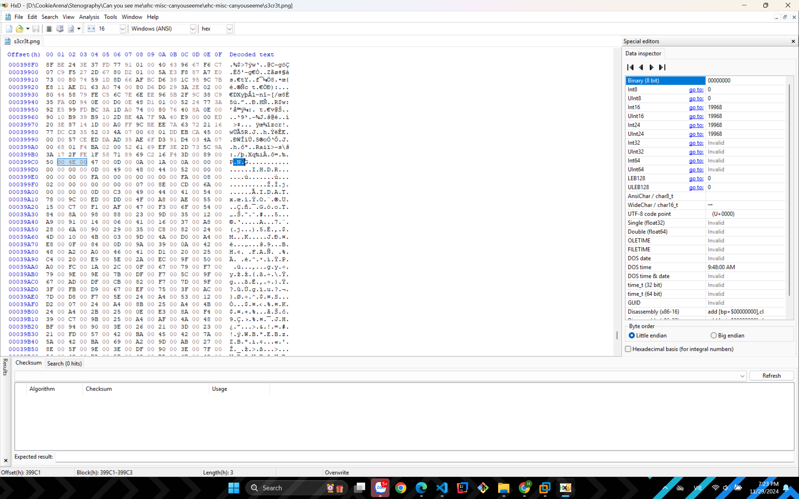

I copied that `hex` segment into a file called `hex.txt` and created a `script` to remove those `00` bytes.

```
89 00 50 00 4E 00 47 00 0D 00 0A 00 1A 00 0A 00 00 00 00 00 00 00 0D 00 49 00 48 00 44 00 52 00 00 00 00 00 00 00 FA 00 00 00 00 00 00 00 FA 00 08 00 02 00 00 00 00 00 00 00 07 00 8E 00 CD 00 6A 00 00 00 00 00 0D 00 C3 00 49 00 44 00 41 00 54 00 78 00 9C 00 ED 00 DD 00 4F 00 A8 00 AE 00 55 00 15 00 C7 00 F1 00 AF 00 47 00 F3 00 6F 00 54 00 84 00 8A 00 98 00 88 00 23 00 9D 00 35 00 12 00 A9 00 91 00 14 00 06 00 41 00 16 00 37 00 A8 00 28 00 6A 00 90 00 29 00 35 00 C8 00 82 00 24 00 4D 00 10 00 4B 00 03 00 9D 00 4A 00 D0 00 A4 00 E8 00 0F 00 84 00 0D 00 9A 00 39 00 0A 00 42 00 48 00 A2 00 A0 00 46 00 41 00 D1 00 20 00 25 00 C4 00 20 00 E9 00 5E 00 2A 00 EC 00 9F 00 50 00 A0 00 FC 00 1A 00 2C 00 0F 00 67 00 79 00 F7 00 79 00 9E 00 9E 00 7B 00 DF 00 F7 00 5C 00 9F 00 67 00 AD 00 DF 00 CB 00 82 00 F7 00 7D 00 9F 00 3F 00 FB 00 D9 00 67 00 EF 00 75 00 3F 00 AC 00 7D 00 D8 00 F7 00 5E 00 24 00 A4 00 53 00 12 00 D2 00 07 00 24 00 A4 00 8B 00 25 00 A4 00 4B 00 24 00 A4 00 2B 00 25 00 0E 00 E3 00 8A 00 F4 00 39 00 C7 00 9B 00 25 00 A4 00 AF 00 4A 00 48 00 BF 00 94 00 90 00 3E 00 26 00 21 00 3D 00 23 00 21 00 FD 00 57 00 42 00 BA 00 45 00 42 00 7A 00 5A 00 42 00 BA 00 69 00 A2 00 9D 00 AB 00 27 00 8E 00 5F 00 9E 00 3E 00 DF 00 90 00 3E 00 7F 00 56 00 42 00 BA 00 57 00 42 00 BA 00 4B 00 42 00 FA 00 9C 00 84 00 F4 00 4E 00 09 00 E9 00 CB 00 12 00 D2 00 83 00 E9 00 F3 00 47 00 25 00 A4 00 8F 00 0C 00 3F 00 4B 00 FC 00 BC 00 1F 00 97 00 90 00 EE 00 90 00 90 00 1E 00 91 00 90 00 EE 00 91 00 90 00 1E 00 9F 00 38 00 7E 00 7F 00 6A 00 FF 00 AA 00 D4 00 DA 00 45 00 69 00 F4 00 4E 00 A7 00 F6 00 73 00 CC 00 9F 00 7D 00 4E 00 42 00 BA 00 4F 00 42 00 BA 00 46 00 42 00 7A 00 40 00 42 00 BA 00 55 00 42 00 FA 00 9E 00 84 00 F4 00 0F 00 09 00 E9 00 61 00 09 00 E9 00 FD 00 12 00 D2 00 F3 00 12 00 D2 00 7B 00 25 00 A4 00 EB 00 25 00 A4 00 7F 00 49 00 48 00 77 00 4B 00 48 00 9F 00 94 00 90 00 7E 00 25 00 21 00 DD 00 9E 00 7A 00 FE 00 13 00 09 00 E9 00 7D 00 12 00 D2 00 87 00 25 00 A4 00 2F 00 4A 00 48 00 0F 00 49 00 48 00 2F 00 49 00 48 00 3F 00 94 00 90 00 5E 00 96 00 90 00 9E 00 95 00 90 00 FE 00 22 00 21 00 3D 00 26 00 21 00 FD 00 4E 00 42 00 7A 00 54 00 42 00 BA 00 76 00 C8 00 A5 00 CB 00 D2 00 0C 00 EE 00 2B 00 1F 00 72 00 FB 00 31 00 DA 00 07 00 12 00 D2 00 8D 00 69 00 3C 00 27 00 F3 00 36 00 37 00 74 00 21 00 13 00 F7 00 BA 00 89 00 6B 00 72 00 5C 00 34 00 71 00 FC 00 C9 00 34 00 C4 00 53 00 B1 00 CB 00 1F 00 86 00 37 00 A5 00 76 00 E6 00 FF 00 30 00 9C 00 5C 00 D2 00 E7 00 49 00 8D 00 FE 00 5C 00 BA 00 78 00 AC 00 F2 00 E7 00 0F 00 4D 00 5C 00 7F 00 DF 00 82 00 F1 00 CF 00 7D 00 28 00 82 00 20 00 B3 00 13 00 6F 00 05 00 9B 00 2A 00 98 00 A2 00 14 00 82 00 F1 00 66 00 05 00 AD 00 60 00 8B 00 52 00 30 00 2E 00 B2 00 82 00 56 00 30 00 47 00 D9 00 52 00 70 00 C9 00 60 00 59 00 C1 00 76 00 0A 00 4A 00 94 00 44 00 70 00 79 00 42 00 E4 00 07 00 58 00 C1 00 88 00 B2 00 0A 00 2E 00 18 00 AB 00 4D 00 22 00 38 00 D5 00 09 00 2B 00 18 00 D1 00 54 00 C1 00 C5 00 F9 00 90 00 DB 00 DF 00 00 00 82 00 F1 00 C5 00 0A 00 5A 00 C1 00 16 00 A5 00 E0 00 01 00 00 00 67 00 00 00 B8 00 04 00 80 00 D3 00 00 00 5C 00 CC 00 D9 00 AF 00 8B 00 27 00 CE 00 7E 00 0A 00 80 00 4F 00 00 00 70 00 1F 00 00 00 D7 00 00 00 F0 00 00 00 00 00 B7 00 02 00 F0 00 2E 00 00 00 1E 00 03 00 E0 00 06 00 00 00 FE 00 08 00 C0 00 53 00 00 00 FC 00 1A 00 80 00 1F 00 00 00 F0 00 35 00 00 00 DE 00 02 00 C0 00 65 00 00 00 FC 00 1C 00 80 00 DB 00 01 00 B8 00 1F 00 80 00 BB 00 00 00 B8 00 08 00 80 00 DF 00 00 00 70 00 25 00 00 00 97 00 02 00 F0 00 15 00 00 00 BE 00 0D 00 C0 00 CB 00 00 00 FC 00 1E 00 80 00 3F 00 03 00 F0 00 DD 00 74 00 D7 00 A3 00 00 00 5C 00 0B 00 C0 00 9D 00 00 00 DC 00 0D 00 1C 00 8E 00 C3 00 E5 00 00 00 3C 00 03 00 C0 00 8F 00 00 00 F8 00 03 00 00 00 3F 00 06 00 E0 00 7A 00 8E 00 7F 00 5D 00 0D 00 80 00 D2 00 91 00 F8 00 7C 00 0A 00 80 00 57 00 53 00 CF 00 63 00 E4 00 6F 00 04 00 E0 00 1B 00 E9 00 A7 00 88 00 D7 00 15 00 43 00 CB 00 4F 00 01 00 F0 00 33 00 00 00 1E 00 02 00 0E 00 47 00 E6 00 CE 00 D4 00 CF 00 BF 00 03 00 70 00 0B 00 00 00 4F 00 03 00 70 00 13 00 00 00 FF 00 06 00 E0 00 EB 00 00 00 BC 00 1B 00 80 00 9F 00 02 00 F0 00 1E 00 E0 00 70 00 9C 00 9F 00 05 00 E0 00 83 00 00 00 BC 00 00 00 C0 00 75 00 43 00 1F 00 FE 00 3A 00 1C 00 89 00 9F 00 E5 00 3F 00 E9 00 C8 00 9F 00 00 00 78 00 12 00 80 00 77 00 00 00 F0 00 4D 00 00 00 BE 00 0F 00 C0 00 B7 00 00 00 F8 00 2D 00 00 00 FF 00 4C 00 7D 00 FB 00 1B 00 00 00 6F 00 07 00 E0 00 39 00 00 00 3E 00 0F 00 C0 00 83 00 00 00 7C 00 09 00 38 00 1C 00 BD 00 B7 00 01 00 87 00 B9 00 F4 00 1D 00 00 00 1E 00 06 00 0E 00 47 00 FE 00 17 00 C0 00 61 00 8E 00 BD 00 94 00 EE 00 FA 00 02 00 00 00 57 00 8D 00 26 00 59 00 41 00 2B 00 B8 00 AF 00 7C 00 58 00 5D 00 29 00 18 00 DD 00 72 00 2D 00 78 00 AE 00 FD 00 F4 00 82 00 38 00 C7 00 66 00 10 00 CC 00 03 00 61 00 05 00 AD 00 60 00 F1 00 05 00 71 00 BC 00 59 00 41 00 2B 00 38 00 F6 00 A1 00 20 00 82 00 0C 00 13 00 6F 00 05 00 AD 00 60 00 D9 00 52 00 30 00 0E 00 59 00 C1 00 1C 00 56 00 B0 00 6C 00 29 00 18 00 37 00 58 00 41 00 2B 00 D8 00 A2 00 14 00 9C 00 1A 00 2C 00 2B 00 D8 00 5A 00 41 00 89 00 92 00 08 00 CE 00 27 00 44 00 7E 00 80 00 15 00 8C 00 68 00 A1 00 E0 00 C4 00 58 00 6D 00 1E 00 C1 00 DC 00 90 00 15 00 8C 00 B0 00 82 00 F3 00 F9 00 90 00 DB 00 DF 00 18 00 82 00 C7 00 5E 00 77 00 56 00 EA 00 8C 00 61 00 05 00 E7 00 C7 00 6A 00 F3 00 0A 00 A6 00 28 00 85 00 60 00 EC 00 DC 00 F0 00 3E 00 19 00 EF 00 93 00 79 00 01 00 A8 00 B9 00 4F 00 06 00 0E 00 67 00 E4 00 D5 00 25 00 CE 00 59 00 C1 00 76 00 0A 00 EE 00 90 00 0F 00 AB 00 2E 00 05 00 A3 00 8B 00 AE 00 05 00 97 00 F4 00 D3 00 0B 00 E2 00 1C 00 9B 00 44 00 30 00 4E 00 AC 00 2D 00 99 00 AC 00 A0 00 17 00 C4 00 B9 00 FD 00 BD 00 21 00 18 00 87 00 AC 00 A0 00 15 00 6C 00 51 00 0A 00 8E 00 3F 00 8C 00 15 00 B4 00 82 00 65 00 4B 00 C1 00 38 00 6D 00 05 00 AD 00 60 00 8B 00 52 00 30 00 6E 00 B6 00 82 00 56 00 B0 00 45 00 29 00 38 00 35 00 70 00 56 00 B0 00 B5 00 82 00 12 00 25 00 11 00 1C 00 4F 00 E4 00 07 00 58 00 C1 00 88 00 76 00 0A 00 4E 00 7C 00 DE 00 3C 00 82 00 53 00 9D 00 B3 00 82 00 AD 00 15 00 1C 00 22 00 B7 00 BF 00 61 00 04 00 C7 00 1B 00 AC 00 A0 00 15 00 2C 00 5B 00 0A 00 1E 00 0C 00 3B 00 22 00 BC 00 4F 00 C6 00 FB 00 64 00 6A 00 ED 00 93 00 39 00 BA 00 F2 00 C5 00 FC 00 A7 00 CA 00 0A 00 5A 00 C1 00 E2 00 A5 00 60 00 74 00 D7 00 B5 00 A0 00 17 00 C4 00 2D 00 4A 00 C1 00 B8 00 68 00 0D 00 C9 00 64 00 05 00 57 00 A4 00 A0 00 44 00 49 00 04 00 D9 00 53 00 47 00 AD 00 60 00 8E 00 CD 00 2B 00 28 00 51 00 12 00 C1 00 25 00 13 00 6F 00 05 00 DB 00 29 00 B8 00 A7 00 7E 00 AE 00 0E 00 41 00 D2 00 17 00 2B 00 38 00 46 00 EE 00 43 00 23 00 05 00 17 00 CC 00 FB 00 26 00 11 00 8C 00 86 00 AC 00 20 00 C3 00 64 00 E7 00 68 00 A7 00 60 00 FA 00 5C 00 0A 00 C1 00 7C 00 C2 00 0A 00 5A 00 C1 00 E2 00 A5 00 20 00 C3 00 03 00 AC 00 60 00 44 00 6B 00 05 00 D3 00 E7 00 52 00 08 00 E6 00 13 00 56 00 D0 00 0A 00 E6 00 C8 00 ED 00 17 00 41 00 30 00 A7 00 CE 00 18 00 56 00 70 00 8C 00 16 00 0A 00 A6 00 28 00 85 00 60 00 EC 00 E8 00 F0 00 3E 00 19 00 EF 00 93 00 A9 00 BB 00 4F 00 06 00 8E 00 B2 00 DA 00 0A 00 5A 00 C1 00 89 00 19 00 2F 00 58 00 0A 00 46 00 D7 00 5D 00 0B 00 E6 00 F0 00 82 00 38 00 47 00 29 00 04 00 C7 00 9B 00 AD 00 A0 00 15 00 2C 00 BB 00 20 00 66 00 87 00 8E 00 5A 00 C1 00 1C 00 A5 00 14 00 1C 00 A2 00 08 00 82 00 4C 00 4C 00 BC 00 15 00 6C 00 AD 00 E0 00 0E 00 FD 00 5C 00 35 00 82 00 71 00 9B 00 15 00 9C 00 EA 00 43 00 53 00 05 00 27 00 E6 00 7D 00 F3 00 08 00 46 00 A3 00 56 00 70 00 8C 00 D6 00 0A 00 4A 00 94 00 44 00 70 00 EA 00 06 00 2B 00 D8 00 5A 00 41 00 89 00 92 00 08 00 E6 00 E1 00 B6 00 82 00 56 00 30 00 A2 00 6C 00 29 00 98 00 BF 00 58 00 41 00 2B 00 98 00 DB 00 2F 00 88 00 E0 00 78 00 C2 00 0A 00 4E 00 0E 00 D6 00 F0 00 B9 00 AC 00 82 00 E9 00 73 00 29 00 04 00 0F 00 5E 00 B7 00 A3 00 00 00 BC 00 4F 00 E6 00 F5 00 2F 00 EF 00 93 00 D9 00 FE 00 3E 00 19 00 80 00 57 00 5E 00 3B 00 6B 00 05 00 AD 00 E0 00 A8 00 E0 00 C4 00 D9 00 CD 00 97 00 82 00 A4 00 64 00 72 00 2D 00 18 00 E1 00 05 00 71 00 D9 00 52 00 30 00 DE 00 AC 00 A0 00 15 00 6C 00 B1 00 20 00 3E 00 B6 00 95 00 99 00 8E 00 5A 00 C1 00 1C 00 65 00 15 00 94 00 28 00 89 00 20 00 69 00 E2 00 AD 00 A0 00 15 00 2C 00 5E 00 0A 00 E6 00 86 00 AC 00 A0 00 15 00 2C 00 5E 00 0A 00 C6 00 03 00 AC 00 60 00 84 00 15 00 2C 00 5E 00 0A 00 E6 00 1B 00 AC 00 A0 00 15 00 2C 00 5E 00 0A 00 C6 00 09 00 2B 00 68 00 05 00 5B 00 94 00 82 00 FB 00 9A 00 78 00 2B 00 58 00 4A 00 41 00 89 00 92 00 08 00 C6 00 9B 00 15 00 9C 00 1F 00 AC 00 76 00 0A 00 EE 00 69 00 DE 00 57 00 87 00 60 00 EC 00 F4 00 F0 00 3E 00 99 00 FC 00 F2 00 3E 00 99 00 5A 00 FB 00 64 00 F2 00 59 00 2B 00 68 00 05 00 67 00 CF 00 96 00 2A 00 05 00 F3 00 14 00 BA 00 16 00 9C 00 0F 00 2F 00 88 00 37 00 8F 00 60 00 7C 00 B1 00 82 00 56 00 30 00 27 00 53 00 D9 00 05 00 F1 00 92 00 8E 00 5A 00 C1 00 1C 00 2D 00 14 00 94 00 28 00 89 00 20 00 17 00 3C 00 21 00 AC 00 E0 00 7C 00 42 00 E4 00 F6 00 5D 00 0A 00 46 00 EC 00 0D 00 C1 00 78 00 B3 00 82 00 56 00 30 00 CF 00 7B 00 D9 00 52 00 30 00 1E 00 66 00 05 00 AD 00 60 00 8B 00 52 00 F0 00 FF 00 8E 00 3E 00 56 00 B0 00 A1 00 82 00 12 00 25 00 11 00 8C 00 8B 00 D6 00 96 00 B8 00 56 00 D0 00 A5 00 E0 00 89 00 20 00 C8 00 0E 00 13 00 6F 00 05 00 CB 00 2A 00 28 00 B1 00 BE 00 C4 00 DD 00 03 00 82 00 F3 00 37 00 5B 00 C1 00 88 00 76 00 0A 00 EE 00 30 00 EF 00 AB 00 46 00 30 00 76 00 7D 00 78 00 9F 00 8C 00 F7 00 C9 00 D4 00 DD 00 27 00 73 00 F4 00 BA 00 D9 00 0A 00 5A 00 C1 00 46 00 A5 00 20 00 7B 00 4A 00 88 00 FC 00 80 00 46 00 B5 00 E0 00 EC 00 BD 00 2E 00 05 00 23 00 56 00 84 00 60 00 9C 00 B0 00 82 00 56 00 B0 00 C5 00 82 00 F8 00 D8 00 A3 00 58 00 C1 00 D7 00 47 00 3B 00 05 00 25 00 4A 00 22 00 C8 00 05 00 49 00 08 00 2B 00 38 00 9F 00 10 00 B9 00 FD 00 55 00 28 00 38 00 71 00 7C 00 F3 00 08 00 C6 00 A1 00 47 00 24 00 AC 00 E0 00 61 00 AC 00 21 00 99 00 5C 00 0A 00 9E 00 08 00 82 00 F1 00 60 00 2B 00 68 00 05 00 5B 00 94 00 82 00 53 00 8D 00 E6 00 4E 00 58 00 C1 00 3C 00 F1 00 2D 00 14 00 94 00 28 00 89 00 20 00 C3 00 64 00 E7 00 B0 00 82 00 4D 00 15 00 9C 00 88 00 DC 00 87 00 4D 00 22 00 C8 00 39 00 4E 00 BC 00 15 00 6C 00 A1 00 E0 00 30 00 D7 00 39 00 36 00 8C 00 E0 00 78 00 91 00 15 00 8C 00 68 00 AD 00 E0 00 39 00 CE 00 FB 00 66 00 10 00 8C 00 1D 00 20 00 DE 00 27 00 43 00 FA 00 7C 00 0A 00 F0 00 3E 00 99 00 3A 00 FB 00 64 00 00 00 9E 00 07 00 E0 00 36 00 AC 00 A0 00 15 00 1C 00 15 00 94 00 28 00 59 00 0A 00 B2 00 43 00 42 00 E4 00 07 00 34 00 AD 00 05 00 87 00 70 00 29 00 18 00 B1 00 52 00 04 00 E3 00 22 00 2B 00 B8 00 3C 00 21 00 5A 00 28 00 B8 00 43 00 3E 00 E4 00 F6 00 57 00 87 00 60 00 3E 00 61 00 05 00 73 00 B4 00 56 00 50 00 A2 00 24 00 82 00 9C 00 58 00 42 00 58 00 C1 00 F9 00 84 00 C8 00 ED 00 AF 00 4E 00 C1 00 14 00 A5 00 10 00 8C 00 D3 00 56 00 70 00 0D 00 C9 00 B4 00 22 00 05 00 4F 00 2C 00 1F 00 DE 00 60 00 04 00 A3 00 13 00 56 00 D0 00 0A 00 B6 00 28 00 05 00 A7 00 3A 00 61 00 05 00 F3 00 C4 00 B7 00 53 00 50 00 A2 00 24 00 82 00 63 00 43 00 56 00 D0 00 0A 00 4E 00 F5 00 61 00 F3 00 08 00 B2 00 60 00 E2 00 AD 00 60 00 3B 00 05 00 87 00 28 00 82 00 60 00 BC 00 59 00 C1 00 08 00 2B 00 58 00 BC 00 14 00 8C 00 DD 00 20 00 DE 00 27 00 73 00 0A 00 F0 00 3E 00 99 00 9A 00 FB 00 64 00 00 00 9E 00 78 00 ED 00 E7 00 B2 00 82 00 56 00 70 00 54 00 50 00 A2 00 64 00 29 00 78 00 EC 00 AC 00 CF 00 24 00 44 00 7E 00 80 00 6B 00 C1 00 08 00 97 00 82 00 11 00 1B 00 40 00 30 00 6E 00 B8 00 69 00 A2 00 21 00 2B 00 18 00 D1 00 4E 00 C1 00 73 00 CC 00 87 00 DC 00 FE 00 AA 00 11 00 CC 00 5F 00 AC 00 A0 00 15 00 2C 00 5E 00 0A 00 1E 00 A4 00 02 00 FF 00 0C 00 70 00 B8 00 10 00 3C 00 3D 00 94 00 FF 00 A4 00 23 00 E3 00 59 00 FF 00 47 00 C4 00 F9 00 E5 00 05 00 F1 00 5A 00 17 00 C4 00 56 00 D0 00 0A 00 8E 00 0A 00 EE 00 35 00 1F 00 56 00 54 00 0A 00 46 00 87 00 5C 00 0B 00 7A 00 41 00 DC 00 A2 00 14 00 24 00 75 00 C2 00 0A 00 E6 00 89 00 6F 00 AD 00 A0 00 44 00 49 00 04 00 E3 00 CD 00 0A 00 5A 00 C1 00 A9 00 3E 00 94 00 42 00 90 00 89 00 89 00 B7 00 82 00 AD 00 15 00 94 00 28 00 89 00 60 00 7C 00 B1 00 82 00 63 00 B4 00 56 00 70 00 62 00 DE 00 37 00 8F 00 E0 00 41 00 FA 00 95 00 8D 00 7F 00 2D 00 E8 00 5F 00 0B 00 56 00 DC 00 27 00 03 00 F0 00 19 00 00 00 DE 00 6A 00 05 00 AD 00 60 00 A3 00 52 00 70 00 49 00 42 00 E4 00 07 00 B8 00 16 00 8C 00 F0 00 82 00 38 00 62 00 63 00 08 00 8E 00 0D 00 59 00 C1 00 88 00 D6 00 0A 00 2E 00 C8 00 87 00 DC 00 FE 00 66 00 10 00 3C 00 F6 00 8A 00 B3 00 C2 00 0A 00 B6 00 53 00 70 00 88 00 22 00 08 00 C6 00 E2 00 CC 00 FB 00 64 00 BC 00 20 00 EE 00 B1 00 20 00 B6 00 82 00 56 00 70 00 54 00 70 00 E7 00 7C 00 58 00 69 00 29 00 18 00 9D 00 73 00 2D 00 B8 00 BC 00 9F 00 5E 00 10 00 E7 00 D8 00 18 00 82 00 B9 00 D3 00 6B 00 4B 00 26 00 2B 00 E8 00 05 00 71 00 6E 00 7F 00 0F 00 08 00 C6 00 17 00 2B 00 48 00 1A 00 3E 00 2B 00 58 00 B6 00 14 00 24 00 4D 00 BC 00 15 00 B4 00 82 00 C5 00 4B 00 C1 00 38 00 61 00 05 00 23 00 AC 00 60 00 F1 00 52 00 30 00 6E 00 B3 00 82 00 56 00 B0 00 45 00 29 00 38 00 0E 00 96 00 15 00 B4 00 82 00 65 00 4B 00 C1 00 63 00 8F 00 62 00 05 00 8F 00 8B 00 46 00 0A 00 0E 00 63 00 55 00 04 00 C1 00 78 00 B3 00 82 00 11 00 56 00 70 00 3E 00 1F 00 72 00 FB 00 9B 00 44 00 F0 00 D8 00 AB 00 B1 00 82 00 CD 00 15 00 94 00 28 00 89 00 60 00 EC 00 DF 00 F0 00 3E 00 19 00 EF 00 93 00 A9 00 BB 00 4F 00 E6 00 E8 00 F8 00 0D 00 58 00 41 00 2B 00 38 00 2A 00 78 00 5E 00 F9 00 B0 00 81 00 52 00 30 00 3A 00 EA 00 5A 00 70 00 BE 00 9F 00 5E 00 10 00 E7 00 D8 00 30 00 82 00 F9 00 A2 00 35 00 24 00 93 00 15 00 5C 00 85 00 82 00 12 00 25 00 11 00 64 00 AF 00 1D 00 B5 00 82 00 39 00 36 00 AC 00 60 00 BA 00 A6 00 14 00 82 00 F9 00 01 00 56 00 D0 00 0A 00 16 00 2F 00 05 00 49 00 53 00 6E 00 05 00 A7 00 22 00 F7 00 A1 00 85 00 82 00 8B 00 E7 00 7D 00 63 00 08 00 46 00 13 00 56 00 70 00 6D 00 89 00 EB 00 52 00 F0 00 44 00 10 00 1C 00 07 00 CE 00 0A 00 5A 00 C1 00 B2 00 A5 00 60 00 3E 00 91 00 1F 00 60 00 05 00 23 00 9A 00 2A 00 38 00 7C 00 2E 00 82 00 E0 00 78 00 C2 00 0A 00 5A 00 C1 00 1C 00 B9 00 FD 00 CD 00 23 00 98 00 BF 00 58 00 41 00 2B 00 58 00 BC 00 14 00 CC 00 FF 00 37 00 93 00 F7 00 C9 00 78 00 9F 00 4C 00 C5 00 7D 00 32 00 70 00 F4 00 4F 00 A8 00 5A 00 41 00 2B 00 38 00 3B 00 E3 00 A5 00 4A 00 C1 00 E8 00 B4 00 6B 00 C1 00 31 00 BC 00 20 00 CE 00 51 00 04 00 C1 00 A9 00 9B 00 AD 00 60 00 6B 00 05 00 25 00 4A 00 22 00 C8 00 CE 00 1D 00 B5 00 82 00 39 00 8A 00 28 00 38 00 71 00 EF 00 E6 00 11 00 64 00 76 00 E2 00 AD 00 60 00 53 00 05 00 77 00 EE 00 E7 00 4A 00 11 00 8C 00 1B 00 AC 00 E0 00 18 00 B9 00 0F 00 ED 00 14 00 9C 00 9D 00 F7 00 0D 00 23 00 18 00 CD 00 59 00 C1 00 35 00 24 00 EE 00 8A 00 14 00 94 00 28 00 89 00 60 00 7C 00 B1 00 82 00 56 00 B0 00 45 00 29 00 48 00 7A 00 80 00 15 00 8C 00 B0 00 82 00 11 00 05 00 11 00 8C 00 37 00 2B 00 68 00 05 00 73 00 E4 00 F6 00 4B 00 21 00 38 00 75 00 C2 00 0A 00 1E 00 33 00 58 00 13 00 9F 00 0B 00 2A 00 28 00 51 00 12 00 C1 00 D8 00 D7 00 E1 00 7D 00 32 00 DE 00 27 00 93 00 5F 00 B5 00 F6 00 C9 00 1C 00 BD 00 5E 00 B1 00 82 00 56 00 B0 00 51 00 29 00 38 00 26 00 93 00 6B 00 C1 00 08 00 2F 00 88 00 0B 00 22 00 98 00 6F 00 B6 00 82 00 56 00 B0 00 F8 00 82 00 98 00 F3 00 EA 00 A8 00 15 00 CC 00 51 00 50 00 C1 00 14 00 A5 00 10 00 8C 00 A5 00 D5 00 A7 00 01 00 B8 00 07 00 80 00 C7 00 01 00 B8 00 03 00 80 00 7B 00 D3 00 F1 00 FB 00 D3 00 22 00 23 00 97 00 FF 00 67 00 00 00 FF 00 47 00 C4 00 5E 00 10 00 6F 00 63 00 41 00 6C 00 05 00 AD 00 E0 00 82 00 79 00 2F 00 52 00 0A 00 46 00 D3 00 AE 00 05 00 73 00 78 00 41 00 5C 00 B6 00 14 00 1C 00 6F 00 B0 00 82 00 56 00 B0 00 EC 00 82 00 38 00 0E 00 59 00 41 00 2B 00 18 00 51 00 BC 00 14 00 8C 00 2F 00 56 00 D0 00 0A 00 E6 00 F6 00 CB 00 96 00 82 00 F9 00 84 00 15 00 9C 00 1F 00 AC 00 46 00 0A 00 4A 00 94 00 44 00 30 00 FF 00 3B 00 33 00 FE 00 B5 00 60 00 7E 00 F9 00 D7 00 82 00 55 00 F6 00 C9 00 E4 00 B3 00 56 00 D0 00 0A 00 2E 00 38 00 5B 00 A4 00 14 00 8C 00 1F 00 C6 00 B5 00 60 00 84 00 17 00 C4 00 C5 00 4B 00 C1 00 78 00 B3 00 82 00 FB 00 4A 00 88 00 22 00 0A 00 4A 00 94 00 44 00 70 00 79 00 47 00 AD 00 60 00 8E 00 E2 00 0A 00 4A 00 94 00 44 00 30 00 4E 00 5B 00 41 00 2B 00 D8 00 A2 00 14 00 24 00 0D 00 9F 00 15 00 B4 00 82 00 79 00 DE 00 0B 00 22 00 48 00 EA 00 BA 00 15 00 B4 00 82 00 C5 00 4B 00 C1 00 78 00 B3 00 82 00 56 00 B0 00 45 00 29 00 98 00 A7 00 73 00 6D 00 89 00 6B 00 05 00 5D 00 0A 00 EE 00 19 00 C1 00 DD 00 27 00 DE 00 0A 00 16 00 54 00 30 00 8D 00 E7 00 DA 00 12 00 77 00 27 00 04 00 49 00 43 00 3C 00 15 00 56 00 30 00 A2 00 91 00 82 00 3B 00 CF 00 FB 00 4A 00 11 00 8C 00 FD 00 1E 00 DE 00 27 00 13 00 2F 00 EF 00 93 00 A9 00 B8 00 4F 00 26 00 9F 00 B5 00 82 00 56 00 70 00 E2 00 6C 00 C1 00 52 00 90 00 BD 00 26 00 44 00 7E 00 40 00 8B 00 5A 00 30 00 0D 00 F1 00 54 00 B8 00 14 00 8C 00 58 00 05 00 82 00 71 00 C8 00 0A 00 5A 00 C1 00 16 00 0B 00 E2 00 F9 00 8E 00 5A 00 C1 00 1C 00 8D 00 14 00 94 00 28 00 89 00 20 00 17 00 30 00 21 00 AC 00 E0 00 7C 00 42 00 E4 00 F6 00 5D 00 0A 00 46 00 EC 00 19 00 C1 00 F8 00 62 00 05 00 AD 00 60 00 8B 00 52 00 30 00 1E 00 69 00 05 00 AD 00 20 00 69 00 F4 00 CA 00 96 00 82 00 F3 00 13 00 90 00 3B 00 61 00 05 00 F3 00 C4 00 17 00 57 00 50 00 A2 00 24 00 82 00 F9 00 86 00 35 00 24 00 AE 00 15 00 5C 00 85 00 82 00 B3 00 91 00 FB 00 B0 00 31 00 04 00 39 00 AF 00 89 00 B7 00 82 00 C5 00 15 00 4C 00 D7 00 AF 00 21 00 71 00 F7 00 86 00 E0 00 D4 00 CD 00 56 00 30 00 A2 00 A9 00 82 00 E7 00 35 00 EF 00 1B 00 40 00 30 00 F6 00 7E 00 78 00 9F 00 8C 00 F7 00 C9 00 D4 00 DD 00 27 00 03 00 70 00 33 00 00 00 CF 00 63 00 05 00 AD 00 E0 00 A8 00 A0 00 44 00 C9 00 52 00 90 00 9D 00 13 00 22 00 3F 00 A0 00 5D 00 2D 00 38 00 11 00 2E 00 05 00 23 00 56 00 87 00 60 00 9C 00 B6 00 82 00 56 00 B0 00 C5 00 82 00 78 00 3C 00 61 00 05 00 73 00 34 00 55 00 50 00 A2 00 24 00 82 00 9C 00 70 00 42 00 58 00 C1 00 F9 00 84 00 C8 00 ED 00 AF 00 48 00 C1 00 21 00 8A 00 20 00 18 00 27 00 AC 00 60 00 C4 00 1A 00 92 00 69 00 15 00 0A 00 9E 00 70 00 3E 00 BC 00 61 00 08 00 C6 00 E3 00 AD 00 A0 00 15 00 6C 00 51 00 0A 00 8E 00 17 00 E5 00 4E 00 58 00 C1 00 3C 00 F1 00 8D 00 14 00 94 00 28 00 89 00 E0 00 B1 00 AD 00 60 00 05 00 9B 00 2B 00 38 00 DB 00 87 00 0D 00 23 00 C8 00 E2 00 89 00 B7 00 82 00 8D 00 14 00 9C 00 68 00 67 00 F3 00 08 00 E6 00 2F 00 56 00 30 00 C2 00 0A 00 96 00 2D 00 05 00 63 00 1F 00 88 00 F7 00 C9 00 78 00 9F 00 4C 00 DD 00 7D 00 32 00 00 00 B7 00 01 00 F0 00 04 00 56 00 D0 00 0A 00 8E 00 0A 00 4A 00 94 00 2C 00 05 00 39 00 AF 00 84 00 C8 00 0F 00 68 00 5D 00 0B 00 A6 00 70 00 29 00 18 00 B1 00 6A 00 04 00 E3 00 52 00 2B 00 B8 00 24 00 21 00 1A 00 29 00 78 00 5E 00 F9 00 90 00 DB 00 5F 00 29 00 82 00 A4 00 1F 00 3B 00 C2 00 0A 00 5A 00 C1 00 B2 00 A5 00 E0 00 C1 00 50 00 E0 00 9F 00 01 00 0E 00 17 00 82 00 A7 00 87 00 B3 00 A4 00 23 00 E3 00 59 00 FF 00 47 00 C4 00 F9 00 E5 00 05 00 F1 00 FA 00 16 00 C4 00 56 00 D0 00 0A 00 8E 00 0A 00 9E 00 40 00 3E 00 AC 00 A2 00 14 00 8C 00 AE 00 B8 00 16 00 F4 00 82 00 F8 00 11 00 89 00 F2 00 A5 00 E0 00 D8 00 09 00 2B 00 98 00 27 00 BE 00 A9 00 82 00 12 00 25 00 11 00 CC 00 0D 00 59 00 41 00 2B 00 38 00 D5 00 87 00 22 00 08 00 32 00 3B 00 F1 00 56 00 B0 00 A9 00 82 00 29 00 4A 00 21 00 18 00 6F 00 56 00 D0 00 0A 00 B6 00 28 00 05 00 E3 00 22 00 2B 00 68 00 05 00 73 00 94 00 2D 00 05 00 97 00 0C 00 96 00 15 00 6C 00 A7 00 A0 00 44 00 49 00 04 00 97 00 27 00 44 00 7E 00 80 00 15 00 8C 00 28 00 AB 00 E0 00 82 00 B1 00 DA 00 24 00 82 00 53 00 9D 00 B0 00 82 00 11 00 4D 00 15 00 5C 00 9C 00 0F 00 B9 00 FD 00 0D 00 20 00 18 00 5F 00 AC 00 A0 00 15 00 6C 00 51 00 0A 00 C6 00 6E 00 0D 00 EF 00 93 00 F1 00 3E 00 99 00 BA 00 FB 00 64 00 E0 00 E8 00 2F 00 8E 00 58 00 41 00 2B 00 38 00 2A 00 B8 00 A7 00 7C 00 58 00 5D 00 29 00 18 00 DD 00 72 00 2D 00 78 00 AE 00 FD 00 F4 00 82 00 38 00 C7 00 66 00 10 00 CC 00 03 00 61 00 05 00 AD 00 60 00 F1 00 05 00 71 00 BC 00 59 00 41 00 2B 00 38 00 F6 00 A1 00 20 00 82 00 0C 00 13 00 6F 00 05 00 AD 00 60 00 D9 00 52 00 30 00 0E 00 59 00 C1 00 1C 00 56 00 B0 00 6C 00 29 00 18 00 37 00 58 00 41 00 2B 00 D8 00 A2 00 14 00 9C 00 1A 00 2C 00 2B 00 D8 00 5A 00 41 00 89 00 92 00 08 00 CE 00 27 00 44 00 7E 00 80 00 15 00 8C 00 68 00 A1 00 E0 00 C4 00 58 00 6D 00 1E 00 C1 00 DC 00 90 00 15 00 8C 00 B0 00 82 00 F3 00 F9 00 90 00 DB 00 DF 00 18 00 82 00 C7 00 5E 00 77 00 56 00 EA 00 8C 00 61 00 05 00 E7 00 C7 00 6A 00 F3 00 0A 00 A6 00 28 00 85 00 60 00 EC 00 DC 00 F0 00 3E 00 19 00 EF 00 93 00 79 00 01 00 A8 00 B9 00 4F 00 06 00 8E 00 FE 00 81 00 55 00 2B 00 68 00 05 00 47 00 05 00 77 00 C8 00 87 00 55 00 97 00 82 00 D1 00 45 00 D7 00 82 00 4B 00 FA 00 E9 00 05 00 71 00 8E 00 4D 00 22 00 18 00 27 00 D6 00 96 00 4C 00 56 00 D0 00 0B 00 E2 00 DC 00 FE 00 DE 00 10 00 8C 00 43 00 56 00 D0 00 0A 00 B6 00 28 00 05 00 C7 00 1F 00 C6 00 0A 00 5A 00 C1 00 B2 00 A5 00 60 00 9C 00 B6 00 82 00 56 00 B0 00 45 00 29 00 18 00 37 00 5B 00 41 00 2B 00 D8 00 A2 00 14 00 9C 00 1A 00 38 00 2B 00 D8 00 5A 00 41 00 89 00 92 00 08 00 8E 00 27 00 F2 00 03 00 AC 00 60 00 44 00 3B 00 05 00 27 00 3E 00 6F 00 1E 00 C1 00 A9 00 CE 00 59 00 C1 00 D6 00 0A 00 0E 00 91 00 DB 00 DF 00 30 00 82 00 E3 00 0D 00 56 00 D0 00 0A 00 96 00 2D 00 05 00 0F 00 86 00 1D 00 11 00 DE 00 27 00 E3 00 7D 00 32 00 B5 00 F6 00 C9 00 1C 00 5D 00 F9 00 62 00 FE 00 53 00 65 00 05 00 AD 00 60 00 F1 00 52 00 30 00 BA 00 EB 00 5A 00 D0 00 0B 00 E2 00 16 00 A5 00 E0 00 FF 00 00 00 A1 00 19 00 4B 00 C2 00 8F 00 11 00 53 00 08 00 00 00 00 00 00 00 00 00 49 00 45 00 4E 00 44 00 AE 00 42 00 60 00 82
```

```python
with open('hex.txt', 'r') as f:
    data = f.read().split()
    
result = [data[i] for i in range(len(data)) if i % 2 == 0]

with open('end.txt', 'w') as f:
    f.write(''.join(result))
```

`result`

```
89504E470D0A1A0A0000000D49484452000000FA000000FA0802000000078ECD6A00000DC349444154789CEDDD4FA8AE5515C7F1AF47F36F54848A9888239D3512A9911406411637A8286A902935C882244D104B039D4AD0A4E80F840D9A390A4248A2A04641D12025C420E95E2AEC9F50A0FC1A2C0F6779F7799E9E7BDFF75C9F67ADDFCB82F77D9F3FFBD967EF753FAC7DD8F75E24A45312D20724A48B25A44B24A42B250EE38AF439C79B25A4AF4A48BF94903E26213D2321FD5742BA45427A5A42BA69A29DAB278E5F9E3EDF903E7F5642BA5742BA4B42FA9C84F44E09E9CB12D283E9F34725A48F0C3F4BFCBC1F9790EE90901E9190EE91901E9F387E7F6AFFAAD4DA4569F44EA7F673CC9F7D4E42BA4F42BA46427A4042BA5542FA9E84F40F09E96109E9FD12D2F312D27B25A4EB25A47F4948774B489F94907E2521DD9E7AFE1309E97D12D28725A42F4A480F49482F49483F94905E96909E9590FE22213D2621FD4E427A5442BA76C8A5CBD20CEE2B1F72FB31DA0712D28D693C27F33637742113F7BA896B725C3471FCC934C453B1CB1F8637A576E6FF309C5CD2E7498DFE5CBA78ACF2E70F4D5C7FDF82F1CF7D288220B3136F059B2A98A21482F16605AD608B52302EB282563047D95270C96059C1760A4A9444707942E40758C188B20A2E18AB4D2238D5092B18D154C1C5F990DBDF0082F1C50A5AC116A5E001006700B80480D3005CCCD9AF8B27CE7E0A804F00701F00D700F00000B702F02E001E03E00600FE08C05300FC1A801F00F03500DE02C06500FC1C80DB01B81F80BB00B80880DF007025009702F01500BE0DC0CB00FC1E803F03F0DD74D7A3005C0BC09D00DC0D1C8EC3E5003C03C08F00F803003F06E07A8E7F5D0D80D291F87C0A805753CF63E46F04E01BE9A788D71543CB4F01F033001E020E47E6CED4CFBF03700B004F03701300FF06E0EB00BC1B809F02F01EE0709C9F05E08300BC00C075431FFE3A1C899FE53FE9C89F007812807700F04D00BE0FC0B700F82D00FF4C7DFB1B006F07E039003E0FC083007C09381CBDB70187B9F41D001E060E47FE17C0618EBD94EEFA0200578D2659412BB8AF7C585D2918DD722D78AEFDF48238C76610CC036105AD60F10571BC59412B38F6A120820C136F05AD60D952300E59C11C56B06C29183758412BD8A2149C1A2C2BD85A41899208CE27447E80158C68A1E0C4586D1EC1DC90158CB082F3F990DBDF1882C75E7756EA8C6105E7C76AF30AA6288560ECDCF03E19EF937901A8B94F060E67E4D525CE59C1760AEE900FAB2E05A38BAE0597F4D30BE21C9B44304EAC2D99ACA017C4B9FDBD211887ACA0156C510A8E3F8C15B482654BC1386D05AD608B52306EB68256B0452938357056B0B5821225111C4FE40758C188760A4E7CDE3C82539DB382AD151C22B7BF6104C71BACA0152C5B0A1E0C3B22BC4FC6FB646AED9339BAF2C5FCA7CA0A5AC1E2A56074D7B5A017C42D4AC1B8680DC9640557A4A0444904D95347AD608ECD2B285112C125136F05DB29B8A77EAE0E41D2172B3846EE43230517CCFB26118C86AC20C364E768A760FA5C0AC17CC20A5AC1E2A520C303AC60446B05D3E75208E61356D00AE6C8ED174130A7CE1856708C160AA6288560ECE8F03E19EF93A9BB4F068EB2DA0A5AC189192F580A46D75D0BE6F08238472904C79BADA0152CBB2066878E5AC11CA5141CA208824C4CBC156CADE00EFD5C3582719B159CEA43530527E67DF30846A356708CD60A4A944470EA062BD85A41899208E6E1B6825630A26C2998BF58412B98DB2F88E078C20A4E0ED6F0B9AC82E97329040F5EB7A300BC4FE6F52FEF93D9FE3E1980575E3B6B05ADE0A8E0C4D9CD9782A464722D18E10571D95230DEACA0156CB1203EB695998E5AC11C65159428892069E2ADA0152C5E0AE686ACA0152C5E0AC603AC6084152C5E0AE61BACA0152C5E0AC6092B68055B9482FB9A782B584A41899208C69B159C1FAC760AEE69DE578760ECF4F03E99FCF23E995AFB64F2592B680567CF962A05F314BA169C0F2F88378F607CB18256302753D905F1928E5AC11C2D1494288920173C21ACE07C42E4F65D0A46EC0DC178B3825630CF7BD952301E6605AD608B52F0FF8E3E56B0A1821225118C8BD696B856D0A5E08920C80E136F05CB2A28B1BEC4DD0382F3375BC188760AEE30EFAB4630767D789F8CF7C9D4DD2773F4BAD90A5AC146A5207B4A88FC8046B5E0ECBD2E05235684609CB08256B0C582F8D8A358C1D7473B05254A22C80549082B389F10B9FD552838717CF308C6A14724ACE061AC21995C0A9E0882F1602B68055B9482538DE64E58C13CF12D1494288920C364E7B0824D159C88DC874D22C8394EBC156CA1E030D739368CE07891158C68ADE039CEFB66108C1D20DE2743FA7C0AF03E993AFB64009E07E036ACA0151C159428590AB24342E40734AD0587702918B15204E3222BB83C215A28B8433EE4F65787603E610573B45650A224829C584258C1F984C8EDAF4EC114A5108CD356700DC9B422054F2C1FDE6004A31356D00AB62805A73A6105F3C4B75350A22482634356D00A4EF561F308B260E2AD603B0587288260BC59C1082B58BC148CDD20DE27730AF03E999AFB64009E78EDE7B28256705450A2642978ECACCF24447E806BC1089782111B40306EB869A2212B18D14EC173CC87DCFEAA11CC5FACA0152C5E0A1EA402FF0C70B8103C3D94FFA423E359FF47C4F9E505F15A17C456D00A8E0AEE351F56540A46875C0B7A41DCA2142475C20AE6896FADA0444904E3CD0A5AC1A93E9442908989B782AD15942889607CB18263B4567062DE378FE041FA958D7F2DE85F0B56DC2703F01900DE6A05AD60A352704942E407B8168CF082386263088E0D59C188D60A2EC887DCFE66103CF68AB3C20AB65370882208C6E2CCFB64BC20EEB120B68256705470E77C586929189D732DB8BC9F5E10E7D81882B9D36B4B262BE805716E7F0F08C6172B481A3E2B58B614244DBC15B482C54BC138610523AC60F152306EB38256B04529380E9615B482654BC1638F62058F8B460A0E635504C178B3821156703E1F72FB9B44F0D8ABB182CD1594288960ECDFF03E19EF93A9BB4FE6E8F80D58412B382A785EF9B08152303AEA5A70BE9F5E10E7D83082F9A2352493155C858212251164AF1DB5823936AC60BAA61482F90156D00A162F0549536E05A722F7A185828BE77D6308461356706D89EB52F044101C07CE0A5AC1B2A5603E911F6005239A2A387C2E82E078C20A5AC11CB9FDCD2398BF58412B58BC14CCFF3793F7C9789F4CC57D3270F44FA85A412B383BE3A54AC1E8B46BC131BC20CE5104C1A99BAD606B05254A22C8CE1DB582398A283871EFE6116476E2AD60530577EEE74A118C1BACE018B90FED149C9DF70D2318CD59C13524EE8A14942889607CB18256B04529487A80158CB0821105118C372B680573E4F64B213875C20A1E3358139F0B2A285112C1D8D7E17D32DE27935FB5F6C91CBD5EB18256B051293826936BC1082F880B22986FB68256B0F88298F3EAA815CC5150C114A5108CA5D5A701B80780C701B803807BD3F1FBD3222397FF6700FF47C45E106F63416C05ADE082792F520A46D3AE057378415CB6141C6FB08256B0EC82380E59412B1851BC148C2F56D00AE6F6CB9682F984159C1FAC460A4A944430FF3B33FEB5607EF9D78255F6C9E4B356D00A2E385BA4148C1FC6B5608417C4C54BC178B382FB4A88220A4A9444707947AD608EE20A4A9444304E5B412BD8A214240D9F15B48279DE0B2248EABA15B482C54BC178B38256B0452998A7736D896B055D0AEE19C1DD27DE0A1654308DE7DA1277270449433C155630A291823BCFFB4A118CFD1EDE27132FEF93A9B84F269FB5825670E26CC15290BD26447E408B5A300DF154B8148C58058271C80A5AC1160BE2F98E5AC11C8D1494288920173021ACE07C42E4F65D0A46EC19C1F86205AD608B52301E6905AD2069F4CA9682F313903B6105F3C4175750A22482F9863524AE155C8582B391FBB0310439AF89B782C5154CD7AF2171F786E0D4CD5630A2A982E735EF1B4030F67E789F8CF7C9D4DD2703703300CF6305ADE0A8A044C952909D13223FA05D2D38112E05235687609CB68256B0C582783C610573345550A224829C704258C1F984C8EDAF48C1218A201827AC60C41A9269150A9E703EBC6108C6E3ADA0156C510A8E17E54E58C13CF18D14942889E0B1AD60059B2B38DB870D23C8E289B7828D149C6867F308E62F5630C20A962D05631F88F7C9789F4CDD7D3200B701F00456D00A8E0A4A942C0539AF84C80F685D0BA6702918B16A04E3522BB824211A29785EF990DB5F2982A41F3BC20A5AC1B2A5E0C150E09F010E1782A787B3A423E359FF47C4F9E505F1FA16C456D00A8E0A9E403EACA2148CAEB816F482F81189F2A5E0D8092B9827BEA982122511CC0D59412B38D5872208323BF156B0A982294A21186F56D00AB62805E3222B680573942D05970C96156CA7A04449049727447E80158C28ABE082B1DA2482539DB082114D155C9C0FB9FD0D20185FACA0156C510AC66E0DEF93F13E99BAFB64E0E82F8E58412B382AB8A77C585D2918DD722D78AEFDF48238C76610CC036105AD60F10571BC59412B38F6A120820C136F05AD60D952300E59C11C56B06C29183758412BD8A2149C1A2C2BD85A41899208CE27447E80158C68A1E0C4586D1EC1DC90158CB082F3F990DBDF1882C75E7756EA8C6105E7C76AF30AA6288560ECDCF03E19EF937901A8B94F068EFE81552B6805470577C887559782D145D7824BFAE905718E4D221827D6964C56D00BE2DCFEDE108C4356D00AB62805C71FC60A5AC1B2A5609CB68256B0452918375B412BD8A2149C1A382BD85A418992088E27F203AC60443B05273E6F1EC1A9CE59C1D60A0E91DBDF3082E30D56D00A962D050F861D11DE27E37D32B5F6C91C5DF962FE536505AD60F15230BAEB5AD00BE216A5E0FF00A1194BC28F1153080000000049454E44AE426082
```

Then, we just need to remove the bytes in `HxD` to create a new image file.

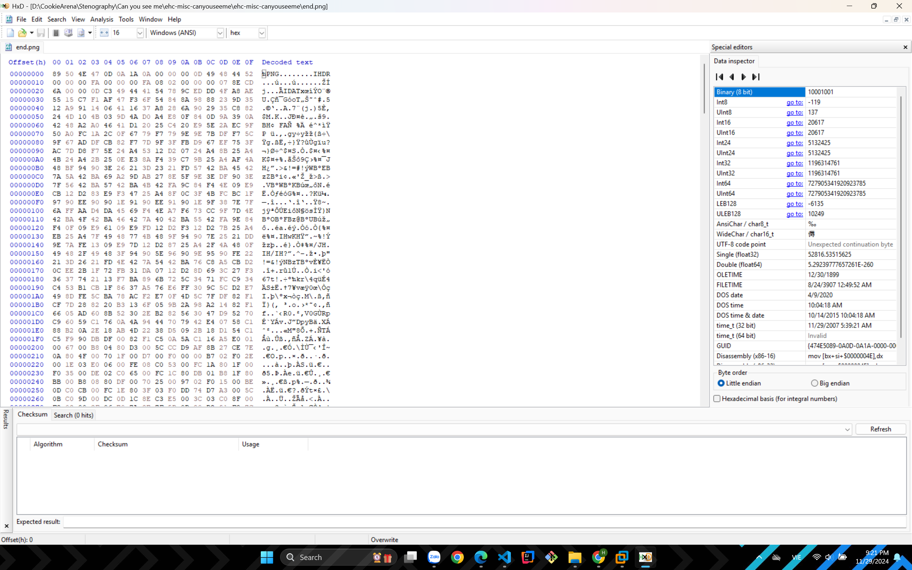

`end.png`


After some analysis, I suspected that the issue lies in the image's pixels, as only the `blue` values of the pixels were changing

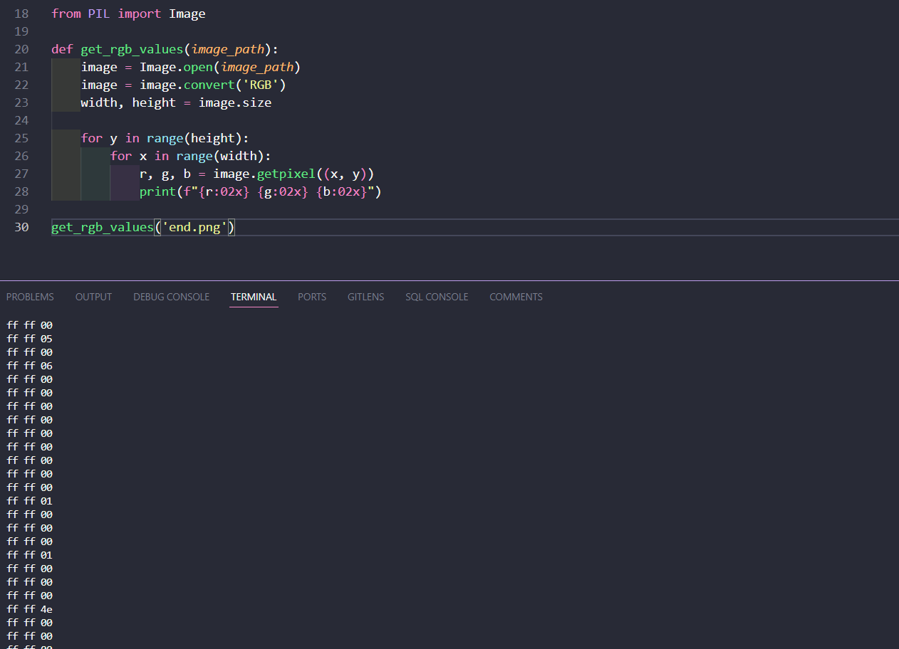

`script`

```python
from PIL import Image

def get_rgb_values(image_path):
    image = Image.open(image_path)
    image = image.convert('RGB')
    width, height = image.size

    for y in range(height):
        for x in range(width):
            r, g, b = image.getpixel((x, y))
            print(f"{r:02x} {g:02x} {b:02x}")

get_rgb_values('end.png')
```

Then, I extracted all the blue values and observed them.

`script`

```python
from PIL import Image

def get_rgb_values(image_path):
    image = Image.open(image_path)
    image = image.convert('RGB')  
    width, height = image.size

    with open('abc.txt', 'w') as f:
        for y in range(height):
            for x in range(width):
                r, g, b = image.getpixel((x, y))
                f.write(f"{b:02x} ")
                print(f"{b:02x}", end=' ')

get_rgb_values('end.png')
```

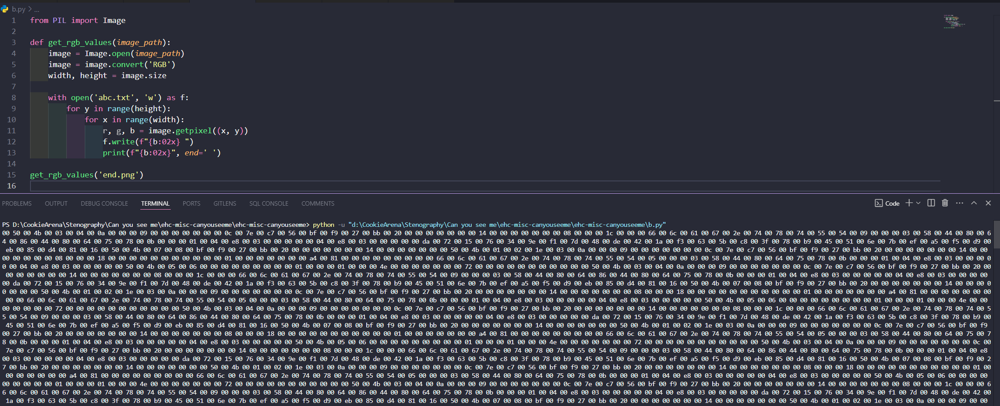

We can see that the bytes are interspersed with `00` bytes, and when removed, they form `504b` (which is the signature of a compressed file type). I removed them and used `HxD` to create the file.

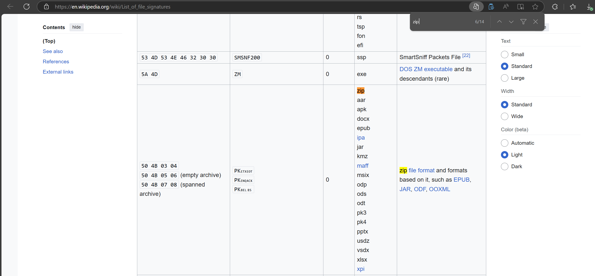

`script`

```python
with open('abc.txt', 'r') as f:
    data = f.read().split()
    
result = [data[i] for i in range(len(data)) if i % 2 != 0]

with open('abc1.txt', 'w') as f:
    f.write(''.join(result))
```

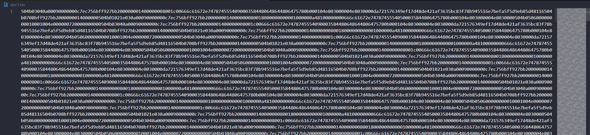

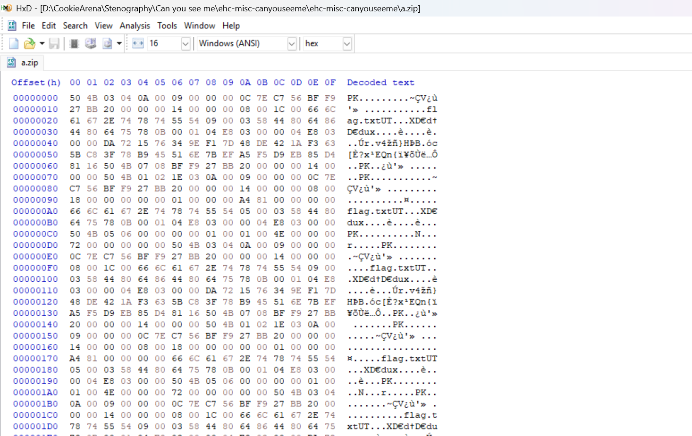

At this point, we need a password to extract the `zip` file, and after struggling with everything for a while, the `password` turned out to be the initial message we received. Once extracted, we will have the `flag`, and the content inside should be in the format `EHC{...}`

`password` is 

```
y0u_c4n_n0t_cr4ck_th1s_f1l3_w1th_th3_d3f4ut_w0rdl1st_0n_k4l1
```

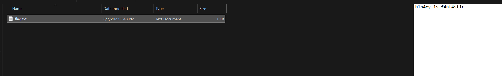

---

## Disco

`Description`

```
The hidden information in this challenge is in the first part of the audio. If you don't listen carefully, you may mistake it for steganography

Format FLAG: CHH{XXX}
```

In this challenge, we encountered a `.wav` file, and I opened it using `Audacity` to analyze it. I couldn't see anything at first, but when I reread the `description`, I realized the data was located at the beginning of the file. I tried zooming in and noticed columns at the top and bottom layers. I analyzed them by thinking of them as binary.

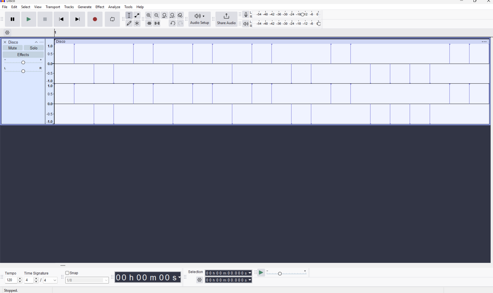

Make sure to zoom in or out to see everything clearly. Then, I treated the top columns as data '1' and the bottom columns as data '0'.

`data`

```
110011011011001100001110011111110111010111011000010101110101010110011011101011101110110111011110011111101
```

I decoded at [cyberchef](https://cyberchef.org/#recipe=From_Binary('Space',7)&input=MTEwMDExMDExMDExMDAxMTAwMDAxMTEwMDExMTExMTEwMTExMDEwMTExMDExMDAwMDEwMTAxMTEwMTAxMDEwMTEwMDExMDExMTAxMDExMTAxMTEwMTEwMTExMDExMTEwMDExMTExMTAx)

---